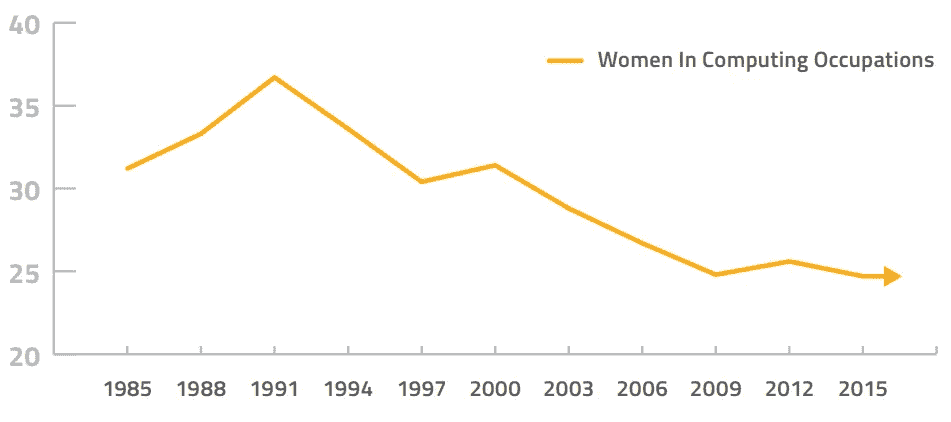
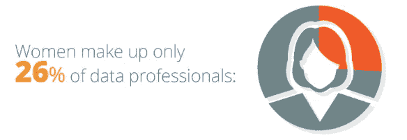

# 团队多样性:数据科学中的女性

> 原文：<https://medium.datadriveninvestor.com/team-diversity-women-in-data-science-a6aa845998c3?source=collection_archive---------5----------------------->

根据国家妇女信息技术中心(NCWIT)的一份报告，2015 年，女性占据了所有专业职业的 57%，然而她们只占据了所有计算机职业的 25%NCWIT 报告的作者认为，这种模式“尤其令人不安，因为有充分的证据表明多样性给创新、解决问题和创造力带来了至关重要的好处。事实上，计算和其他领域的大量研究记录了不同工作团队带来的增强的性能成果和优势。”

美国劳工部 2016 年报告称，女性从事计算机职业的比例在 1991 年达到 36%的峰值，此后一直呈下降趋势。

来自 [*为什么我们需要女性从事数据科学*](https://www.betterbuys.com/bi/women-in-data-science/) 的一张信息图显示了与 NCWIT 报告相似的数字——只有大约四分之一的“数据专业人员”是女性。

根据 [*数据科学中的女性:4 种观点*](http://www.mastersindatascience.org/blog/women-in-data-science) “尽管最近的数据表明这些数字正在发生变化。在统计中，女性是一股不断增长的力量。超过 40%的统计学学位授予了女性。”

是否鼓励或不鼓励女性进入数据科学的跨学科技术领域并在该领域取得成功？为了从我们自己的队伍中获得一些额外的观点，我采访了几位女性数据科学家，了解她们对该领域工作的看法。

1.  **你为什么选择数据科学这个职业？**

[**哈利**](https://www.elderresearch.com/company/our-team/halee-mason) **:** 数据科学是一个令人兴奋的领域，它有机会解决新的挑战，并帮助企业和客户改进他们的流程。有一些技术挑战满足了我继续学习的好奇心，同时为我提供了一个非常充实的职业生涯。

[**Jennifer**](https://www.elderresearch.com/company/our-team/jennifer-schaff)**:**我在之前的工作生活中培养了对数据分析的兴趣，一个数据科学学位让我有能力轻松地追求自己的新兴趣。

[**莉安娜**](https://www.elderresearch.com/company/our-team/leanna-kent) **:** 我喜欢能够使用数学/计算机科学来解决现实世界问题的想法，而不是数学的理论用例。我喜欢解决编码难题和应用数学解决问题。

[**Anna**](https://www.elderresearch.com/company/our-team/anna-godwin) **:** 作为一名医疗器械产品工程师，我一直在使用数据收集和分析流程来解决产品开发难题。能够使用数据来证明开发或过程的改变会产生更好的产品。这是一次有益的经历，它培养了我的分析技能和工作心态。在学习了更多关于数据科学和分析职业的知识后，我决定回到学校并做出改变。

1.  **作为一名女性，你在这个领域面临过哪些挑战？**

詹妮弗:**我想这取决于工作环境的构成，但是在男性员工占主导地位的办公室或公司里，感觉就像是一个男生俱乐部。关于共同兴趣的讨论会带来友谊和合作，这对女性来说是很难建立的。**

LeAnna: 在我的职业生涯中，很难让我的同事信任我的技能。我的工作最初经常遭到质疑。举两个例子。1)在提交了实现抽象函数以提高脚本模块化的代码返工后，有人问我谁帮我写代码。2)一个承认对编码语言生疏的同事试图调试他们的代码。当我提出建议时，它们被忽视了——尽管最终的工作解决方案使用了我建议的修改。

1.  **您认为女性在数据科学领域的机会正在增加吗？**

**Halee:** 是的，数据科学可以应用于许多不同的领域，所以总会有新的机会，对新数据科学家的需求也会增加。越来越多的数据科学工作倾向于咨询。当开始新项目时，许多人从业务理解阶段开始，以确定目的、目标并创建项目计划。在项目阶段，团队中男女成员的混合为来自不同生活视角或经历的不同观点提供了机会。

1.  你觉得工作的哪些方面最有价值？

帮助客户从他们的数据中看到价值是非常值得的。数据科学和分析能够真正影响企业做出明智的决策，并对结果产生积极影响。清理训练数据，也称为“争论”，是数据科学家花费大部分时间的地方。我非常喜欢通过 ETL 过程将原始输入数据转换成适合建模的格式，甚至有些人会认为这是数据科学中“不那么迷人”的部分。

**LeAnna:** 我很高兴知道我的工作能够帮助改善他人的日常生活——无论大小。无论是改善客户体验这样的小胜利，还是帮助改善医疗诊断这样的大胜利。

**珍妮弗:**老年研究是一个学习和体验新型项目的好地方，我每天都很感激我的工作没有过时。

1.  **您认为未来数据科学最激动人心的机会是什么？**

**Halee:** AI 与深度学习。随着处理能力的提高，利用这一技术所需的时间会缩短。在这个领域有很多令人兴奋的事情和新的机会。

**Jennifer:** 个性化数据分析，如医学、最佳职业路径等。

LeAnna: 医学领域的机会让我非常兴奋。能够更早地发现疾病，或者准确地诊断病人，意义重大。

**Anna:** 我很想知道数据科学将如何继续影响人类和计算机驱动的智能体之间日益增加的互动(想想 Alexa、自动驾驶等等)。将创建哪些新服务？这将在未来 10 年对我产生怎样的影响？起作用的道德规范是什么？最终会制定出什么样的政策？随着数据科学、人工智能和自动化在我们的日常生活中变得越来越普遍，这是一个非常有趣的时代。

1.  **你对考虑从事分析职业的女性有什么建议？**

**Halee:** 在数据科学社区中保持活跃和联系、接触新的机会以及跟上新兴技术非常重要。

詹尼弗:在开始工作之前，要了解员工和领导层的性别(和种族)比例。如果不平衡，领导层知道吗？有解释吗？如果这是一个问题，他们是否采取了补救措施？在一个(非歧视性的)以男性为主的公司工作对一些女性来说可能不是问题，但对那些精通技术，但害羞或难以找到自己声音的女性来说可能是一个巨大的问题。

LeAnna: 你会面临怀疑和逆境，但如果你对工作充满热情，那就坚持下去。奖励——当能够解决一个棘手的问题，或者发现新的发现——是令人难以置信的满足。此外，消除怀疑最简单的方法就是让你的工作证明他们是错的！

**安娜:**找到一位从事数据科学的女性，向她提问！很有可能，她在职业生涯的某个时候曾处于你的位置，当你在追求数据科学和分析时，她将是你的宝贵资源。

1.  **你还有什么想补充的吗？**

**Halee:** 我从一条非传统的道路过渡到数据科学，我会鼓励其他女性不要让非传统的背景阻止她们追求分析或数据科学的职业生涯。对我来说，这是一个非常有益的职业转变，这个领域和机会只会继续增长。

项目团队的多样性——性别、技能、经验——丰富了创意过程，并增加了分析解决方案的深度。我们庆祝女性的贡献及其对数据科学的影响，她们挑战偏见的勇气，以及她们争取机会和实现进步的决心。

**下载白皮书** [**数据科学中的女性**](https://www.elderresearch.com/women-in-data-science) **如果您想了解有关该主题的更多信息。**

# 有关系的

阅读博客[作为一名女性科技领导者的高潮和低谷](https://www.elderresearch.com/blog/highs-lows-being-female-tech-leader)

请访问我们的[职业中心](https://www.elderresearch.com/company/careers)了解更多有关 Elder Research 数据科学机会的信息。

*原载于【www.elderresearch.com】**。***

**