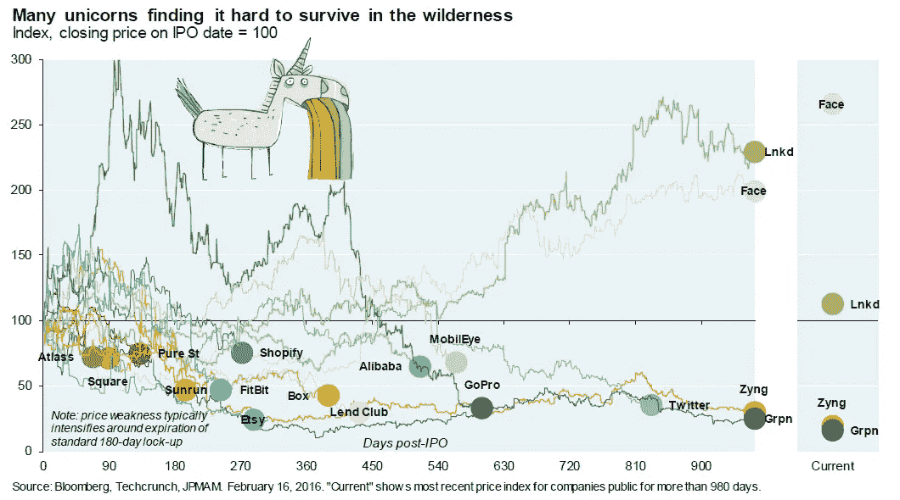
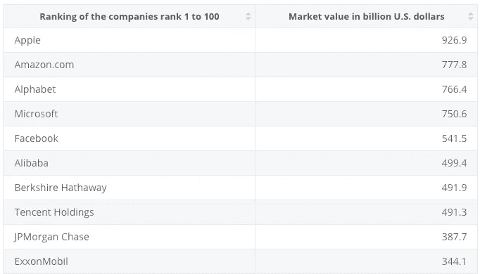
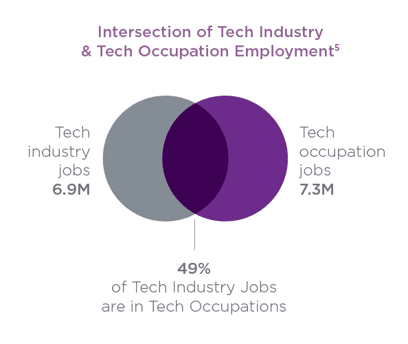

# 科技泡沫破裂&这意味着什么

> 原文：<https://medium.datadriveninvestor.com/tech-bubble-burst-what-that-means-957d3c11efd8?source=collection_archive---------15----------------------->

# 我们是否正在接近科技行业的平台期？

自 21 世纪初互联网泡沫破裂以来，许多人都在想，我们是否会比预期更快地迎来科技行业的另一场危机。股票泡沫是指在预期的基础上，一个行业的估值过高和股价快速增长；在这种情况下，技术行业。它通常伴随着投资者需求的增加和越来越多的公司通过 IPO 上市。为了与下一个“独角兽”结盟，风险资本家正在向无法保证投资回报的初创企业投资。

根据 [Statista](https://www.statista.com/statistics/263264/top-companies-in-the-world-by-market-value/) 、**的数据，全球市值最高的 10 家公司中有 7 家**在科技行业，其中第 1-6 名牢牢掌握在科技行业手中。对于这些统计数据，人们对科技公司潜力的兴奋并不令人意外。比特币从 2014 年的 10 美元上涨到 2017 年的 2 万美元(在 2018 年跌至近一半之前)，这只是加剧了这些预期，许多投资者渴望支持下一件大事。然而，这种高涨的兴趣转瞬即逝，许多科技公司的 IPO 已经发现了这一点。

就连科技领域的知名企业也在努力申请 IPO 和利用投资者的兴趣。Snap IPO 首日收盘价接近每股 25 美元，第二日接近每股 30 美元。三周后，股价跌至每股 20 美元，而今天，股价约为 17 美元。Dropbox 于今年 3 月早些时候上市，首日股价为 29.89 美元，但截至 2018 年 5 月，据报道，Dropbox 从未盈利，目前估值为 22 美元。更令人惊讶的是，Fitbit 在 2015 年申请 IPO，并在当年 8 月升至每股 51 美元以上，现在的估值低于每股 5 美元。

# **这对程序员来说意味着什么？**

截至目前，技术岗位增长仍然强劲，美国每月新增岗位超过 10，000 个，预计未来 5 年还会有更多。然而，只有 37%的技术工人受雇于高科技行业，其余的 63%分布在其他行业。这意味着，如果科技泡沫真的破裂，程序员不再被雇佣的风险很小。根据研究公司 IDC 的数据，一些世界上最大的公司也是最大的 IT 支出者，大约 1/3 的 IT 支出用于内部 IT 和员工工资及福利。这些公司包括沃尔玛、美国银行、花旗集团和摩根大通。其他行业也有无数的工作机会，包括时尚(香奈儿一直在尝试使用 3D 打印的设计)、金融、媒体等等。