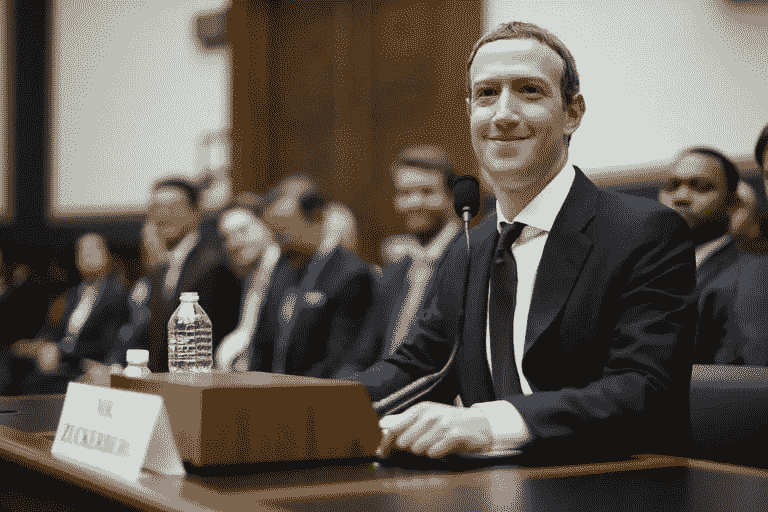

# 科技公司在区块链中找到了新的法律屏障

> 原文：<https://medium.datadriveninvestor.com/tech-companies-find-a-new-legal-shield-in-blockchain-f000c9df71b2?source=collection_archive---------4----------------------->

## 几十年来，像脸书和谷歌这样的科技公司一直依靠 230 条款来保护其平台上发布的材料。但随着硅谷越来越受到美国的挑战，科技公司转而在区块链寻找新的庇护。

Silhouette of a centaur at dusk. (Image by [Tomasz Proszek](https://pixabay.com/users/TomaszProszek-613139/?utm_source=link-attribution&utm_medium=referral&utm_campaign=image&utm_content=557261) from [Pixabay](https://pixabay.com/?utm_source=link-attribution&utm_medium=referral&utm_campaign=image&utm_content=557261))

阿雅眺望着切罗基族的广阔平原，思索着当“白人”最终征服了一切时，他的族人会变成什么样。

与部落的长者不同，大姐亲眼目睹了“白人”带给他的族人的可怕技术。

尽管切诺基人是优秀的骑兵，使用弓箭准确无误，但大姐见过“白人”如何使用高速发射弹丸的长金属武器来狩猎和保卫他们的土地。

瓦亚警告他的部落长老，如果他们不采用这项技术，他们的人民和土地总有一天会被这些新移民侵占，因为他们的人数越来越多——当有一天这些武器被转向切罗基族而不是野牛。

然而，尽管来自欧洲的移民潮给了 Waya 的切罗基长老们几个例子，但他们抵制使用枪支。

 [## 5 行业转型区块链应用|数据驱动投资者

### 除非你一直生活在岩石下，否则我相信你现在已经听说过区块链了。而区块链…

www.datadriveninvestor.com](https://www.datadriveninvestor.com/2019/02/13/5-real-world-blockchain-applications/) 

相反，切罗基族的长老们坚持认为，他们的弓箭技能将确保他们，而不是“白人”在任何冲突中获胜。

大姐对此并不确定，而是训练了一批志同道合的切诺基青年，让他们骑在马上学习射击，使用这种“白人”称之为“步枪”的新型可怕武器。

当欧洲殖民者和印第安人之间最终不可避免的冲突最终爆发时，Waya 和他的一小队装备步枪的切罗基人对“白人”进行了短暂的测量，但最终，切罗基人未能接受这种新武器在很大程度上导致了他们曾经自豪的人民的最终衰落。

## 便捷的技术

因此，当区块链技术首次出现时，许多人将其吹捧为挑战 Twitter、脸书和谷歌等公司巨大的中央集权的最佳希望之一。

然而，令人惊讶的是，许多互联网巨头现在都在寻求比特币和其他加密货币的技术，以保护他们免受商业模式面临的越来越多的监管挑战。

许多挑战都指向 230 条款，这是一项有 23 年历史的法律，被誉为美国互联网经济的支柱，因为它保护任何“交互式计算机服务”不因其用户的不良行为而被起诉。

这一法律屏障意味着，Reddit 和雅虎、Twitter 和脸书等在线平台提供商能够在最小的影响下主持自由讨论。

但近年来，在 2016 年美国总统选举中达到高潮，230 条款被指责为促成了科技行业最糟糕的方面——无论是脸书的假新闻，Twitter 上的恐怖主义宣传，还是 4Chan 和 8Chan 最糟糕的过度行为，甚至是复仇色情。

今年 8 月，当电子商务巨头亚马逊援引 230 条款辩称，它对网站上销售的危险和有缺陷的产品没有法律责任时，230 条款变得更加臭名昭著，这一论点与促进武器和非法麻醉品销售的丝绸之路网站只有一箭之遥。

因为当然，如果亚马逊不能对其网站上销售的产品负责，为什么丝绸之路的创造者应该负责？

“Pss…want to get high?” (Photo by [Marc Schaefer](https://unsplash.com/@marcschaefer?utm_source=unsplash&utm_medium=referral&utm_content=creditCopyText) on [Unsplash](https://unsplash.com/s/photos/drugs?utm_source=unsplash&utm_medium=referral&utm_content=creditCopyText))

要求立法者对第 230 条采取措施的公众压力越来越大，这些天来，两党的政治家越来越乐意照办。

民主党人指责第 230 条让脸书这样的人耸耸肩，而欺凌者和俄罗斯挑衅者在其服务上横行无忌，而共和党人则指责相同的平台审查保守派新闻，同时促进自由主义内容，反映了其创造者的左倾政治观点。

与金融服务业不同，金融服务业受到的监管要严格得多，其监管是禁止性的，而不是许可性的，第 230 条已成为立法者的一个容易的目标，他们认为废除该条款将使科技公司对其平台上的刻薄言论负责。

## 如果不是任何人的问题，那就是所有人的问题

最近，来自蒙大拿州的共和党参议员乔希·霍利(Josh Hawley)提出了一项法案，该法案将剥夺大型科技公司的 230 条款保护，只有美国联邦贸易委员会发现的以“政治中立的方式”监控内容的网站才能保留其法律保护。

该法案很可能被认定违宪，目前已经搁置，但更让科技公司老板担心的是，修改或废除第 230 条的想法已经获得了两党的支持。

但是，即使国会真的找到了一种方式来打击第 230 条，它实际上是第一修正案，而不是第 230 条保护了人们在网上憎恶的许多东西，包括仇恨言论和假新闻。

尽管如此，科技公司并没有将迄今为止不受约束的自由所面临的挑战视为理所当然，而是越来越多地期待区块链技术有可能解决他们的问题。

Twitter 首席执行官、比特币的长期支持者杰克·多西表示，他希望受比特币设计启发而开发的社交媒体软件能够减少 Twitter 对人们如何使用这项服务的控制，并将权力转移到 Twitter 以外的用户和程序员身上。

通过使用区块链技术的去中心化模式，Twitter 将纯粹充当去中心化内容的“组织者”——换句话说，它不会对用户发布的内容负责，因为从技术上讲，该平台的发展和增长不在它的掌控之内。

这有点像组织抗议——如果抗议演变成暴力，组织者不能承担个人责任，除非他们明确发起了抗议。

因此，既然区块链技术允许任何人在这个平台上进行构建，那么从技术上来说，谁也不需要为它的走向负责。

脸书首席执行官马克·扎克伯格(Mark Zuckerberg)也表达了类似的观点，他的加密货币项目 Libra 仍然面临着巨大的阻力，他表示，他希望比特币的同样概念可以“从中央集权系统中获取权力，并将其放回到人们的手中。”

如果你觉得这听起来很熟悉，就像你以前听过一样，那是因为你听过。将权力交还给人民是贝恩接管高谭市的原因。

Air quality was particularly bad in Gotham this time of year. (Photo credit: Screenshot, “The Dark Knight Rises” (2012) courtesy Warner Bros.)

但更愤世嫉俗的人会观察到(我相信这是正确的)，世界上一些最大的社交媒体公司对去中心化的推动只不过是装点门面，这些公司的整个商业模式和存在都围绕着巨大的中心化。

这种策略甚至有一个名字，叫做“欧弗顿窗口”

“欧弗顿之窗”背后的理念是，在任何给定的社会，在任何给定的时刻，都有一系列政策，在政治上为主流所接受。

一般来说，政客们只会在那个时间段内提出政策，因为边缘分子(一般来说)不会赢得连任。

因此，智库(和其他机构)有责任提出不受欢迎的东西，希望能改变现状，让以前不可想象的事情变得可以想象。

这正是这里正在发生的事情。

对于那些真正相信 Twitter 和脸书等公司正在寻求放弃其对权力和影响力集中的垄断的人来说，那么在某个地方也可能有一座桥等待着被他们收购。

事实是，通过提议分散其平台的管理和责任，社交媒体公司本质上是一举两得。

Facebook CEO and man pleased you’ve noticed his new haircut, Mark Zuckerberg. (Photo: Chip Somodevilla / Getty Images)

监管机构将知道，监管脸书和 Twitter 这样的公司虽然具有挑战性，但并非不可能——因为有一个目标，有一个控制点，有一个可以被传唤到国会的首席执行官——现在尝试监管一个没有中央治理结构的实体——这正是“权力给人民”的含义，我们都看到了高谭市人民的结果。

即使脸书和 Twitter 等社交媒体平台的治理结构是分散的，这也让它们能够继续保持作为平台“组织者”的利润，同时为无意中发布到平台上的最可恶和最卑鄙的内容委派责任。

换句话说，这就像减掉了很多体重，同时还能吃大量你喜欢的食物——终极饮食。

## 但是我们是怎么来到这里的呢？

去中心化的想法并不新鲜，它可以追溯到互联网的基本设计和理想，互联网本应是一个全球聚会的地方，在那里每个人都受到欢迎，没有人负责。

这显然没有发生。

这就是为什么就连万维网的创始人蒂姆·伯纳斯·李爵士也在努力解决集中式互联网的问题，将个人数据的所有权从大公司转移回用户手中。

Twitter 的多尔西认为，比特币的发明使这些早期的理想得以复兴，因为支撑比特币的底层技术——区块链——提供了一种方式，让互不相连的计算机网络就现有的每一枚比特币达成一组记录——这项技术有朝一日可能会进入我们管理数字和物理生活方方面面的方式，从金融到社交媒体。

多尔西肯定不是第一个乐观地表示区块链技术有一天可以用来记录社交网络上的所有用户和活动，并在没有任何公司负责的情况下为该网络商定一套单一规则的人。

但如果国会是一个可以效仿的例子，那么这种乌托邦式的愿景，一种参与式的平台民主，在未来还会有一段距离。

许多初创公司已经试图利用区块链构建竞争对手的社交网络，与脸书和 Twitter 等公司以及 Steemit 和 Minds 等公司竞争，但成效有限。

这些总部位于区块链的社交媒体平台替代品未能吸引主流关注，更糟糕的是，因为它们是分散的，用户只能靠自己抵御黑客。

“Wait…who’s in charge?” (Image by [ArtTower](https://pixabay.com/users/ArtTower-5337/?utm_source=link-attribution&utm_medium=referral&utm_campaign=image&utm_content=95472) from [Pixabay](https://pixabay.com/?utm_source=link-attribution&utm_medium=referral&utm_campaign=image&utm_content=95472))

因为在没有人负责的情况下，这意味着每个人都有责任，包括对自己的安全负责。

如果你忘记了密码或私人钥匙，没有帮助热线，没有人可以发邮件。

如果用户对这家总部位于区块链的社交媒体平台的运营方式不满意，他们可以直接启动自己的竞争平台，这就产生了一系列完全不同的问题。

例如，Twitter 的竞争对手、总部位于区块链的乳齿象，就是为了躲避 Twitter 上随处可见的愤怒和仇恨言论而创建的。

但最近，Gab，一个与所谓的仇恨犯罪有密切联系的极右翼仇恨组织，在被挤出主流互联网后不久，最近在乳齿象上为自己建立了一个安全的避难所。

因为这是一个开源平台，乳齿象的领导们除了反对这一举动之外别无他法，但也无法阻止它。

这就是为什么当涉及到互联网和社交媒体时，支持比特币的技术可能不会像一些人吹捧的那样提供银弹，我们应该警惕任何人把它作为一个复杂而微妙的问题的简单解决方案。

值得注意的是，几个专注于去中心化的新兴项目，包括 Berners-Lee 的名为 Solid 的项目，已经完全避开了区块链，因为他们不相信区块链除了金融交易之外还有任何用处。

## 适合正确工作的正确工具

然而，就金融交易而言，区块链虽然不完美，但至少提供了一个看似合理的解决方案。

鉴于在安排经济生活事务时需要高度的信任，寻租者在这个行业中比比皆是，随着经济生活变得越来越复杂，这个行业也越来越肥。

然而，软件和代码本身可以提供一个解决方案，虽然不一定要完全根除“可信”的第三方，但至少要削减他们的影响、规模和重要性，这样他们就不再能够要求他们的“一磅肉”。

这就是为什么当现有的社交媒体公司吹捧区块链技术是其社交媒体平台本身造成的问题的解药时，我们应该有保留地接受这种建议。

因为尽管人们可能很容易相信区块链技术有望分散社交媒体，但它最终真正做的只是分散责任和问责。

当每个人都有责任的时候，没人有责任。