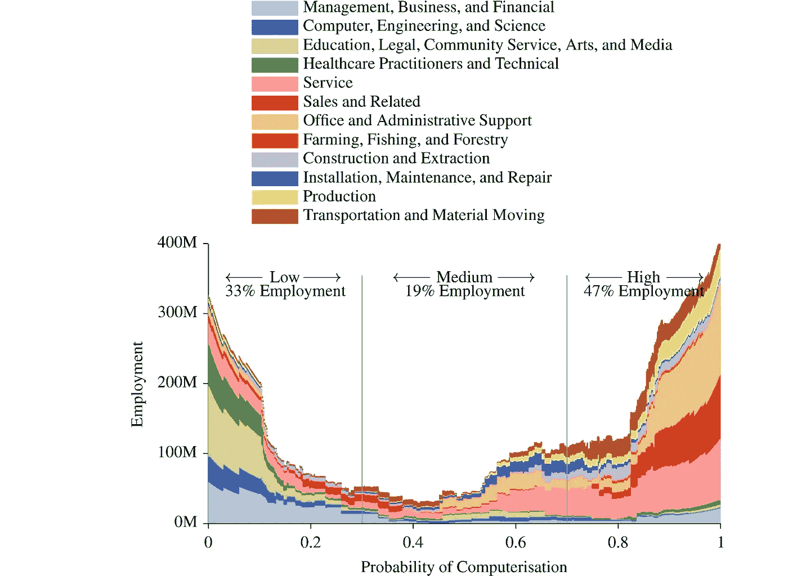

# 人工智能世界中的移情教学技术

> 原文：<https://medium.datadriveninvestor.com/tech-for-teaching-empathy-in-an-ai-world-cd3c352a5585?source=collection_archive---------4----------------------->

为了在人工智能世界中教授共情，需要分析两种现状:共情和人工智能。如果这篇论文是以技术为中心的，为什么我们需要讨论共情的现状？因为我们作为人类还没有教会自己移情…到目前为止。最注重传授同理心的行业是医疗保健、教育和媒体。长期以来，教育和医疗保健一直试图向其他人传授同理心。教师和医生将受益于成为高度同理心的人，因为他们都在与多种身份打交道，以及在极端情绪化、令人沮丧的情况下与这些身份打交道。教授同理心的最大趋势，特别是在医疗和教育领域，是文化能力。文化能力有许多定义，但每一个都围绕着以尊重和足智多谋的方式了解不同的文化。当讨论如何达到这种心态时，同理心是最大的驱动力。同理心将推动医生花时间自学西方医疗保健的其他文化立场，以及当病人不与他/她进行目光接触时耐心和同情的情绪反应。

然而，之所以有这么多的定义，是因为一个系统、一本书或一门课程并没有提高医生或教师的文化理解。在媒体行业内部也可以看到这一点。由于日益增长的法律义务和社会趋势，媒体公司内部及其创作的内容需要多元化和包容性。然而，即使有了这种推动，媒体行业的领导者们也没有设法做出感同身受的回应。已经发布了一些广告，如多芬的肥皂将一名黑人妇女变成了一名白人妇女(卫报:2017 年)，百事可乐发布了一则广告，让白人妇女肯达尔·詹娜递给一名警察一瓶百事可乐，以某种方式治愈警察暴行，而实际上他们轻视了黑人的命也是命运动。这两个广告，特别是百事可乐的广告，都认为他们理解美国人对种族、厌女症和性问题的感受，但他们大错特错，结果丢掉了生意。在一个产品和服务比以往任何时候都多的不断增长的世界中，接触消费者是关于个性化和以某种方式让他们对你的产品有所感觉。如果数据是新的石油，移情就是加油站。

记住这一点，现在检查人工智能的技术和感知的现状是至关重要的。人工智能最初是在 1955 年的一次达特茅斯会议上创造的，他们预测，到 2001 年，我们将已经拥有我们在本文中讨论的那种类型的人工智能:这种人工智能将遵循这样的原则:“学习的每个方面或智能的任何其他特征在原则上可以如此精确地描述，以至于机器可以刺激它”，换句话说，“人工通用智能”，然而，今天我们有人工狭义智能或机器学习。机器学习是“将高度复杂和强大——但通常无法解释——的统计模型拟合到海量数据的过程”……一个缺乏人类心理学或同理心的系统(Guszcza，Lewis，Evans-Greenwood: 2017)。这就是为什么，正如德勤报告所指出的那样，重要的是要认识到，“神经的、深度的和学习的”并不意味着人工智能像人类一样学习，或者在心理上深度思考，而是“更多的数据导致更准确的参数估计”。是的，人工智能可以比人类更好地确定狗的品种，但他们不理解实际的概念。

这就是为什么当前人工智能的震颤是为了促进人类和人工智能一起工作，互补彼此的弱点和优势，但假设移情只是人类的一种优势是错误的吗？有很多公司都在利用人类的同情心，比如 Affectiva，它可以从用于帮助自闭症患者的网络摄像头中获取人类的情绪状态。或者，一个人工智能可以发现男性和女性谈论心脏病的可能性不同，通常会导致偏见治疗(Guszcza，Lewis，Evans-Greenwood: 2017)。这并不意味着人工智能以任何方式移情，而是非语言和面部表情被添加到可计算数据的列表中。人工智能可以抑制偏见，但也可以促进偏见。比如广告人工智能给黑人发送的刑法广告比白人多。目前的一个答案是，“人类加上计算机加上更好的算法工作流程将产生比最有才华的人类或最先进的算法单独工作更好的结果”(Guszcza，Lewis，Evans-Greenwood: 2017)。或者，另一种情况是，简单地让人工智能只做更常规的任务，如工厂工作或医疗手术和分析，这样人类就可以反过来专注于提高他们的移情技能。虽然在第一部分看起来像是大量的研究，但对于老师、医生、医学专业人士或广告人来说，这是完全无关紧要的。在分析社交机器人的增长趋势时，社交机器人是一种“必须在其复杂性中理解人类行为并做出相应反应”的机器人(Yang，Dario，Kragic : 2018)，他们的困难与一个 AI 和一个人是一样的。他们必须明白，“社会信号是主题特定的，依赖于上下文的，并由文化决定的”(杨，达里奥，克拉吉:2018)。在这样做的同时，他们还必须纳入社会和道德规范。如前所述，人类仍然试图自己做到这一点，所以这就是为什么我对在人工智能世界中教授同理心的预测倾向于后者；让人工智能完成日常任务，而人类可以专注于提高我们的同理心。

我的预测是，在未来 10 到 15 年内，人工智能，或者更具体地说，人工智能(机器学习)将取代许多常规工作，导致人工智能(T2)和人工智能(T3)的发展。这一预测的一个主要障碍是失业人数的减少，然而，这种担心并不新鲜。在一篇题为“就业的未来:工作对计算机化有多敏感？”，Frey 和 Osborne (2016)讨论了技术变革对经济的影响，以及随着机器学习和人工智能等技术的发展，我们在未来将会如何。回顾棉花制造新技术诞生的时候，人们甚至获得了自己的名字——勒德分子——的巨大阻力。这是现在对反对新技术的人的通用术语。因此，从我们人类的技术史来看，“除非所有个人都接受市场结果的“裁决”，否则失败者很可能会通过非市场机制和政治激进主义来抵制是否采用创新的决定”……因此，可以预期工人会抵制新技术，因为新技术会使他们的技能过时，不可逆转地降低他们的预期收入。因此，就业保护和技术进步之间的平衡在很大程度上反映了社会权力的平衡，以及技术进步的收益是如何分配的”(牛津文章)。最后一部分，“社会中的权力平衡，以及技术进步的收益是如何分配的”已经在媒体行业得到了验证。

在互联网革命期间，媒体行业决定退出不断增长的基础设施，而不是进入其中。当英国政府决定处死任何想要破坏棉纺机器的人时，他们没有向英国学习，而是说，“尽管这个国家从他们的建立中获得了很大的好处，但在这个国家破坏他们[棉纺机器]只会成为将他们转移到另一个国家的手段[……]，从而损害英国的贸易”(引自[曼图克斯，2006](https://www-sciencedirect-com.libezproxy2.syr.edu/science/article/pii/S0040162516302244#bb0450) ，第 403 页)。媒体行业将利润和消费者数据转移给了其他公司:亚马逊、脸书、Spotify 等等。所以，我预测媒体行业会从这个错误中吸取教训。具体来说，对于媒体行业来说，并不是所有的工作都必须丢掉。当考虑广告和公关等分支的定位时，程序化将占据主导地位。人工智能可以比人更好地选择搜索引擎优化的搜索词。然而，当看着目前人工智能和人类对同理心的使用时，很明显为什么在未来 10 到 15 年，他们都需要彼此。

我为什么主张人工智能和人类一起工作的互补系统，而不是试图实现人工一般智能，是因为目前向人类教授同理心和文化能力的方法。从本报告的第一部分开始，我就讨论了文化能力，即意识到他人的差异，但不要让这些差异决定你如何对待他们。要做到这一点，一个人必须承诺并渴望了解另一个人的文化，同时也要有同理心去理解那个人与你交流时的感受。从人类学的角度来看，这种方法是有问题的，因为人类学是创造我们当前“文化”概念的学说。通过允许人们基于种族、国籍和语言假设某些信仰(这并不是文化的全部)，人们被束缚在他们可能会如何行动的刻板印象中。例如，如果你要治疗一个病人，教一个学生，或销售一种产品，你已经参加了一个文化能力课程，书籍，或立法机构，你可能会想，“‘中国人相信这个’，或‘日本人相信那个’，等等——好像整个社会或民族可以用这些简单的口号来描述”(Kleinman，Benson : 2006)。由于机器学习是通过在输入的数据中寻找模式来工作的，因此人工智能一直在产生这样的结果。不是因为一个 AI 有偏见，而是因为我们有偏见。在人工智能世界中教授同理心的补充系统将通过第二次检查来解决这一问题。比如像司法系统。一项研究发现，法官在休息后比休息前更有可能批准假释，这意味着法官的血糖水平正在显著改变个人的生活，无论是变好还是变坏。使用没有血糖量的人工智能可以解决这个问题。然而，一项观察司法系统中人工智能的研究也发现，它标记黑人被告的可能性是白人被告的两倍。那么，平衡在哪里呢？使用人工智能作为工具，而不是像以前人类用自己有限的同理心资源所做的那样，成为最终的决定。

那么，在这种新趋势的影响下，世界会变成什么样子呢？在二十世纪的前一个时代，只有“熟练”劳动力才能保持盈利。移情劳动会。使用爱德华·康尼什的情景方法来分析未来，我们可以看到在人工智能世界中使用移情的最佳可能情况，最消极的情况，以及介于两者之间的任何情况。在一个没有惊喜的场景中，被视为低认知角色的工作也是例行公事，将是唯一被人工智能完全取代的工作，而医疗专业人员和教师保持不变。不会有太多的喧嚣，因为这些工作将为他们的公司创造更大的利润。关于媒体，没有人工智能会创造内容或管理它，而只是接管编程角色。在乐观的情况下，事情会像牛津大学的研究在下图中预测的那样。是的，许多工作，如办公室管理、销售、运输和材料搬运，可能会计算机化，但更多的同理心角色，如教育、艺术和媒体，仍将高度人性化。这是乐观的，因为这些角色具有人类的力量，如创造力、同理心和常识。更多的人将能够在这些角色中享受他们的工作，并最终在每个角色中创造更好的体验。随着更多的焦点放在教育上，我预测媒体将会集中到这个领域。目前，它不是很有利可图。然而，随着教师能够与人工智能一起工作，他们将能够为他们的每个学生创建个性化的课程计划……需要电影、播客、歌曲等的混合。去帮助他们。

另一方面，悲观的情况看起来像第六个超级趋势，去文化化。随着人们的日益融合，最糟糕的情况是我们根本不需要文化能力，因为文化行为和信仰的数量将会减少。这将使人工通用智能更有可能成为现实，因为没有无限量的数据，随着更少的文化和更多的人类模仿彼此的行为，制造社交机器人将变得更加容易，创造人工智能制作的大众喜欢的内容也将变得更加容易。这将意味着广告办公室里有同情心的工作或文案不再值得，最终导致失业。这导致了灾难场景，只有少数文化和创造力模仿旧的文化和创造力，除了维护系统之外，几乎没有其他工作。由于就业机会少，犯罪活动激增。或者，另一方面，我们让 AI 自己运行，没有人类移情的第二次检查。世界各地的人类将被持续地提供偏见内容，取悦已经形成的偏见，不满和仇恨会激增。

最有趣的讨论场景是转型。在这个世界里，AI 和人类在每个领域都是完美互补的。我们看到的不是失业，而是工作满意度的大幅上升。每个领域的人类都被允许抛开令人厌倦的常规任务，专注于移情和创造。这改变了教育、医疗和媒体的结构。同情心激增，贫困减少。在所有这些场景中，我预测媒体世界将完全采用人工狭义智能。这样做，将会有失业，当失业时，将会有挫折。因为媒体行业已经见证了当他们不采用新技术时会发生什么，但是，我假设他们会采用这一个。这将意味着消费者收到的内容是完全适合他们的。例如，当他们在上午 10 点在脸书收到它时，这将是人工狭义智能的工作。信息是什么和它看起来像什么，将是人工智能和人类的角色。经过移情训练的人工智能可以扫描互联网数据，并找出消费者目前对可口可乐品牌的感受。然后，作为第二个核对者的人类自己能够接受这些数据，并利用人类常识的力量找出定位品牌的最佳方式。或者，对于电影行业来说，人工智能可以检测到消费者何时正在观看电影预告片，他们看起来很无聊。不是让人工智能创造他们自己的预告片，而是利用这些信息，人类可以发挥他们的创造力，创造一些全新的、完全娱乐性的东西。虽然这种新趋势可能会有伦理问题，因为人类仍然会有偏见，可能会让人工智能的偏见过去，使系统永久化。这就是为什么推动心理学和社会学培训是必须的。人文学科不再是有利可图的。如果人工智能有一天会有同理心，我相信人类希望如此，因为我们给汽车命名，并与 SIRI 开玩笑，我们首先必须解决自己的偏见。这种二次检查的系统是人工智能向人类学习的一种方式，也是人类向人工智能学习的一种方式。

书目

[https://www . the guardian . com/world/2017/oct/08/dove-proposes-for-ad-showing-black-woman-turning-white-onego](https://www.theguardian.com/world/2017/oct/08/dove-apologises-for-ad-showing-black-woman-turning-into-white-onego)

弗雷奥斯本。就业的未来:工作对计算机化有多敏感？(2016).

[https://www-science direct-com . libezproxy 2 . syr . edu/science/article/pii/s 0040162516302244](https://www-sciencedirect-com.libezproxy2.syr.edu/science/article/pii/S0040162516302244)

格斯查，刘易斯，埃文斯-格林伍德。为什么人类和计算机一起思考更好。2017.[https://www2 . Deloitte . com/insights/us/en/Deloitte-review/issue-20/augmented-intelligence-human-computer-collaboration . html](https://www2.deloitte.com/insights/us/en/deloitte-review/issue-20/augmented-intelligence-human-computer-collaboration.html)

克莱曼本森。临床中的人类学:文化能力的问题及其解决方法。(2006).【https://journals.plos.org/plosmedicine/article? id = 10.1371/journal . pmed . 0030294

杨，达里奥，克拉吉。社会机器人——信任、学习和社会互动。(2018).

【http://robotics.sciencemag.org/content/3/21/eaau8839.full 