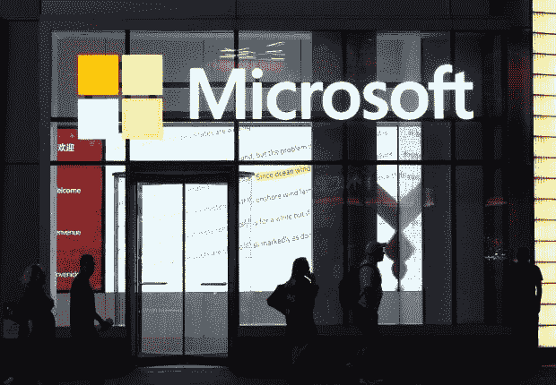
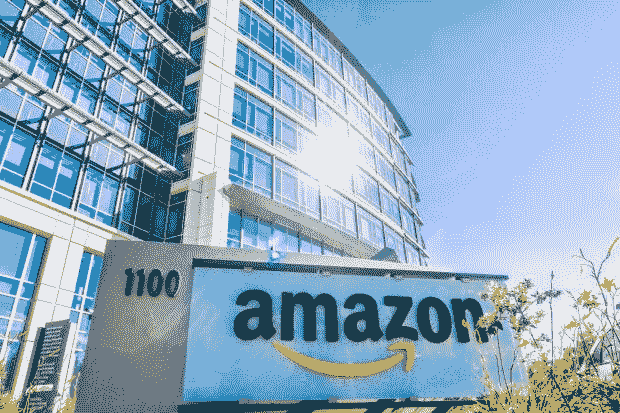
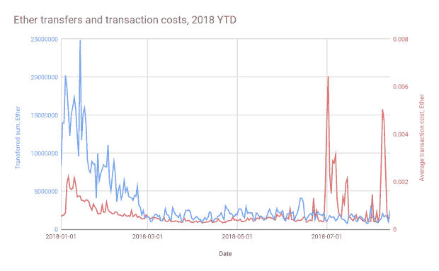

# 科技巨头仍然看好区块链

> 原文：<https://medium.datadriveninvestor.com/tech-giants-remain-bullish-on-blockchain-22597dd79858?source=collection_archive---------5----------------------->

宣布 2018 年是加密货币灾难性的一年并没有太大争议。

随着去年引人注目的繁荣成为褪色的记忆，持续的熊市已经耗尽了投资者对令牌化项目的兴趣，而用户对加密的采用在很大程度上仍然令人失望。

不出所料，这种情况引发了长期末日论者的反常满足感——这些人很少试图理解任何具有变革潜力的事物。由于缺乏想象的能力，许多人最终因为错误的原因被证明是正确的。伤心！

我们会看到 crypto 的命运逆转吗？目前很难说。但我们可以更乐观的是，对这些数字资产背后的技术的兴趣仍然很强。事实上，今年区块链的发展取得了重大进展，尤其是一些全球最大的科技巨头。

在区块链发展的早期阶段，该技术能否兑现其承诺仍有许多悬而未决的问题，尤其是在交易吞吐量和成本等问题上。但我们至少可以放心的是，科技巨头们继续在这个领域大胆行动。

企业解决方案、研究设施、收购和咨询只是这些巨头增加其在这一新兴行业的曝光率的一些方式。IBM 和微软正处于领先地位，部分原因是它们在这一领域相对较长。但包括亚马逊、甲骨文、阿里巴巴、腾讯和谷歌在内的其他科技巨头也在其中。

# 国际商用机器公司

IBM 可以说是目前区块链领域企业中的领导者。去年，Juniper Research 发现，超过 40%的考虑或实际部署区块链的公司员工将 IBM 列为该领域最有实力的公司。

蓝色巨人对分布式账本技术(DLT)最著名的尝试是通过其对开发 [Hyperledger Fabric](https://www.ibm.com/blockchain/hyperledger) 的贡献，这是一个由 Linux 基金会主持的开源合作项目。Hyperledger 是成为企业区块链框架行业标准的有力竞争者，并且已经将不同领域的用户、开发人员和供应商联系起来，以便了解和开发企业区块链解决方案。

IBM 还提供自己的区块链即服务(BaaS)平台 IBM Blockchain，这是一种基于 Hyperledger Fabric 的公共云服务。该平台让企业玩家有机会建立自己的区块链网络。例如，沃尔玛一直在使用 IBM 区块链上的[食品信托解决方案](https://www.ibm.com/blockchain/solutions/food-trust)，以实现旨在提高供应链可追溯性和透明度的食品安全区块链解决方案。

7 月，IBM 与哥伦比亚大学合作建立了一个致力于区块链研究和数据透明的中心。哥伦比亚-IBM 区块链和数据透明中心旨在研究与该技术相关的重要问题，例如包括信任和数字数据的使用。最近，该中心披露了两个新的加速器计划，将提供额外的资源，以帮助企业建立区块链网络。

但也许最令人欣慰的是最近的研究显示，除了阿里巴巴，IBM 获得了最多的与区块链相关的专利。考虑到 T2 与澳大利亚政府签署了一份 7 . 4 亿美元的协议，使用区块链进行数据安全保护，IBM 可能会在区块链专利保护方面处于领先地位。

# 微软

IBM 现阶段在区块链的最大竞争对手是微软。事实上，根据[ABI 研究公司](https://www.abiresearch.com/press/microsoft-takes-overall-top-spot-abi-researchs-blockchain-service-competitive-assessment/)最近的一份报告，在对领先的 BaaS 平台的综合评估中，微软击败了 IBM。

微软的 BaaS 是一个基于以太坊的网络，基于其云计算平台 Azure，这将帮助开发者高效地构建应用程序。微软确定了使用 Azure 区块链平台的三个主要好处:简化开发，快速验证区块链场景，以及“在开放、可信、全球可用的云平台上”保持数据安全像新加坡金融管理局和 Webjet 这样的多样化客户现在正在受益于 Azure 区块链。

Azure 最知名的区块链应用是[区块链工作台](https://azure.microsoft.com/en-us/blog/simplifying-blockchain-app-development-with-azure-blockchain-workbench-2/)，它使用其高度自动化的区块链基础设施来帮助简化应用开发，该基础设施集成了许多 Azure 服务和工具。微软[将](https://docs.microsoft.com/mt-mt/azure/blockchain/workbench/overview) Azure Blockchain Workbench 描述为“构建区块链应用的脚手架，使开发人员能够专注于创建业务逻辑和智能合同。”

微软还在开发一个名为 Coco 的企业级区块链框架，旨在为交易提供更高的吞吐量和延迟，并将兼容任何区块链协议，如以太坊和 Hyperledger Fabric。

微软在区块链最重要的合作伙伴之一是最近宣布的 T2 与纳斯达克的 T3 合作。Azure 将与纳斯达克的金融框架整合，该框架为交易商、交易所和清算所提供相互交互的软件。因此，区块链伙伴关系将提高纳斯达克客户的可用性，使买卖双方更容易匹配，并有效地管理交易的交付、支付和结算。

# 亚马孙

紧随 IBM 和微软之后的是亚马逊，它现在正迅速提高其在区块链的曝光率。事实上，这家在线零售巨头在 11 月份又获得了两项与区块链相关的专利，分别涉及加密签名和可扩展数据网格，这反映了它对该领域表现出的强烈兴趣。

通过其云计算服务亚马逊网络服务(AWS)，该公司迄今为止最重要的区块链风险投资是为以太坊和 Hyperledger Fabric 设计的 AWS 区块链模板。与微软和 IBM 的产品类似，AWS 区块链模板允许客户构建自己的区块链应用程序，而无需建立自己的网络。服务“[”提供了一种使用开源框架创建和部署安全区块链网络的快速简单的方法。](https://aws.amazon.com/about-aws/whats-new/2018/04/introducing-aws-blockchain-templates/)

亚马逊最有趣的区块链合作伙伴之一是它在 5 月宣布的与区块链初创企业 Kaleido 的合作。据 AWS 称，这是 AWS 市场上第一个可用的区块链 SaaS 解决方案，将“帮助客户更快地移动，而不用担心自己管理区块链”。去年 12 月，AWS 宣布与区块链银行联盟 R3 合作，允许其 Corda 区块链平台用于 AWS 市场。

# 谷歌

就连谷歌自己也承认，它未能在区块链的发展中占据领导地位。尽管如此，该公司[在 7 月宣布与 DLT 两家初创公司 BlockApps 和 Digital Asset 合作，允许客户在谷歌云平台上“探索他们可能使用分布式账本技术(DLT)框架的方式”。](https://www.blog.google/products/google-cloud/building-a-better-cloud-with-our-partners-at-next-18/)

谷歌的 BigQuery 数据分析工具今年也加入了更多的加密功能。今年 2 月，[宣布](https://cloud.google.com/blog/products/gcp/bitcoin-in-bigquery-blockchain-analytics-on-public-data)将开放比特币区块链数据供探索，因为加密货币生态系统内更高的透明度“使包含的数据变得更容易访问和有用”最近，它将这一功能扩展到以太坊数据集。例如:

[来源](https://cloud.google.com/blog/products/data-analytics/ethereum-bigquery-public-dataset-smart-contract-analytics)

在这两种情况下，BigQuery 将使用户能够分析和可视化数据集，并使用 SQL 查询，尝试从数据中提取有意义的见解。

# 其余的

就其他科技巨头而言，甲骨文已经推出了自己备受期待的基于 Hyperledger Fabric 的企业区块链平台，其客户包括阿拉伯约旦投资银行、CargoSmart 和 Certified Origins。

中国巨头最近也很活跃。腾讯的区块链平台 [TrustSQL](https://trustsql.qq.com/chain_oss/TrustSQL_WhitePaper.html) 正被中国物流采购联合会&用于开发行业应用，而该公司也[最近进入了区块链驱动的供应链金融领域](http://usa.chinadaily.com.cn/a/201811/02/WS5bdbddf6a310eff303286334.html)；中国搜索引擎巨头百度在 4 月启动了其区块链项目 Totem，以管理图像的知识产权，从而确保图像所有权的更有效的过程。

— — — — –

基于 2%的服务器将用于运行区块链，每台服务器每年 5500 美元的假设，美洲银行[估计](https://www.cnbc.com/2018/10/02/blockchain-could-be-a-major-boost-to-amazon-microsoft-analyst-says--.html)区块链在未来某个时候将是一个 70 亿美元的市场。像微软和亚马逊这样的公司预计将特别有能力利用这一趋势。亚马逊也被吹捧为受益于“区块链实施带来的增量云服务需求，而供应链跟踪的改善应该会使亚马逊的零售业务更加高效。”

促使大公司增持区块链敞口的部分原因，可能也是为了通过旁观来防止市场份额的损失。例如，从人力资本的角度来看，一场“人才战争”可能很快就会出现，[一些人认为](http://fortune.com/2018/07/14/olaf-carlson-wee/)开发人员和其他技术人才已经开始从巨头流向加密初创公司。

当然，像 IBM 和微软这样的公司很清楚这一点。战胜来自创业世界的竞争的努力将变得越来越明显。事实上，科技巨头对区块链日益增长的兴趣很可能威胁到许多加密货币初创公司的存在，在投资加密领域时，这应该是一个值得考虑的问题。

*原载于 2018 年 12 月 14 日*[*www.datadriveninvestor.com*](https://www.datadriveninvestor.com/2018/12/14/tech-giants-remain-bullish-on-blockchain/)*。*