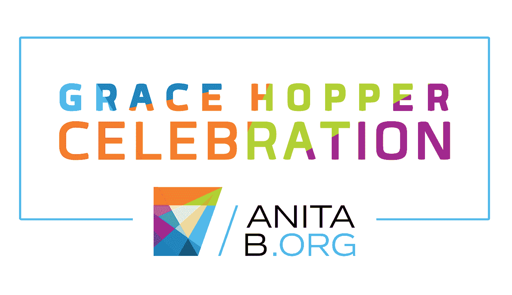

# 与 GHCI 和 AnitaB.org 一起探索妇女赋权的阶梯

> 原文：<https://medium.datadriveninvestor.com/tech-ing-the-ladder-of-women-empowerment-with-ghci-and-anitab-org-261c417803f6?source=collection_archive---------2----------------------->

## 你用什么来喂养一个渴望探索、充满好奇心的灵魂？

我 *英特尔奔腾 P5。256 MB SDR 内存。燃烧过度的 SMPS。可能是 10 GB 的硬盘。Win 98 OS。白色 CRT 显示器。一张超级有用的软盘。和一个 6 岁的孩子。*

Photo by [Federica Galli](https://unsplash.com/@fedechanw?utm_source=medium&utm_medium=referral) on [Unsplash](https://unsplash.com?utm_source=medium&utm_medium=referral)

我是个好孩子。我从不在墙上乱涂乱画；我打开电脑，打开 MS Paint，在那里涂鸦。*我和电脑的互动就是这样开始的。*

这些年来，从 128 MB Micro SD 到 128 GB Micro SD，我迷上了技术的整体术语。尤其是玩电子游戏的时候。在校期间计算机学科得满分只是事情好的一面。

[Source](http://www.relativelyinteresting.com/wp-content/uploads/2015/01/wolfenstein-1992-BJ-Blazkowicz-comparison.jpg)

## Hello World 和我的旅程{

高中教育。第一个 C++程序:打印 Hello World。然后，哎呀！编程概念溢出异常。虽然我学到了大部分的概念，但是有一种相对来说不太实用的方法。

编程语言和框架、数据库、Android、Web 开发语言和框架、操作系统、算法设计和分析、云、大数据、网络、AI & ML 等等。一个巨大的知识池，供你游泳或溺死。

拥有计算机工程专业的技术学士学位，学位就是你在考试中的表现。这是你真正应该向遍布全球的技术社区挥手问好的时候。

## }

[Source](https://ghcindia.anitab.org/)

## 2017 年印度格蕾丝·赫柏庆典

体验印度最大的 STEM 女性聚会是一个值得珍惜的时刻。成千上万鼓舞人心的灵魂在同一个屋檐下共鸣着授权和技术的频率——一个强大社区的力量。

从与一些顶级科技公司分享简历到有机会在招聘会上与他们互动，还有测试、编码、面试和选拔！除此之外，[一百多名技术专家在不同的领域发表了信息丰富的演讲。](https://ghcischedule.anitab.org/)

> 不仅是我简历上的亮点，也是我生活中的亮点。

## [格蕾丝·赫柏庆印 2018 近了！](https://ghcindia.anitab.org/ghci-18-november-14-16-2018/)

你的简历向你梦想为之工作的公司介绍了你。建立关系网并成为技术社区的一部分是当前的需要。机会可能会再次降临，但你准备好抓住它了吗？

新生或职业重新开始——GHCI 欢迎您！如果有一丝点燃你的技术火花的可能性，没有比这里更好的地点、时间和人了。

在你等待事件的时候，建立你的简历:让它反映你的创新个性。重温你的概念，开启黑暗模式并编码，同时喝咖啡休息！

— — —

作者是一个有创造力的吉普赛灵魂，漫游于各个星系——从科技到艺术。作为一个真正的工程师和生物老师的女儿，她对机器和有呼吸的灵魂都很着迷。经常发现涂鸦的想法，她也写内容(也写代码)。作为 GHCI 2017 的与会者，这是一个巨大的曝光率和机会，成为其中的一部分；她很高兴认识了他们，并鼓励你也成为其中的一员！