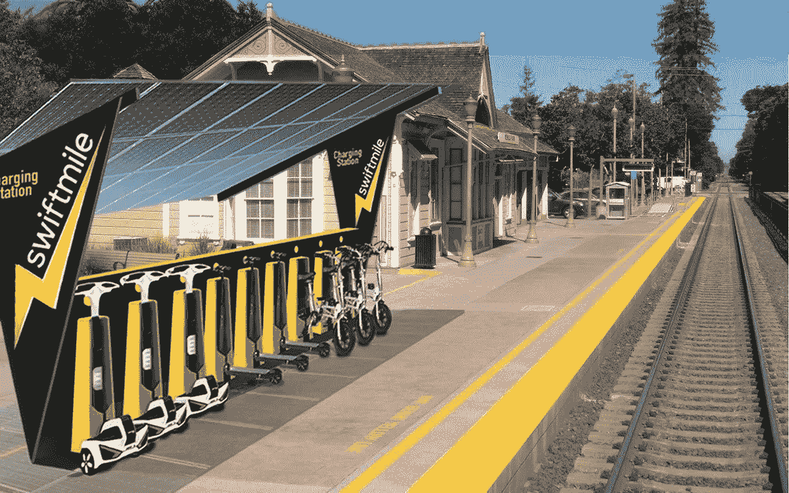
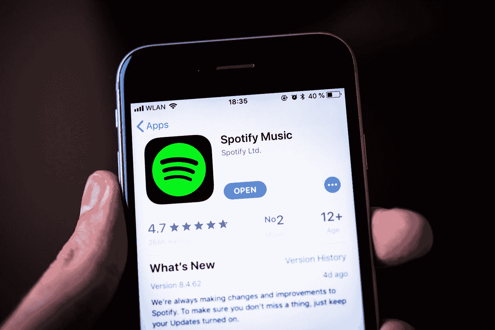

# 科技新闻:每周文摘#1

> 原文：<https://medium.datadriveninvestor.com/tech-news-weekly-digest-1-c61138abcfd9?source=collection_archive---------15----------------------->

你好。

从现在开始，每周五早上我都会发布关于科技巨头、创业公司、新市场、技术和未来的新闻。这些是本周最有趣的新闻，既有知识性，有时也很有趣。

我已经做这个文摘一年多了，今天我决定和全世界分享它。从现在起，你可以在媒体上阅读我们的每周新闻摘要。

 [## 数据驱动的趋势和统计-2019 年 2 月-数据驱动的投资者

### 虽然寻找视觉内容最简单的方法是“谷歌”它们，但如果你能…

www.datadriveninvestor.com](https://www.datadriveninvestor.com/2019/03/07/data-driven-trends-statistics%e2%80%8a-%e2%80%8afeb-2019/) 

1.Swiftmile 是加州的一家初创公司，致力于清洁街道的解决方案，街道上到处都是小型摩托车。自从它们在 2017 年作为一种受欢迎的城市交通工具出现以来，人们一直在到处离开它们，从公园到人行道。Swiftmile 希望让行人免受这些滑板车的伤害，让企业不用花钱为它们充电，也不用在城市间收集它们。Swiftmile 计划安装大量太阳能充电站，作为小型摩托车的码头。

2.你知道现在哪里的电子商务最热门吗？在[拉丁美洲](https://techcrunch.com/2019/03/12/paypal-to-invest-750m-and-dragoneer-100m-into-mercadolibre-argentinas-e-commerce-powerhouse/)。该地区的手机用户比美国还多，GDP 是印度的两倍。像 PayPal、软银这样的大公司正在这个地区大举投资。本周，这家阿根廷电子商务公司从不同公司筹集了超过 8 . 5 亿美元，软银宣布将在拉丁美洲设立一只 50 亿美元的创新基金。

3.在大家开始购买显卡进行比特币挖矿后，英伟达的市值增长了 9 倍多。但是在加密崩溃后，他们损失了 50%的股票。为了扭转局面，Nvidia 进行了其历史上最大的收购，以近 70 亿美元收购了以色列硬件制造商 Mellanox。英特尔和微软也对这笔交易感兴趣，但 Nvidia 赢得了竞标，现在 Mellanox 将为他们生产以太网交换机和适配器。

4.Spotify 正在欧盟委员会起诉苹果在 App Store 上的反竞争行为。苹果正在控制应用程序的传播方式，并利用其优势战胜 Spotify 等竞争对手。例如，对应用内购买征收 30%的税会让其他应用提高用户的价格——这是苹果不需要做的事情，可以让他们的价格保持在较低水平。Spotify 还声称苹果施加了技术限制:例如，Spotify 和其他竞争对手无法获得 Siri、HomePod 和 Apple Watch 等苹果服务。

5.来自平板电脑和笔记本电脑开发部门的大多数谷歌员工被要求在公司内部寻找[其他工作](https://www.businessinsider.in/Google-has-told-dozens-of-employees-on-its-laptop-and-tablet-division-to-find-new-jobs-at-the-company-raising-questions-about-its-hardware-plans/articleshow/68384002.cms)。你可以对这些消息做出不同的解读:一些人认为谷歌不想生产像过去那样多的硬件，一些人认为在谷歌看来笔记本电脑和平板电脑将在不久的将来失去人气。

6.脸书[起诉两名乌克兰人](http://www.theverge.com/2019/3/10/18258233/facebook-ukraine-quiz-browser-plugin-malware-lawsuit-sluchevsky-gorbachov)发布了一个浏览器扩展，该扩展从脸书收集了大量用户个人数据，而这些数据无法通过 API 获得。该扩展允许用户阅读他们的星座和参加测验。脸书是如何注意到这两个人的？你可能会想，通过数据收集，但事实并非如此。我们的同胞们在脸书的 newsfeed 上开展了自己的广告活动来增加销售额。

7.当我们想到全球最大的电子商务巨头时，我们通常会想到亚马逊或易贝。然而，事实是，目前下载量最大的电子商务应用是 Wish。它以低得离谱的价格出售来自中国的产品(很像全球速卖通)——例如，一件毛衣可以卖 2 美元，而苹果手表只卖 9 美元。

由于亚马逊现在正试图通过其“Prime”年度订阅建立一个优质部门，人们转向了廉价愿望。据统计，80%的 Wish 用户会再次购买。

这就是今天的全部新闻。下周五见！