# 科技倒带:2018 年

> 原文：<https://medium.datadriveninvestor.com/tech-rewind-2018-581f3095a18?source=collection_archive---------8----------------------->

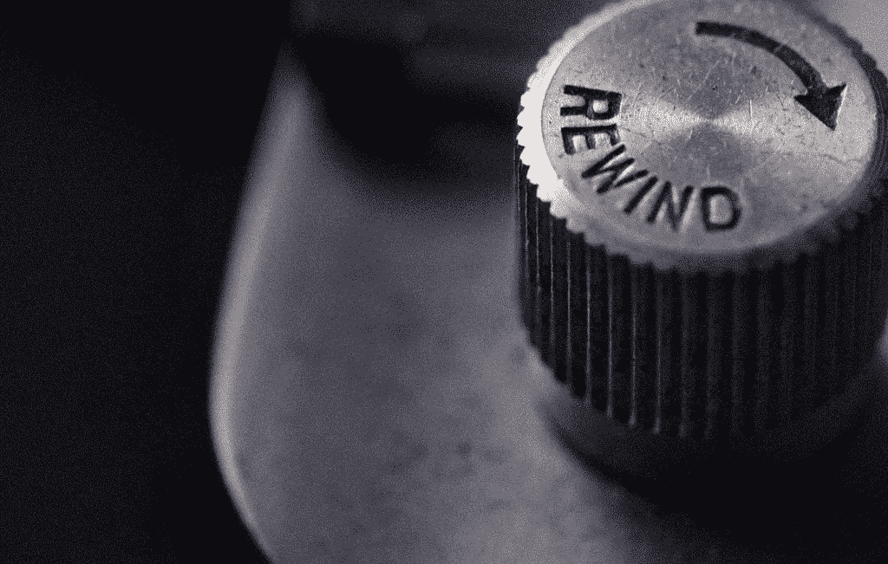

2018 年，科技领域取得了许多进步。现在是时候再次回顾技术如何通过一些有希望的改进改变我们的生活，并且仍然有望改变我们的日常生活。

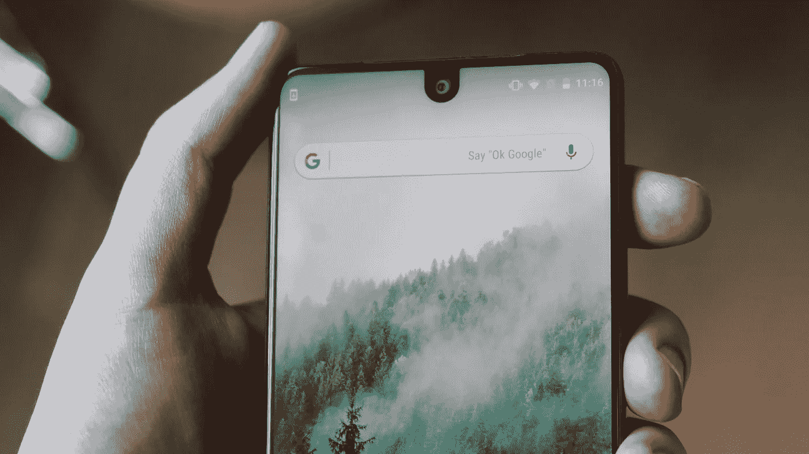

我们看到市场上推出了许多无边框智能手机。这场革命首先是由 iPhone-x 开始的，我们看到许多手机在 AMOLED 的帮助下使用这些设计。Oppo、华为、三星、一加以及更多公司都推出了无边框产品。有了这个，我们可以体验最大化的屏幕和酷炫的设计来应对。

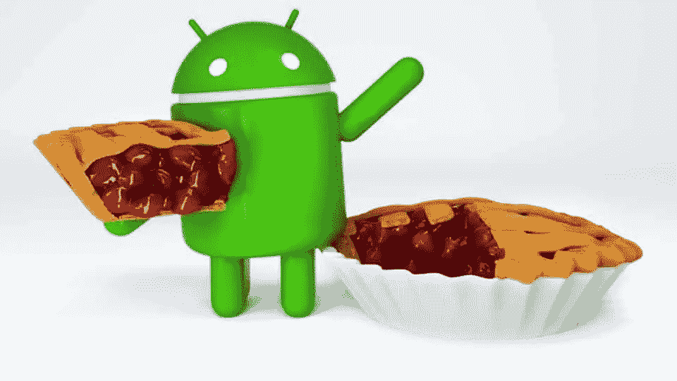

Android pie Beta

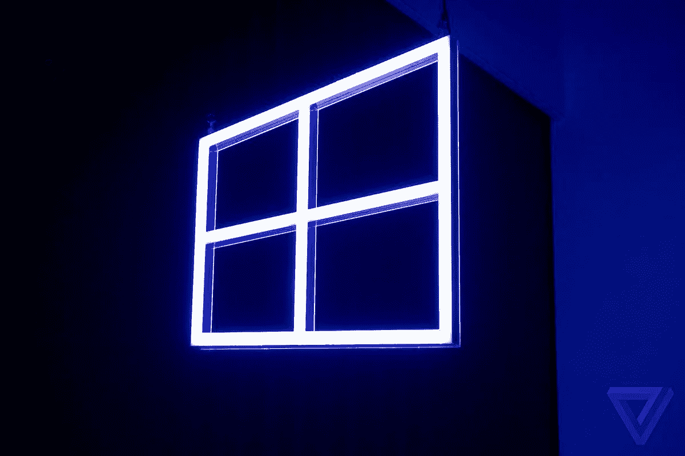

在操作系统中引入人工智能是智能手机、笔记本电脑和个人电脑世界的一个显著进步。人工智能的引入通过延长电池寿命、加快应用程序的打开速度、改善应用程序之间的切换，提高了系统的性能。不仅仅是 android，windows 10 月-2018 年的更新也显示了 PC 与用户交互的显著变化。当微软从体验了 Windows 最新人工智能更新的用户那里获得反馈时，他们证明了这一点。

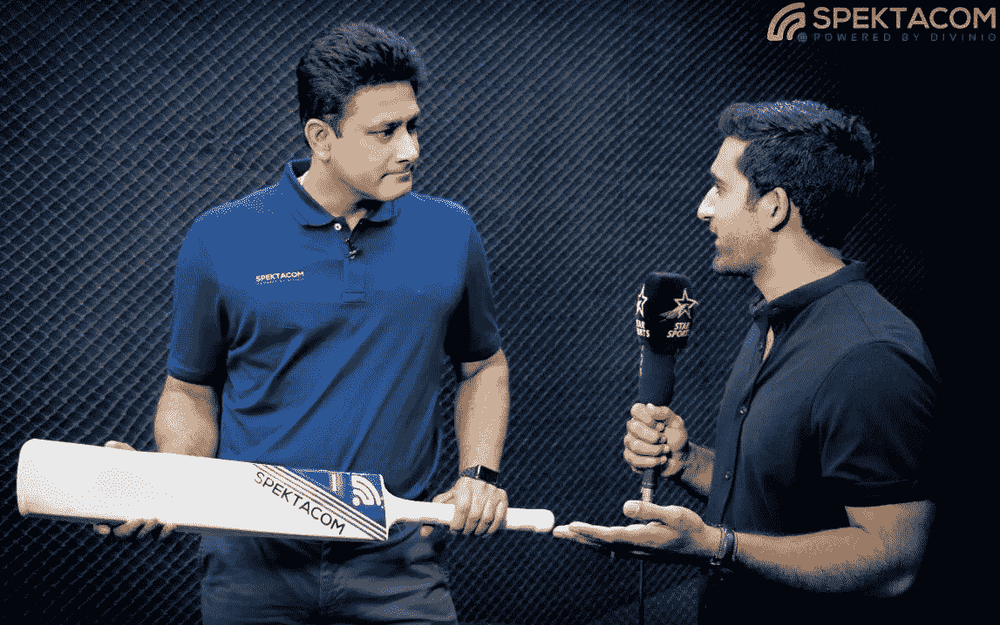

人工智能在体育运动中的应用。在人工智能的帮助下，微软展示了体育界的另一个显著变化。在这里，人工智能芯片附着在球棒上，击球手的表现数据在比赛时收集。它收集实时数据，如冲击速度、冲击扭转，并帮助教练分析击球手的表现，蔻驰通过移动应用程序获得分析数据。微软通过与印度著名板球运动员 Anil Kumble 的合作开发了这一产品。

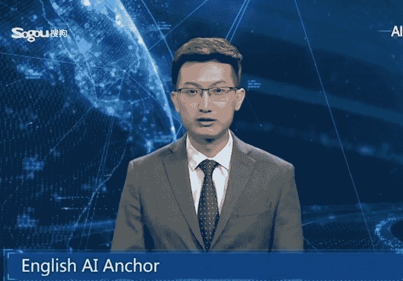

在发明了最聪明的人工智能人形机器人索菲亚之后，中国首次推出了人工智能主播人形机器人。它是世界上第一个人工智能(AI)驱动的新闻主播。根据同一份报告，人工智能主播可以在其官方网站和各种社交媒体平台上全天工作，降低新闻制作成本，提高效率。我们迈向人工智能人形机器人的步伐正在一步一步地前进，让我们看看未来世界会看到什么样的人形机器人进步。

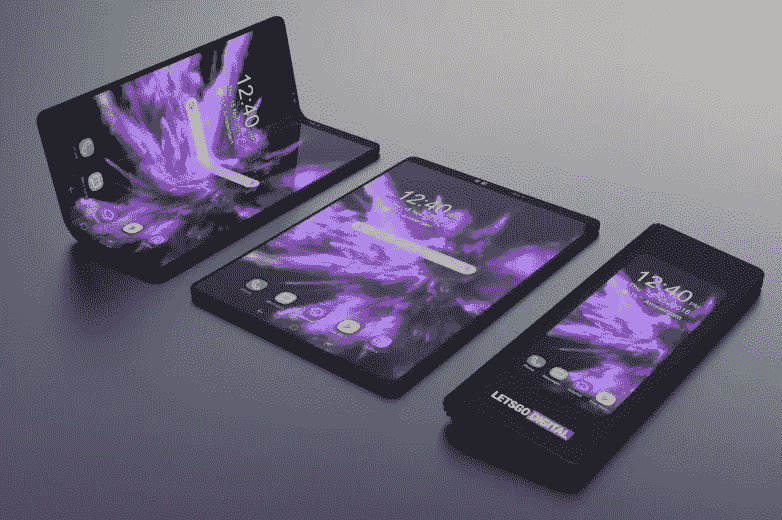

可折叠智能手机现在不是梦。三星发布了史上首款可折叠智能手机。三星展示了他们自己的可折叠智能手机及其最新的 UI-One。现在，在有机发光二极管显示器的帮助下，可折叠屏幕也成为可能。让我们看看可折叠屏幕将如何改变我们的未来。

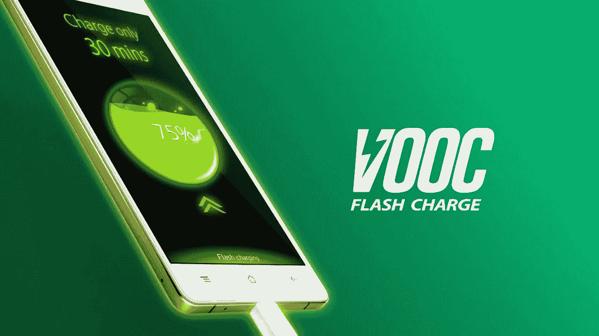

随着 **VOOC** (电压开环多步恒流充电)和 super VOOC 的推出，我们看到了智能手机充电的动态改善。我们可以在 30 分钟内充 75%的电。Oppo 通过将电池分成两半并平行充电两个插槽，进一步推动了这场革命，这催生了世界上最快最安全的充电智能手机 OppoR17，它可以在 10 分钟内充电 40%。Oppo 现在还在研究如何让充电体验更快更安全。

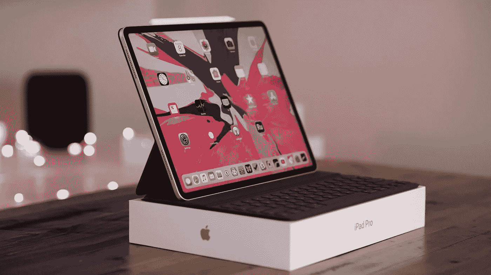

苹果(Ipad pro-2018)和其他公司如微软和谷歌(GooglePixel Slate 2018)推出的平板电脑模型表明，这些平板电脑是计算的未来。平板电脑型号的进步表明，它们甚至可以取代笔记本电脑。我们看到了这些平板电脑模型在计算、设计和性能方面的巨大改进。

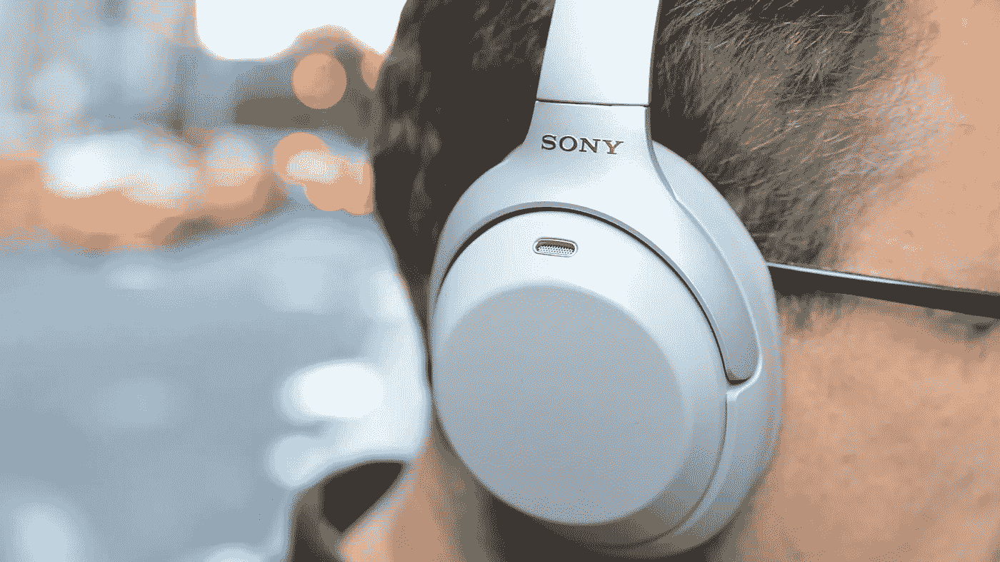

索尼在发布其索尼 WH1000xM2 降噪耳机时，达到了降噪和高级音质的新水平。这款智能耳机增加了许多新的用户友好和技术功能，如快速充电、高效电池、谷歌辅助等，将耳机的未来推向了一个先进的水平。

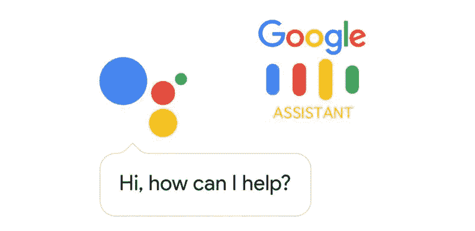

在人工智能的帮助下，谷歌将其谷歌助手提升到了一个新的水平。现在，你可以预订电影院门票、餐厅座位、图书沙龙，只需说 OK GOOGLE 并订购所需的目的地，谷歌助手就会像真人一样用表情与对方交谈。它还拥有许多高级功能，可以给你最好的体验，就像你正在与一个真正的人类助手互动一样。

在技术领域有很多这样的进步，比如虚拟现实和增强现实的进步。推出智能处理器，如骁龙 855 和骁龙 8cx，承诺我们 5G 技术的未来。

在我看来，这些是技术上的主要进步，需要放在回放列表中。

# **如果 a 在《科技倒带:2018》的倒带列表中漏掉了什么，请在下面评论。**