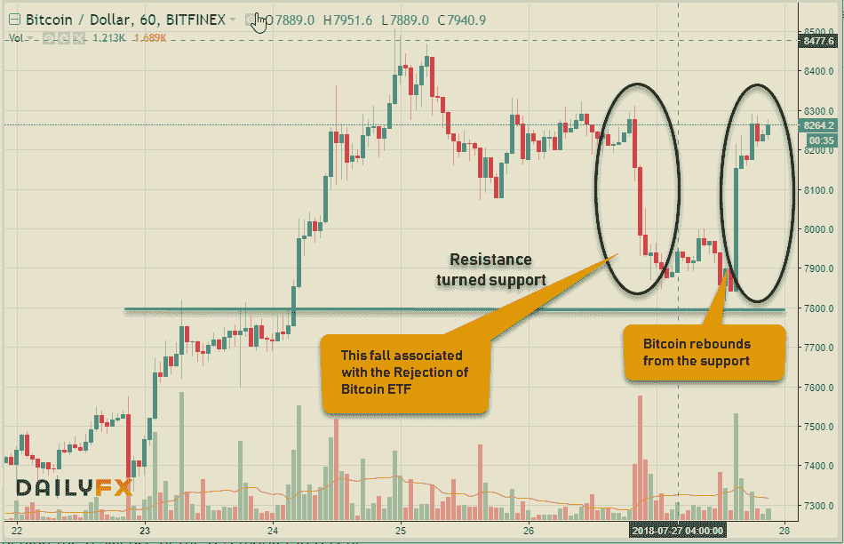

# 技术滚动、加密 FUD 和市场噪音

> 原文：<https://medium.datadriveninvestor.com/tech-rollover-crypto-fud-market-noise-b63515b9a08?source=collection_archive---------4----------------------->

在我早期交易的日子里，有一件事一直困扰着我，那就是大量的“噪音”不断分散我的注意力，并对我根据技术水平做出合理交易决策的能力产生不利影响。这会给我灌输一种贪婪或恐惧的情绪，以至于我会太快地退出正交易，或者太长时间地持有亏损的交易，从而损害我的投资组合。我并不是建议你对市场上发生的事情漠不关心，但你不必关注每一件小事，也不必把每一条头条新闻都当作修改交易的建议。如果你做了正确的功课&按照你的计划进行交易，而不是静观其变。

这些年来，我学会了不要太在意那些华而不实的标题……毕竟，它们摆在你面前，是为了吸引公众的注意力，而不是作为一个贸易想法的建议。对我来说，最终我意识到新闻、文章和贸易想法等的一些好资源。你所需要的就是一个你认识并信任的可能的导师、朋友或交易伙伴，当你有任何疑问时，可以向他们咨询。这方面的一个例子是上周科技季度收益发布时发生的事情&一些关于加密货币的其他噪音。

美国股市的财报季总是未来几个月市场走向的决定性因素。像往常一样，科技股特别受到关注，因为它是美国市场近期反弹的唯一驱动力。在我继续说下去之前，我必须告诉你，对于像我这样的短线交易者来说，玩股票收益或外汇数据就像买一张彩票，然后向天祈祷，希望资产朝着你的方向发展。需要我告诉你中彩票的几率有多大吗？话虽如此，如果你是一名长期投资者，希望在一个稳健的商业模式基础上，兑现公司未来的潜力和增长，这些修正其实并不太重要。

这让我想到了脸书& Twitter 在发布财报后股价下跌了 20%。谈到脸书，该公司预计在不久的将来，增长将放缓，运营利润率将下降。然而，它仍然拥有非常稳健的商业模式，拥有世界上最大的社交媒体平台之一，拥有 22 亿用户，拥有广受欢迎的 Whatsapp、Instagram & Messenger，最近在 ar、VR 领域进行了一些大的押注。类似地，Twitter 在经历了前几年的困境后，今年也有了很好的好转，涨幅超过了 100%。它是社交媒体领域的主导者之一，拥有增长空间、3.35 亿用户、定向收购和有机增长计划。Twitter 用户数量下降的原因是，为打击滥用内容和错误信息而移除和/或暂停账户导致 100 万用户流失(这实际上是件好事)。告诉你这一切的全部意义不是给你一个买入这些公司的投资建议，而是让你知道收益如何发挥作用，与之相关的市场噪音&它是否应该影响你的交易或投资决策。当然，如果你像我一样是短线交易者，简单的建议是，在事情稳定下来之前，不要涉足。对于长期投资者来说，这些举动被认为仅仅是调整，给他们一个巩固和/或增加头寸的机会。

加密市场受到市场噪音或 FUD 的困扰。在我之前的文章中，我提到过比特币交易所交易基金的预期批准将是推动加密货币的根本原因之一。昨天，我的桌面上被文克莱沃斯兄弟的 ETF 申请再次被 SEC(T2 证券交易委员会)拒绝的消息轰炸。巧合的是，比特币价格从过去一周左右保持的近期高点下跌。显然，价格下跌与这一决定直接相关，有人认为这将扼杀最近的 BTC 牛市。我没有太关注它，但今天的头条新闻一直持续到我最终决定进一步了解发生了什么&也看看比特币图表。原来，SEC 以行政理由拒绝了申请，实际上在 92 页的回复中解释了没有针对加密货币的任何东西——顺便提一下，目前有五份 ETF 申请提交给 SEC！因此，在 FUD 澄清后，我打开了 Crypto kingpin 的图表，它清楚地显示了数字硬币的一些获利回吐，它下降到先前的阻力水平&现在支持 7800 美元，然后在撰写本文时反弹到 8260 美元，如上图所示。

市场噪音真的会让你恐慌到做出非理性决定的程度&给你的投资组合造成重大损失。所以，保持专注，保持你的目标。在金融市场交易中，耐心是一种美德。练习一下！

相关文章:**[**交易心理&经验教训**](http://www.datadriveninvestor.com/2018/07/12/trading-psychology-lessons-learnt/)[**加密货币复兴市场主义**](http://www.datadriveninvestor.com/2018/07/17/cryptocurrencies-reviving-agorism/)[**关税战&改变自由贸易动态**](http://www.datadriveninvestor.com/2018/07/19/tariff-war-changing-dynamics-of-free-trade/)**

**保持联系:[Twitter](https://twitter.com/fklivestolearn)|[StockTwits](https://stocktwits.com/trade_nut)|[LinkedIn](https://www.linkedin.com/in/faisal-khan-2a3009b/)|[Telegram](https://t.me/joinchat/IWzyHBGWCFwPQTe8Tm5H_Q)|[trade alike](http://www.tradealike.com/)**

***原载于 2018 年 7 月 27 日*[*www.datadriveninvestor.com*](http://www.datadriveninvestor.com/2018/07/27/tech-rollover-the-crypto-fud-market-noise/)*。***