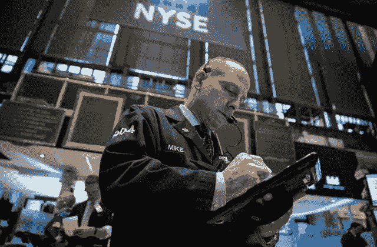

# 技术大幅降低市场

> 原文：<https://medium.datadriveninvestor.com/tech-sharply-lowers-markets-9c9c4be2c20e?source=collection_archive---------52----------------------->

受波音下跌的影响，标准普尔 500 下跌 1.67%，道指下跌 1.56%，或 395.78 点。在苹果和其他大型科技股暴跌后，科技股纳斯达克下跌 3.03%或 219.4 点。苹果公司股价下跌，此前周一有报道称该公司已削减 iPhone 产量。对公司的供应商提出质疑。

持续的贸易紧张局势也继续给市场带来压力。上周末，中国国家副主席迈克·彭斯在巴布亚新几内亚举行的亚太经合组织峰会上发表演讲，暗示美国将停止对中国征收关税，直到中国接受美国的贸易要求。

## 股票

纳斯达克指数下跌 3.03%，至 7028.48 点

标准普尔 500 下跌 1.66%，至 2690.73 点

道琼斯指数下跌 1.56%，至 25017.44 点

## 货币

欧元下跌 0.03%，至 1 欧元兑 1.145 美元

日元上涨 0.04%，至 1 美元兑 112.6 日元