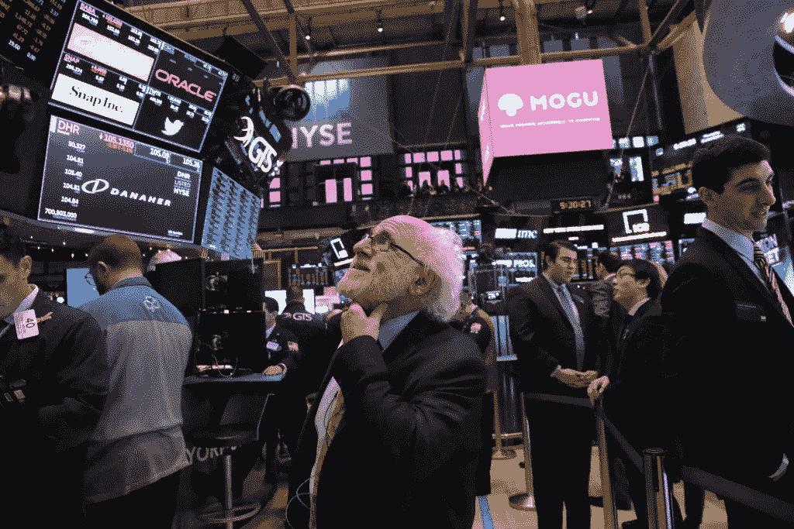

# 今天科技股上涨稳定了指数

> 原文：<https://medium.datadriveninvestor.com/tech-stocks-rise-steadying-the-indexes-today-56194bd0a464?source=collection_archive---------38----------------------->

标准普尔 500 股市上涨 1.23%，至 2561.07 点，非必需消费品板块涨幅可观。道琼斯指数上涨 1.31%，至 24527.27 点，纳斯达克指数上涨 1.67%，至 7098.31 点。

早些时候，唐纳德·特朗普总统在接受采访时表示，中国正在购买“大量”美国大豆，这是贸易争端的核心。特朗普还表示，华盛顿和北京正在通过电话谈论贸易，更多的特使将进行会谈。

苹果供应商正在考虑将 iPhone 的生产从中国转移出去。苹果公司股价上涨 0.28%，至 169.10 美元。亚马逊上涨 1.24%，至 1663.54 点，谷歌上涨 1.13%，至 1063.68 点。脸书和网飞股市双双上涨，脸书股市上涨 1.70%，至 144.50 点，网飞股市上涨 3.6%，至 274.88 点。

## **股票**

标准普尔 500 指数上涨 0.5%。

纳斯达克上涨了 0.95%。

道琼斯指数上涨了 0.64%。

日本东证指数上涨 0.3%。

澳大利亚 S&P/ASX 200 指数上涨 0.2%。

上证综合指数上涨 0.2%。

韩国综合股价指数上涨了 0.4%。

## **货币**

日元兑美元汇率上涨 0.13%，至 113.44。

欧元上涨 0.1%，报 1.1367 美元。

英镑下跌 0.03%，至每磅 1.26 美元。

## **商品**

西德克萨斯中质原油上涨 0.5%，至每桶 51.38 美元。

黄金价格稳定在每盎司 1244.34 美元。