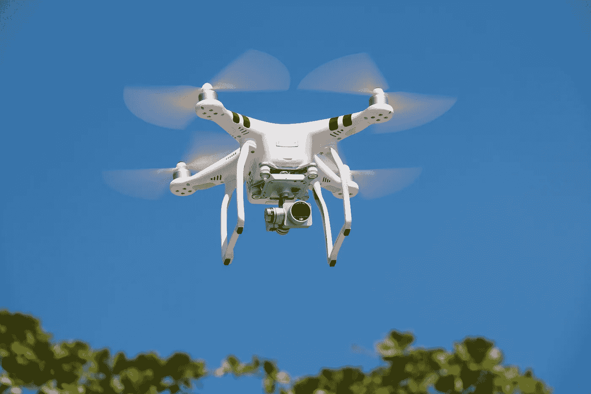

# 面向未来的技术:5 个高增长行业的创新是什么样的

> 原文：<https://medium.datadriveninvestor.com/tech-to-the-future-what-innovation-looks-like-in-5-high-growth-industries-55cc599621b3?source=collection_archive---------10----------------------->

La Fosse Associates 采访了 5 位专家，以了解他们在各自行业中最感兴趣的发展，以及他们所在行业的创新前景。

*无论你是在寻求扩大投资视野，还是仅仅对你所在领域之外的突破性技术感兴趣，请看下面 5 个闪电之旅，从健康技术的视野到新型超级计算机。*

# 医疗保健——Rabin Yaghoubi

我们系统性医疗保健问题的最终解决方案是从昂贵的治疗转向具有成本效益的预防。通过应用人工智能和预测分析，我们最终可以利用技术为你的身体做传感器已经为汽车做的事情——即持续监控它们，在小问题变成大问题(和昂贵的问题)之前先发制人地识别它们。

收集高质量数据的能力是关键。然而，今天的医疗保健数据是完全不同的，即使是最基本的测量某人健康的方法也是昂贵、繁琐和不常见的(例如血液测试)。

通过开发侵入性更小且持续的方法来监控您的健康，我们可以显著降低数据收集的成本和工作量，同时提高数据的质量和频率。然后，我们可以在大量人群中应用人工智能来识别预测模式。这可能有助于识别某些疾病的高危人群，从而进行早期干预。

永远在线、永远在线的手机和可穿戴设备是这些持续数据收集和分析进步的核心，从健康追踪器到[插入式心电图配件](https://www.technewsworld.com/story/84985.html)到[用于精神健康的情绪测量应用](http://www.mobihealthnews.com/content/study-apple-watch-cognition-kit-offer-accurate-cognitive-mood-assessment)。随着诊断服务的其他进步，移动技术也得到了改善，如负担得起的基因、血液和尿液家庭检测试剂盒，以及呼吸和声音分析等领域的创新。

这一进展代表着对“量化自我”的早期入侵，并将始终允许我们进入预测和预防医学的强大世界，在这个世界中，我们的身体和思想，就像我们的汽车一样，不再抛锚。"

# 无人机技术——克里斯·比利莫尔

创新技术处于建筑行业的最前沿，为该行业的从业人员提供了激动人心的新机遇。

一个例子是**无人机技术**；虽然一些公司仍然保持沉默，但它的使用越来越广泛。无人机可以安装激光扫描仪或摄影设备，以进行基础设施状况评估——这不仅可以提供质量、时间、成本和安全方面的好处，还可以减少对破坏性交通管理的需求。无人机沿着电力传输电缆、高速公路和铁路等长线性资产飞行，减少了临时关闭高速公路车道或铁路线的需求。

利兹大学正在牵头[一个 420 万英镑的关于自我修复城市的基础设施研究项目](http://selfrepairingcities.com/)。这包括一个“感知和修补”项目，无人机首先用于早期检测沥青中的磨损，然后安装 3D 打印机，在坑洞发生之前先发制人地恢复表面状况。修复可能只需要一分钟——唯一需要的交通管理就是改变交通灯的顺序。

*要看无人机的行动演示，点击* [*这里。*](https://www.youtube.com/watch?v=mcK1xGfDWg0&feature=youtu.be)

# 保险技术——凯文·芬德利

在保险业引起最大轰动的技术是物联网、人工智能、智能合同和分布式账本。这些趋势如何发展有待讨论。

人工智能和预测算法多年来一直是保险精算师的主食。今天的新内容是引入额外数据及其在保险分销、优化销售和改善后台运营方面的应用。

这得益于廉价硬件和改进的软件开发平台的可用性，以及核心人工智能/神经网络算法的改进。[神经网络](http://blog.trueinteraction.com/neural-networks-what-they-are-and-their-many-applications)是模拟大脑物理结构和信息处理的计算系统，使其能够以更“人性化”的方式处理决策。

这些发展使我们能够使用数据来更好地制定保险政策，尽管进步应该始终以处理个人数据时必须应用的道德标准为中介。"

# 数据与分析:单内存超级计算机——马特·赖特

“从 IT 角度来看，我感到兴奋的是新技术，如 [SAP Hana](https://www.sap.com/uk/products/hana.html) 和[惠普的‘The Machine’](https://www.labs.hpe.com/the-machine)，它们实现了 IT 部门一段时间以来对企业做出的实时报告的承诺，消除了对数据库的需求。

作为一个已经在 IT 行业工作了 30 年的人，这些技术带来的机会简直令人难以置信。我们看到在操纵和虚拟化数据以及保护记录系统的能力方面取得了巨大进步，这为业务和 IT 提供了令人振奋的机会。"

# 金融科技论坛:让我们超越区块链——内拉·琼斯

“区块链在交易和身份领域有特定的应用——英国政府最近被敦促[将护照放在区块链](http://www.cityam.com/276514/put-passports-blockchain-think-tank-urges-uk-government)上，以创建单一的国家身份，而 R3 和 Ripple 等公司展示了它在全球金融网络或 Investpop 中创建智能合同的功效。

然而，区块链有其局限性:它还没有达到可以处理零售支付等低延迟交易的阶段。

如果你关注支付领域，你会发现区块链之外还有很多吸引人的地方，价格也不那么昂贵。支付和身份密不可分，PDS2 等监管压力进一步推动了这些发展，要求通过生物识别和行为分析实现更好的身份认证。

让你能够检查和保护消费者的技术，如人工智能和机器学习，也值得密切关注，就像任何围绕网络安全的东西一样——“Regtech”的新兴生态系统正在蓬勃发展，一些评论者将其称为“新金融科技”。”

艾玛·罗德里克是 La Fosse Associates 公司的高级顾问，专门研究私募股权。如果您想了解更多关于我们的执行能力 [*点击这里*](https://www.lafosse.com/executive-search) ***。***

***与艾玛取得联系，拨打 0207 932 2066 或*** [*邮箱*](mailto:emma.roderick@lafosse.com?subject=Executive%20Capabilities) ***。***

*原载于 2018 年 2 月 14 日*[https://www.lafosse.com/posts](https://www.lafosse.com/posts)*。*