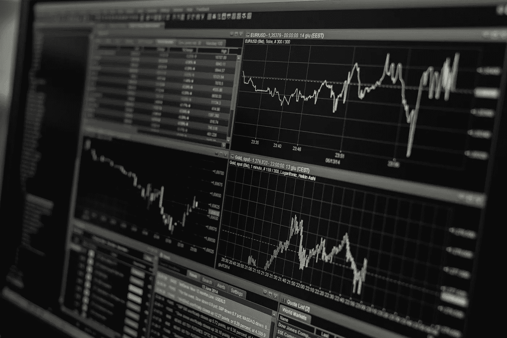

# 技术分析—局限性

> 原文：<https://medium.datadriveninvestor.com/technical-analysis-limitations-a930375ae91?source=collection_archive---------9----------------------->

最好的市场策略是什么？

学者们认为，基本面高于一切，大多数散户交易者表示，是技术在操纵市场。

事实上，正如我在以前的文章中所写的，在我看来，正确的方法是 80%的基本面分析告诉我们资产的方向/偏差以及它可能持续多长时间，20%的技术面分析告诉我们进入市场的最佳时机。

那些认为技术分析是市场驱动力的人可能没有错，因为如果你正确使用技术分析，你可以成为一个非常成功的交易者。

在我作为交易者的旅程中，我尝试过几种交易方法，包括基本面分析方法，但是，我宁愿用技术而不是基本面。

这是我感觉更舒服的，我意识到技术分析有局限性，如果你们能意识到这一点，这可能并不坏！

我想强调的是，那些使用 80%基本面和 20%技术面的方法的人没有错，这是“完美”的方法，也是金融行业专业交易者通常使用的方法。

在过去的三年里，我开始意识到技术分析的局限性。

你有没有想过，当你试图长期持有(几个星期到几个月)时，为什么你所持的头寸(在大多数情况下)不奏效？

政治事件有时会改变市场趋势，在这些情况下技术分析会失败，但当我们看基本面时，它也会失败吗？

市场是被银行和政府操纵的吗？

这些是我在过去三年中一直想知道的几个问题的例子，它已经开始让我对技术分析有了高度的认识。

不幸的是，就在去年，我彻底改变了我的市场策略，但我仍然专注于 90%,我的大部分交易都是基于技术分析。

作为一个交易者，我们必须在我们可以使用的技术和当我们长时间(超过一周)强制使用时变得“危险”的技术之间找到平衡。

日内交易和日内交易成为我作为交易者的风格，因为出错的风险比我们倾向于长期交易时要小得多，事实上，我持续几天的头寸让我更快地知道在做决定时我是“对”还是“错”，所以我可以最大化我的利润。

此外，我也只应用技术分析，如果我能识别价格/图表已经有足够的历史表明某个运动可能会重演。

因此，对于那些只想专注于技术分析的人来说，必须意识到技术分析有其局限性。

永远记住，目标是和市场在一起，而不是和市场作对！关注你所看到的和你认为可能发生的，你的图表是最好的指示器！