# 技术设置— Cryptos.Forex 股票

> 原文：<https://medium.datadriveninvestor.com/technical-setups-cryptos-forex-stocks-618dc0031c62?source=collection_archive---------0----------------------->

# 疯狂的密码诗

上周对 Cryptos 来说真是难熬，数字硬币抹去了过去一个月的收益。在撰写本文时，**的总市值从 2960 亿美元暴跌至 2550 亿美元。让我们看看比特币是否能守住 6900 美元的主要支撑位，还是会否定基础理论&进一步走低。让我们来看看图表。**

****比特币(BTCUSD — MT 看跌，ST 看跌)****

**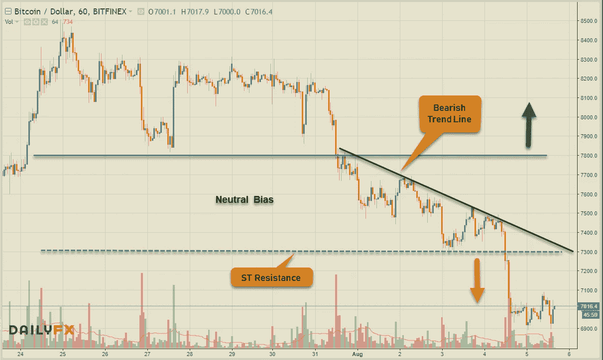**

****Ehtereum (ETHUSD — MT 看跌，ST 看跌)****

**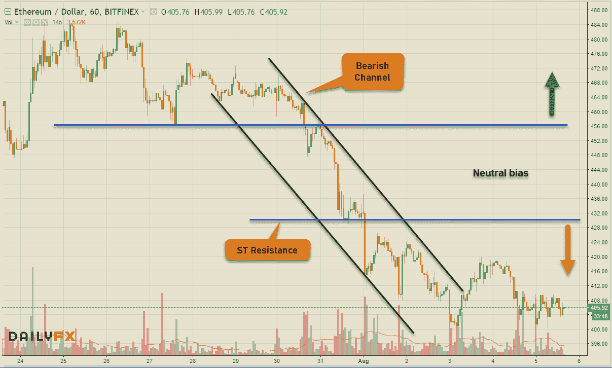**

****Ripple (XRPUSD — MT 看跌，ST 看跌)****

**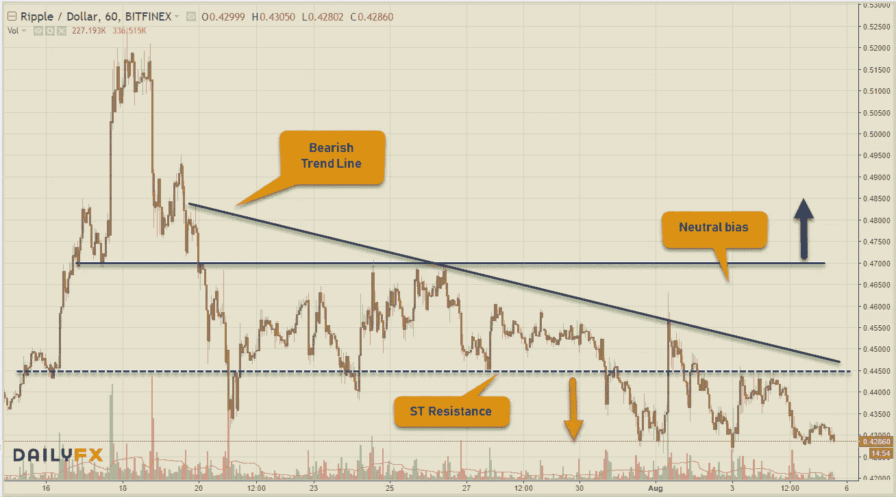**

****比特币现金(BCHUSD — MT 看跌，ST 看跌)****

**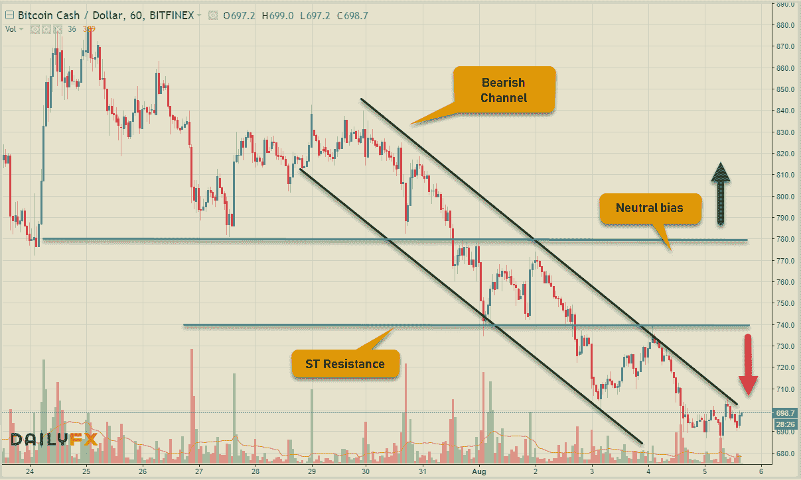**

****EOS (EOSUSD — MT 看跌，ST 看跌)****

**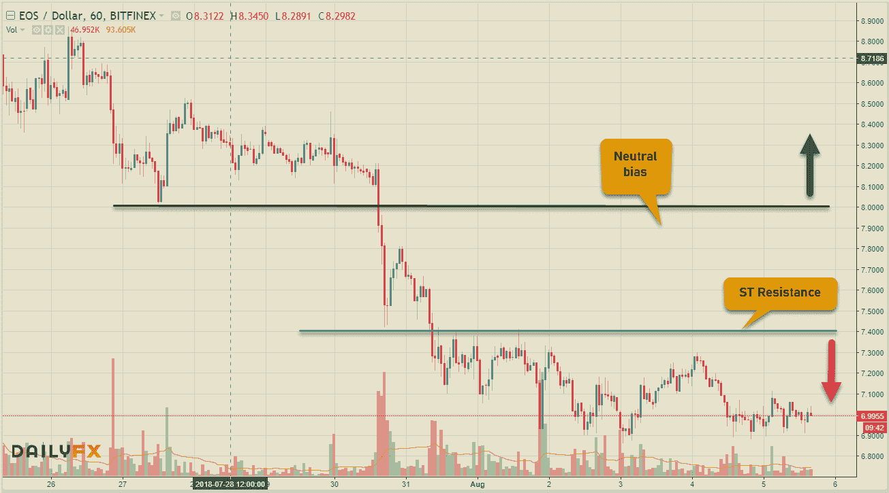**

# **外汇市场**

**美元指数的波动意味着美元将恢复其牛市趋势，接近前一个高点——也许第四次将会是个好兆头。欧洲货币对表现最差，伊朗里亚尔兑美元汇率跌至 10 万里亚尔的历史低点。英格兰银行&印度中央银行提高了利率，同时日本银行打消了改变宽松货币政策的担忧。下周的经济日历又是忙碌的一周，澳大利亚&新西兰&美国&中国 CPI、加拿大就业数据和英国&日本 GDP 数据都将公布。**

****欧元(欧元兑美元— MT 看跌，ST 看跌)****

**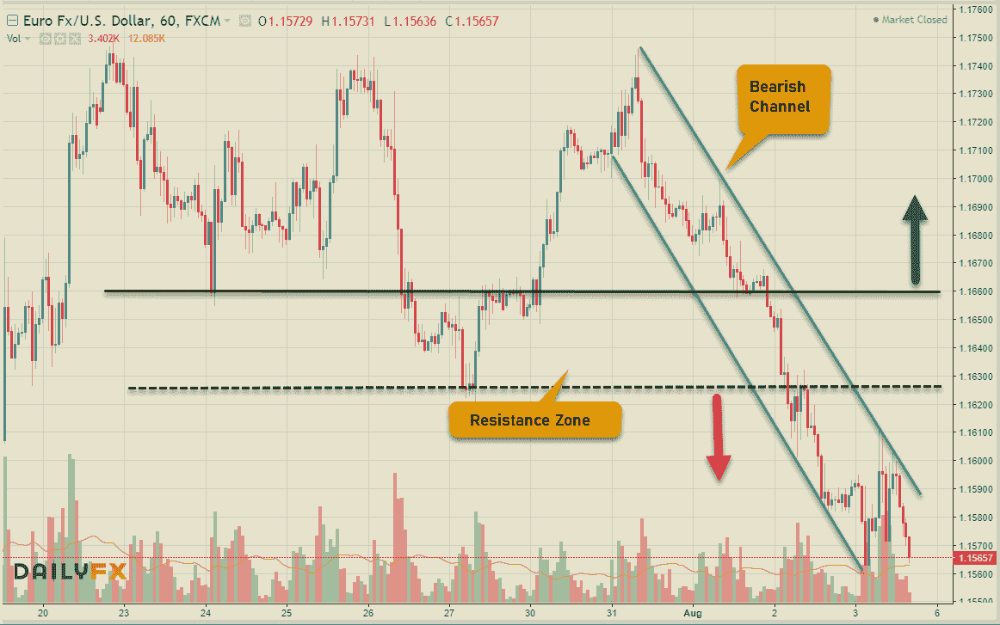**

****英镑(GBPUSD——MT 看跌，ST 看跌)****

**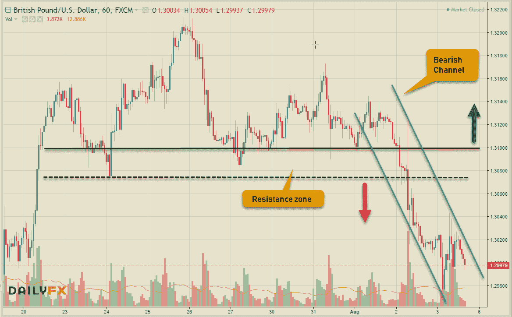**

****日元(美元兑日元——MT 中性，ST 看跌)****

**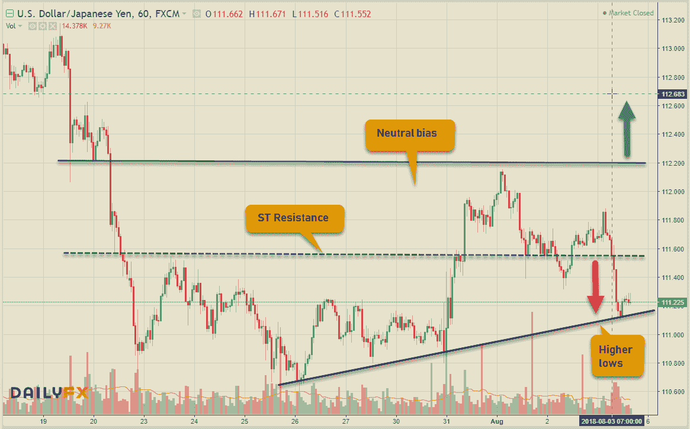**

****LOONIE(美元兑加元-MT 中性，ST 看跌)****

****澳元(澳元兑美元— MT 看跌，ST 中性)****

**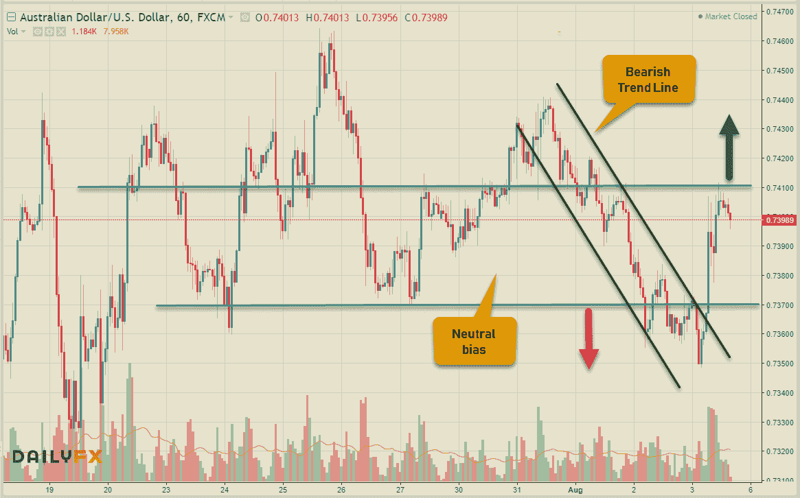**

# **股票市场**

**尽管世界上两个最大的经济体之间的贸易争端持续不断，但美国股市本周收高走强。目前，似乎没有什么能够阻止美国市场在又一个盈利良好的季节再次偏离其他主要金融市场的情况下继续走高。来说几个数字吧。**

****美国——DJIA(+0.05%)，标准普尔 500 指数(+0.76%)，纳斯达克(+0.96%)，****

****欧洲——富时 100 指数(-0.55%)，德国 DAX 指数(-1.90%)，CAC 40 指数(-0.59%)****

****亚洲——日经 225 指数(-0.83%)，BSE Sensex 指数(+0.59%)，上海 50 指数(-4.42%)****

**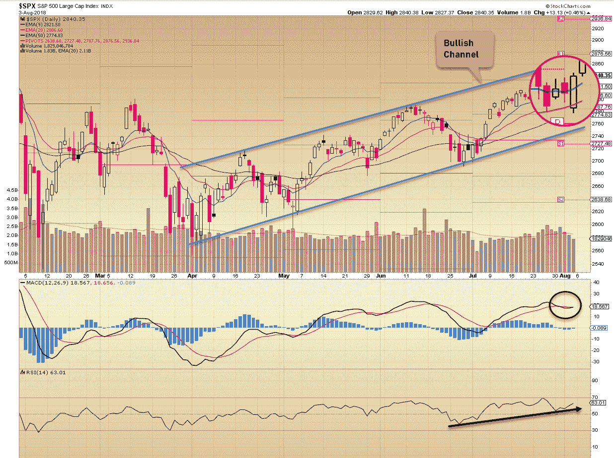**

**标准普尔 500 从 20 均线反弹，本周以看涨收盘，目标是保持 4 月份以来的看涨通道中的前一个高点。没有理由在这一点上担心，在 2815 附近也有支撑。其他新闻方面，Sonos 公司将其上市价格下调至每股 15 美元，低于 17 至 19 美元的预期范围，但交易价格高达 23.50 美元，收盘时约为 21 美元。**

**本周达成交易的想法— **JBHT****

**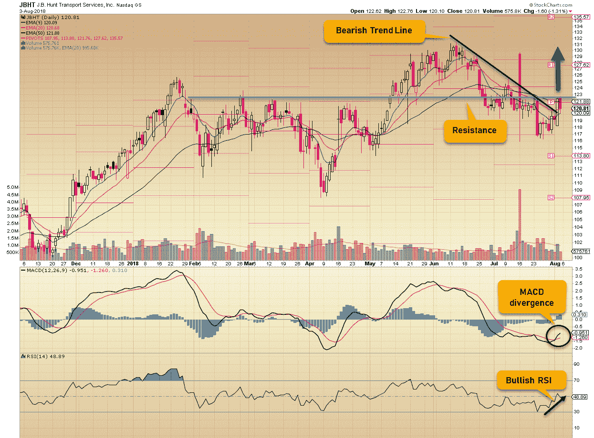**

**苹果击败亚马逊成为第一个万亿美元的公司。交易愉快！**

**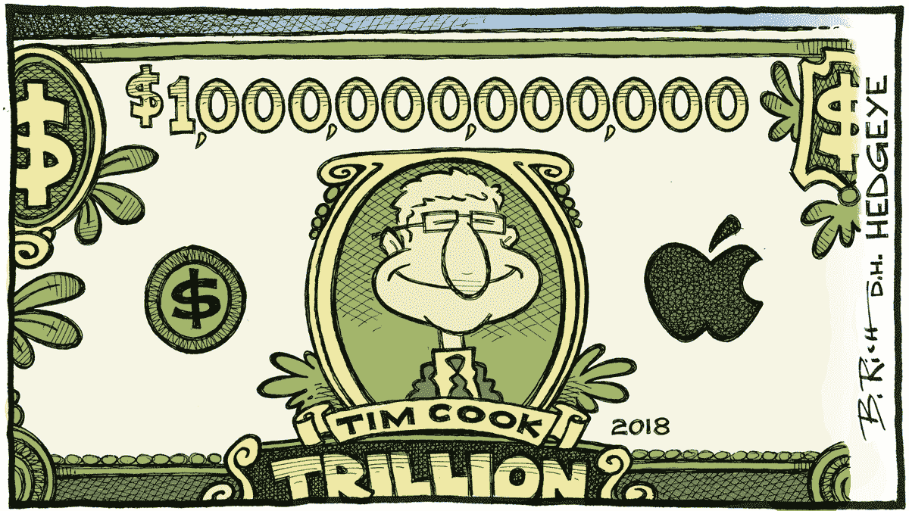**

**相关文章: [**交易美元专业外汇**](https://medium.com/datadriveninvestor/trading-usd-majors-in-forex-b616c7841bc7) ， [**交易心理&经验教训**](http://www.datadriveninvestor.com/2018/07/12/trading-psychology-lessons-learnt/) ， [**万金油……一个高手！**](http://www.datadriveninvestor.com/2018/07/03/jack-of-all-trades-master-of-one/) ， [**一刀切的交易策略？**](http://www.datadriveninvestor.com/2018/06/20/one-size-fits-all-trading-strategy/)**

**保持联系:[Twitter](https://twitter.com/trade_nut)|[StockTwits](https://stocktwits.com/trade_nut)|[LinkedIn](https://www.linkedin.com/in/faisal-khan-2a3009b/)|[Telegram](https://t.me/joinchat/IWzyHBGWCFwPQTe8Tm5H_Q)|[trade alike](http://www.tradealike.com/)**

***原载于 2018 年 8 月 5 日 www.datadriveninvestor.com***。****