# 技术设置—密码。外汇股票

> 原文：<https://medium.datadriveninvestor.com/technical-setups-cryptos-forex-stocks-93688587c2dc?source=collection_archive---------3----------------------->

Cryptos 一直持续 24/7/365——感觉没有时间放松或休息，所以在技术图表失效之前，让我们深入了解它们。在撰写本文时，总市值**为 2960 亿英镑，高于上周的 2500 亿英镑，这主要归功于表现最强劲的比特币。Ripple 仍然是表现最差的。**

****比特币(BTCUSD — MT 中性，ST 看涨)****

**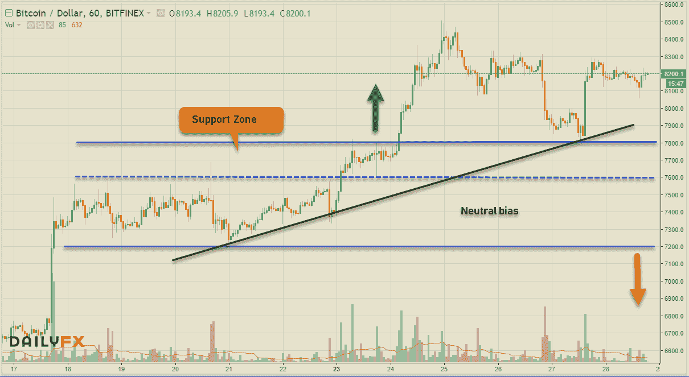**

****Ehtereum (ETHUSD — MT Neutral，ST Neutral)****

**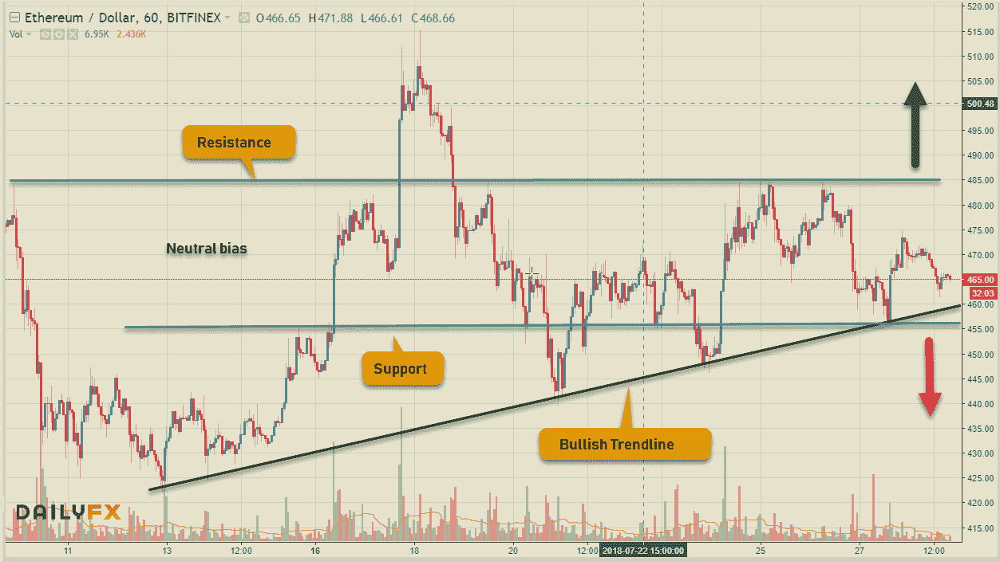**

****Ripple (XRPUSD — MT 看跌，ST 看跌)****

**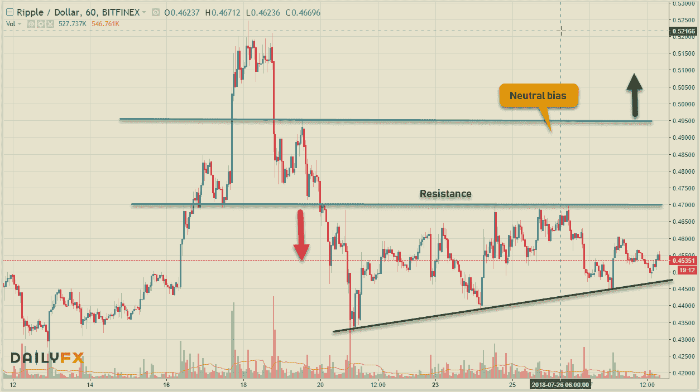**

****比特币现金(BCHUSD — MT 看跌，ST 中性)****

**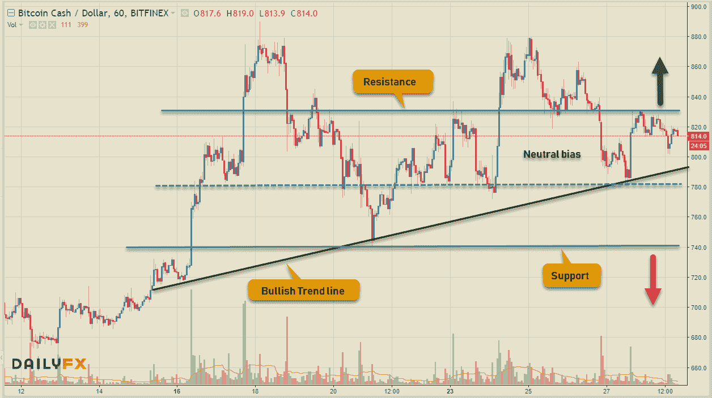**

****EOS (EOSUSD — MT 看跌，ST 中性)****

**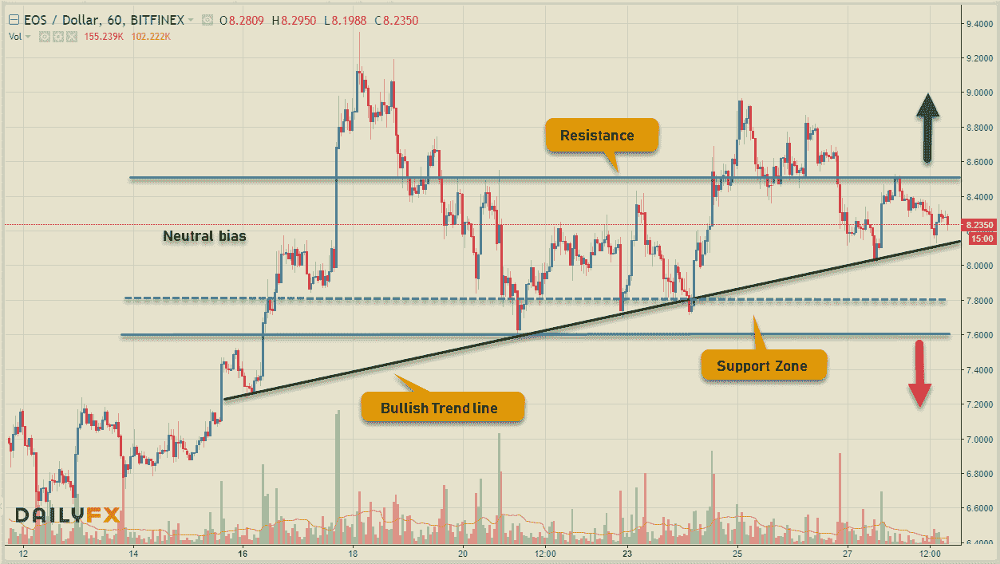**

# **外汇市场**

**后卫的韧性持续的力量让大联盟承受着压力。自从 1，000，000%的恶性通货膨胀使其毫无用处以来，委内瑞拉已经决定通过将其货币与国家加密货币 Petro 挂钩来重新命名其货币。日本央行宣布积极回购债券，推动日元走高，其中美元兑日元涨幅最大。本周经济日历繁忙，FOMC 利率决定，日本央行，NFP 美国数据，加拿大国内生产总值，德新就业数据等等。**

****欧元(欧元兑美元— MT 看跌，ST 看跌)****

**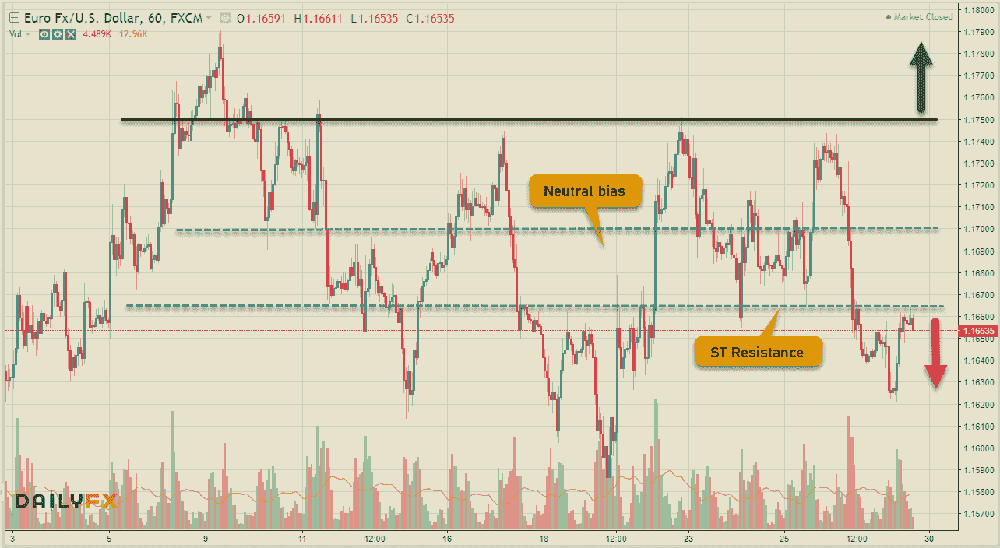**

****英镑(GBPUSD-MT 看跌，ST 看跌)****

**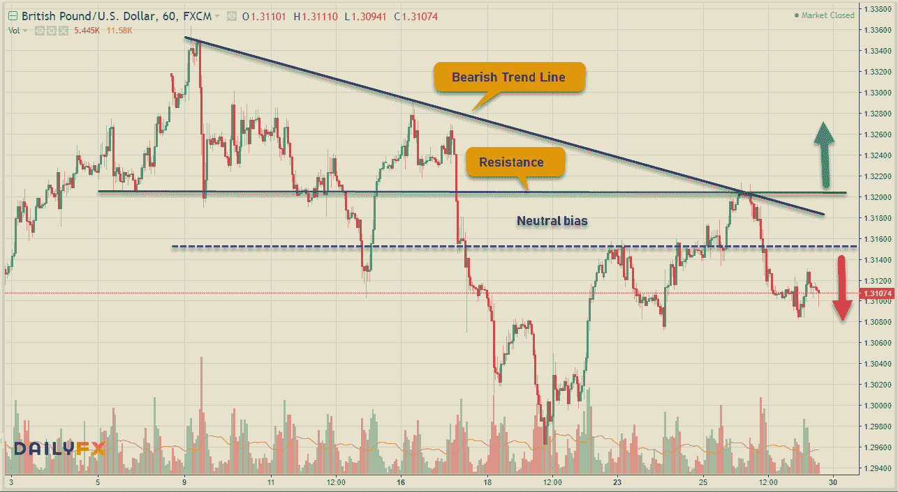**

****日元(美元兑日元——MT 中性，ST 看跌)****

**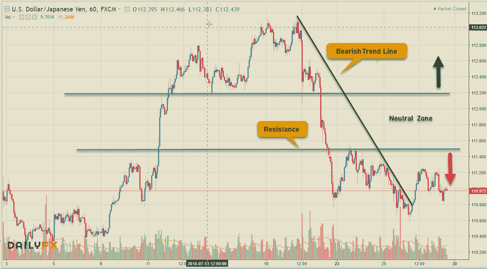**

****LOONIE(美元兑加元-MT 中性，ST 看跌)****

**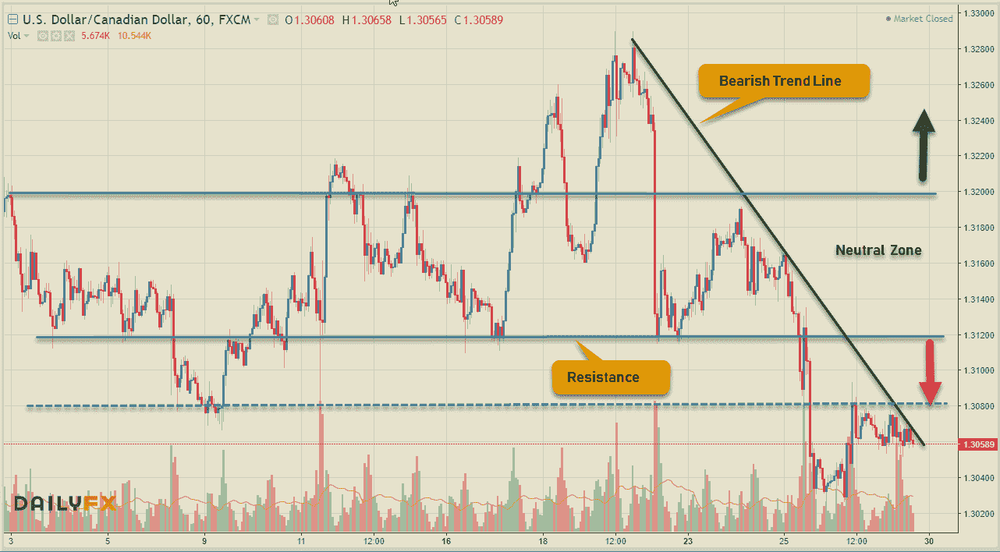**

****澳元(澳元兑美元— MT 看跌，ST 中性)****

****

# **股票市场**

**随着欧盟关税问题的解决，美国市场迎来利好消息&超过 4%的惊人国内生产总值增长率使市场连续第四周上涨，但科技指数下跌，脸书推特的收益加速了这一举动。让我们回顾一下本周世界市场的数据。**

****美国——DJIA(+1.57%)，标准普尔 500 指数(+0.61%)，纳斯达克(-1.06%)，****

****欧洲——富时 100 指数(+0.29%)，德国 DAX 指数(+2.38%)，CAC 40 指数(+2.10%)****

****亚洲——日经 225 (+0.07%)，BSE Sensex (+2.30%)，上海 50(+1.26%)****

**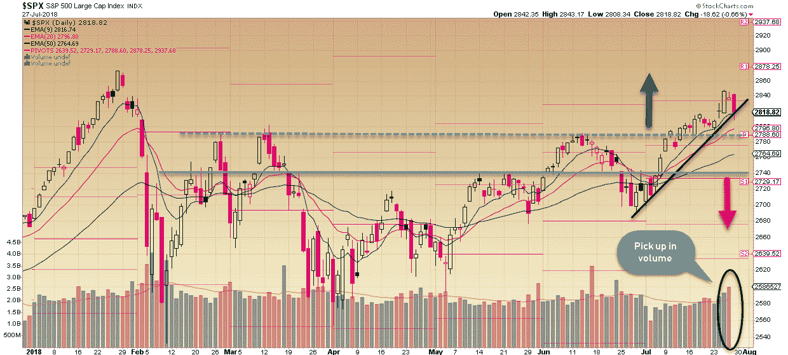**

**尽管周五科技股收益引发抛售，但标准普尔 500 本周仍设法收高。仍然持有 9 均线和看涨趋势线的汇合点。只要 2815 点附近的汇合点保持在下方，盘整就会延续。其他消息，Pinduoduo **(PDD)** 将其在美国的 IPO 定价为每股美国存托股票 19 美元，在 2018 年中国公司在美国的第二大 IPO 中筹集了 16.3 亿美元。**

**本周达成交易的想法— **ULTA****

**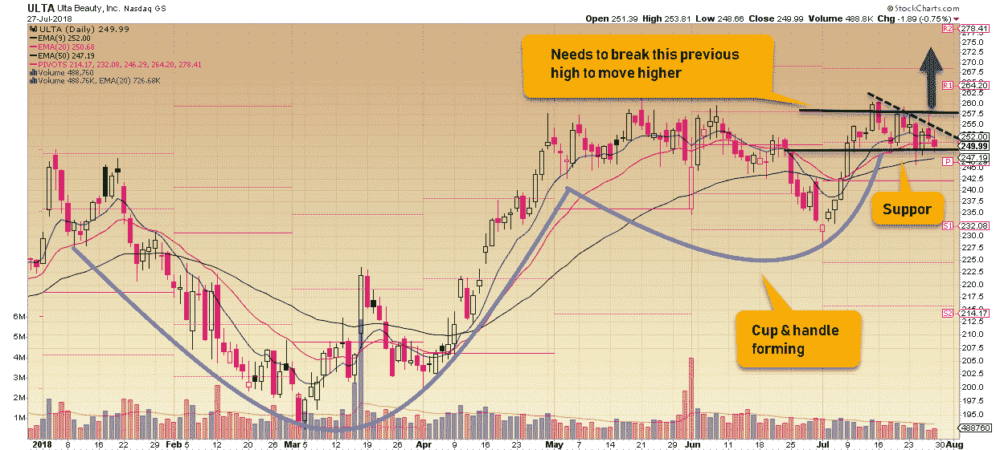**

**随着脸书和 Twitter 股价的下跌，科技股展期让投资者损失惨重。**

**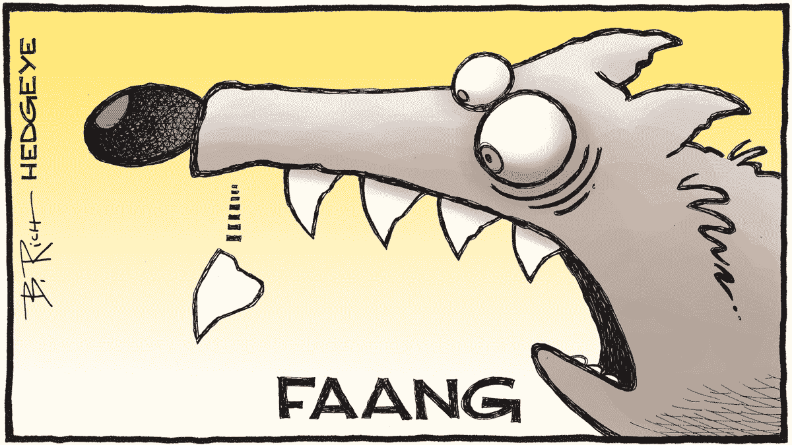**

**相关文章: [**交易美元专业外汇**](https://medium.com/datadriveninvestor/trading-usd-majors-in-forex-b616c7841bc7) ， [**交易心理&经验教训**](http://www.datadriveninvestor.com/2018/07/12/trading-psychology-lessons-learnt/) ， [**万金油……一个高手！**](http://www.datadriveninvestor.com/2018/07/03/jack-of-all-trades-master-of-one/) ， [**一刀切的交易策略？**](http://www.datadriveninvestor.com/2018/06/20/one-size-fits-all-trading-strategy/)**

**保持联系:[Twitter](https://twitter.com/fklivestolearn)|[StockTwits](https://stocktwits.com/trade_nut)|[LinkedIn](https://www.linkedin.com/in/faisal-khan-2a3009b/)|[Telegram](https://t.me/joinchat/IWzyHBGWCFwPQTe8Tm5H_Q)|[trade alike](http://www.tradealike.com/)**

***原载于 2018 年 7 月 28 日*[*www.datadriveninvestor.com*](http://www.datadriveninvestor.com/2018/07/28/technical-setups-cryptos-forex-stocks%e2%80%8a/)*。***