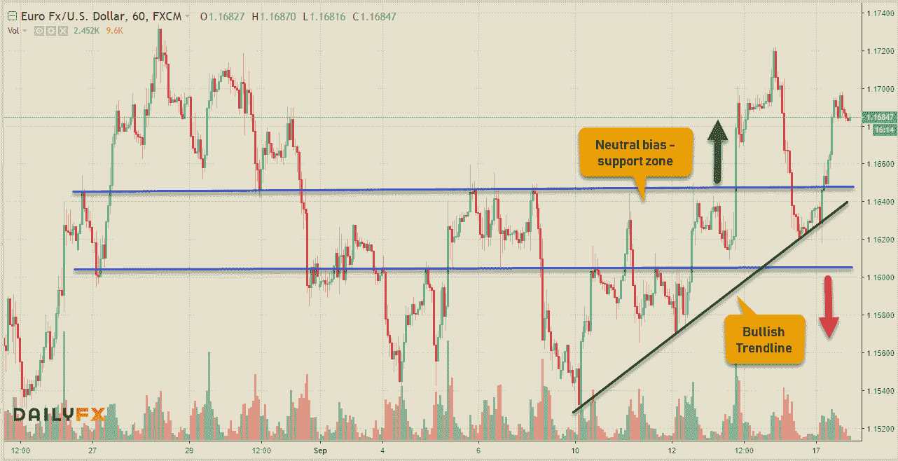
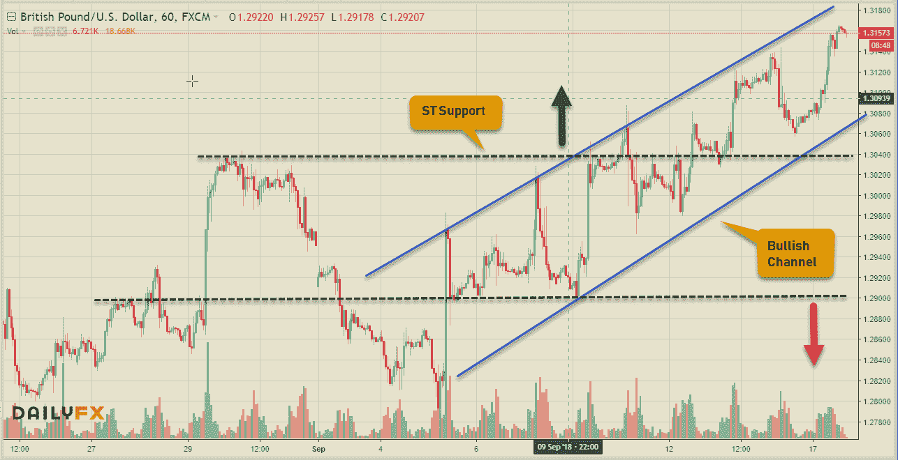
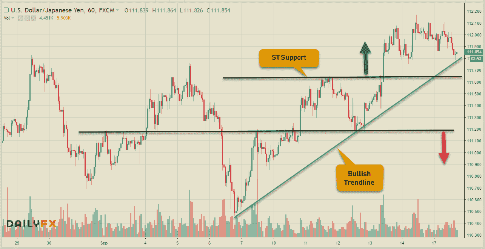
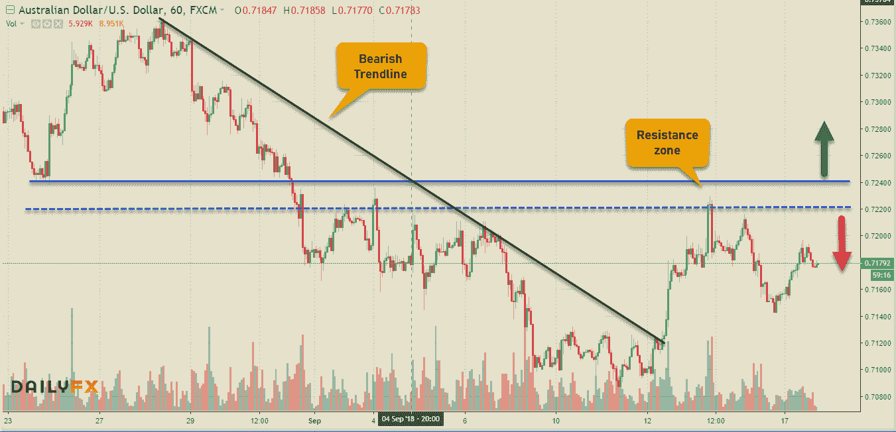
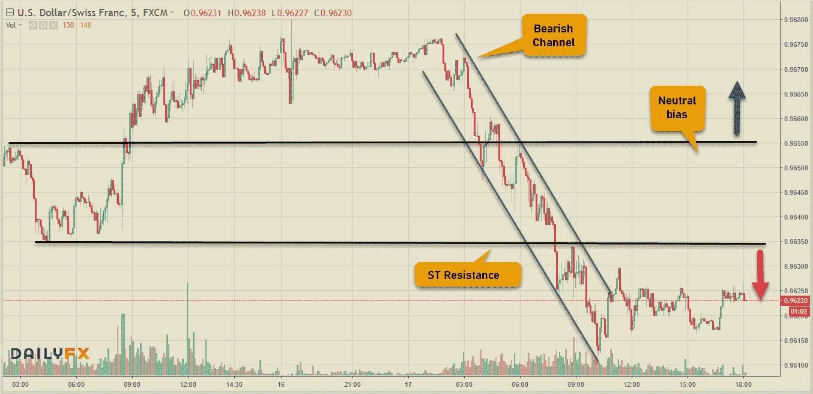

# 技术设置—外汇

> 原文：<https://medium.datadriveninvestor.com/technical-setups-forex-d73569fb8b52?source=collection_archive---------36----------------------->

本周美元开始走弱，但这将归结于金融市场的总体风险情绪。如果美国即将对中国征收额外关税，这可能意味着风险流入储备货币。让我们看看美元巨头&他们现在的情况。

## 欧元/美元(MT 中性，圣保罗)

## 英镑/美元(MT 中性，圣保罗)

## 美元/日元(MT 中性，ST Bulish)

## 澳元/美元(MT 看跌，ST 看跌)

## 美元/加元(MT 看跌，ST 看跌)

## 美元/瑞士法郎(MT 看跌，ST 看跌)

我通常也在 Twitter & StockTwits 上发布一些想法，但是如果你有兴趣从我这里获得实时的可操作的提醒，请下载 Tradealike 应用程序并以@Fakd 的名字关注我。交易愉快！

相关文章: [**土耳其里拉崩盘&传染恐惧**](https://medium.com/datadriveninvestor/turkish-lira-meltdown-contagion-fears-58b327901206) 、 [**交易心理&经验教训**](https://medium.com/datadriveninvestor/sttrading-psychology-lessons-learnt-2ea706908df2) 、 [**百事通……一个高手！**](https://medium.com/datadriveninvestor/jack-of-all-trades-master-of-one-bb05ccafdf8a) ， [**交易美元专业外汇**](https://medium.com/datadriveninvestor/trading-usd-majors-in-forex-b616c7841bc7)

保持联系:[Twitter](https://twitter.com/fklivestolearn)|[StockTwits](https://stocktwits.com/trade_nut)|[LinkedIn](https://www.linkedin.com/in/faisal-khan-2a3009b/)|[Telegram](https://t.me/joinchat/IWzyHBGWCFwPQTe8Tm5H_Q)|[trade alike](http://www.tradealike.com/)

*原载于 2018 年 9 月 17 日*[*www.datadriveninvestor.com*](http://www.datadriveninvestor.com/2018/09/17/technical-setups-forex/)*。*