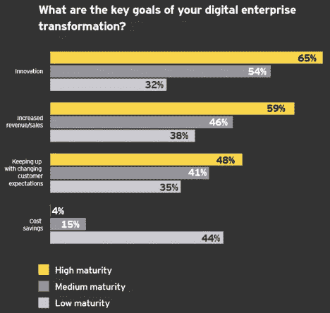
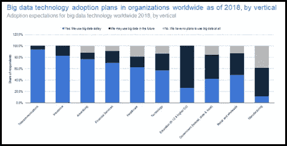
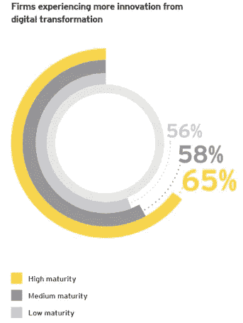
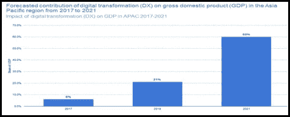
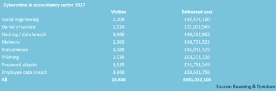

# 技术创新:财务会计的时代需求

> 原文：<https://medium.datadriveninvestor.com/techno-vation-need-of-the-hour-for-finance-accounting-ec9ed6aa353e?source=collection_archive---------9----------------------->

**执行摘要**

实施数字化转型不仅仅是企业的事后想法。为了改善决策、效率和盈利能力，企业应该投资并利用各种类型的技术创新，包括区块链、人工智能、大数据和物联网(IoT)。

尽管数字化转型有诸多好处，但在过渡阶段可能会出现挑战。通过适当的实施前规划和研究，技术创新可以很容易地被采用和调整，以获得最大的积极成果。

**HYPER-INNOVATION: NEED OF THE HOUR FOR F&A**

**简介**

数字技术可能不是魔杖，但它已经彻底改变了商业格局。它带来了所有部门的不断发展和不断演变，财务和会计也不例外。抛开局限于统计数字或编制盈亏统计数据的传统角色，F&A 如今发挥着更大的作用。但是，为了充分发挥潜力并保持相关性，他们需要全心全意地采用技术创新，不断变革和创新。

 [## 分散金融的出现|数据驱动的投资者

### 当前的全球金融体系为拥有资源、知识和财富的人创造了巨大的财富

www.datadriveninvestor.com](https://www.datadriveninvestor.com/2019/03/14/the-emergence-of-decentralized-finance/) 

因此，要成为领导者，就要像领导者一样行事，F&A 必须拥抱和采用超创新。运用“没有风险就没有收获”的理论是一个诀窍，首席财务官不能回避尝试最新的创新，这是击败竞争对手所必需的。从长远来看，尽早开始创新总是有好处的。当务之急是通过改进和改革来合作、协作和征服。以客户为中心的方法应该是所有进步的基础。提前思考，为未来做好准备是关键；传统的、倒退的、过时的流程意味着停滞和死亡！

在本文中，您将了解

●金融公司押注的不同的*路径*和*类型的创新*，

●他们知道或认为这会带来什么好处，以及

●他们在这个过渡阶段面临的主要挑战。

**#什么是 TECHNOVATION？**

*“技术创新基本上是一种数字化转型，旨在重塑或重组由技术驱动的不同服务。”*

从大纲来看，*金融服务的数字化*可能看起来不相关或不需要，但实际上，数字化转型和技术创新将*运营效率*提升到了更高的水平。

越来越多的金融服务公司正在考虑投资于能够简化其流程的技术，以产生更快的产出，最终加速其业务。

要清楚了解数字化转型如何影响日常生活，最基本的例子就是对比几年前我们处理交易的方式！

回到 20 年前，人们不得不去银行，排着又长又忙的队取钱。但是今天，在尖端技术的推动下，交易可以通过应用程序轻松完成。在未来使用自动化技术和区块链，交易甚至可以是无接触的。

安永(EY)对金融服务行业的 240 名高管进行了一项关于技术颠覆的调查。调查向他们提出了一些问题，询问他们公司在运营中引入技术颠覆者的主要原因，大多数人指出技术颠覆者提供了创新和收入增长。

Source: Ernst & Young

数字转型如此具有颠覆性并使金融和非金融公司的旧业务模式过时的主要原因是，总体而言，转型所铺平的新道路对客户、员工和组织来说更容易、更顺畅、更好。

**会计和金融领域的技术创新类型**

金融服务行业中 4 种最有前途且应用最广的技术颠覆性产品概述:

**#1。区块链**

*“区块链是一个不朽的经济交易数字账本，它不仅可以记录金融交易，还可以记录几乎所有有价值的东西。”— Don & Alex Tapscott，区块链革命作者(2016)*

区块链是领先的技术，为服务转型铺平了道路，使传统的金融业务模式过时。新的金融科技公司称使用区块链势在必行，因为它们使交易、客户互动和财务报告变得更容易。

传统巨头的进入壁垒和竞争力水平在金融行业非常高，但使用区块链等先进技术创新的新金融科技公司已经找到了一种方法，不仅可以竞争，还可以在金融服务业一些最赚钱的元素中占据市场份额。

许多银行正在使用区块链来促进跨境支付，这曾经是一个包括多个代理和银行来处理从一端到另一端的支付的过程。现在有了区块链，这些中间代理已经变得多余，节省了时间，最重要的是，客户在很短的等待时间内就可以拿到钱，同时始终知道自己的钱在哪里。另一方面，传统方法需要大量的时间，而且在开始交易和实际收到钱的过程中，你唯一知道钱在哪里的时间是连续几天都不知道钱在哪里。

然而，传统方法在追踪反洗钱和 KYC 计划方面有其安全优势，但现在区块链也被用于解决所有这些问题，区块链的透明和清廉本质上是这些问题的完美解决方案。

然而，对于金融服务公司来说，必须实际研究和了解技术在哪些方面可以使他们的流程更加高效；仅仅为了创新而创新是行不通的。

**#2。人工智能**

*“一个系统正确解释外部数据，从这些数据中学习，并利用这些学习通过灵活的适应来实现特定目标和任务的能力。”*

根据普华永道的一项调查，“87%的会计师和财务专业人士自己认为，会计和跟踪财务可以在人工智能和数字助理的帮助下进行。”

今天，**人工智能(AI)** 正被广泛研究并应用于可能从中受益的服务领域。这同样适用于金融服务业。随着*大数据*和*云服务*领域的增长，直接受益于它们的 **AI** 越来越受欢迎，在未来 10-15 年将成为颠覆的主要来源。

金融服务在很大程度上依赖于人工智能，比如最近反复灌输的个人助理、聊天机器人等功能。带来了更好的客户体验，并作为数据点。

人工智能也大量用于财务报表和数据的审计。审计需要处理大量的数据，这些数据在很多情况下是杂乱无章的，需要花费时间来处理，AI 简化了这一过程。

人工智能还被用来更快、更可靠地做出信贷决策，同时灌输一种更严格的信用评分框架，以发放贷款和预付款，而不是传统的设置。

从合规的角度来看，会计师事务所可以通过使用人工智能，使所有数据处理和处理完全自动化和无错误，来应对严格的法规，并满足日益增长的客户需求。像应付账款和应收账款的清点这样的过程可以通过采用人工智能来顺利和最有效地处理。

许多金融公司正在大量投资于从事人工智能和内部 R&D 的公司，以产生更好的流程。

**#3。大数据**

*“极大的数据集，可以通过计算分析来揭示模式、趋势和关联，尤其是与人类行为和互动相关的。”*

在特许公认会计师协会和管理会计师协会的一项调查中，全球 62%的公司认为大数据非常重要，这可能会使精明的管理人员比竞争对手更具优势。

大数据集成已经成为金融服务和保险行业的一个关键因素，如下图所示，100%的保险机构参与了调查，使用或计划在其流程中灌输大数据，而金融服务行业的这一数字为 95%。

至于会计领域，纳入大数据对 it 的几乎每个方面都有巨大影响，包括审计、税务和相关咨询服务。审计人员现在正在使用大数据驱动的采样，他们对客户分类账中的所有交易进行采样，以搜索任何突出的潜在信息。会计师还受益于宏观经济层面的大数据，他们可以预测消费者和经济趋势的变化，从而帮助他们最大限度地降低风险。

Sources: Dresner; Statista Estimates

**#4。物联网**

*“嵌入日常物品中的计算设备通过互联网相互连接，使它们能够发送和接收数据。”*

**物联网**以其迷人的方式连接智能设备，帮助企业/公司*接收和发送数据，*这反过来帮助他们更好地分析需求，关注低效的服务，并间接帮助接触到以前不是目标的客户/客户。

注册会计师也可以从在他们的业务中灌输物联网中受益，他们可以接收关于交易、账单等的所有信息。通过数字网关，这可能导致簿记变得过时。访问各种数据点将成为会计师更好的关注点，因为他们可以实时跟踪记录和交易。如今，会计公司大多使用云托管的解决方案和服务，物联网将在不久的将来再次颠覆会计工作。

*这 4 种技术颠覆者有很多优点，并为一家计划和研究如何正确实施这些优点的公司带来了很多好处；然而，它们也有一些并发症。正反两面列举如下:-*

**通过技术创新实现数字化转型的 4 大优势**

数字化转型为公司提供了许多帮助，这些公司精心规划了数字化转型的实施，并完美地执行了数字化转型。对于*金融服务业*来说，数字化转型的一些最重要的优势如下:

《今日会计》的一项研究称，“会计软件的全球市场价值将达到 118 亿美元。”

**#1。创新**

使用新技术执行操作总是需要新的和创新的解决方案作为副产品出现。接受技术的金融行业参与者正在为他们的客户提供创新的解决方案。

例如，银行现在可以分析作物产量，根据产量，他们可以灵活地向农民提供贷款，这在农民和银行之间建立了牢固的关系。

通过分析借款人的支出模式、收入增长和预付款来计算借款人的信用评分；以前的信用记录等。与使用技术颠覆者的高级算法相结合，是使用技术创新简单计算以获得考虑到所有相关因素的可靠和稳健分数的另一个例子。

在同一份 EY 调查中，65%来自成熟公司的高管表示，数字化转型为他们的公司创造了更多创新。

Source: EY

**#2。效率**

如前所述，如果与最佳技术相结合，运营将变得更加高效。例如，正如在金融服务中使用大数据的分析师所说，现在可以发现比以前更多的趋势和模式，以做出合理的决策。

此外，利用技术减少了可能出现的人为错误，如区块链提供的信息是完全透明和廉洁的。先进的人工智能可以执行绝对健全的会计和审计分析，没有错误。

**#3。更强的关系**

可以与客户建立更牢固的关系，因为公司可以更好地满足客户的需求，特别是在客户有大量投资的金融服务业，他们更喜欢一个能够理解他们的需求、尊重他们的愿望并对他们的限制提出建议的机构。

如果企业的客户数据管理和分析极其高效和可靠，企业可能会更满意，这可以通过技术创新来实现。

**#4。经济强化**

整体数字化转型已经并将对各国经济以及全球层面产生重大影响。越来越多的投资正在进行；创新技术解决方案为 R&D 发展做出了重大贡献，公司将利用技术颠覆获得的超额回报投入到颠覆性机会市场。

据预测，到 2021 年，通过投资人工智能、物联网和其他加速数字化的产品和活动，通过数字化转型创造的数字产品和服务将占亚太地区国内生产总值(GDP)的 60%左右。

Source: Statista

然而，在使用和实施数字化转型时，并不全是彩虹和阳光。

**技术创新实施的挑战**

**不确定因素**

公司和员工在经历转型时总是面临不确定性。金融服务，例如审计或投资组合管理，有许多活动的部分，比如许多人为特定的审计或基金工作，拥有一个系统的流程对于成功完成任务至关重要。当经历转型时，员工通常对最终结果保持试探性，转型的过程可能会很紧张。

● **监管问题—** 像人工智能这样的技术创新必然会面临许多道德和监管问题，因为人工智能的机制无法被正确理解，它所能带来的变化和举措的数量也很难分析。

● **颠覆中的颠覆—** 随着越来越多的初创公司甚至老牌公司提出更具技术创新性的新产品，包括金融服务公司在内的所有公司都将面临一个问题，即如何跟踪最适合其需求、可行性、成本结构等的产品。这是因为成功整合的变更管理需要大量的资源和培训，而这些不能也不应该重复进行。

● **培训问题—** 随着越来越多复杂的技术创新解决方案的出现，企业人手不足，也就是说，他们没有足够的员工来培训其他员工如何应对这些变化。因此，不适当的培训总是导致无法实现潜在的最终结果，也无法满足基于这种变化而设定的未来目标。

**数据管理&数据隐私问题—** 大多数新技术颠覆者都是数据驱动型的，因此面临着成功管理客户数据和隐私的巨大挑战。这可能是一个相当大的挑战，因为全球范围内经常发生有针对性的黑客攻击和泄露。例如，尤其是在使用基于云的服务和执行“云会计”的会计公司比传统会计公司更容易受到网络犯罪的影响的情况下。

**克服挑战的方法**

● **更好的培训管理—** 在公司中拥有一个变革管理团队将是指导公司转型的理想选择。保持公司士气并让他们专注于长期目标同样重要。雇佣具有行业经验的有经验的人员将是有益的，这些人员曾面临同样的转变并处理过围绕它们的问题。

● **适当的实施前规划&研究—** 在实施之前，必须判断哪些领域可以从技术颠覆者中受益，必须找到能够与公司形成协同效应的最佳技术创新，还必须设定长期目标和愿景。不解决公司在特定运营中需要技术颠覆的事实是一个问题，但在没有任何需求或仅获得最低回报的情况下获得技术也是一个问题。因此，研究是关键。

例如，一家会计公司希望简化其流程，并利用技术创新来实现这一目标，它可以通过使用基于云的会计来实现这一目标，但随着物联网的出现，它可以通过另一种方式来实现。因此，公司需要选择一种符合其长期目标的方法。

● **始终保持创新** —技术颠覆总是在不断变化，因此，在实施变革和补充时，公司成为行业领导者是至关重要的。先发优势是一个重要因素，尤其是在金融服务业，保持创新是关键。

**前进的道路**

对于金融和会计的未来，最好的选择是采用一种未来的方法，预测 2025 年的情况并采取相应的行动。

认为不现实的会受益，因为今天不现实的，明天就会成为现实！

为未来做准备显然意味着绘制一张清晰的未来路线图，并载有完善的战略。

在为不可避免的中断做好未来准备的过程中，雇佣合适的人员和采用合适的技术至关重要。

企业需要明白，发展和完善完善的数字金融战略将有助于确保快速、顺畅和经济高效的组织。

这句简短的话，“*你要么破坏，要么被破坏”*很有分量；这给了领导者一个明确的暗示，要超前思考，否则，他们将被**数字技术浪潮**所淘汰。

**引文:**

*金融服务的产业化创新:加速和规模化之路。*

*会计数字化转型—* 喜气洋洋。