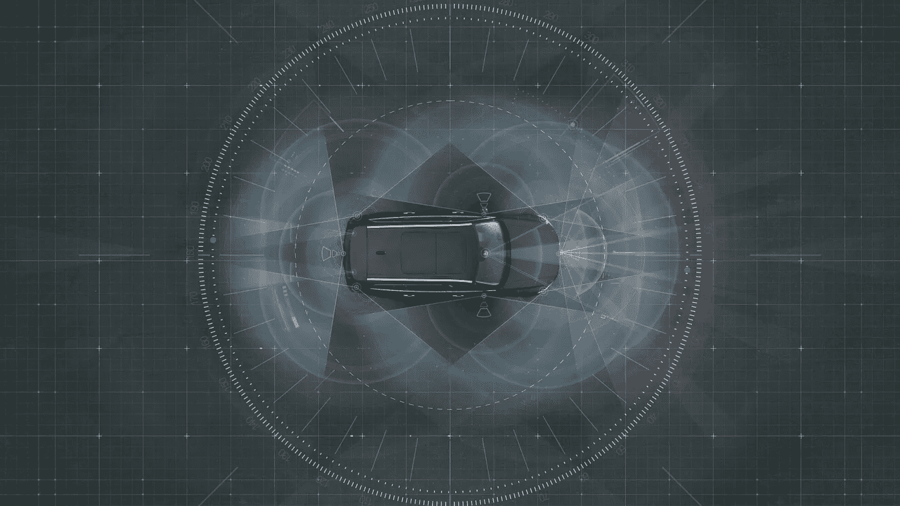
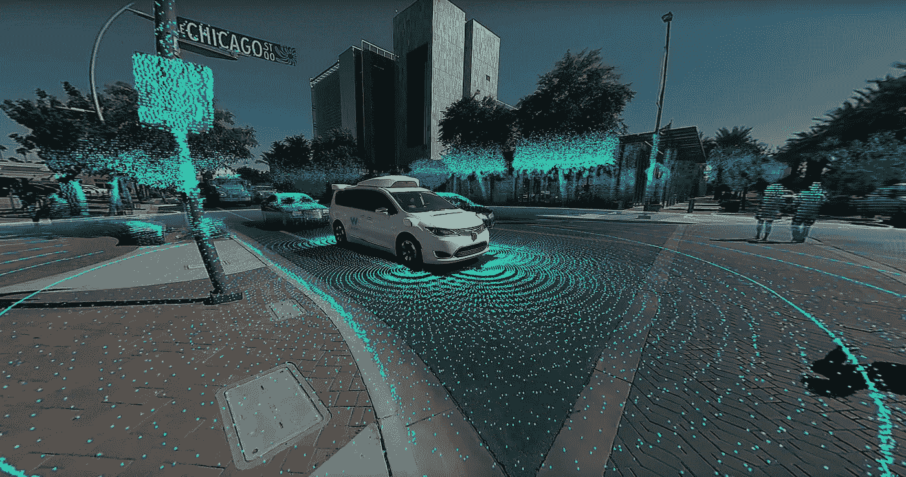

# 无人驾驶汽车面临的技术、伦理和法律挑战

> 原文：<https://medium.datadriveninvestor.com/technological-ethical-and-legal-challenges-of-self-driving-cars-6709de404974?source=collection_archive---------0----------------------->

如今，技术因为不自然和邪恶而受到了很多指责。然而，技术是唯一帮助我们克服问题的东西。我们的工具帮助我们扩大我们可以实现的范围。技术是人类想象力的具体化。想想这个事实:人类在过去的 50 年里比过去的 50，000 年进化得更多。

如果我们看看人类物种从史前时代开始的崛起，有三次由技术发展推动的进化加速浪潮。第一次浪潮发生在人类从狩猎过渡到农业的时候，由人类创造犁、锤和矛等基本工具的能力推动。这种转变发生在大约几千年前。第二次浪潮发生在工业革命时，由装配线、标准化、有组织的工作流程和自动化的发明推动。这发生在大约几百年前。第三次浪潮发生在人类发明计算机和互联网等信息处理系统的时候，它正在迅速演变人类与其发明的工具之间的关系。这是几十年前开始的。

不仅如此，技术也对生物和社会进化产生了更深远的影响。想想吧。一旦我们创造了石器，我们的下巴就变小了。一旦我们发现火可以烹饪我们的食物，使每一餐都更有效率，它释放了文化、宗教和艺术出现所必需的认知空间。把技术想象成一个延伸我们思想、范围和视野的脚手架。所以你可能会说，我们是谁是因为我们和我们的工具之间的反馈回路，在某种程度上，我们的工具变成了延伸的附属物，即使它们不在我们的生物皮肤组织内，但它们仍然是我们认知武器库的一部分。它们是我们的一部分，就像鸟巢是鸟的一部分，蜘蛛网是蜘蛛的一部分一样。它是我们现有表现型的延伸。这是我们白蚁的聚居地。这就是我们。

现在的问题是，无论技术有多好，是否应该允许它做出道德和伦理的决定？

让我们从不同的角度来看自动驾驶汽车的概念。法律法规视角。技术和监管往往被视为相反的力量。技术象征着新的更大的市场、创新企业和无与伦比的增长，而监管则代表着政府、沉重的官僚主义和增长的障碍。

技术和监管相持不下的一个例子是无人驾驶汽车的概念。自动驾驶汽车令人兴奋，部分是因为它们可以帮助确保我们的安全。90%的车辆死亡是由于人为错误——比如发短信和驾驶，在酒精或药物的影响下驾驶。通过消除道路上的司机，自动驾驶汽车可以产生巨大的积极影响。在乌托邦式的场景中，电网将无缝运行。这些汽车将彼此同步运行，完美地响应周围世界的规则和参数，不会有人丧生。但这永远不会发生。我们总是会遇到不可预测的天气、机械故障以及汽车维修和编程中的错误。即使是无人驾驶汽车，也会有撞车不可避免的时候，人们会不幸地死去。问题是我们的无人驾驶汽车应该如何应对这种情况？什么样的道德指南针将被用于编程我们汽车的死亡算法？如果你考虑经典的电车问题，它开启了一套全新的算法需要做出的决定。这种伦理困境进入了重视人类生命价值的模糊领域。

然而事情并没有就此结束。还有很多其他的事情要考虑。附带损害或经济损失呢。责任或车辆强度呢？能承受更大损害的汽车会被允许冒更大的风险吗？这些都是迷人而又困难的问题。有趣的是，无人驾驶汽车正在创造一个全新的基础设施，这使得我们有必要分析和修改我们的道德规范。通过将本能从等式中移除，我们被要求预先确定行动，并为我们最个人的价值观分配一个数字权重。

奥巴马政府已经拨出近 40 亿美元用于在未来 10 年内开发自动驾驶汽车，因此用不了多久你就可以放松下来，让你的汽车为你做所有的工作。在我看来，新车需要新的规则。在世界范围内，各国都在制定新的法律来监管无人驾驶汽车。英国表示，任何操作无人驾驶汽车的人都必须能够接管，以防任何事情失控。同样，在加州的拟议法律中，DMV 已经强制要求所有自动驾驶汽车必须有方向盘和驾驶执照。这是谷歌反对的事情，因为他们不希望他们的汽车有方向盘或踏板。日本希望在 2020 年东京奥运会上使用一个系统，但他们还没有找到监管框架。不仅政府必须适应这项新技术，保险公司也是如此。许多分析师预测保险业将迎来 Napster 时刻，因为他们认为自动驾驶汽车不仅会减少事故，还会减少拥有汽车的人，因此购买汽车保险的人也会减少。

此外，隐私将是一个问题。自动驾驶汽车的本质意味着它们不断观察周围发生的事情以及谁在驾驶它们。消费者监督组织等倡导团体担心自动驾驶汽车会收集乘客的哪些信息，包括他们去哪里旅行、住在哪里以及和谁在一起。12 家汽车制造商签署了一份书面承诺，承诺公开他们从客户那里收集的信息，并限制他们保留这些信息的时间。但当加州通过其自动驾驶汽车立法时，谷歌成功游说取消了所有拟议的隐私保护。谷歌的自动驾驶汽车项目将是收集我们信息的又一种方式。

也有人担心自动驾驶汽车过于安全。自动驾驶汽车被设计成遵守所有交通法规，但这并不意味着它们总是正确的。在加州的山景城，一辆汽车因在最低时速 35 英里的区域内以 24 英里的速度行驶而被拦下。有几个例子表明赛车对他们没有准备好的情况反应过度。有一次，为了不撞到停在离路边稍远的一辆车，这辆车突然转向。另一次，一辆自动驾驶汽车快速向右移动，预计会与另一条车道上的一辆汽车相撞，而那辆汽车只是稍微超过了限速。分享这些模范公民的道路可能需要人类一点点习惯。

总之，未来会有更多激动人心的技术为我们所用，比如设计抗生素、摄取机器人和太空光子学；监管框架必须不断发展，以适应技术进步带来的挑战。监管对技术的影响将取决于政府选择的监管工具。不同的监管方法，如可交易的配额、信息披露的透明度、税收、绩效标准和技术要求，会对技术进步和其他后果产生不同的影响。监管系统很快制定了关于网络欺凌的法律。然而，由于监管系统总是在追赶技术，这些系统将不得不适应不断加快的技术进步步伐。

***订阅*** [***【灵感】***](https://apple.co/2QnjduI) ***，由***[***Aalok Rathod***](https://www.facebook.com/aalok.rathod)***主持，这是一个以企业家和年轻领导者为特色的播客，分享他们如何成功的故事。获得*** [***的 9.99 美元会员资格的五折优惠***](https://apple.co/2QnjduI) ***。***

***订阅套餐详情在此:***[**https://bit.ly/2PFDUS8**](https://bit.ly/2PFDUS8)