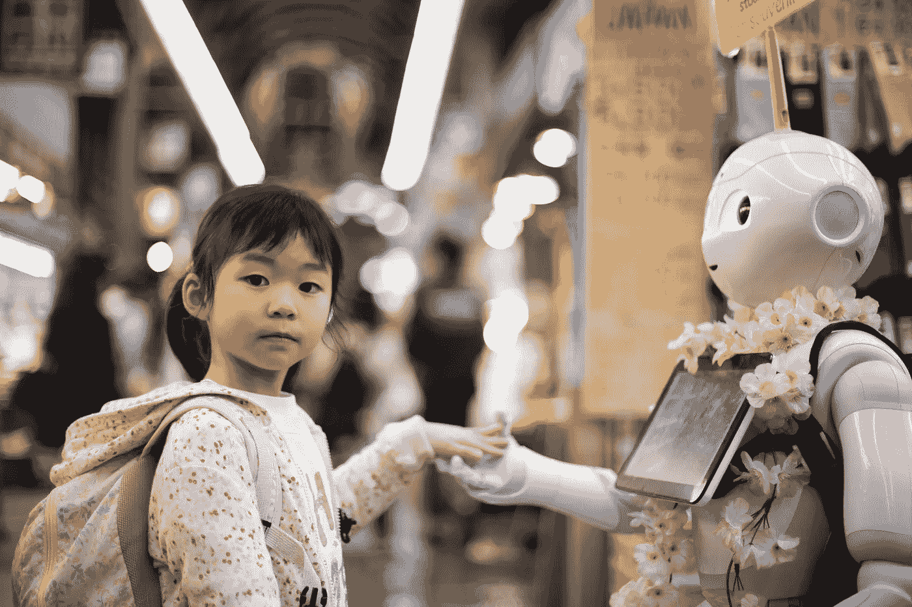

# 使我们失去人性的技术

> 原文：<https://medium.datadriveninvestor.com/technologies-dehumanizing-us-d028e5634a93?source=collection_archive---------6----------------------->

## 我想谈谈我们这个时代的问题，这会让我冷静下来

对我们来说，打电话比见面更容易。或者写个消息——这样就没必要听答案了。通过发送电子邮件，我们甚至对面试官隐藏了自己的声音。信使将交流减少到最低限度。

Photo by [Franck V.](https://unsplash.com/@franckinjapan?utm_source=unsplash&utm_medium=referral&utm_content=creditCopyText) on [Unsplash](https://unsplash.com/s/photos/robot?utm_source=unsplash&utm_medium=referral&utm_content=creditCopyText)

我的祖父，也就是我父亲的父亲，直到孩子出生时才能见到他。他不得不将手放在妻子圆滚滚的肚子上，满足于想象。我的父亲已经可以——并第一次在屏幕上看到我，这要感谢及时发明的检测海船船体缺陷的技术。他的想象力已经被流过我身体的超声波所引导。

格拉斯哥的产科医生唐纳德曾想把超声波工厂从造船厂搬到医生的办公室，他认为看到还未出生的孩子的可能性会鼓励母亲更爱他们，并减少堕胎的数量。然而，这项技术后来被用于堕胎等。不仅是在发育明显缺陷的情况下出于医学原因，甚至是在父母根本不适合未来孩子性别的情况下。

> 要见证奇迹，你根本不需要相信它，你可以面对它

显而易见，今天的经典黑白超声图像在生死问题上发挥着重要作用。但是我们在这些问题上做决定。我们如何为这些决定做准备？
怀上第一个孩子，我和妻子激烈地争论:要不要提前认他。我决定问问我叔叔的意见，他是一位著名的妇科医生。他的叔叔从来不倾向于给出建议，也不被精神所吸引。

 [## 幸福的算法？数据驱动的投资者

### 从一开始，我们就认为技术正在使我们的生活变得更好、更快、更容易和更实用。社交媒体…

www.datadriveninvestor.com](https://www.datadriveninvestor.com/2019/03/08/an-algorithm-for-happiness/) 

然而，他的回答非常明确:“不要这样做。当医生看着屏幕告诉你性别的时候，你就是在处理信息。当一个孩子出生，你亲眼目睹了一切，你就是在应对一个奇迹。“我不相信奇迹，但我听从了建议。叔叔是对的。事实证明，要见证一个奇迹，根本没有必要去相信它，它可以简单地面对。

例如，研究同理心和同情心的心理学家早就确定，大脑对身体疼痛会立即做出反应。“评估一种情况的心理和道德方面”需要一些时间。换句话说，体验和反思的深度与时间成本直接相关。
正因如此，通过专注于获取信息的速度，宁愿将笑脸和短信线传播到数百页的小说中，我们牺牲了移情的能力。薇依写道，关注是最稀有、最干净的慷慨形式。不难理解，我们与世界的关系、彼此的关系以及与自己的关系都变得不那么慷慨了。

一本厚厚的小说对读者要求很高，但首先是注意力。通过听音乐或看电视，我几乎可以做任何事情。我可以和一个朋友聊天，看展览上的画。但是读小说，我不得不把其他的都放在一边，只专注于这本书。罗曼教导我换位思考，拓展了我的视野，他需要关注——因此迫使我表现出慷慨。包括对他自己。

> 我们认为我们在利用技术来节省时间。相反，他们越来越多地夺走我们的时间

我们习惯于认为技术是扩展和提高我们能力的一种手段。众所周知，谷歌组织并提供了一个信息世界。汽车让我们发展出我们两个人无法达到的速度，炸弹帮助我们轻松快速地杀死一群我们无法徒手控制的敌人。但是技术不仅仅是有效的，它也是有情感的。它们影响着我们，并且不仅限于技术。

Photo by [Andy Kelly](https://unsplash.com/@askkell?utm_source=unsplash&utm_medium=referral&utm_content=creditCopyText) on [Unsplash](https://unsplash.com/s/photos/robot?utm_source=unsplash&utm_medium=referral&utm_content=creditCopyText)

约会时说出的、在电话中听到的、手写的或以短信形式发送的爱的告白，会以非常不同的方式被感知——即使告白的人投入了他感情的全部力量和深度。眼睛的表情、声音和语调、字母的倾斜度和轮廓，以及手机制造商预设的字体，都会影响单词的真正含义。

**大多数通信技术都是作为一种“假肢”而诞生的——试图取代我们所没有的东西。**我们不能和一个人见面交谈——好吧，这有个电话可以打给他。如果他不在家，这里有一个留言机。以及网上交流作为电话交流的替代品而诞生。然后他们也有了短信，使得交流更加快捷，移动性更强。但是这些技术都不是为了改善我们之间的交流而设计的。简化，通过限制到任何允许的限度来代替—是的。但不是为了提高。

然后奇怪的事情发生了。我们开始优先考虑这些“假体”，简化和有限的替代品。对我们来说，打电话比见面更容易。而且在答录机上留言甚至更容易——没有必要听答案。这里我们已经选择了收信人肯定不在家的时候打电话。

发送电子邮件甚至更容易——我们甚至对面试官隐藏了自己的声音。而消息降低了我们的沟通成本，创造了另一个可以隐藏的外壳。前进的每一步都是迈向信息的一步，但是远离了我们做情感工作的能力，远离了我们自己的人性。

> 抵制新技术是唯一的解决方案，比完全和无条件地采用新技术更愚蠢

但问题是，通过采用这些简化的交流方式，然后给予它们偏好，我们自己就变成了简单化的人类。说话越来越少，我们感觉越来越少。或者也许我们只是从通信设备开发商和销售商的角度感受到了我们需要感受的东西。

像我的许多熟人一样，我担心我的手机和互联网正在浪费我的生命，用短期的光明取代了我经历的深度，并阻止我专注于真正重要的事情。

不知何故，我发现我在浴室里买孩子的时候会检查邮件，或者在开始的提案还没有完成时会漫无目的地浏览网站，一个重要的想法还没有形成。而且在火春日，我碰巧找了个阴影厚一点的，这样太阳就不会照在手机屏幕上了。你没遇到过吗？这难道不意味着现代科技充斥着我们的日常生活，淡化了我们的重要性吗？这一进程正在加速？我们认为我们在利用技术来节省时间。但是越来越多的是相反的——夺走了我们的时间。如果他们任由我们处置，它就不会太定性、饱和和深入。

令我担忧的是，随着我们越来越多地感受到“指尖的平静”，它离我们的心越来越远。这不是一个“或”或“或”的选择:抵制新技术是唯一的解决方案，比完全和无条件地采用新技术更愚蠢。不，这是一个平衡的问题，但这种平衡定义了我们的生活。

可以肯定的是，总有一天，注射到人体内的智能纳米机器人会到达心脏并检测到问题，比我们感觉到问题的第一个症状并联系医生要早得多。其他纳米机器人将修复心脏，而且非常聪明，我们不会感到疼痛，也不会在治疗上花费时间或金钱。会是奇迹吗？是的，但只对那些心有感知奇迹能力的人。事实上，这是心脏应该保存和修复的主要能力。