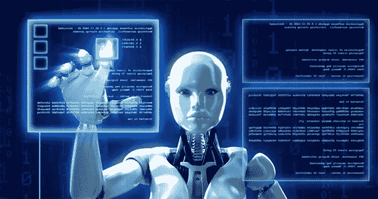
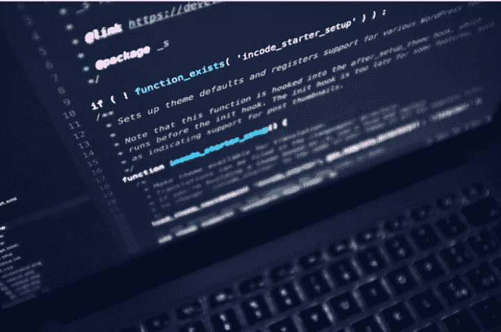
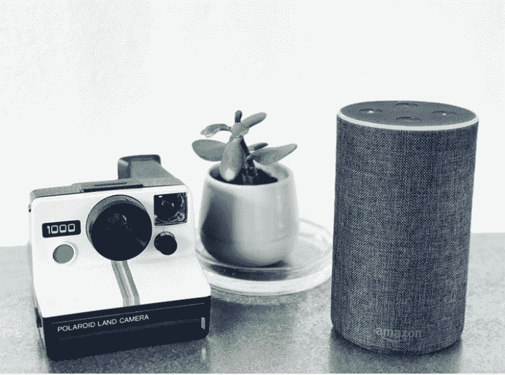
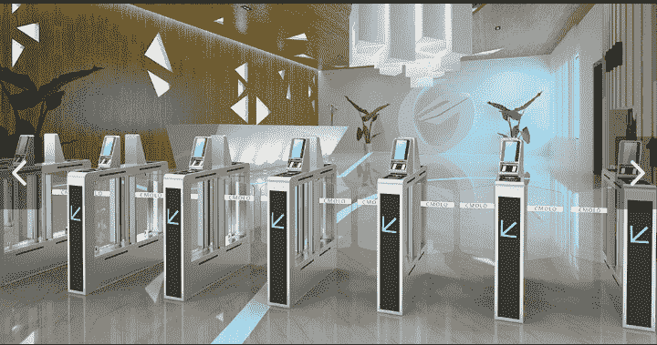
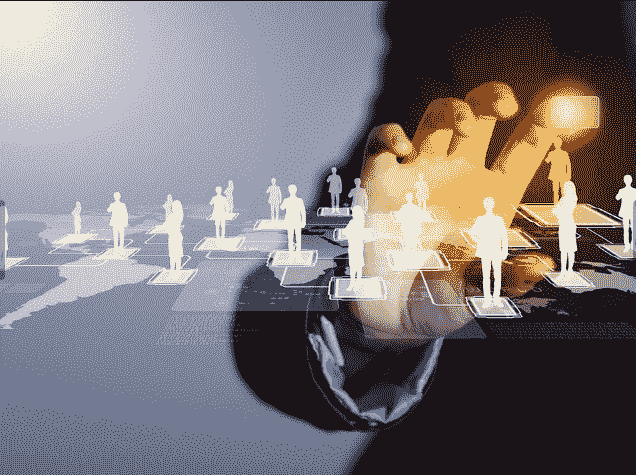
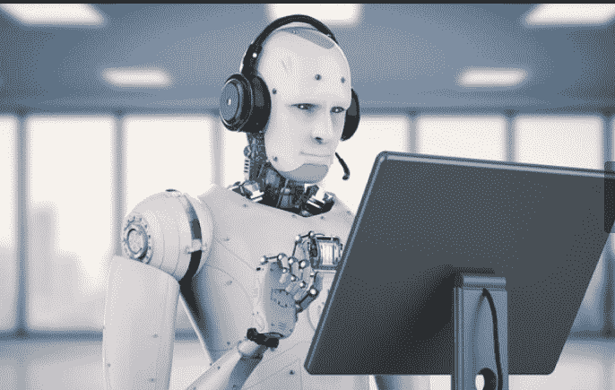

# 你需要了解的人工智能技术

> 原文：<https://medium.datadriveninvestor.com/technologies-you-need-to-know-about-for-artificial-intelligence-cd9cac220a17?source=collection_archive---------11----------------------->

人工智能(AI)可能是第四次工业革命中每一项重大进步的秘密成分。

从苹果的 Siri 这样的虚拟助手到谷歌的自动驾驶汽车，甚至是生物识别和语音识别程序，人工智能的应用永无止境。

基于模仿人类的思维过程，这项颠覆性技术已经成功渗透到我们生活的方方面面。根据布鲁克林大学最近的一份出版物，人工智能将在未来的大多数领域发挥重要作用，从经济到政治，甚至到犯罪。

然而，尽管这种颠覆性的技术在各个行业被广泛采用，但它仍在不断发展。是的，大多数人工智能技术仍然基于基于预设用户行为做出响应的算法，这限制了它的真正目的。因此，有必要改进构成每项人工智能技术神经网络的算法。毫无疑问，这种驱动力刺激了技术或软件的创新和随后的采用，从而改变了人工智能的格局。

为了帮助你更好地驾驭这一局面，我整理了最有潜力影响变革的著名人工智能技术。因此，您不仅会熟悉其中的细微差别，还会探索这些技术的真实使用案例。

**机器学习**

> [DDI 编辑精选——机器学习基础:案例研究方法](http://go.datadriveninvestor.com/mlcasestudy/matf)

机器学习是人工智能的一个主要方面，它专注于机器通过使用大量输入数据进行学习和做出准确决策的能力。这项技术利用了从无数物联网设备收集的大量数据。它能够利用这些海量数据来执行视觉感知和语音识别等任务，这些任务被认为需要人类水平的智能。

与其他人工智能技术不同，机器学习利用了算法和数据的结合。虽然重点放在它的数据使用上，但它的独特性在于学习模式和自动创建新的动态数据的能力。此外，机器学习创建了一个反馈回路，使其能够在不需要额外资源的情况下产生更多的模型。

毫不奇怪，像可口可乐和喜力啤酒这样的大公司已经利用这项技术来改善他们的运营、广告、客户和营销服务。例如，[可口可乐利用机器学习](https://rctom.hbs.org/submission/how-coca-cola-is-leveraging-machine-learning-in-the-hyper-competitive-cpg-industry/)推出了樱桃雪碧。通过收集从他们的苏打水药房收集的大量数据，这家公司能够识别樱桃雪碧的巨大市场！

**自然语言处理**

到 2025 年，全球人工智能市场预计将创下 600 亿美元的历史新高。你知道有趣的部分吗？这一数字的很大一部分预计将来自自然语言处理(NLP)技术。从亚马逊的 Alexa 到谷歌的助手，这种语音转文本技术正在迅速成为社会各个方面的一个常数。这是人工智能的一种高级形式，帮助机器理解，甚至可能与人类语言交流。让我们用亚马逊的 Alexa 作为案例研究:Alexa 的设计师能够将 NLP 更进一步。Alexa 使用[多层通信系统](https://developer.amazon.com/docs/alexa-design/design-voice.html)，跨越音频提示、屏幕、Alexa 的语音和应用程序。除此之外，它还利用[隐马尔可夫模型](https://web.stanford.edu/~jurafsky/slp3/A.pdf) (HMM)来理解人类语言及其使用的语境。

因此，NLP 技术能够通过一系列编码语法规则将人类语言分解成词类，以便理解语言的上下文。除了作为虚拟助手的大量应用，这项技术还用于数据挖掘和欺诈检测。

**生物识别**

密码非常容易受到攻击。事实上，它们通常被认为是组织中最薄弱的安全环节。出于这个原因，生物识别技术被开发出来，通过利用防失败的认证标准，如 DNA、指纹、牙齿结构和面部结构，来确保机器和人类之间的自然交互。

更重要的是，它提供了一种比磁条或密码更快捷的身份识别方式。毫不奇怪，对 4000 名客户进行的一项调查显示，52%的人更喜欢生物识别方法，而不是传统的安全协议。因此，像[三星](https://developer.samsung.com/tech-insights/pass/what-are-biometrics-and-biometric-solutions)和[苹果](https://www.biometricupdate.com/tag/apple)这样的公司已经利用这种人工智能技术为他们的产品赢得了更多的订户。毫无疑问，生物识别系统在各个领域都具有不可或缺的价值。例如，政府机构在选民登记、电子护照、身份证和边境控制中使用生物识别系统。除此之外，它还提供了一种更安全、更有效的方法来识别他们的公民，而无需始终请求物理 ID 标签。

**业务决策管理框架**

公司利用其掌握的大量数据做出明智的决策，与目标受众建立更多联系。毫无疑问，当注入人工智能时，这些决定变得更加准确。在电子商务、保险和金融营销交易中，人工智能对决策管理的影响是巨大的。

这个商业决策管理框架整合了自动化系统的设计、构建和管理，以更好地做出决策。公司能够使用它来管理他们的供应商、员工和客户的互动，以促进运营决策。更有甚者，像亚马逊这样的大型公司已经通过他们的[亚马逊网络服务(AWS)合作伙伴网络](https://aws.amazon.com/partners/)向公司和个人提供人工智能启发的决策管理服务。AWS 网络等框架使企业能够通过最新的技术、业务和市场支持与目标受众建立联系。

**机器人过程自动化**

这是另一项人工智能技术，目前正在彻底改变大多数行业的劳动力。事实上，在人力成本昂贵或效率低下的领域，公司采用这种技术是司空见惯的。机器人流程自动化(RPA)是一种非侵入式技术，它利用现有的基础设施，不会对系统造成中断。

简而言之，这项技术专注于在不影响效率或生产力的情况下降低成本。RPA 机器人可以模仿许多人类用户操作，例如移动应用程序、填写表单、复制和粘贴数据以及从文档中提取数据。毫不奇怪，像 PWC 和 IBM 这样的大公司已经集成了 RPA 来降低成本，同时提高可扩展性、控制和质量。事实上，根据 [IBM 的分析报告](https://www.ibm.com/downloads/cas/42DRML06)，使用 RPA 支付账户的公司处理发票的速度比非 RPA 用户快 43%。

此外，这些公司的运营成本降低了 40%。请注意，RPA 技术完全依赖于算法。因此，它无法从其运营中创造新的体验。这种操作模式不同于机器学习或生物识别应用，如苹果的 Face ID，它利用算法和数据的结合来创建一个新的动态反馈回路。

**外卖**

如前所述，由于新的颠覆性技术的涌入，人工智能正在不断发展。这些技术不仅扩大了人工智能的前景，也增加了我们对大脑如何工作的理解。通过足够的研究和创新，人类将学会如何改进神经网络，这是每项人工智能技术的核心。

编辑披露:编辑有时会发布有用资源的链接。如果你发现它们有用并购买，我们会赚很多钱。不，我不是说要把我的薯条做大。我说的是超大披萨上的意大利香肠。感谢您一直以来的支持，我们将继续为 p̶e̶p̶p̶e̶r̶o̶n̶i̶出版而努力。