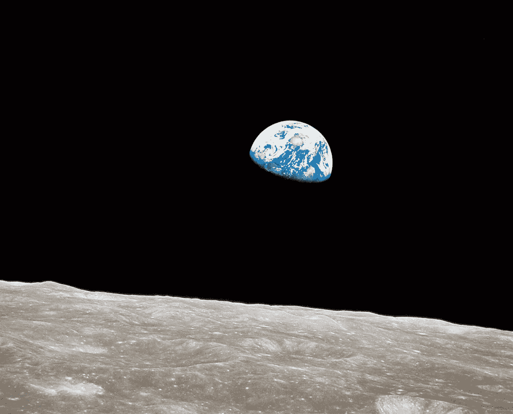

# 66.技术

> 原文：<https://medium.datadriveninvestor.com/technology-498da4a784d4?source=collection_archive---------38----------------------->

Earthrise

如果系统能够抵御冲击，那么它就能持久。如果它们是脆弱的，它们会破碎并消失。一项技术是一个成功的系统。轮子是系统，语言是系统，电脑是系统，人体是系统，自然是系统。这些系统能够抵御冲击并蓬勃发展。他们“工作”，他们成为技术。

蓬勃发展的技术是有弹性的，因为它们模仿自然。当你模仿自然时，你就模仿了一个有弹性的系统。以电脑为例；它具有记忆、处理能力和输入输出能力，可以应用于多种任务。听起来很像大脑。大脑已经存在了 40 亿年，所以一个新系统越善于模仿这样的系统，这个新系统就变得越有弹性。

现在的大多数新技术都是在解决过去旧技术带来的问题。看看拥挤的城市问题:我们发明了建造摩天大楼的技术来解决这个问题。当像地震这样的冲击袭来时，我们努力开发新技术，使摩天大楼能够抵御这种旧的冲击。我们今天发明的新技术产生了新的问题，这些问题还没有被未来的新技术解决。这是推动技术进步之箭的力量。

当我们把这些放在一起时，一个有趣的论点出现了:

*我们所知的终极技术，自然，创造了新的技术，人类，来解决它的老问题。*

人性只是自然的奇点吗？

如果我们认为自然只是地球，那么多行星物种和地球化可能是解决地球问题的答案。如果我们将自然视为整个宇宙，人类可能是一种技术，它可以局部加速熵，并将宇宙推向热寂，然后将其推进到下一个阶段？而 AI 呢？人工智能对我们来说就像人类对自然一样吗？解决我们问题的系统？(到现在我的头都晕了)。

无论未来会发生什么，我们都是一项非常优秀的技术，并将继续致力于技术进步。今天是感恩节，所以我该去吃些火鸡了！