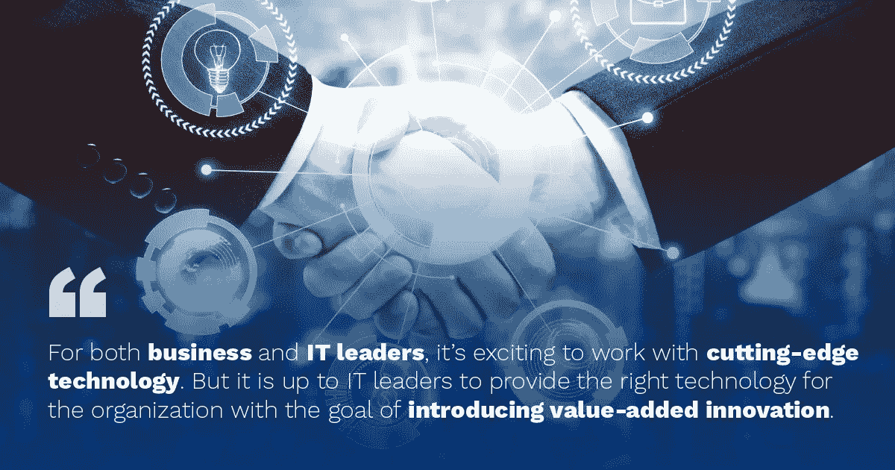

# 技术作为一种商业策略

> 原文：<https://medium.datadriveninvestor.com/technology-as-a-business-strategy-5e357766fae1?source=collection_archive---------5----------------------->

在不久的将来，对新技术进行战略性投资仍将是人们关注的焦点。在“客户时代”,组织面临着改变数字体验的压力，这不仅是为了他们的客户，也是为了他们的员工或其他与他们互动的实体。

对于业务和 IT 领导者来说，与前沿技术合作是令人兴奋的:物联网(IOT)、移动、智能代理/机器人、虚拟现实、增强现实、商业智能。但是，it 领导者需要了解他们的市场(业务、客户和竞争对手),为组织提供合适的技术，而不总是最新的技术，目的是引入增值创新。业务和技术的紧密合作成为确保完美结合的基础，从而使组织在市场中处于领先地位。

## 充分利用技术优势简化业务管理

从战略上来说，企业应该通过技术以较低的成本寻求稳健的运营，及时交付系统并不断改进，以便 it 可以通过智能地使用技术创新来简化业务。当一个组织明白它可以通过客户的数字化体验、数字化运营和系统的最大效率来引领市场时，它就可以充分利用技术。

在过去的十年中，使用技术发展最快的企业通常是 B2C 企业。实际上，技术已经极大地改变了我们处理休闲的方式，但要改变我们的工作方式还有很长的路要走。随着当今数字受众的增加，技术在企业战略中的作用必须与其增长保持同步。为了保持竞争力，公司需要利用新兴的社交和移动平台与客户联系，以确保其品牌、服务或产品战略符合消费者的偏好。

为了在日益快速和数字化的市场中竞争，公司必须装备自己成为差异化者。首先是“速度”:学习、建设、部署和变革的速度。第二，他们可以轻松快速地与任何其他类型的系统集成。此外，公司还必须通过提供引人入胜的用户体验和授权来打破障碍和消除界限，同时永远不要忘记安全性(这是一个广泛且不断发展的主题)和可扩展性，以便他们能够适应增长，避免破坏性的实施。最后，遵循进化过程，利用仪器和监测，主动处理任何需要适应的问题。

但是，一些公司将会落后。首先，所有公司过去都在变化缓慢、威胁有限的环境中运营，无法跟上市场和客户的步伐。第二，那些决策过程与那些处于最前沿的公司相去甚远的公司，以及那些负责制定政策和过程的领导人缺乏实际知识的公司。最后，工业时代的传统组织注重效率、削减和成本管理、稳定性和可靠性，这些品质仍然很重要，但其本身并不能在数字环境中保持组织的竞争力。

因此，五年后，我们应该会看到一个新的、转型的数字化组织和企业市场，它们采用组织战略来推动速度、敏捷性和创新。一个激动人心的新世界即将到来！

想了解更多关于如何使数字化转型项目与业务战略保持一致的信息吗？请查看终极电子书“[创造数字化商业转型文化](https://digital.bluescreen.pt/ebook-create-a-culture-of-digital-business-transformation)”和关于最新行业趋势的[文章](https://www.bluescreen.pt/blog/)。

弗雷德里克·法里亚·德奥利维拉

也在这里发表[。](https://www.bluescreen.pt/2018/09/19/technology-as-a-business-strategy/)