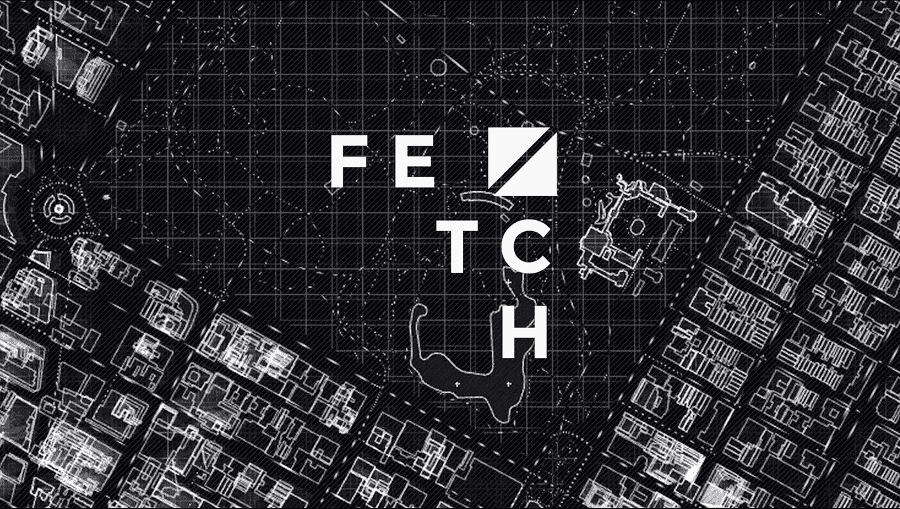
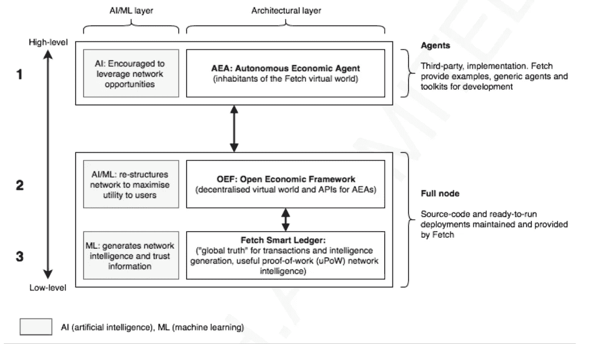
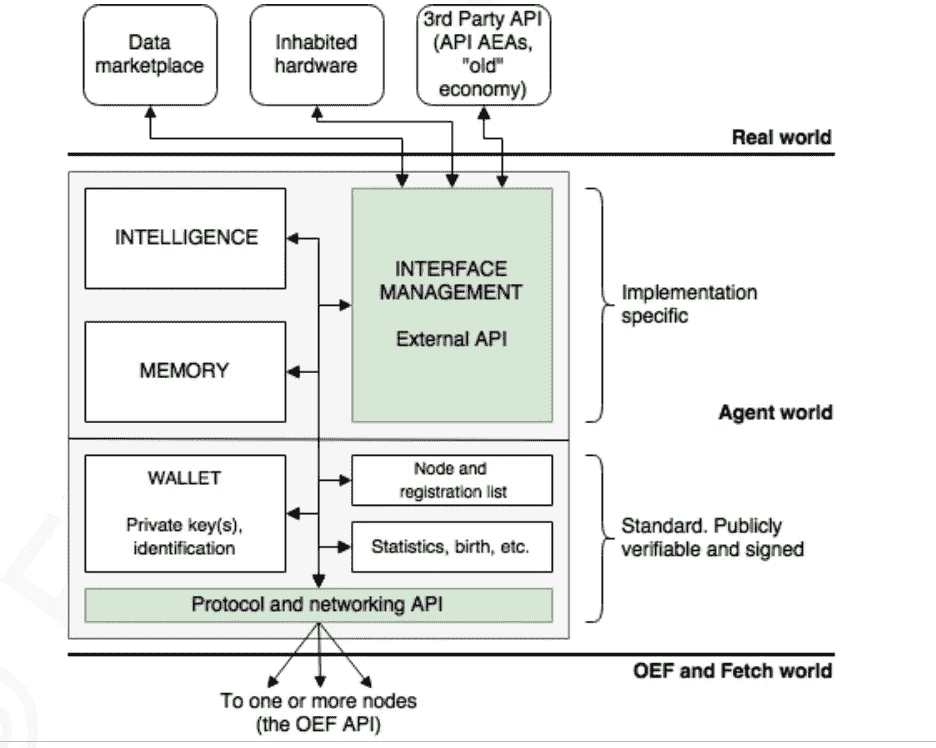

# 技术星期五:这一定是我见过的最疯狂、最令人兴奋的区块链项目之一

> 原文：<https://medium.datadriveninvestor.com/technology-fridays-this-has-to-be-one-of-the-craziest-most-exciting-blockchain-projects-ive-ever-e0c9ed4a6d4?source=collection_archive---------0----------------------->

欢迎来到技术星期五！几周前，我偶然发现了 [Fetch.ai](https://fetch.ai/) ，我被这个项目背后的雄心和创新概念所震撼。从那以后，我发现自己一遍又一遍地阅读他们的白皮书，试图理解(并复制😉)的一些想法，从他们的架构为我自己的工作。今天，我想我用这篇小文章让你初步接触这个迷人的项目。

[Fetch.ai](https://fetch.ai/) 位于我两个激情的交汇点:人工智能(ai)和区块链技术。然而，Fetch.ai 不仅仅是(如果这个术语在这里适用的话)另一个试图实现去中心化人工智能的平台。该公司试图为一个世界提供基础，在这个世界中，自主、智能的人工智能代理可以在正确的经济和监管激励下一起工作和协作。你可以把 Fetch 想象成 AI 智能体的第一个虚拟世界。多酷啊。

随着人工智能的发展，我们越来越接近自我学习，自主代理，我们应该问自己，这些代理将需要什么类型的环境？作为人类，我们生活在允许我们作为物种进化的经济、社会和生物动力的结合下。如果我们希望人工智能半有机地进化，我们需要为自主智能体提供一个虚拟环境，结合正确的机制让它们合作和进化。这就是 Fetch.ai 的用武之地。

如果你想用一个术语来概括 Fetch，你可以把这个平台想象成一个分散的数字世界，在这个世界中，自主软件代理执行有用的经济工作。好吧，我承认这并不简单😉想象一下，一个平台允许人工智能程序执行收集数据或提供预测等任务，结果它们会收到加密令牌。Fetch 利用区块链技术，用正确的经济激励和执行环境来补充无人监管的人工智能代理，以便执行他们的任务。

从技术上讲，Fetch 平台有三个基本构件:Fetch 智能分类账、开放经济框架和自主经济代理。每一个组成部分都抽象出社会的一个基本部分:公民、经济和规则。

# 一种新型的分布式账本和共识机制

获取智能分类帐是一种新型的分散分类帐，包括一种新的共识模型，称为有用的工作证明(uPoW)。分类账的作用是记录自主代理人执行的活动，并处理它们之间的经济交易。为了实现这一点，Fetch 平台创建了 uPoW，这是一种新的共识模型，解决了传统 PoW 算法的一些限制，并允许计算能力较低的参与者从解决计算难题中受益。uPoW 将用于训练新的自主代理或在 AI 程序之间交换奖励等任务。

# 作为一等公民的经济学

开放经济框架(OEF)是 Fetch 平台的组成部分，为自主软件代理提供生命支持。这些代理人生活在一个不断变化的环境中，他们从自己的角度看到一个不同的世界:一个根据感知和声明的需求重组的世界。OEF 是高级节点功能:位于原始协议和分类帐之上的层，提供该环境和代理进行日常工作所需的所有其他操作。OEF 负责抽象服务，例如为决策提供数据、过剩容量、能源、计算的交易，或者数字或物理资产的存储、转移和运输*。*

# 自主智能机器人

填充 Fetch.ai 世界的主要元素被称为自主经济主体(AEA)。这些数字实体可以独立于人工干预进行交易，并可以代表自己、设备、服务或个人。该平台包括不同类型的代理，如**居民**(代表存在于现实世界中的硬件)**数字数据和销售**(附属于不同市场中的数据源)或**代表**(代表获取世界中的个人)。不同类型的代理人可以被视为全新的获取社会中的第一个角色。

# 大量的创新

除了这三个主要的构建模块之外，Fetch 平台还包括许多有趣的想法，用于构建分散的、经济上可行的环境。例如，该平台在一个分散的数字世界中引入了地理概念，使用领域空间的概念根据邻近程度分配区域。类似地，Fetch.ai 引入了在 AEA 之间进行商业交易的基本协议，该协议模拟了现实世界的许多动态。

# 不只是幻想

Fetch.ai 平台是我听说过的最雄心勃勃的项目之一。然而，这项工作不仅仅是理论性的。目前，该平台正在交通、能源和 IOT 行业的多个场景中使用。