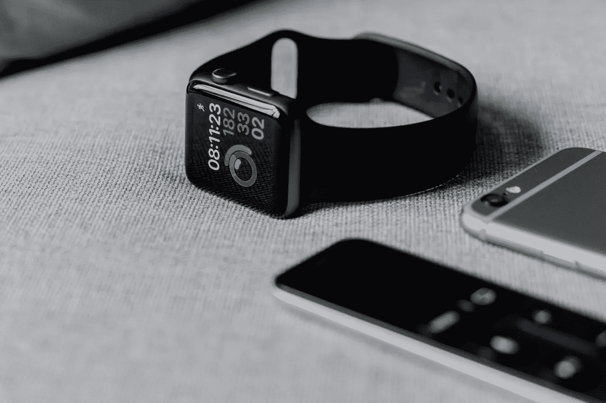
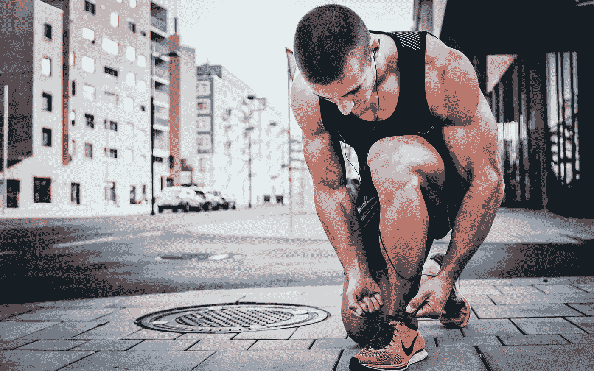

# 健身技术

> 原文：<https://medium.datadriveninvestor.com/technology-in-fitness-da9e41316d8d?source=collection_archive---------14----------------------->

## 健身黑客

## 科技如何帮助你保持健康

Photo by [Andres Urena](https://unsplash.com/@andresurena) on Unsplash

## 你喜欢什么？

我吗？我热爱健身和科技。

猜猜我还喜欢什么？

我也喜欢在今天这个时代，这两者可以携手并进。

 [## 大笔资金和尖端技术:人工智能/人工智能投资将如何革新医疗保健…

### 在过去几年人工智能(AI)和机器学习(ML)的显著发展中…

www.datadriveninvestor.com](https://www.datadriveninvestor.com/2018/03/22/big-money-and-cutting-edge-technology-how-investment-in-ai-ml-will-revolutionize-the-healthcare-industry/) 

与 20-30 年前不同(那时儿童和成人不会一直粘在他们的手机上)，我们现在生活在一个我称之为“活僵尸”的时代，因为我们总是在某种屏幕上。无论是手机、平板电脑、电视、便携式游戏设备还是笔记本电脑。见鬼，我现在正在我的笔记本电脑上打这篇文章。公园不像过去那样挤满了人。操场也不是。在科技应用和没有科技的生活之间取得平衡是一场真正的斗争。

不过好消息是，它可以共存，并且有好处。

我将与你分享，科技如何帮助我过上更健康的生活方式，以及它如何帮助你。

Photo by [Alexander Redl](https://unsplash.com/@alexanderredl) on Unsplash

## 智能手表

如果你有智能手机，很有可能你也会有智能手表。我目前正在使用 iPhone XR，并已将其与我的 Apple Watch 配对。我仍然在使用第一代 Apple Watch，虽然它现在有点滞后(是的，我知道我应该升级到第四代)，但它仍然运行得很好。

我在手表上使用活动模拟脸。它基本上就像一个普通的模拟界面，但我的活动环清晰可见。如果你不熟悉 Apple Watch，它会为你追踪三项主要活动；移动、锻炼和站立。让我来分解一下。

**移动** =燃烧的卡路里数
锻炼 =你积极走动的分钟数
**站立** =你每小时至少要站起来走动 60 秒

每天，你都有一系列的“目标”,你可以通过这三项活动来实现。但是，只有您的 ***移动*** 目标可以根据您的喜好设定。另外两个已经被苹果修好了。基本上，你必须达到每天最少 30 分钟的 ***锻炼******站立***60 秒每小时一次，每天至少 12 小时，燃烧你为自己的 ***【动*** 目标设定的卡路里数。对我来说，我设定了每天燃烧 350 卡路里的目标。稍后我会解释为什么是 350。

## 健身应用

现在有大量的健身应用程序。有些运动你可以在自己家里或健身房舒适地进行。其他人可以帮助你根据一天中你所吃的食物种类来追踪卡路里的摄入量。大多数时候，这些应用都可以做到，所以你只需要选择你更喜欢哪个。

我个人使用安德玛的耐克跑步俱乐部应用程序、健身伙伴应用程序和 MyFitnessPal 应用程序。它们都有不同的功能，我出于特定的原因使用它们来实现我的健身目标。

## 提醒

有时候你会有事情忙得不可开交的日子。对我来说，它通常会让我很忙。尽管如此，我还是会尽量抽时间锻炼。我每周坚持锻炼的次数总是最少三次。不管我有多忙，我的时间表看起来有多疯狂，我会确保每周至少锻炼三次，每次锻炼至少持续 30-45 分钟。

在手机上设置提醒可以帮我做到这一点。我也用提醒来帮助我完成我将要做的练习。现在你可以做各种各样的锻炼，通常情况下，你没有足够的时间或精力在一次锻炼中完成所有的锻炼。所以，与其浪费时间去想当我已经在健身房的时候我会做什么运动，我通常会把它放在我的提醒里，这样一旦我在健身房，我就已经知道我会做什么，并且我会马上去做。

> "如果你花太多时间想一件事，你永远也做不成。"——李小龙

现在你已经知道了我使用的一些技术，我将和你分享我是如何以及为什么使用它们的。

日常使用，我会说我最信任的技术将是我的苹果手表。为什么？因为它整天都在我身边。它一直戴在我的手腕上，因此，我会提醒自己什么时候该行动，我已经做了多少，还需要做多少。我是那种每天都想关闭所有活动圈的人。迄今为止，我已经连续 273 天每天关闭我所有的戒指。我就是这么疯狂地想确保自己戴上戒指。这也是因为它帮助我保持了更健康的生活方式。

正如我之前提到的，锻炼和站立环分别固定在 30 分钟和 12 小时。你所能做的就是改变你的动作，对我来说，就是每天摄入 350 卡路里。

那么，为什么是 350 卡路里？

嗯，我的身体每天自身平均燃烧大约 1650 卡路里，不管我是否在做任何事情。这是我目前的代谢率。对于一个 33 岁的人来说，这相当普通。

我目前正在减肥，减掉更多的体脂。为了做到这一点，我需要确保我每天摄入的热量少于 1650 卡路里。现在，我每天大约摄入 1100-1200 卡路里。因此，当我能够达到燃烧额外 350 卡路里的目标时，我每天燃烧的总热量约为 2000 卡路里。这告诉我，我每天燃烧 800 卡路里。没有那么多，但总比没有好。

我的苹果手表确保我每天都能达到目标。这会持续多久？嗯，现在已经连续持续了 273 天了，所以祈祷吧，它还会持续一段时间。

我提到的其他应用程序也帮助我丰富我的日常锻炼和饮食。它帮助我在如何看待我的健身之旅时保持动力和创造力。

总之，尽管技术已经导致人们在当今世界变得不那么活跃，但它也能很好地帮助人们变得更加活跃。到目前为止它帮助了我，它肯定也能帮助你！