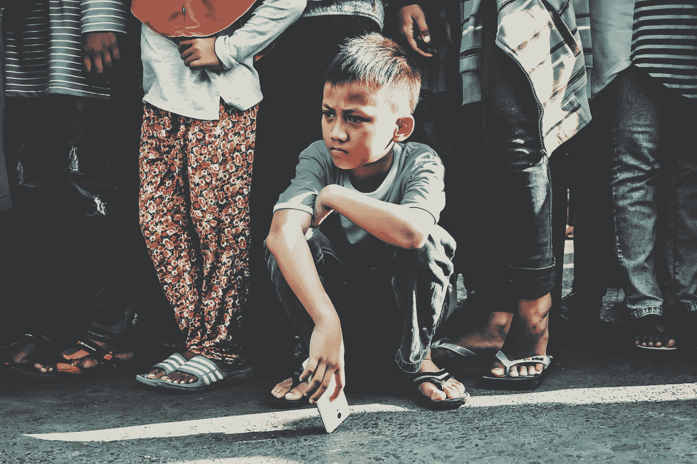

# 科技不会真的毁掉你孩子的生活

> 原文：<https://medium.datadriveninvestor.com/technology-isnt-actually-ruining-your-kid-s-life-ed5fca9a69e3?source=collection_archive---------20----------------------->

Photo: Maya Anggraeni.

你可能以前听过——“小时候，我去外面玩。没有这些智能手机垃圾。新鲜空气。自行车。断了一两条胳膊。”

是的，凯伦，但是当你还是个孩子的时候，犯罪率并没有达到历史最高水平。车少了，这意味着当你骑着自行车漫无目的地下山时，你可能不会被车撞着，每个人都告诉你不要这样做。此外，人们很少谈论安全——“陌生人的危险”更多的是一种说法，而不是现实，这可能是因为你认识你所在城镇的大多数人。

现实是这个世界已经不像凯伦八岁时的*了。*

*所以，如果你一直告诉你的儿子或女儿*到外面去，*想一想。*

*我最近听到有人说:“是的，孩子们花太多时间在科技上，但至少他们是安全的。”这是真的。适度的一切都是好的——蒂米花 12 个小时玩堡垒之夜从来都不是好主意，出去走走也是好的——但是科技确实可以帮助孩子们。*

*视频游戏已经被证明可以提高空间意识和解决问题的能力。智能手机和电脑让孩子们可以和世界各地的同龄人联系。如果你是安全的，科技可以是惊人的。但我不是要你让蒂米和加拿大 50 岁的男人说话，就像你不会鼓励 8 岁的凯伦和隔壁令人毛骨悚然的邻居说话一样。*

*正如我所说，适度和安全。*

*那么，为什么会有“科技对孩子有害”的流行文化呢？*

*好吧，科技当然有它的耻辱时代。互联网上充斥着形形色色的人——并非所有人都是好人。从性侵犯者到 25 岁的有毒男子，他对你的儿子在最近的使命召唤中殴打他感到愤怒。互联网上有可怕的图像、犯罪和可怕的人。但是也有审查这些东西的方法，让孩子们一起交流和玩耍的游戏，以及获取他们可能永远不会知道的信息。*

*所以，是的，Timmy 可能在最近的 FPS 中很愤怒，但他也在学习团队建设技能、空间意识、解决问题和领导能力。他甚至可以学到一些自信和社交技巧。你知道，尽管他才 12 岁，却指挥着他的团队。*

*许多老一代人不喜欢技术，因为他们不知道如何利用它。这对他们来说是陌生的——这没关系。有些人(看着你，妈妈)无法理解科技，也许永远也不会。这对他们来说是令人沮丧的，把他们的问题归咎于技术比试图学习技术更容易。*

*此外，世界上有很多问题，说“我年轻时没有发生这种情况，因为我去了外面”比实际考虑真正的来源更容易。*

*事实上，这些问题可能仍然在发生，凯伦——只是你没有听说过而已。*

*真的没有任何真正的理由让千禧一代和婴儿潮一代在与技术的斗争中相互对抗。无论你喜不喜欢，技术革命都会发生。提米仍然可以和他的朋友出去，但是他也可以和他们一起出去玩，事实上也是。这真的很酷*。**

*科技*很酷——在适当的监督和控制下，它有能力让孩子们的生活变得更好。**