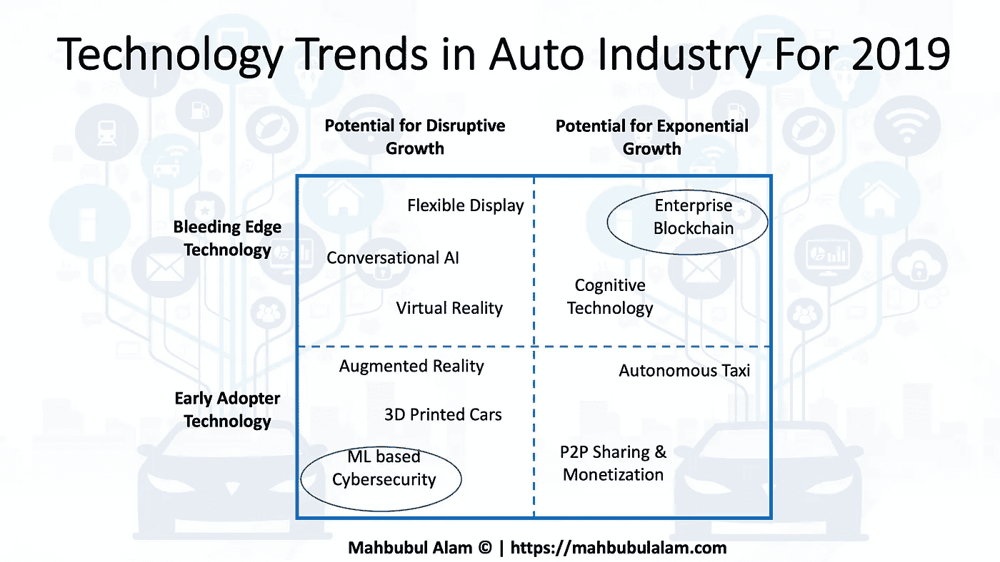
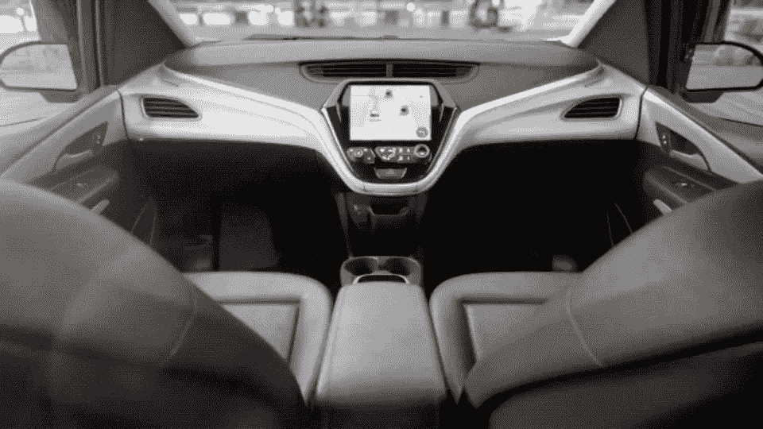
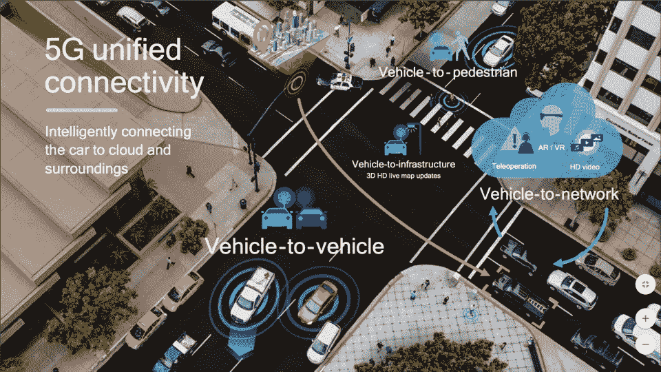
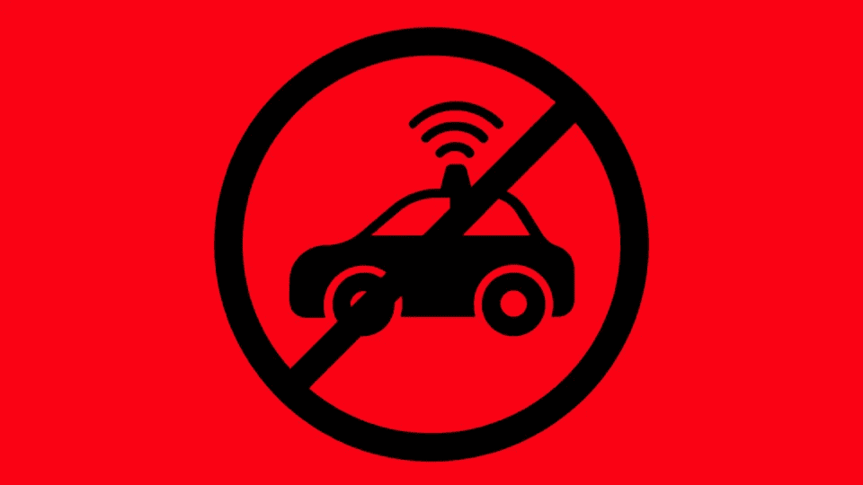
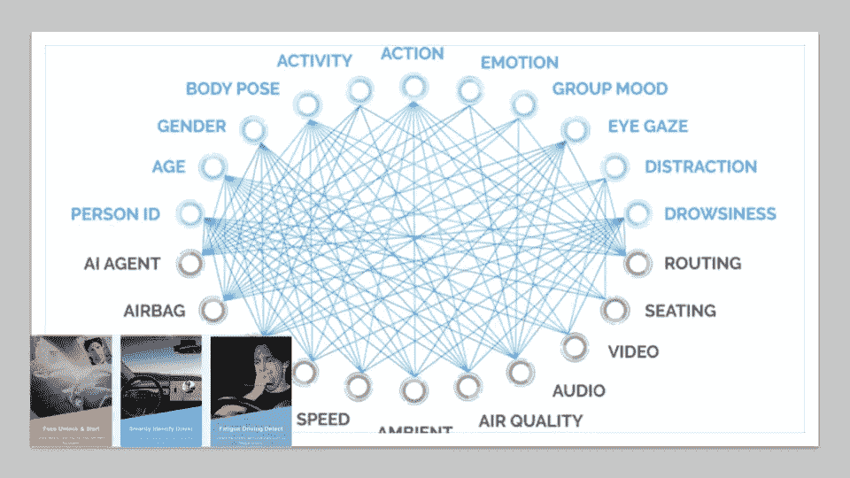

# 2019 年汽车行业的技术和市场趋势

> 原文：<https://medium.datadriveninvestor.com/technology-market-trends-in-the-automotive-industry-for-2019-a51f1c2356b3?source=collection_archive---------1----------------------->

2019 Technology Trends in Auto Industry

# 2019 年汽车行业的五大市场趋势

# #1:商用机器人出租车将进入美国市场

**The emergence of robo-taxi (driverless cab) in selective U.S. market**

> 2019 年将在美国主要城市推出大规模的机器人出租车(自动驾驶叫车)。
> 
> Waymo 于 2018 年 12 月推出了首个商业机器人乘车服务

# #2:蜂窝-V2X 试验和 5G 将主导自动驾驶汽车安全

**Increased trials of C-V2X will pave the way towards 5G mobility**

> **2019 年 C-V2X 的试点将会增加。这将是向 5G V2X 演进的催化剂。**
> 
> 5G V2X 将推动电信、智能手机、智能城市、电动汽车充电等行业之间的协同效应。和汽车工业。

# #3:通过增强的数字可信服务和网络物理安全，获得消费者对无人驾驶汽车的信任和信心

**Cybersecurity for the autonomous car will be key to winning public trust and confidence**

> 2018 年，美国 10 个司机中有 7 个对自动驾驶汽车越来越恐惧。令人惊讶的是，甚至 10 个千禧一代中有 6 个属于这一类别。
> 
> **2019 年，围绕网络物理安全和绝对数据完整性的活动将会增加，这将推动人们对移动服务的信任，并提高消费者的信心。**

# #4:数据将成为汽车行业的数字货币。汽车行业的关键价值驱动因素将转向软件，从而导致软件定义的硬件

**Data is the new automotive currency: Rise of the software programmable car**

> 脸书、亚马逊和谷歌已经证明了数据的精英化和成功的货币化。特斯拉将数据视为可以被多个部门反复使用的货币。
> 
> **2019 年，汽车制造商、保险、车队和移动即服务提供商将尝试丰富的移动服务。预计并购和合伙活动将会增加**

# #5:改善车内体验，将“浪费的时间”转化为“值得花的时间”

**Increased comfort and safety with cognitive technology**

> 在美国，人们平均每天花 46 分钟在车上。汽车制造商和移动提供商一直致力于提供个性化驾驶体验的方法。
> 
> **2019 年，消费者可以期待更多的功能，目标是将汽车中的“浪费的时间”转化为“值得花的时间”，拥有更多自主功能，以改善驾驶体验、安全性、个性化和便利性。**