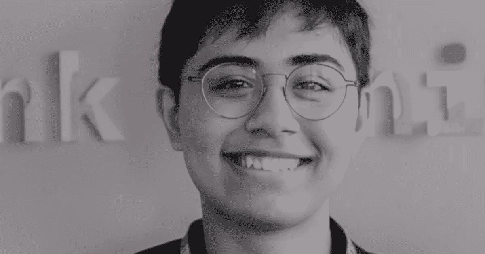

# 技术仍然可以是个人的。Tanmay Bakshi 会告诉你怎么做。

> 原文：<https://medium.datadriveninvestor.com/technology-still-can-be-personal-tanmay-bakshi-will-tell-you-how-e2bfa099e891?source=collection_archive---------8----------------------->

**Tanmay Bakshi / TED 演讲者，IBM 冠军，IBM 荣誉云顾问—** Tanmay Bakshi，世界上最年轻的程序员之一，使用认知和云机制来构建旨在拓宽人类技能的应用程序。巴克西是神经网络的建筑师，也是该出版物的作者；TED 的一个演讲者；他拥有 IBM Champion 和 IBM Cloud 荣誉顾问的头衔，还运营着 IBM 脸书 Live 系列，名为 Watson Made Simple with Tanmay。学习和分享他的经历的热情表现在他的 YouTube 频道、书籍和媒体出版物中。他是在银行、金融、医疗保健和医学以及音乐和聊天机器人等领域使用认知计算的专家。[链接](https://www.ted.com/talks/tanmay_bakshi_technology_that_tackles_the_teen_suicide_epidemic)。

很高兴你能加入我们，坦梅！你是世界上最年轻的程序员之一，使用认知和云机制来构建旨在拓宽人类技能的应用程序。我很好奇，这种颠覆性的创新形式从何而来？是技术还是别的？

**Tanmay Bakshi:** *非常感谢！*

*使用认知&云计算(和其他新技术)是我所热衷的，而将它们主要应用在医疗保健等领域是我感兴趣的。事实上，这种创新来自技术——主要是新的强大的算法集，如机器学习。这种技术的应用不局限于某一特定领域或行业；它适用于任何你想收集某种数据并从中获得洞察力的地方。根据 HBR 的数据，由于广泛的可能应用，72%的公司投票选择 ML 作为当今最具创新性的技术(13%投票选择云，7%投票选择区块链)。*

> *然而，医疗保健处于一个独特的位置，可以从这项技术的潜力中获益最大。有大量的数据。2015 年，美国产生了超过 600 亿张医学图像。*

也缺乏人力。据世卫组织估计，到 2035 年，全球将短缺 1290 万名医护人员。利用机器学习技术，你可以降低进入该领域的门槛，增强已经在该领域工作的人的智能，并利用正在收集的大数据。我在这个领域的一个项目是让那些因疾病或事故而失去自然交流能力的人能够进行人工交流。它的工作原理是通过我开发的定制机器学习算法来理解他们的脑电图。

**沃克:在更广泛的技术领域，五种技术正在改变全球生产系统:物联网、人工智能、先进机器人、可穿戴设备和 3D 打印。这些技术为社会创造价值提供了机会。你看到他们给社会带来了什么价值？**

**TB:** *有很多新的创新技术。你提到了五个，但还有更多。我相信在所有这些新技术中，更通用的肯定是机器学习。也有一些技术，我相信有很多宣传，但肯定没有人们想象的那么重要。一个例子是人形机器人——硬件和控制硬件的软件绝对是先进的。但是重要的是找到正确的用例来应用它们！许多公司会在人形机器人上安装一个简单的聊天机器人，本质上让它充当一个简单的语音输入/输出系统。这远没有达到该技术应有的用途！但是，当许多这种技术结合在一起时，每种技术的真正力量都会大放异彩，例如:想象一下，能够使用物联网来跟踪机器中 3d 打印组件的传感器数据，然后使用 ML 来理解和分析这些传感器数据，以确定是否会出错。这被称为预测性维护。*

**AW:信息和通信技术(ICTs)具有改善人们生活的巨大潜力，并且无疑具有全速推进可持续发展目标(SDGs)的巨大潜力。我知道你一直在努力改善他人的生活，并与 IBM Watson 合作开展各种人工智能项目。请与我们分享您目前参与的项目，以及为什么它对您很重要？**

**TB:** *当然，谢谢！我正在从事许多不同的项目，这些项目利用机器学习技术来增强人类的生活。这些领域从金融到医疗保健。事实上，我的最新项目名为“市场警报”，它旨在通过总结他们需要的所有数据并将其带到他们的指尖，使用机器学习来帮助人们处理金融领域的信息过载。*

> *在医疗保健领域，我正在从事的另一个项目是跟踪人们每天在移动设备上产生的数据，以预测某人是否会患抑郁症。这对我来说非常重要，因为这项技术有可能拯救和改善数百万人的生活，但关键是这项技术要用在正确的地方。*

让我们想象这是 2030-2070 世纪中叶——我们生活在有史以来最乌托邦的社会；到处都有人工智能。人类被我们自己的创造超越了。全世界所有的人都受益于它的智慧。这个功能齐全的网络世界将现实世界与电脑图像融合在一起，它将如何影响人类以及社会和经济发展问题，包括:贫困、饥饿、健康、教育、全球变暖、性别平等、水、卫生、能源、城市化、环境和社会正义？

**TB:** *首先，我想指出一点:拥有我们自己的创造——在这种情况下，AI——超越我们是不可能的。这是不会发生的，无论技术有多进步。*

如果有，那将不是人工智能，而是生物技术——人类人工合成一些有机/自然的东西。然而，我能说的是，我们使用的越来越多的技术将以某种方式由机器学习驱动。至少在大多数情况下，这对我们人类来说是非常好的！芬兰已经在玩弄一些 UBI(通用基本收入)概念，机器学习技术只会加快这一进程。在教育中，ML 将使我们从“一刀切”的课程转向更个性化的学习系统。

这将使我们更有效地利用我们的资源，并帮助我们充分利用它们。它会消除我们无法摆脱的天生的人类偏见。它会帮助我们更好地了解自己，以我们自己永远无法做到的方式。

随着技术的发展速度超过我们对它的理解，你会和你的年轻朋友分享什么样的智慧？2050 年，他们需要学会怎样领导？

TB: *我想说的一件事是:做你热爱的事情。你的激情可以是艺术、科学、编程、体育或任何其他东西。跟随你的心和激情。*

> *此外，确保你非常有毅力——即使遇到第一千个障碍也不要放弃。只要意识到每次你解决了一个问题，你只是变得更好，获得了更多的经验。*

AW:请和我们分享一件激励过你的事情？

**TB:** *每天激励我的一件事绝对是所有联系我、问我问题、分享他们的反馈的人。它让我坚持下去，并成为我所做事情背后的一种“驱动力”。我也喜欢看到我开发的应用程序对人们生活的影响，特别是在医疗保健等领域。*

*“8 月 1 日，联合国开发计划署加入了人工智能伙伴关系(Partnership On Artificial Intelligence，AI)，这是一个由公司、学者和非政府组织组成的联盟，致力于确保人工智能以安全、道德和透明的方式发展。*

*通过该伙伴关系，开发署创新基金将与合作伙伴和社区合作，负责任地测试和推广人工智能的使用，以实现可持续发展目标。*

*通过利用数据的力量，我们可以为风险、政策和项目评估提供信息，我们还可以利用机器人和物联网(IoT)来收集数据，并达到以前认为无法达到的目标，不让任何人掉队。*

人工智能的前景不仅限于商业应用。它显示了帮助解决世界上最具挑战性的发展问题的巨大潜力，这些问题是开发署在世界各地的工作人员每天都要应对的。" *资源[【http://www.undp.org/】T21](http://www.undp.org/)

Agnieszka Wielgosz 是 CEI 集体有限责任公司的创始人，也是一名国际全球媒体专家，致力于通过#CEImedia 和#CEIproject 支持企业通过 CEI 风险投资公司将人情味融入营销。

除了客户工作，她的公司还致力于通过#CEIproject 提高公众和媒体对联合国可持续发展目标的认识，这是一项积极主动的举措，旨在通过有意识的行动激活激发变革的对话。

Wielgosz 采访了一系列有意识的商业领袖、专家、创意催化剂、创新者和变革者，他们将自己的核心商业优势作为社会公益的力量。她的使命是支持富有成效的对话，推动我们作为个人和全球社会向前发展。

Wielgosz 致力于培养一种相互理解的态度——跨越不同的语言、文化、使命和目的。