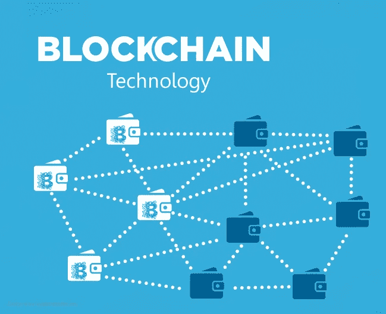
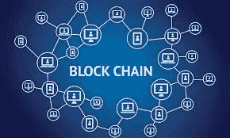
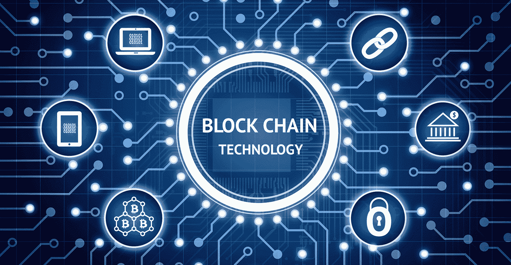

# 区块链技术的技术趋势

> 原文：<https://medium.datadriveninvestor.com/technology-trends-in-blockchain-technology-39c965f86595?source=collection_archive---------4----------------------->

**区块链技术让商业全球化变得更容易**

区块链技术是一个正在形成的概念，它允许经验证的知识的郊区化和不变的存储。区块链可以是分布式系统，由于它向所有或任何网络成员提供了等效的、经过验证的信息，因此比集中式体系结构具有优势。这项技术不希望网络运行，但是由于网络而存在。

如今的企业要求更快的投资回报，缩短资本家和投资者之间的距离。区块链为全球化提供了更快和额外的经济推动，无论人们在哪里都能获得信息和商业。

 [## 2019 年成为主流的 7 大区块链挑战及更多...数据驱动的投资者

### 教训是永远不要停止学习和成长。关于技术、金融、工作场所、生产力和…

www.datadriveninvestor.com](https://www.datadriveninvestor.com/2019/03/25/top-7-blockchain-challenges-to-go-mainstream-in-2019-more/) 

目前，多个行业对区块链技术的兴趣越来越大，因此开展国际业务的潜力也越来越大。遵循 square measure 区块链开展国际业务的一些重要方式，这些方式使世界经济进入了一个更新换代的时代:

合规:管理跨境交易是国际商务中最棘手的问题之一。这是为了确认与众多监管框架的一致性，并遵循独特的规则。典型的公司甚至不知道他们违反了当地法律。先进的税法使得在州与州之间做生意变得很麻烦。漫长而昂贵的交易等待期导致资源浪费和难以完成交易。

区块链技术不受政府控制，也不需要第三方来管理交易的任何方面。因为这可能是一种点对点技术，它有助于资产的无缝跨境转移。此外，区块链将记录公之于众，以确认没有人在欺诈。区块链为企业提供了降低价格的方式，并确保了全球范围内的安全交易。

**区块链整合前景光明**

blockchain

有关比特币及其利润的所有激动人心之处，都让行业难以置身于区块链一体化之外。然而，一些人意识到这很难，并认为掌握这项技术的小字体是繁重的。这背后有一点真实性，因为这项技术包括 square measure 很难了解的科学学科特性。然而，区块链的最终结构并没有那么先进。下面列出方块衡量一下 [**区块链科技**](https://www.cioapplications.com/cxoinsights/blockchain-technology-represents-a-new-frontier-of-innovation-in-the-commodity-trading-industry-nid-1632.html) 的几个属性，为抓住区块链创新点打下基础。

**亦见:**[**CIO review**](https://medium.com/cioreview-magazine)**出版物**

**1。不可更改**

区块链分类账的永久保存能力和不可更改的交易历史可能是区块链专家强调的一个明确特征。不可更改将重新审核方法，使其成为一个快速、经济和高效的过程，从而为信息业务使用带来信任和完整性。

**2。速度**
区块链不包含中间人的另一个优点是大大提高了知识共享的速度，因此企业非常赞成采用它。

**3。透明度**

区块链技术允许该方法中的相关用户查看另一个用户的操作。该技术最终实现了门户网站上销售的 100%透明，确保没有用户会更改或删除任何交易，同时也没有其他用户会注意到这一事件。这也可能是一个缺点，因为它彻底暴露了所有的知识。然而，混合区块链将部分解决这种情况，并显示一个操作已经发生，但是，它没有揭示什么是块内。

**4。可追溯性**

一个包含没有人会篡改的不可变的、清晰的信息的系统，允许快速地追踪信息，并且是一个受到几个人，尤其是食品部门内部赞扬的额外收获。食品供应链异常繁琐、不透明，涉及多方，他们有自己的一套信息；区块链确保这些信息中的每一个都可以直接追踪，并提供了一个额外的清晰和安全的环境。

**区块链技术对行业的优势**

自从区块链技术被引入以来，它就一直在新闻中出现，几乎每天都有关于区块链技术潜在用途的替代用例被发现。这项技术被证明是几家公司的重要优势，因为它提供了极好的信息安全和隐私。一个非常区块链的网络中的信息保存在受害者科学散列上，创建每个明确可指定的条目。使用独特且极其安全的密钥来提供对信息的访问。这里列出了区块链技术促进工业发展的一些方式:

革新供应链:净寻找趋势是在护理上升趋势的关联，它有效地取代了正常的寻找策略。消费者购物行为的改变需要生产者改变供应链管理。购买者要求供应链方法中的透明度，以跟踪他们的产品。区块链提供分布式和本地化的数字账本，允许整个提供链方法绝对透明。

处理假冒商品:随着假冒产品的大量增加，一些公司正因为多样化的 come 政策而遭受损失。区块链将阻止这些欺诈行为。区块链技术允许客户在最短的时间内跟踪他们的产品。零售商将在每件商品上使用一个可扫描的代码，允许购物者查看商品从生产地到最后一次转售的整个历史。

分析买家行为和打电话:区块链技术将与良好的设备连接，以研究客户行为。它将为制造商提供至关重要的祝福，因为它将提供对非常明确的产品的修改要求以及特定产品生产量内任何所需修改的见解。

除了难以想象的安全性和可追溯性，区块链技术还有几个不同的行业用例。该技术将产生区域单元本地化的市场，允许人们说话，而不需要任何第三方。

**来源—** [**CIO 应用**](https://www.cioapplications.com)

**看看这个:关于**[**CIO Review**](https://medium.com/@jackmathew/cioreview-beab930fb56e)**杂志**的评论

**参见:** [**CIOReview 杂志**](https://www.prnewswire.com/news-releases/compliancequest-recognized-by-cioreview-as-one-of-the-top-20-promising-digital-experience-solution-providers-for-2017-300548358.html)