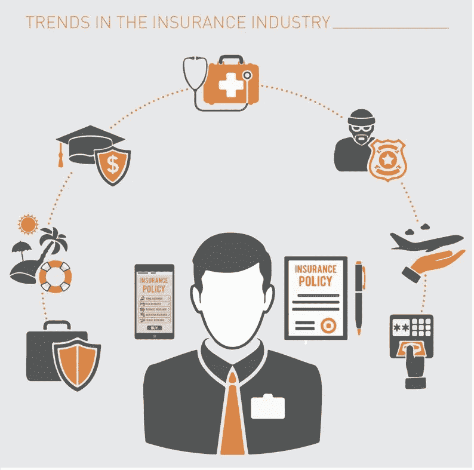
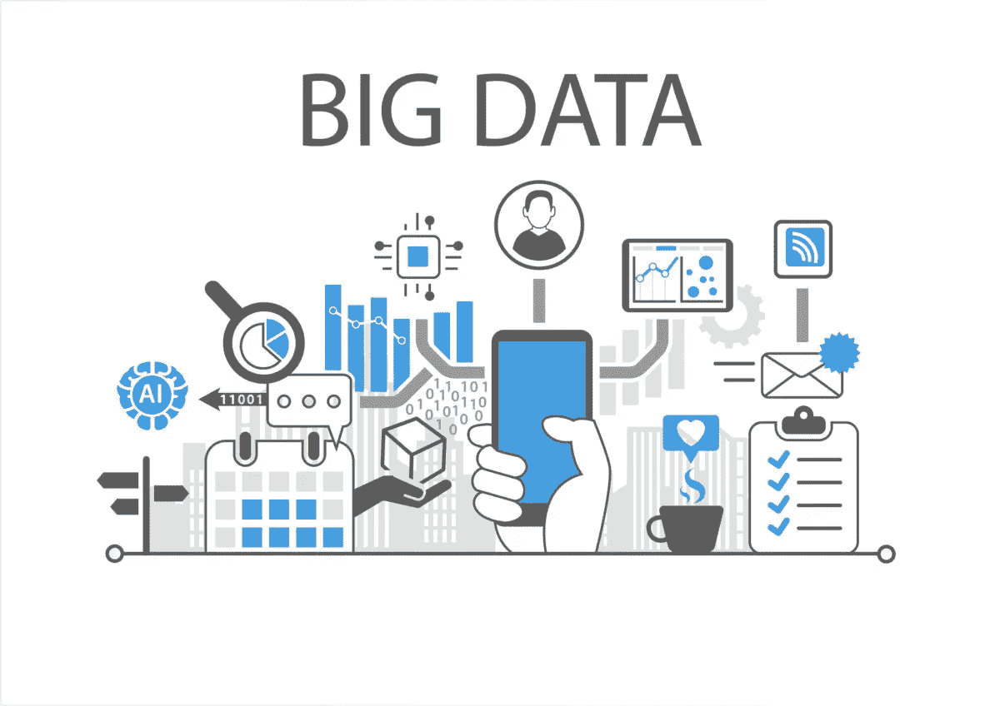

# 改变保险业的技术趋势

> 原文：<https://medium.datadriveninvestor.com/technology-trends-transforming-the-insurance-industry-c208f1ca1120?source=collection_archive---------4----------------------->

全球保险市场正在经历向“数字优先”商业模式的转变，这种模式可能会带来数十亿美元的新价值

随着准学士学位增加目标个性化保费和基于使用的覆盖范围，保险公司在物联网、高级分析和机器学习领域进行单位投资，以开发更多精细的个人风险概况

 [## 今年值得关注的 5 大人工智能趋势|数据驱动的投资者

### 预计 2019 年人工智能将取得广泛的重大进展。从谷歌搜索到处理复杂的工作，如…

www.datadriveninvestor.com](https://www.datadriveninvestor.com/2019/02/19/artificial-intelligence-trends-to-watch-this-year/) 

古老的保险公司和保险技术公司之间的合作可以带来更新的模式和收入流，更高的利润和更低的运营价格。

# 1.保险业中的人工智能:

*人工智能在保险业务的再造中起着至关重要的作用。保险供应商从基于人工智能的工具和应用中获益，用于精确的保险操作和理赔。如今，随着可穿戴设备、物联网和智能移动应用的质量不断提高，保险组织能够优化高级保险选择和调查。保险购物者使用的智能工具和应用程序改变了保险供应商，以访问其客户健康的宝贵数据，并提供定制的保险单。近年来，基于人工智能的管理工具和应用程序迅速优化并夸大了世界各地保险组织的潜力。*

***1。定制保险单***

*智能可穿戴设备，如健身带、家庭助理、智能手表等。已经成为副学士积分时尚方式的一部分。通过访问有价值的客户健康数据，智能设备允许保险公司更好地了解用户偏好。生成的知识有助于保险公司定制保险商品和服务，同时发展长期客户关系。明智的可穿戴设备的信息优势允许保险供应商将被保险人从“远低于死亡风险”转变为“健康”，支持他们的健康状况，以便根据一段时间的健康记录改变保费政策。*

***2。欺诈检测***

*健康保险供应商使用基于人工智能的欺诈检测技术进行正确的医疗索赔。人工智能技术通过更快、更好和更精确地创建索赔管理流程来促进索赔管理流程。精通技术的保险公司在保险流程的许多阶段利用基于人工智能的工具，只要对知识的合理分析将确定匿名医疗索赔或篡改的医疗文件。AI 允许保险公司实施明智的选择，如促进一段时间的问答服务，预先评估索赔，而自动化伤害分析方法，自动化欺诈检测，预测索赔量的模式，并在客户界面中增加损失分析。人工智能聊天机器人和客户端界面将对医疗索赔进行合理的审查，并在索赔结算的支付程序之前，通过欺诈检测算法和合理的分析来验证政策细节。基于人工智能的自动索赔处理系统有助于保险公司避免不名誉的医疗索赔、索赔过程中的人为错误以及索赔报告中的不准确性。*

***3。合理承保***

**

*AI 帮助保险组织在其现有的索赔管理流程中执行动态、智能的承保算法。因为保险的初始承保过程是繁琐而复杂的，实施人工智能将有助于保险专业人员开发定制的销售技术，并应对市场日益增长的竞争水平。AI 利用客户知识，并根据客户偏好和相关保险商品制作保险组合的才能，使保险公司的承保流程变得更加轻松。*

*人工智能在保险领域的重大优势给古老的保险业务带来了革命性的变化。从更大的知识准确性、额外的深度定制到战略性欺诈检测，基于人工智能的解决方案为时尚的保险公司提供全方位的保险运营服务。保险组织对人工智能的稳步采用证明可以加速其现有的保险业务方法，并提高其商品和服务的销售率。明智的保险商品、定制的保险单、高效的保险运营以及其他的不断推出，显示了 AI 在保险领域的积极统治地位。*

***看看这个:** [***顶级 AI 保险公司***](https://bit.ly/34b9Swn)*

# *2.大数据有利于保险业:*

**

*[***保险界***](https://bit.ly/31XGOa3) 向来相当约定俗成；尽管如此，对最新技术的掌握不仅仅是最近的趋势，而是继续竞争步伐的需求。在 gift 数字时代，大量信息技术有助于处理大量数据、提高发展潜力、评估风险和降低运营价格。*

*现代文明不断制造出大量的时间周期信息。经过人工智能的处理，它与保险一样，成为许多贸易模型的重要数据来源。除了第三方资源之外，保险行业一直支持信息分析――事故数字、投保人的非公开信息。从这些多个来源接收到的信息有助于将投票人分类到完全不同的风险类别、支持的损失和费用中。向数字社会的快速发展释放了新的数据资源，这些数据资源可用于为每个客户护理棘手的行为模式，并准确推断他或她的风险状况。*

***保险业内大量信息的作用:***

*新的分销模式:虚拟助理和聊天机器人，可以增强客户互动，有针对性地销售大量产品。*

*方法自动化:它替代了体力劳动，提高了内部流程的能力。*

*新主张:它有助于创建不同的商业形式，如点对点概念或数字保险公司。*

*保险行业的几种海量信息解决方案:*

***客户获取:***

*每个客户都通过电子邮件、社交媒体平台和反馈产生大量的知识，这比任何调查或表格都更能产生关于他们选择的精确信息。通过分析这种无定形的信息，保险公司将增加他们的效力。*

***客户维系:***

*基于购物者的活动，算法会识别出顾客不满的早期迹象。通过牺牲这些汇集的见解，保险公司将考虑通过动态评级模型来确定客户的问题。*

***风险评估:***

*保险公司永远以客户信息的认证为目标，同时评估风险。大量信息将通过部署预测模型来预测支持客户信息的可达到的问题，从而提高这种方法的有效性。*

***降低成本:***

*大信息将使几个劳动密集型过程计算机化，创造出许多胜任的人。在过度竞争的环境下，降低处理索赔和治理的价格可以降低保费，并有利于吸引新的购物者。例如，保险支持的大量信息被用于形成评级模型，每个模型可以匹配消费者的预算并保证公司的利润。*

***看看这个:** [***顶级大数据公司***](https://bit.ly/2BWqdZS)*

# *3.保险领域的区块链:*

**

*在追求卓越的过程中，副学士学位加速了数字世界的重塑。这项技术目前影响着人们的日常生活和其他选择，并能灵活地大大加强这种影响。众所周知，保险业对于拥抱技术并与技术一起成长非常重要。区块链是游戏规则的改变者，远远超过支持比特币的信息分类账技术。这是副学士学位创新技术，将开启新的商业机会，降低集体诉讼价格，并增强信任，保护和现有程序的有效性。它是破坏和改造传统上免于修改的产业的工具。保险业是一个罕见的例子，这个行业可能会被区块链方面大幅改变。远见卓识的商业领袖广场衡量区块链和企业家的新用例的形成。他们正在建立保险业务，开拓新产品，应对独特的市场。*

*在全球范围内，保险公司每年因欺诈损失超过 800 亿美元。保险公司在打击欺诈方面面临的最大挑战是，理算员主要相信物理过程。它验证索赔数据，如物品所有权、可信度、历史记录等。欺诈者会利用这一点。区块链交易的加密性质一旦与其独特的，坚固的来源能力相结合，就允许制作准学位专制索赔和现实世界事物的数字文件。这些个人数字记录将习惯于在他们的整个一生中跟踪和证明有价值的实物，而这对犯罪分子欺骗系统来说是非常麻烦的。保险业务的边缘从区块链的实用性通过虐待它来修改和修改用户的入职方法。区块链允许对全新购物者提供的多个身份文件进行验证。*

***看看这个:关于**[**CIO Review**](https://medium.com/@jackmathew/cioreview-beab930fb56e)**杂志**的评论*

*以企业为代表的共享经济的发展为全新的、进步的保险产品创造了机会。它解决了利用个人资产实现商业目标的固有困难。保险组织广场措施虐待区块链技术，以加快短期商业保险合同的共享经济。区块链有助于企业按需制作带时间戳的安全保险文件，而不需要昂贵的中央处理器。 [***区块链科技***](https://bit.ly/34baqSX) 提供的价值颠覆，正在制裁商家，开拓一个全新的市场。在价差分类帐上处理和保存信息可以使再保险人能够直接从原始供应接收经验证的时间段信息，而不必将他们的交易对手保险人包括在案例中。这共同保证了更快的资本分配，以满足未来的需求。在我们考虑到保险业务涉及一大堆相同合同的再保险人之后，优势平方衡量甚至更为明显。*

****看看这个:*** [***区块链顶级保险公司***](https://bit.ly/2BT5TIH)*

*区块链最强大的能力之一是智能合约，这是一种可编程和可自我执行的平方度量，用于预先确定的需求，而不需要外部干预。这项技术有巨大的潜力来修改，从而降低价格，所有形式的合同连同保险索赔。保险公司喜欢明智的合同，机械地加快损失赔偿的申请，以防不利的天气条件——损坏财产。这种安排围绕所有类型的测量设计，如天气读数和探测器信息，创造了许多可信的说法，较少主观或可能不光彩的说法。*

*区块链作为一种显著的资本正在以惊人的速度前进，无数的创新思维被赋予其中。它为所有利益相关者提供了扩展运营潜力的工具。它是每个公司信息流和交易的数字枢纽。区块链使索赔管理变得更加宽松，更加机器化，保证了知识的完整性，并使索赔提交的建议自动化。随着区块链的采用率越来越高，其在业务中的影响力越来越大，因此，贸易参与者必须准确跟踪技术带来的突破，以免在数字化转型后徘徊不前。*

***看看这个:** [***保险趋势&科技新闻***](https://bit.ly/36adxfE)*

***CIOReview 客户端的:**[**prefect**](https://www.zebra.com/us/en/about-zebra/newsroom/press-releases/2019/profitect-recognized-by-cioreview.html)**，** [**旗舰**](http://www.flagshipbio.com/news/flagship-named-company-of-the-year-by-cioreview/) **，** [**，**](http://www.pcmicorp.com/2017/10/pcmi-20-automotive-technology-cioreview/) **，** [**Beqom**](https://www.beqom.com/awards/cio-review-20-most-promising-hr-technology-solution-providers-in-2017)*

***退房点评 CIO Review:**[**Crunchbase**](http://www.crunchbase.com/organization/cio-review)**，**[**glass door**](http://www.glassdoor.co.in/Reviews/CIOReview-Reviews-E1172153.htm?countryRedirect=true)*

***看看这个:** [**CIOReview 概述**](http://www.owler.com/company/cioreview) **，**[**muck rack**](http://muckrack.com/media-outlet/cioreview)*