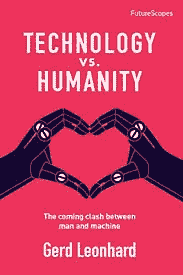

# 技术与人性:即将到来的人机冲突

> 原文：<https://medium.datadriveninvestor.com/technology-vs-humanity-the-coming-clash-between-man-and-machine-da074eee067f?source=collection_archive---------0----------------------->

**技术的社会影响**

作为人类，我们不理解指数或自我放大。特别是对人类的影响。理查德·沃森写了很多关于它的文章。例如在“[数码对战人类](https://www.ronimmink.com/digital-versus-human-running-time/)”。”[生活 3.0](https://www.ronimmink.com/if-you-had-three-wishes-for-an-ai/) “没那么不一样。我们需要小心我们的愿望。

格尔德·伦纳德

我遇到了 Gerd Leonhard，因为他是 2017 年伦敦法律博览会的一名演讲者。今年我将追随他的脚步。他们很难跟上。他的书《技术与人类:即将到来的人机冲突》绝对是一部杰作。

**数字原子弹**

我们还没有想清楚人工智能、物联网、大数据、社交媒体、云、ICT、基因组编辑可能会做什么。他把它比作原子弹的发明。在那些日子里，事情要慢得多。我们面对的是一枚数字核弹，它可能会在我们意识到自己身处何种境地之前爆炸。指数技术可能很快引发一连串的“原子弹挑战”或“数字广岛”

**黑暗趋势**

作为彼得·迪亚曼迪斯的 6Ds，他指出了许多影响。称之为 6Ds 的阴暗面。

*   依赖性——把我们的思维留给软件和算法，因为这样更方便快捷。
*   困惑——不知道回复我邮件的是预定的人类，还是她的人工智能助手。甚至不知道是我自己做的决定还是被我的 IDA 操纵。
*   失去控制——无法知道人工智能的预测是否正确，因为我们不可能跟踪系统的逻辑，甚至无法理解以量子计算为燃料的机器学习系统的工作方式。换句话说，我们要么完全信任它，要么根本不信任它，就像一些飞机飞行员已经面临自动驾驶系统的困境一样。
*   放弃——倾向于将更多的任务留给系统来处理，无论是协调个人日程、安排约会还是回复简单的电子邮件。那么，当然，如果出了问题，我们很可能会简单地责怪云/机器人/人工智能。

让我想起了“[第七感](https://www.ronimmink.com/seventh-sense-power-fortune-survival-age-networks/)”。你认为人工智能接管后会让我们这么做吗？

**更黑暗的趋势**

他指出的其他黑暗趋势包括:

*   社交自闭症(我们爱屏幕胜过爱人类)。
*   沉迷于技术(“移动设备是新的香烟”)。
*   数字肥胖。发达国家的每个消费者都不知不觉地摄入了大约 150 磅的添加剂——大部分是糖、酵母和抗氧化剂，以及味精等真正令人讨厌的东西。因此，消费者被巧妙设计的“更多需求”所迷惑，以至于很难找到无尽快乐消费王国的出口。如果这听起来像脸书或你的智能手机，你明白我的意思了。食品工业实际上称这种行为为“疯狂”或“渴望”。在技术领域，营销人员称之为魔力、粘性、不可或缺性，或者更亲切地说，用户参与。渴望和上瘾作为技术的商业模式。想想 2020 年，想象数十亿超级互联消费者变得数字肥胖，沉迷于持续不断的信息、媒体和数据——以及他们自己的反馈回路。
*   数字封建主义(赢家，即平台赢得一切)。
*   安全性，因为虚拟化带来了去中心化，减少了物理控制点。
*   软件很快会吃掉生物，”以及通过大脑上传或半机器人化来虚拟化人类的日益增长的诱惑——这是许多超人类主义者的梦想。
*   指数级地忘记我们自己，在数字生活中梦游，打开了一种全球数字封建主义的大门——技术霸主以我们无法理解的方式统治着我们。
*   在社会安全环境中，仅仅通过数字来对待人们，就像对待无实体的数据源一样
*   由于结合了快速、廉价和超级强大的工具，包括移动云技术、个性化、语音和图像识别、情绪分析和情感分析，数字自我发展成为我们自己的真实副本。最终，我们将不断与机器相连，它们越来越擅长读取我们的想法。它将导致自由意志的终结。
*   如果我们对彼此的所见所闻完全由算法决定，而这些算法旨在让你尽可能长时间地停留和观看广告，而不是由人决定，我们的选择将会如何形成？如果这些工具没有受到公共控制、监督或监管，会怎么样？正如塔勒布所说“技术和奴隶制的区别在于，奴隶们充分意识到他们并不自由”。
*   软件不再只是“吃掉世界”，而是越来越多地“欺骗世界”
*   每一个人和每一件事都成为一个数据灯塔，每天产生数千千兆字节的数据，由 IBM 的屈臣氏和谷歌的 DeepMinds 的军队在云中收集、过滤和分析，每秒钟应用他们饥饿的、自我学习的全球人工智能大脑。
*   低成本、无处不在的数字技术让我们有可能将我们的思维、决策和记忆外包给越来越便宜的移动设备及其背后的智能云。这些“外部大脑”正在迅速地从了解我到代表我再到成为我。
*   在其最黑暗的变体中，物联网可能是机器思维的高潮——有史以来设计的最完美的间谍操作系统(OS ),有史以来设计的最大的实时监控网络，强制人类完全遵守并消除所有剩余的匿名性。

**活靶子**

我们将成为被任何知道如何使用这个系统的人操纵和不当影响的活靶子。随着生物学让位于技术，我们的生物系统将变得越来越可选择、可替代，最终甚至退化。

**技术内部化**

技术正在走向内部——将我们与世界分离，越来越多地将我们与人类体验分离。我们已经开始将工具的魔力与持续连接、媒体化、屏幕化、模拟和虚拟化的药物效应相混淆。魔法已经变得疯狂——令人上瘾、诱人、刺激、苛刻——那么当魔法商数达到 1000，当技术变得无限强大、廉价、与我们密不可分时，会发生什么？在不久的将来，我们可能不得不考虑一个终极问题:我们现在是生活在机器内部，还是机器生活在我们内部？数据是新的石油:付费或成为内容。

by [rawpixel](https://unsplash.com/@rawpixel?utm_source=medium&utm_medium=referral) on [Unsplash](https://unsplash.com?utm_source=medium&utm_medium=referral)

**差距**

我们正面临着技术能做什么(答案似乎是几乎任何事情)和它应该做什么才能带来人类整体幸福之间的巨大差距。为了保护人类的未来，我们必须像发展技术一样投入同样多的精力来促进人类的发展。算法可以测量甚至模拟一切，除了对人类真正重要的东西。错误地定义人类繁荣意味着什么，只会让机器更加强大。

人类正处于危险之中

这样做的风险是我们将失去人性。自动化正在爆炸式增长，因为很明显，人类昂贵、缓慢且通常效率低下，而机器廉价、快速、超高效，并且正呈指数级增长。

**调试人性**

我们有调试人性的危险。调试神秘、错误和意外收获，调试缓慢、乏味的人类行为，如讨论、思考和情感。做人就是太繁琐了。自动化正在爆炸式增长，因为很明显，人类昂贵、缓慢且通常效率低下，而机器廉价、快速、超高效，并且正在呈指数级增长。我们最终会成为一个完全没有意识、神秘、灵性和灵魂的物种吗，仅仅是因为在这个即将到来的机器时代没有这些数字的空间吗？再往前推十年，我们可能真的会以 95%的自动化、超连接、虚拟化、超高效和远不如我们今天所能想象的人性化而告终。

**幸福**

人类最快乐的时候是他们:

*   快乐(美味的食物，温暖的沐浴)
*   参与度(或称心流，专注于一项享受但具有挑战性的活动)
*   关系(社会关系已被证明是幸福的一个非常可靠的指标)意味着(一种感知的追求或属于更大的东西)
*   成就(实现了切实的目标)。

相比之下，技术在促进真实关系或建立感觉、目的或意义方面会有实质性的帮助。事实上，事实可能恰恰相反，因为技术往往会对关系产生很大的腐蚀性，就像我们在家庭聚餐时沉迷于移动设备一样。

**同情心**

同情心——一种与幸福相关的独特品质。你能想象一台电脑，一个应用程序，一个机器人，或者一个软件产品有同情心吗？

**黑客快乐？**

幸福是无法获得或购买的，因此也不可能塞进一个应用程序、一个机器人或其他机器。支持性证据表明，经历对我们整体幸福的影响比财产更长久。体验是个人的、有背景的、及时的和具体化的。

**黑客快乐！**

然而，技术进步思想家的关键论点是，快乐只是正确种类的神经元在正确的时间以正确的顺序放电的结果。他们认为这只是生物、化学和物理，因此可以被计算机完全理解、学习和复制。

看一看 www.happify.com，看看组织快乐的想法是如何被推销的——一个教你快乐的软件工具！人们只能想象到 2025 年这将会变成什么样——一个通过 BCI 或微小的植入物直接连接到我们大脑的应用程序，以确保我们一直都很快乐，而且——关键的是——我们一直在消费快乐！情绪机器人和科技快乐科技已经能够创造、编程或操纵快乐的时刻。

**操纵**

很快，这将通过非常熟练地操纵我们的感官来实现。电脑会努力让我们感到快乐。他们会努力成为我们的朋友。他们会希望我们爱他们。

我们将解开血清素、多巴胺和催产素等关键神经递质的遗传决定因素，并能够利用结合机器人技术和传统药理学的精确纳米技术操纵幸福基因——如果不是血清素相关的 5-HTTLPR，那么就是类似的东西。这些“情绪机器人”一旦被摄入，将直接传播到大脑的特定区域，开启基因，手动调高或调低我们的幸福设定点，改变我们体验周围环境的方式。

**Mantal 军备竞赛**

在对“[《销售的科学》](https://www.ronimmink.com/neuroscience-behind-selling/)”的评论中，我预测正念和(销售)操纵之间会有一场军备竞赛。同情和幸福，就像意识一样，不仅仅存在于生物学或化学术语中，而是存在于人类所有事物的整体相互作用中。机器或软件不太可能达到这些状态，即使它们在某种程度上很快变得更擅长模拟它们。

**足够好**

在可预见的未来，试图首先定义并编程一种人类特征，如同情心，或像意识一样神秘的东西，似乎是一个遥不可及和不可实现的概念。但是，真正的危险是，一个伟大的模拟([将包括 AR 和 VR](https://www.ronimmink.com/experience-on-demand-and-what-it-will-do/) )对我们大多数人来说很可能是“足够好”的吗？

**你的程序能幸福吗？**

幸福不能被编程到机器中，不能自动化，也不能出售。它不能被复制、编纂或深入学习。它需要从我们身上发出，在我们之间成长，而技术就在这里帮助我们——作为一种工具。我们是使用技术的物种，而不是注定是(来)技术的物种。

**人权**

他提出了数字时代的五项新人权

1.  保持自然的权利，即生物的权利——我们必须能够选择在一个未被强化的状态下生存。
2.  低效率的权利定义了我们的基本人性
3.  我们必须有比技术慢的选择。
4.  断开连接的权利——我们必须保留关闭连接、在网络上“变暗”以及暂停通信、跟踪和监控的权利。
5.  匿名的权利——在这个即将到来的高度互联的世界里，我们仍然可以选择不被识别和追踪，

**规则**

和一些规则:

*   我们不能让机器自我授权，从而规避人类的控制。
*   我们不应该仅仅为了更好地适应技术而试图减少人类的缺陷。
*   我们不应试图通过使用技术来预测或防止错误、神秘、事故和机会，从而消除它们，我们也不应仅仅因为技术可能使事情变得可行就努力使事情变得明确。
*   我们不会创造、设计或传播任何以上瘾为主要目标的技术。
*   我们不应该混淆一个清晰的算法和人类现实的精确图像
*   我们不能追求效率而忽视人性

**可以还是应该？**

对于技术接管了不该接管的地方，我们能做些什么？我们如何保护自己不仅仅成为机器人推动的超高效率的对象，养活一个巨大的人工智能，进而支配我们的生活，告诉我们什么我们不能再做？在不久的将来，问题将不再是技术能否做某事(答案几乎总是肯定的)，而是它是否应该做某事。他担心，如果没有技术，我们可能很快变得一无是处——迟钝、不完整、愚蠢、缺乏技能、懒惰和肥胖。

**人性的侵蚀**

想象一下，如果我们继续削弱并最终侵蚀人类的精髓，如隐私、神秘、匿名、情感、自发性、惊奇、直觉、想象力和灵性，仅仅是为了跟上机器的步伐，会发生什么？

**管家**

我们必须成为人类更好的管理者。每一位商业领袖、技术先锋和政府官员都需要接受并履行自己塑造人类未来的责任。技术没有伦理，然而一个没有伦理的社会注定要失败。指数技术通常会迅速从神奇变为狂热，再变为有毒——实现平衡至关重要。

*   我们需要教授 STEM 和核心(同情、创意、互惠和同理心)技能。技术和人文必须都在课程中；的确，科学和哲学属于同一个教室。
*   我们需要明确区分什么是真实的，什么是复制或模拟的。完全连接、思维机器、智能云和认知计算是我们不可避免的未来，但我们不应该放弃模拟和存在、计算和感知、机器类和人类之间的区别。
*   我们需要开始问为什么和谁，而不仅仅是是否或如何。
*   我们不应该让硅谷、技术专家、军方或投资者成为人类的任务控制者——不管他们在哪个国家。那些资助、创造和销售指数级技术的人不太可能是那些想要限制其潜在应用能力或规模的人。

**七问**

当我们评估指数技术时，我们应该问七个基本问题:

1.  这项技术会无意中或有意贬低人性吗？
2.  这项技术会促进人类真正的幸福吗？
3.  这项技术是否有任何意想不到的和潜在的灾难性的副作用？
4.  这项技术是否会给自己或其他算法、机器人和机器过多的权限？
5.  这项技术会让我们超越它，即超越它本身，还是会让我们依赖它？
6.  人类是否需要进行物质上的改变或增强才能真正使用这项技术？
7.  这项技术是公开的，还是专有的？

**一个黑暗版的“滤镜泡泡”**

这本书是“[滤镜泡沫](https://www.ronimmink.com/the-shallows-on-steroids/)”或“古腾堡对扎克伯格”的一个非常黑暗的版本。这一个更具有存在性。

**武装自己**

帮自己一个忙，学习如何冥想，投资你的精神资本，确保你能控制自己的大脑。阅读:

*   [佛脑](https://www.ronimmink.com/business-case-meditation/)
*   [非凡思维的代码](https://www.ronimmink.com/invest-mental-capital/)
*   [为快乐而解决](https://www.ronimmink.com/solve-for-happy/)

**联系人**

请随时联系我，电话是[ron@ronimmink.com](http://mailto ron@ronimmink.com)。我在 Linkedin 上的简介是 https://www.linkedin.com/in/ronimmink/。

最初发布于:[https://www . ronimmink . com/technology-vs-humanity-coming-clash-man-machine/](https://www.ronimmink.com/technology-vs-humanity-coming-clash-man-machine/)