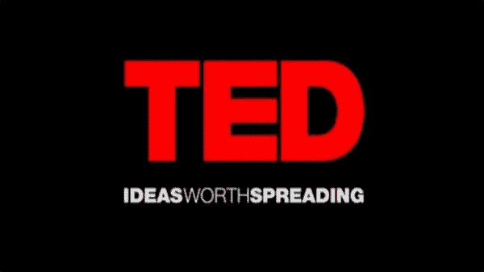

# TED 演讲:5 个最鼓舞人心的领导力视频

> 原文：<https://medium.datadriveninvestor.com/ted-talks-5-most-inspirational-videos-on-leadership-a1f32c81c18f?source=collection_archive---------1----------------------->

*本* [*条*](https://www.youtubetomp3shark.com/ted-talks-5-most-inspirational-videos-on-leadership) *由萨拉·普利兹克最先出现在*[*【Youtubetomp3shark.com】*](https://www.youtubetomp3shark.com/)*。*

# 领导者是希望的经销商——拿破仑·波拿巴

成为领导者意味着什么？一个人如何成为伟大的领导者？真正需要的是什么？这些是有史以来最优秀的领导者不断问自己的问题，这可能是他们伟大的部分原因。

 [## 数据驱动的投资者

### 事实上，在各行各业，数据的大规模激增正在改变我们感知世界的方式。而且只有…

go.datadriveninvestor.com](http://go.datadriveninvestor.com/youtube) 

但是，食谱并没有就此结束。成为一名优秀的领导者需要这么多，包括不断努力，努力提高，最重要的是，永远学习。成为领导者的最佳时机莫过于今天，因为我们手边有成千上万的资源，来自精英中的精英的激励人心的演讲，就在我们面前，只要我们敢，随时可以利用。

如果你准备好成为你能成为的最好的领导者，今天就来看看 10 个最鼓舞人心和激励人心的关于领导力的 TED 演讲。

# 领导力 TED 演讲第一课倾听并向你周围的每个人学习

领导力和学习是不可或缺的。—约翰·肯尼迪

斯坦利·麦克里斯特尔将军是美国武装部队授勋的四星将军，在我看来，这些都是接受领导力培训的很好的资格证书。他做了一个令人难以置信的 TED 演讲([斯坦利·麦克里斯特尔:听，学，然后领导](https://www.ted.com/talks/stanley_mcchrystal?language=en))，时长约 15 分钟。然而，在视频中，麦克克里斯托给出了一个领导的基本价值观:不要太骄傲或太自负而不愿向他人学习，因为在一天结束时，我们都需要彼此来度过一生。简短、深刻，与任何处于领导地位的人都有着难以置信的相关性。敬礼。

# 领导力 TED 演讲第二课自我领导力是第一位的

领导者能做的最重要的事情之一就是以身作则。如果你想让其他人都充满激情、投入、专注、有动力，你先走！—马歇尔·戈德史密斯

Lars Sudmann 做了一个简短的 TED 演讲，内容是关于领导力的第一法则:自我领导。他很快介绍了一些作为领导者需要经常做的重要练习，以确保你成为最好的领导者，这包括定期自我性格特征检查、问自我反思的问题和持续的自我调节。简而言之，苏德曼表明，如果你真的想领导别人，你必须从领导自己开始。

# 领导力 TED 演讲第三课重视每个员工的贡献

*一个有创造力的领导者的角色不是拥有所有的想法；这是为了创造一种文化，在这种文化中，每个人都可以有想法，并感到自己受到重视。—肯·罗宾逊*

好的领导会欣赏并理解每个员工的价值。显而易见的事实是，没有一个伟大的帝国是单枪匹马建立起来的。相反，它是几个人的共同努力。伟大的领导者理解这一原则，培养一种文化，在这种文化中，每个人都知道自己能做出什么贡献，被给予做出贡献的工具和空间，并因他们对最终产品的贡献而受到赞赏。

在她的演讲中，[忘记了尊卑次序](https://www.ted.com/talks/margaret_heffernan_why_it_s_time_to_forget_the_pecking_order_at_work?language=en#t-166561)，玛格丽特赫弗南对竞争的通常商业模式进行了质疑，狗咬狗，你必须踩着对方才能爬到意识形态的顶端，并提出了一种不同类型的心态。我在演讲中最喜欢的一句话是:“如果最有效率的人成功的唯一方式是抑制其他人的效率，那么我们迫切需要找到一种更好的工作方式。”。说得好，玛格丽特。

# 领导力 TED Talk subtitles and transcript # 4 领导力的定义是让某人的生活变得更好

领导者是帮助改善他人生活或改善他们所处系统的人。—萨姆·休斯顿

这是关于领导力的最好的 TED 演讲之一，因为它完全颠覆了我们习惯的整个定义。德鲁·达德利在短短的六分钟里向我们展示了我们每个人是如何成为领导者的，而我们自己却不知道。通过做最小的事情，我们可以改变某人的生活，从而成为人们的领导者。

达德利质疑通过巨大的力量和超人的力量改变世界的超级英雄领袖形象。相反，达德利说，我们改变世界，我们领导世界，通过一次对一个人产生影响的小事。看着它，你会惊讶的。

# 领导力 TED 演讲第五课适当激励

万事开头难。—约翰·沃尔夫冈·冯·歌德

领导者的部分工作是激励员工取得成功。社会通常用来让人们动起来的最常用的方法之一是激励，不管是积极的还是消极的，内部的还是外部的。但是励志演说家丹·平克正在教我们一些关于动机的有趣发现。事实证明，大多数时候，当我们用奖励来激励人们时，他们实际上是弊大于利！听听丹·平克的《动力之谜》，了解到在一天结束时，最大的动力是感觉我们在做重要的事情。

关于这个主题还有很多其他的研究和演讲，包括来自[丹·艾瑞里](https://www.ted.com/talks/dan_ariely_what_makes_us_feel_good_about_our_work?language=en)和[托尼罗宾斯](https://www.ted.com/talks/tony_robbins_asks_why_we_do_what_we_do?language=en)的两个最好的。这两个非常深入地解释了人们的动机，以及如何与我们的内部机制合作，以获得更高的生产力和更大的工作场所幸福感。

# 领导力 TED Talk subtitles and transcript # 6 一点小小的鼓励会有很大的帮助

如果你是一个领导者，你永远不要忘记每个人都需要鼓励。每一个接受它的人——年轻的或年老的，成功的或不太成功的，不知名的或著名的——都被它改变了。约翰·C·麦斯威尔

西蒙·西内克为任何想成为伟大领袖的人提供了大量的灵感和建议(我强烈建议你去看看)。我最喜欢的 TED 演讲之一是 Sinek 关于领导者如何激励行动的演讲。在这个演讲中，Sinek 展示了你的使命宣言激励着你，你的“为什么”比你的“是什么”或“如何”更重要向大师学习。

# 领导力 TED Talk subtitles and transcript # 7 无畏地领导，努力地爱

真正的领导者不仅关心自己的成功，还关心他人的成功和授权。—沃伦·g·本尼斯

琳达·克里亚特·韦曼可能是这份名单上最有激励性的演讲者。她是一个强有力的，有动力的，成功的领导者，她是一所学校的校长。没错，她是学校校长，但不是一般的学校校长。Cliatt-Wayman 进入问题严重的学区，以令人难以置信的方式扭转了他们的局面。

在她的 TED 演讲中，琳达告诉人们，如果你想成为一名领导者，你必须做三件事:真正的领导，也就是说，站起来做事。这当然包括其他人做不了的大工作，但也包括其他人不感兴趣的琐碎工作。第二，不要把重点放在借口或者问题上，要把重点放在解决方法上。第三，带着爱去做。不管你领导的是什么样的组织，一点关心和尊重都会有很大的帮助。

也喊出了[安吉拉·李·杜克沃斯成功的关键？砂砾](https://www.ted.com/talks/angela_lee_duckworth_grit_the_power_of_passion_and_perseverance?language=en)演讲。如果你想听更多这样的故事，就来看看吧。

# 领导力 TED 演讲第 8 课女性赋权

*有一天，她发现自己变得凶猛而坚强，充满激情，甚至她都无法克制自己，因为她的激情比她的恐惧燃烧得更明亮。—马克·安东尼*

在她令人难以置信的鼓舞人心的 TED 演讲中，雪莉·桑德伯格解释了为什么很少有女性担任领导角色。我认为这是每个女孩都需要听到的非常有价值的谈话。桑德伯格谈到了正确的自我信息，职场并不适合每一位女性，如果是的话，确保永远“坐在桌子旁边”。平等地看待和对待自己，别人也会如此。试试看！

# 领导力 TED 演讲第九课学习如何兴风作浪

这是一个三分钟的视频，展示了成为一名优秀领导者的一些要点。在[如何发起一场运动](https://www.ted.com/talks/derek_sivers_how_to_start_a_movement?language=en#t-145769)中，德里克·西弗斯展示了培养你的支持者的重要性，也展示了有时不要害怕成为一名追随者的重要性。Seth Godin 在他关于如何让你的想法传播的演讲中进一步阐述了这个概念。一句话，就是要卓越。看看这个。

# 领导力 TED 演讲第十课成功和获胜的区别

胜利很有趣…当然。但是赢不是重点。想要赢才是重点。不放弃才是重点。永不放弃是关键。—帕特·苏米特

我将以任何人(尤其是领导者)都需要理解的最重要的一课来结束这篇鼓舞人心的综述。在一次精彩的演讲中，约翰·伍登解释了成功和获胜之间的巨大差异。几乎每一次，最大的成功就是付出努力，尽你所能做到最好。你是否成功，也就是说，是否完成了你设定的目标，并不重要，重要的是你付出了什么努力。

喜欢你看到的吗？你也可以看看[菲尔兹·维克尔·缪林的演讲](https://www.ted.com/talks/fields_wicker_miurin_learning_from_leadership_s_missing_manual)，了解一些快速而振奋人心的领袖故事，或者[伊泰·塔尔加姆的演讲](https://www.ted.com/talks/itay_talgam_lead_like_the_great_conductors?language=en#t-175624)，讲述如何利用和声创造出美妙的交响乐。

领导者的任务是让他的人民从他们现在所在的地方到他们没有去过的地方。—亨利·基辛格

领导者拥有巨大的潜力来做出重大的改变，感动他人，并真正塑造世界，但他们必须成为优秀的领导者才能实现这些目标。幸运的是，我们有一些世界上最成功、最有权力、最有影响力的领袖作为我们的老师。有了今天的技术，我们没有什么可以阻止我们学习这些无价的领导力课程。正如穆罕默德·阿里所说，“我们唯一的限制就是我们给自己设置的限制。”

在这里阅读更多内容，别忘了订阅我的教练博客网站获得免费教练报告:[**https://www . coaching-blog . com/ted-talks-5-most-inspirational-videos-on-leadership/**](https://www.coaching-blog.com/ted-talks-5-most-inspirational-videos-on-leadership/)

**请访问我们的网站，订阅我们的免费教练杂志:**[http://www.international-coaching-news.net/](http://www.international-coaching-news.net/)