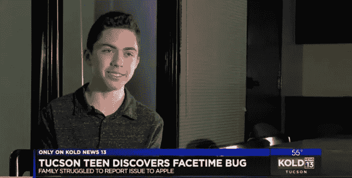

# 青少年因揭露 FaceTime Bug 而获得苹果公司的巨额奖励

> 原文：<https://medium.datadriveninvestor.com/teen-receives-massive-reward-from-apple-for-revealing-bad-facetime-bug-6fe2114b970c?source=collection_archive---------15----------------------->

你会被奖励的内容震惊的。

鉴于社交媒体的整体情况(想想 Fyre Festival、脸书的法律问题、数据隐私等。等等。)，我会说苹果有充分的理由提供奖励，就像这个 bug 是罗宾汉的克隆，他们为此损失了大量金钱。老实说，这个问题不一定是什么大不了的事情，但是*可能*落入坏人之手，比如说*黑客*。不要担心:因为苹果已经完成了这项工作，修复了漏洞

见见格兰特·汤普森。一个 14 岁的孩子。他正在用他的 iPhone 处理自己的事情，进行群组视频聊天，这时他意识到有人打电话给他却没有接。事实证明，FaceTime 可以让任何人轻松窃听。现在，当你从一个更大的角度来看，这通常是一件大事，一个需要被发现的令人讨厌的错误，而这个男孩发现了它。

苹果公司最近修复了这个问题，为令人讨厌的故障道歉；该公司还对服务进行了全面的安全审计，以确保一切都是最新的和经过验证的。但是听好了。

该公司还将资助格兰特的教育。天啊。让我在一部 iPhone 里找到一些 bug。当然，你可以看到相关性，因为这可能是一个致命的安全问题，因为数据对于社交媒体和智能手机平流层中的许多人来说仍然是一个微妙的问题。我们的个性——我们的身份——存在于这些设备中。所以想要保护他们是有道理的。

对当前的数据隐私、保护、云和智能设备问题有什么想法？告诉我们并 [**注册一个免费的 VIGYAA 账户！**](https://vigyaa.com/accounts/login/)

*原载于*[*vigyaa.com*](https://vigyaa.com/@pierre/teen-receives-massive-reward-from-apple-for-revealing-bad-facetim-0f274e4b/)*。*