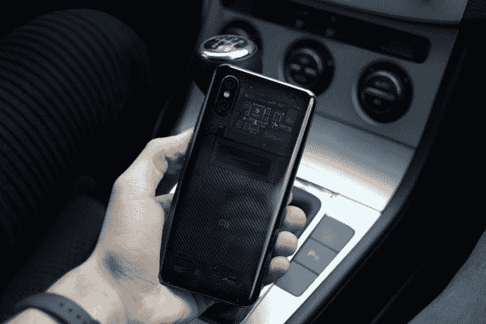
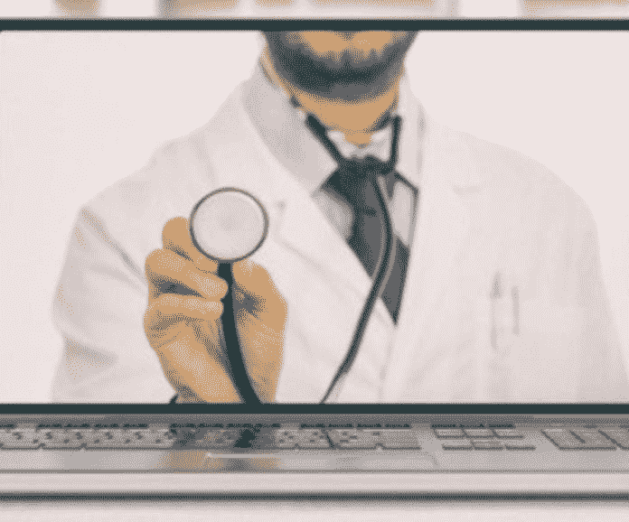

# 远程医疗为远程连接开出了药方

> 原文：<https://medium.datadriveninvestor.com/telemedicine-prescribes-cure-for-distant-connections-a4d87383c808?source=collection_archive---------5----------------------->

## 从远处看很有帮助，应用程序也有自己的隐私问题

电子医疗体现了现代个人数据的风险回报。在医疗服务提供者稀缺的地方，它有希望带来更多的个人接触。然而，移动医疗每天都面临黑客或个人身份信息处理不当的威胁。

[斯蒂芬妮·米亚科博士](https://twitter.com/StephMiaco)经常面临这些挑战。这位来自菲律宾杜马盖地市的精神病学家和 Silliman 大学医学院的一名教员倡导精神健康以及如何改善为每个人提供这些服务。

 [## 大笔资金和尖端技术:人工智能/人工智能投资将如何革新医疗保健…

### 在过去几年人工智能(AI)和机器学习(ML)的显著发展中…

www.datadriveninvestor.com](https://www.datadriveninvestor.com/2018/03/22/big-money-and-cutting-edge-technology-how-investment-in-ai-ml-will-revolutionize-the-healthcare-industry/) 

“远程医疗提高了我们作为医生的影响力，并影响了我们的实践，”她说。

Miaco 将远程医疗描述为远距离提供临床服务，分为三种类型的解决方案:存储转发、远程病人监测和实时接触:

*   存储转发:医疗保健提供商与另一个地方的医生、放射科医生或专家共享患者的医疗信息，如某个[客户](https://www.datadriveninvestor.com/glossary/client/)或患者的实验室报告和影像检查，以促进患者的护理。复杂的功能确保了安全性和保密性。医疗保健团队—无论距离多远—都可以查看信息以提高效率。
*   远程患者监护:医护人员远程跟踪患者的生命体征和活动。这使得在辅助生活设施中能够更有效地治疗慢性病，如糖尿病和老年人的病痛。在那里，患者可以自动将他们的数据发送给医生，这对双方都更方便，提供更好的护理。
*   实时遭遇。患者和提供者使用视频会议代替传统的亲临诊所。这是用于初级保健咨询、随访和监测临床反应。

Miaco 提出了一个警告:即使有远程电话会议来代替实时咨询，社交媒体渠道如 Facetime、Skype 或 Messenger 也不适合实施移动医疗。

她说:“远程医疗的遭遇需要通过确保客户或患者的保密性和安全性的措施和应用程序来保护。”

“远程医疗将不可避免地成为主流，”Miaco 说。“偏远地区缺少医生和医护人员，临床决策对完整信息的需求势在必行。”

# 隐私事件

在 mHealth 的接收端，不断有关于患者隐私的提醒和告诫。在美国，政府在数据泄露后处以数百万美元的罚款，许多是远程医疗处理不当的结果。

“我们接触远程医疗是在我们的康复医学轮换期间，”分子医学的准博士候选人 Ourlad Tantengco 说。“我们在实习期间模拟远程康复。

“电话另一端的物理治疗师或职业治疗师教社区的实习生如何为病人做基本练习，”他说。"然而，并不是所有的实习生都能体验到在社区中工作."

 [## 医生为患者联系开出应用程序

### 即时连接也可能导致即时隐私问题

medium.datadriveninvestor.com](/doctors-prescribe-apps-for-patient-connections-fdb8cd90c166) 

这带来了遥远的病人带来的障碍。

“有些人要求远程会诊，这不是我通常的做法，”Miaco 说。“当他们在治疗师之间转换时，患者声称这对他们帮助很大。然而，他们大多只能通过 Skype 或 Messenger 来完成。

“偏远地区因此受益，”她说。“确实很有用。”

内分泌学家[Iris Thiele Isip Tan](https://twitter.com/endocrine_witch)医生面临着职业短缺。

“菲律宾没有足够的内分泌学家，”她说。“我不得不使用诊所电话的短信服务，向无法像我希望的那样频繁随访的患者转发实验室结果、毛细血管血糖和血压监测结果。

“当我因为其他任务和马尼拉的交通而无法到达医院时，我通过 Skype 与内分泌学家和住院医生进行了学术交流，”Tan 说。

远程医疗使医疗服务提供者更加方便。与其没完没了地打电话，mHealth 加快了联系速度，并实时提供实验室结果和其他重要信息。从这个意义上来说，网络可以更加个人化。

“在我的一家医院里，病人有一个应用程序，允许他们访问他们的结果，”教育工作者[Rhia Gomez](https://twitter.com/mrsgomezmd)医生说。放射科医生和核医学医生。"一旦我在报告上电子签名，它就会自动通过电子邮件发送给转诊医生."

# 过度扩张的危险

移动健康的便利带来了代价:承担太多的诱惑。

“我曾考虑加入远程医疗平台，但由于时间安排问题，决定不加入，”谭说。“我周一到周五都有门诊，不想多待一天。

她说:“我也考虑过收费问题，但决定不对我在诊所没有真正见过的病人使用远程医疗平台。”"根据我听到的说法，这将限制远程医疗的实用性."

 [## 缩写不是字母完美的

### 被误解的 A、B 或 C 可能会危及患者的健康和安全

medium.datadriveninvestor.com](/abbreviations-are-not-letter-perfect-efa3b58a60a0) 

有了远程医疗，关键的诊断可以很快完成。

“它有助于诊断一些导致人类疾病的寄生虫和真菌，这些疾病很难识别，”教育专家和社交媒体倡导者 Narciso Tapia 博士说。“远程医疗对微生物学和寄生虫学很有用。

“他们已经实地测试了一个社区，”他说。“这是张贴在他们的脸书网页上。我很高兴自己在其中发挥了作用，即使我不是儿科医生或肿瘤学家。”

对 Miaco 来说，她不愿意涉足远程医疗的深水领域。

“这确实帮助了我在诊所工作的一些人，但我认为如果面对面的交流会更好，”她说。"在偏远地区，训练有素的护士和心理保健人员可以提供帮助."

牢记隐私，患者和提供者都需要克服对通过移动设备交流的厌恶。虽然医疗保健可能更字节大小，移动健康的影响和好处可能是广泛和令人满意的。

世界卫生组织西太平洋地区和马卡蒂医疗中心的职业健康专家和顾问[Gia Sison](https://twitter.com/giasison)博士说:“我希望更多的人对这种做法持开放态度。“更多的医生也应该参与进来，尤其是在获得医疗保健是一个巨大挑战的时候。”

**关于作者**

吉姆·卡扎曼是拉戈金融服务公司的经理，曾在空军和联邦政府的公共事务部门工作。你可以在[推特](https://twitter.com/JKatzaman)、[脸书](https://www.facebook.com/jim.katzaman)和 [LinkedIn](https://www.linkedin.com/in/jim-katzaman-33641b21/) 上和他联系。

*原载于 2019 年 11 月 1 日*[*【https://www.datadriveninvestor.com】*](https://www.datadriveninvestor.com/2019/11/01/telemedicine-prescribes-cure-for-distant-connections/)*。*