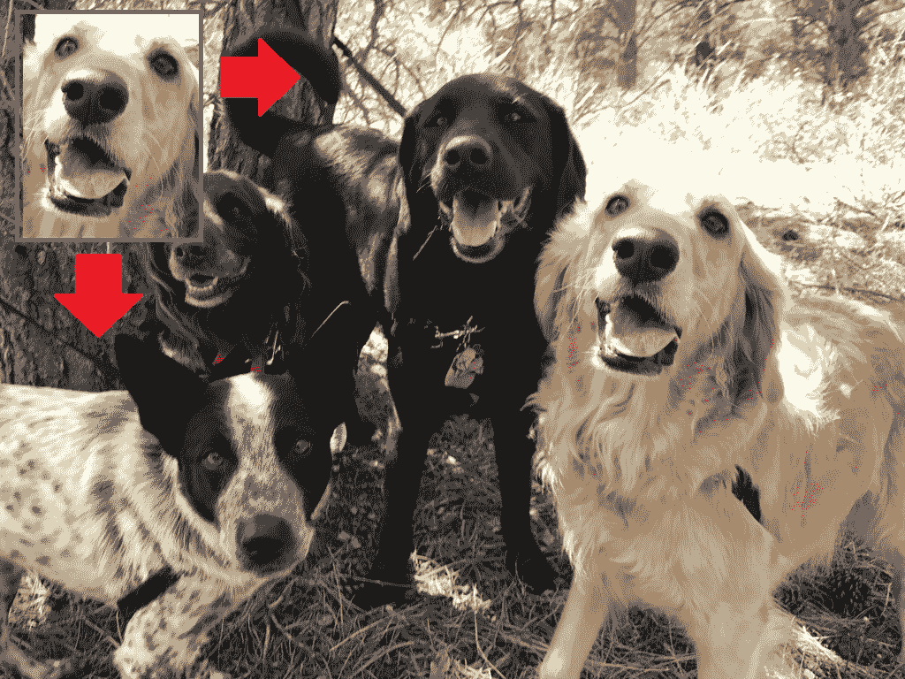
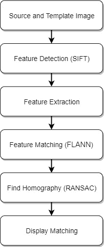
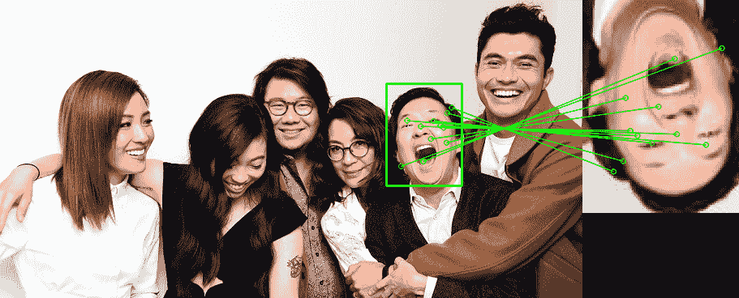

# 基于模板与基于特征的模板匹配

> 原文：<https://medium.datadriveninvestor.com/template-based-versus-feature-based-template-matching-e6e77b2a3b3a?source=collection_archive---------0----------------------->

瑞恩·尼尔·卢斯

模板匹配是人工智能领域的一个重要课题，因为它是解决图像处理中感兴趣区域定位这一基本问题的方法之一。它找到某个物体在给定图像中的位置。它有广泛的应用，如对象检测，跟踪，监视，医学成像和图像拼接。

模板匹配也包括两个主要部分:**源图像**和**模板图像**或补丁。源图像是我们期望在其中找到与模板图像匹配的图片，而模板图像是将与源图像的子图像进行比较的补丁图像。

 [## 挑战你对人工智能和社会看法的 4 本书|数据驱动的投资者

### 深度学习、像人类一样思考的机器人、人工智能、神经网络——这些技术引发了…

www.datadriveninvestor.com](https://www.datadriveninvestor.com/2019/02/28/4-books-on-ai/) 

模板或图像匹配的两种一般分类是基于模板的和基于特征的。**基于模板的方法**，也称为基于区域的方法，在模板对图像没有明显特征时非常有效，因为它们直接作用于像素值。使用图像和模板的强度值来测量匹配。另一方面，当源图像和模板图像包含更多关于特征和控制点的对应关系时，使用**基于特征的方法**。在这种情况下，特征包括点、曲线或曲面模型来执行模板匹配。

**基于模板的方法**

基于模板的方法比基于特征的方法更容易实现。简单的模板匹配包括通过滑动模板图像与源图像进行比较。模板图像从左到右或从上到下一次移动一个像素，以便能够计算与其重叠的补片的相似性的一些数值度量。两幅图像都被转换成二进制图像或黑白图像，然后应用模板匹配技术，如归一化互相关、互相关和平方差和。

基于模板的方法的挑战之一是尺度不变性。源图像或模板图像的尺寸变化会影响算法的性能。解决该问题的一个简单技巧是将模板图像调整到多个比例，然后将其与源图像进行比较。在遍历完所有大小后，取相关系数最大的区域，并将其用作“匹配”区域。然而，这种方法很难解决旋转不变性。在此基础上，金、海和阿劳若、希德内(2007)开发了 Ciratefi 算法，通过改进涉及在每个角度旋转模板图像的蛮力算法来解决旋转问题。Ciratefi 算法比暴力算法快 400 倍，并获得相同的结果。

**基于特征的方法**

边缘和兴趣点等图像特征提供了丰富的图像内容信息。局部特征及其描述符是许多计算机视觉算法的基础。它们的应用包括图像配准、对象检测和分类、跟踪和运动估计。这些特征是每个图像独有的，因此有助于在图像之间进行识别。即使图像的大小和方向发生变化，图像的特征也将保持不变，因此，如果搜索图像中的匹配以某种方式进行变换，则该方法可能证明更有用。如果图像分辨率很高，使用这种方法也更有效。在大的源图像中一次一个像素地滑动你的模板图像，并以不同的比例重复它，这在计算上将是昂贵的。

基于特征的模板匹配包括四个主要步骤。前两步是特征检测和特征提取。SIFT(尺度不变特征变换)和 SURF(加速鲁棒特征)对于检测和匹配特征最有用，因为它们对于尺度、旋转、平移、照明和模糊是不变的。在特征检测和提取之后，下一步是使用近似最近邻快速库(FLANN)进行特征匹配。它包含一组针对大型数据集和高维特征中的快速最近邻搜索而优化的算法。从 FLANN matcher 收集的匹配特征中，基于 Lowe 比率测试选择好的匹配。在过滤特征点之后，下一步是通过随机样本一致性(RANSAC)算法计算单应性。

然而，当图像具有较少的特征或者不同的对象共享相同的特征时，这种方法不能被利用，因为算法将不能在源图像中找到模板。

下面是当模板图像旋转 90°时，基于模板的方法和基于特征的方法的结果。基于模板的方法未能在源中找到模板图像，然而，基于特征的方法成功地找到了它。

图二。基于模板的匹配。

图 3。基于特征的匹配。

#

**立即获得免费的机器人过程自动化(RPA)软件！**

[下载这里](https://www.raxsuite.com/freedownload?utm_source=Medium%20Post&utm_medium=medium&utm_campaign=medium_footer)