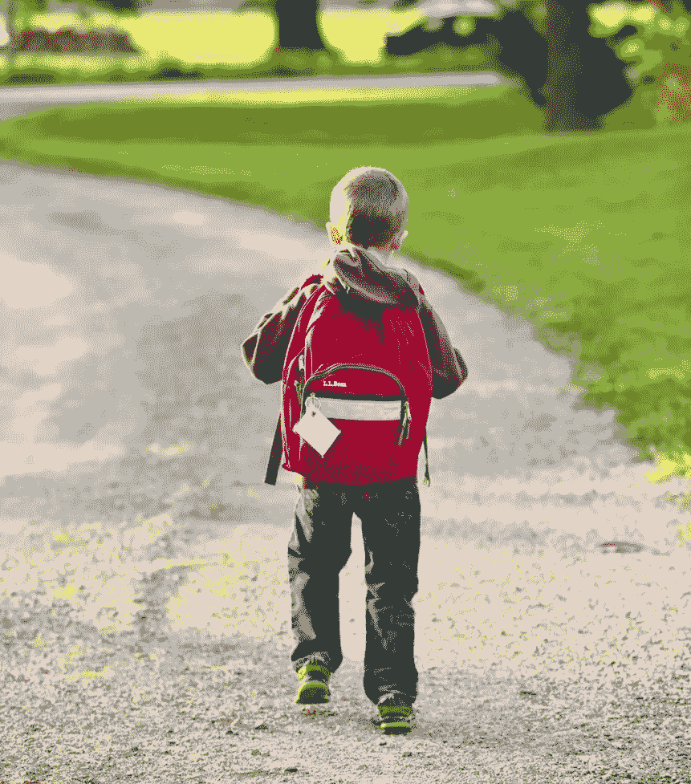

# 养育经济独立快乐的孩子的十课

> 原文：<https://medium.datadriveninvestor.com/ten-lessons-to-raise-financially-independent-and-happy-children-b88241621d13?source=collection_archive---------8----------------------->

犯错误并从中学习变得更强大是生活的本质。让你的孩子经历不理想的结果、错误和挫折。它们是生活提供的最好的课程。让他们在生命的早期经历小剂量的不适和失败，让他们成长为更大、更好、更强、最重要的是独立、更快乐的成年人。

人类是如何被连接起来的，这难道不好笑吗:婴儿不读书或参加课堂课程来学习如何走路。不，他们尝试失败，失败更多，失败更严重，然后突然:哇，看，我的宝贝会走路了！

对父母来说，你的小宝贝开始独立起飞的那一刻可能是最重要的时刻之一。父母没有“教”婴儿如何走路，这只是发生了，我们非常自豪地看到我们的后代站在自己的脚！

当你的孩子学会说话时，同样的过程会再次发生。他们第一次开口时，通常只是随意的咿呀学语，直到有一天他们说:“妈妈”或“爸爸”！然后，在你意识到之前，他们会说“我不喜欢蔬菜！”。孩子们很棒，他们不需要外在的动力。他们知道如何独立地培养自己的技能。看到一个年轻人自己掌握了所有这些技能，这难道不令人惊讶吗？

如果这么简单，为什么有些成年人似乎忘记了该怎么做？？？我们作为成年人，难道不应该通过生活中积累的经验，变得更善于“边做边学”吗？

那么，这里发生了什么？一旦孩子长大，他们往往会变得越来越“社会化”，并适应他们的环境。作为父母，你对他们如何继续学习、成长和“变得”更有影响力。然而，一些父母突然开始禁止他们的孩子玩某些游戏:“你可能会受伤！”并且变得越来越有保护欲，而其他人则随着孩子年龄的增长不断增加他们可能享有的自由。

有多少自由是好的或足够的，这可能有一个细微的界限，这当然也取决于你的孩子。最终，虽然我不是一名训练有素的教师，但我坚信，更多地接触自由的孩子将如何成长为更加自给自足的人，这是有关联的。

A new life is an unwritten book, help your child to write a good one!

好消息是:人类天生好奇，并被设计成终身学习者！

> “最大的风险是不冒任何风险……在一个瞬息万变的世界里，唯一肯定会失败的策略就是不冒任何风险。”
> 
> *——马克·扎克伯格*

**作为父母，你的工作是什么？**

作为父母，你的首要任务是“培养独立的成年人”，他们应该能够自主地驾驭生活及其所有的起起落落。这是你的工作，你的责任，你的 KPI。因此，为了实现这个目标，难道我们不应该想办法让我们的孩子适应尝试和失败、自学和一般的不适吗？如果我们不断地保护我们的后代免受所有“坏事情”的影响，那么我们最终很有可能得不到强壮(足够)快乐的成年人。

Embark on this journey together as a team.

> 作为你的爸爸，我应该给你两样东西……根和翅膀。根是知道你有一个爱你的家庭的安全感和翅膀，这是做任何你想做的事情的信心。”

**怎么做？**

培养对不适的容忍度，鼓励好奇心去尝试、失败、学习和成功，很可能比孩子们在补习班里多呆几个小时更有价值。随着年龄的增长，我们可能会遇到越来越多的不适:被潜在伴侣拒绝、事故、升职被拒、交通堵塞、火车和航班延误，等等。

我们中的一些人经历过这样的人，他们在学校非常成功，但是在以后的生活中却一事无成，因为一旦他们离开了受保护的环境，他们就会被“现实生活击垮”。为了让你的孩子为生活做好准备，帮助他们建立适应力，获得对自己能力的信心，培养无论如何都要不断尝试的渴望，让他们知道即使是大的“错误”他们也能生存下来，并从中吸取教训。

# 1.让他们得到一个糟糕的成绩

成绩不好是好事还是坏事？股市赔钱是坏事吗？嗯……看情况吧！这取决于你从低于预期的成绩中学到了什么。如果一个孩子只是因为父母总是在背后支持而取得好成绩，那么我认为一直取得好成绩是一件坏事！一些父母强迫他们的孩子学习，检查他们的作品，过度编辑他们的作品，这样做，我们就剥夺了孩子的全部经历。试想有一天你可能不在了，帮不上忙，你的学妹怎么办？最好是让他们尝尝现在做得更差的滋味，然后从侧面帮助他们改进。如果我们干预太多，他们将不知道如何应对未来的困境。如果他们学到了这一课，他们也将能够调整自己的行为，以便在以后的生活中最终在股市(以及其他事物)上赚钱。

> *“当你失败时，从中吸取教训。再试一次也没什么不好。”*

# 2.让他们忘记他们的家庭作业，他们的体育课用品，他们的零食盒子

如果你在你的孩子忘记东西的时候帮助他们，他们将不会被适当地激励去建立他们自己的系统去检查和确保他们是否得到了他们今天上学和以后生活所需要的一切。我们帮助得越多，实际上就越让他们明白，没有父母的监督，他们是无法管理的。这并不令人鼓舞。从现在开始把手拿开！

Not everything works out as planned in life. Get your kids ready to deal with it!

# 3.让他们把钱花光…或者甚至提供贷款给他们

教你的孩子理财知识应该在他们拿到第一份工资之前就开始。它必须从自身的教训开始。每隔一段时间给你的孩子零用钱，开始是每周一次，然后是每两周一次，最后是每月一次。此外，帮助他们制定预算，这样他们就可以计划和学习如何自己保留一些钱，而不是马上花掉。如果他们的预算包括外出就餐，简单地让他们从家里打包午餐，而不是让步和保释。

最终，你的孩子没钱了，不停地唠叨，要求你立即注入额外的现金，你可以做一些非常强大的事情:提供贷款！是的，一笔该死的贷款。就我而言，我父亲在我 8 岁的时候给了我一笔贷款。有一个我非常想要的玩具，但是我缺少大约 50 美元。我父亲给了我一笔无息贷款。我不得不承诺过段时间会还的。虽然我仍然记得买下我的玩具时我是多么兴奋，但我永远也忘不了在接下来的六个月里每周支付 2 美元，而我妹妹却继续领取每周零用钱的感觉。结果，我开始不喜欢那个玩具，我再也没有贷款，直到后来我们买了房子。

> *“障碍迫使你成长。平静的大海造就软弱的水手。”*

# 4.让他们迟到吧

和金钱一样，时间也需要预算。在以后的生活中，没有人会叫醒他们并确保他们准时。如果可以，让他们自己醒来——你可以为此给他们买一个好的闹钟或收音机。与他们讨论他们应该做什么，如何管理它，然后观察他们尝试并找出答案。如果合适的话，让他们自己解决上学的问题。万一他们迟到了，如果需要的话，确保他们用自己的钱支付出租车费，或者要求一系列的杂务来偿还你，以防你需要开车送他们去学校。

Let your kid seize the day.

# 5.让他们错过一个重要的截止日期

如果有对他们非常重要的事情:不要一遍又一遍地提醒他们临近的截止日期。让你的孩子错过某些小事，并了解其后果。想象一下他们只有在年轻的时候才会明白这一点。我相信你们大多数人在自己的旅途中都会错过截止日期。这让你感觉如何？最有可能的是，它让你生气，并以某种方式激励你建立某些系统来防止它再次发生。

确保你的孩子有和你一样的机会来学习这宝贵的一课！

# 6.让他们使用公共交通工具，最终让他们迷路，并在不使用时体验成就感

这部分或多或少适用，取决于你住在哪里。某些地方有非常安全可靠的公共交通系统。其他人没有。如果你对公共交通系统和你孩子的年龄感到满意:让他们冒险出去吧！也许在他们第一次尝试的时候和他们一起骑车，但是作为他们的同伴，而不是他们的父母。让他们告诉你如何支付乘车费用，在哪里下车，如何看地图，还要一起去一个你以前没去过的地方。度假的时候在国外城市也试试这个。后来，就让他们自己去了。对于孩子来说，在城市中漫游有一种巨大的独立感，如果他们迷路了，他们会从中学到更多。

当我接近六岁的时候，我被告知六岁以下的孩子仍然可以免费乘坐整个城市。我从这些信息中得到的启示是:很快我就要付钱了！因此，我想利用仍然能够免费乘坐的优势。和我的小妹妹以及我最好的朋友一起，我们乘公共汽车开始了下午的城市探索之旅。不知何故，我们没有通知我们的父母。当我们回来时，我们的父母是如此担心，又是如此如释重负。直到今天，我们仍然对那次远足有着珍贵而自豪的记忆。

It’s time to explore!

> “生活的收缩或扩张与一个人的勇气成正比。”

# 7.如果他们错过了洗衣篮或者他们没有洗衣服，让他们穿有臭味的衣服

这节课背后的目的是我们希望我们的孩子离家后能自给自足。在某个时间点，他们无论如何都得自己洗衣服，所以为什么不让他们帮你做家务呢？你会惊讶有多少年轻人自己不知道如何做这项工作！能够做到这一点，不仅会让他们更欣赏你做的这部分家务，还会让他们成长为学生时代更好的室友，以及以后生活中更好的伙伴。

> *“要想在生活中获得成功，你需要三样东西:愿望、骨气和幽默。”*

# 8.让他们为自己做了不友善或不诚实的事情而感到羞耻

不要在不好的事情发生后马上去安慰你的孩子，而是给他们一些时间来消化这种情况。此外，让他们经历他们内心的整个情绪火花，他们应该发展阅读他们的情绪的技能，并理解他们的行为或不行为的全部后果。你可以通过承认你孩子的感受来帮助他们，但是不要让他们因为他们做得太快而逃脱责任。帮助他们思考他们的行为是如何造成这种情况的，以及他们的感受。询问他们计划如何避免类似情况再次发生。

# 9.让他们留下未完成的作业

是的，那是你可以考虑做的事情。你的孩子在学校可能看起来很糟糕，但是，这是最重要的。我认为让他们错过一次家庭作业比在某一天完成家庭作业更有价值。确保他们会在学校感受到没有尽到责任的后果。这可能是你最后一次担心他们的作业了。

如果孩子们需要上网或其他资源来完成他们的作业，如果你已经设定了每天使用互联网的上限，不要再通过允许更多的互联网来保释他们，以防他们已经用光了互联网来满足他们的私人嗜好。这将教会他们更有效地使用他们的资源，他们也必须把这一部分告诉他们的老师。这将是令人尴尬的，因此另一个教训值得一去。

# 10.让他们为自己设定一个目标，如果他们不能实现目标，不要干预

如果你的孩子有一个大的梦想，帮助他们把它分解成小的步骤，告诉他们为了让他们的梦想成真，首先需要实现什么。这可以是任何事情，比如学习一项新技能，攒钱买更大的东西，在一门学科上取得一定的成绩，或者加入某个体育班或队。作为父母，你可以通过一个计划来帮助他们，但是让他们自己去执行。

当我快 14 岁的时候，我非常想要一台电视放在我自己的卧室里。我爸爸很快扭转了局面，告诉我如果我能挣到买电视的钱，他会很乐意让我拥有它。两周后，我每周两次向 400 户家庭分发报纸，无论下雨、晴天还是下雪，都必须完成。经过三个月的努力，我终于可以买电视机了。是的，你可能已经猜到了，几个月后，当我感觉到所有的工作时间都花在了一件东西上时，买家后悔了。我真的很感激在这么早的时候就学到了这一课。

You’re given this one life, what is it that you want to do with it?

> 目标只是有期限的梦想

与其告诉孩子们如何生活，不如让他们过自己的生活，并在旅途中指导他们。让他们看看。让他们去做，去尝试，去失败，去学习。然后，让他们知道他们的行为或不行为是如何导致每一种情况的最终结果的。表扬好的东西，也强调需要改进的地方。反思不好的东西，鼓励他们再试一次。告诉他们你对他们迄今为止的进步感到多么自豪。在他们经历过之后[而不是之前]，与他们分享你自己的经历。告诉他们，看到他们努力不放弃自己的梦想，你是多么自豪。本质上:做你孩子的教练，而不是他们的保姆！

> *“想象力是你头脑的作坊，能够将思维能量转化为成就和财富。”*

说完，我就让你自己去试试吧！我很乐意阅读你作为孩子、父母、老师、顾问或教练的亲身经历，了解你是如何学习并变得更大、更好、更强的！学习是一生的事情，我甚至相信以上的教训不仅仅适用于孩子。

如果你喜欢这篇文章，请不要忘记在[脸书](https://www.facebook.com/financialimagineer/)或[推特](https://twitter.com/FI_imagineer)上分享和喜欢财经幻想家。

祝你一切顺利，并愉快地将你的经验和知识传授给下一代！

马特(男子名ˌ等于 Matthew)

*原载于 2019 年 9 月 24 日*[*http://www.financial-imagineer.com*](http://www.financial-imagineer.com/2019/09/24/ten-lessons-to-raise-financially-independent-and-happy-children/)*。*