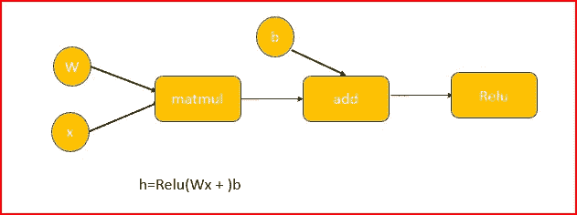
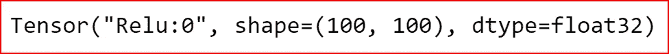
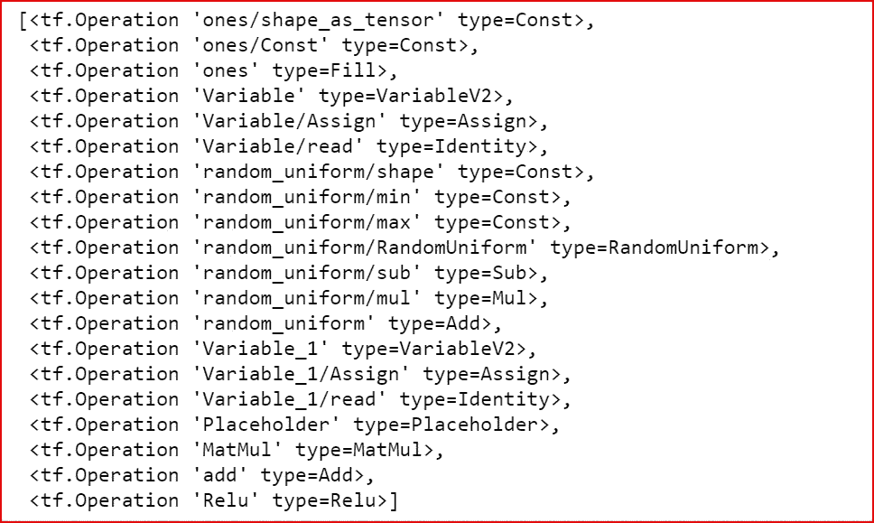
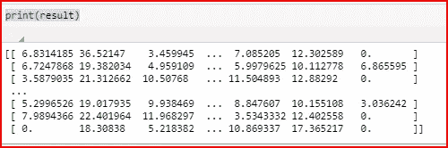

# 张量流基础

> 原文：<https://medium.datadriveninvestor.com/tensorflow-basics-6377a6043d93?source=collection_archive---------4----------------------->

[](http://www.track.datadriveninvestor.com/1B9E)

在这篇文章中，我们将了解什么是张量、数据流图，然后我们将讨论会话、变量、占位符，最后使用张量流构建一个图并执行它。


## 什么是张量流？

*   TensorFlow 是开源的机器学习框架，使用张量进行计算。
*   它是由谷歌大脑团队开发的。
*   TensorFlow 运行在多个 CPU 和 GPU 上
*   张量流计算使用数据流图

*让我们了解什么是张量，数据流图如何用于计算*

## 张量是什么？

*   张量是张量流用于所有计算的数据结构
*   张量是 n 维数组或列表
*   张量的每个元素都是相同的数据类型，如 float32、float64、int32、int64 等
*   张量的数据类型总是已知的
*   张量的值是不可变的，除了 ***tf。变量*** 。
*   在单次执行的上下文中，张量只能有一个值，但是当我们对同一个张量求值两次时，我们会得到不同的值

【Tensorflow 如何利用张量进行 n 维数据的计算？

## 数据流图

数据流是并行计算的通用编程模型。Tensorflow 通过数据流图表达数值计算。

**图形节点**是数学运算，可以接受任意数量的输入并生成单个输出。

**图边**是在图节点之间流动的张量。

**数据流图是 Tensorflow 的基础设施或主干，在这里我们将复杂的计算分解为更小的简单操作**

*例如，matmul 运算是一个单节点，它接受两个输入 W(权重)和 x(输入)。加法运算从 matmul 和偏置项 b 获取输入，我们将 Relu 作为非线性激活函数应用于线性输入。*



Dataflow graph for computing a single hidden layer in a neural network

*tensor flow 为什么要用数据流图？*

数据流图为 Tensorflow 提供的优势有

*   **并行计算:** Tensorflow 用边来表示运算之间的依赖关系。这有助于找到可以并行运行的操作
*   **分布式执行:**由于操作可以并行执行，我们可以将计算分配给多个 CPU 和 GPU
*   **可移植性:**数据流是独立于语言的，所以我们可以用 python 创建数据流图，用 C++代码保存和恢复它。

## **变量**

*   在我们的例子中，b 和 W 是变量。它们是可以调整的模型参数
*   变量是有状态的节点。它们在图形的多次执行中保持其当前值
*   变量可以共享，也可以持久化
*   使用 ***tf 操纵变量。变量*类**类

## 占位符

*   占位符是节点，其值在执行时馈入数据流图。
*   占位符可以是输入或标签
*   x 是我们示例中的输入，它将在执行时被输入到图形中
*   我们有一个输入占位符，用于指定输入的数据类型和形状。这有助于 graph 了解如何在没有输入值的情况下进行计算
*   占位符的值将在执行时指定

我们如何运行数据流图？

我们使用会话来执行图形或图形的一部分

## 会议

*   会话在多个 CPU 和 GPU 上分配资源来执行图形
*   会话保存实际计算的值和变量
*   变量值仅对会话有效。
*   我们可以在多个会话中使用图形

现在我们有了基础知识，让我们开始使用张量流进行编码

*让我们写一个简单的代码来计算一个隐藏层的输出。*

我们将随 TensorFlow 一起导入基本库

```
import numpy as np
import tensorflow as tf
```

我们创建变量 W 和 b。

b 是偏置项，它是 1 的张量，W 是-1 和 1 之间的随机均匀分布

```
**b = tf.Variable(tf.ones(100,))
W = tf.Variable(tf.random_uniform(shape=(784,100), minval=-1, maxval=1))** 
```

为输入 x 创建占位符。占位符仅接受数据类型 float32，形状为(100，784)

```
**x = tf.placeholder(dtype=tf.float32, shape=(100,784))** 
```

我们现在计算 h

```
**h = tf.nn.relu(tf.matmul(x, W) + b)**
```

让我们打印 h，我们还没有看到 h 的任何值

```
print(h) 
```



print(h)

我们没有获得任何值，因为我们只创建了图形，没有为输入 x 提供任何值。输入 x 只是一个占位符。

我们可以显示将用于计算的图形。TensorFlow 抽象出创建图形的所有细节。

```
**tf.get_default_graph().get_operations()** 
```



tf.get_default_graph().get_operations()

我们需要使用一个会话来执行图形。

因为我们正在使用变量，我们需要首先使用***initialize _ all _ Variables()***初始化全局变量

```
**init = tf.initialize_all_variables()** 
```

我们现在创建一个会话，这是我们需要运行图形的执行环境。

TensorFlow 使用惰性求值，这意味着求值仅在会话运行时进行

我们输入 x，这是一个字典。它将图形节点映射到实际值

```
with tf.Session() as sess:
    sess.run(init)
    result=sess.run(h, feed_dict={x:np.random.random(size=(100,784))}) 
```

让我们打印结果

```
print(result)
```



这篇文章将帮助你开始学习 TensorFlow。在接下来的文章中，我们将使用 TensorFlow 探索 DNNRegressor 和 DNNClassifier

# 如果你喜欢这篇文章，请分享并鼓掌！

## 参考资料:

第七讲:[张量流介绍](https://www.youtube.com/watch?v=PicxU81owCs)(斯坦福)

[https://www.tensorflow.org](https://www.tensorflow.org/guide/graphs)