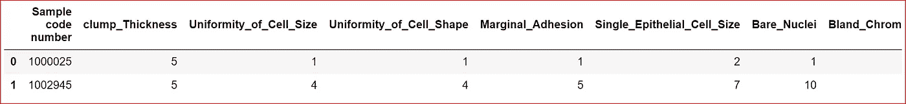
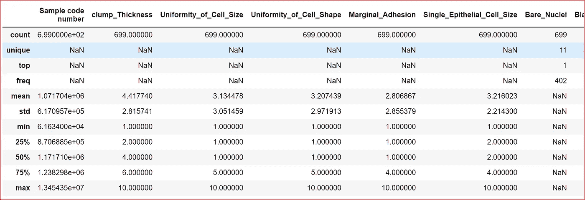
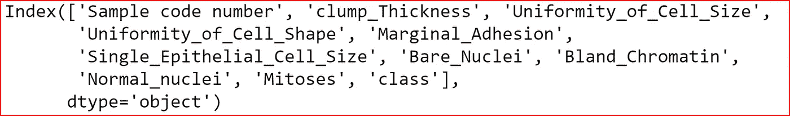
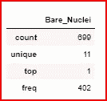
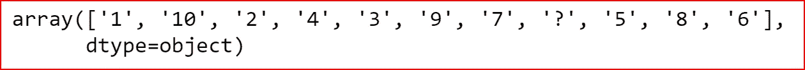
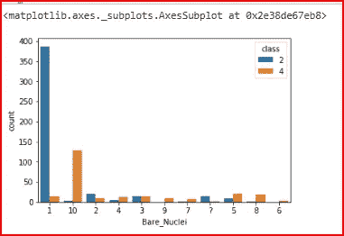
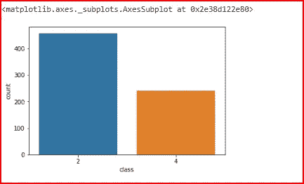
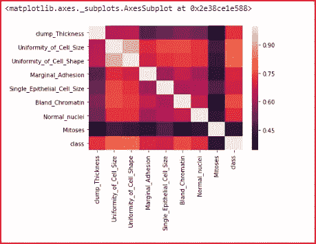
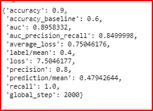
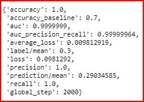

# 张量流:dnn 分类器

> 原文：<https://medium.datadriveninvestor.com/tensorflow-dnnclassifier-4e68df3df00?source=collection_archive---------0----------------------->

[](http://www.track.datadriveninvestor.com/1B9E)

在本帖中，我们将使用 TensorFlow 的 DNNClassifier 创建程序。我还将提到我在开发该程序时面临的一些问题。

## 先决条件:

[评估模型的性能](https://medium.com/datadriveninvestor/how-to-evaluate-the-performance-of-a-machine-learning-model-45063a7a38a7)

[梯度下降](https://medium.com/datadriveninvestor/gradient-descent-5a13f385d403)

[张量流基础知识](https://medium.com/datadriveninvestor/tensorflow-basics-6377a6043d93)

[使用张量流的 dnn 解算器](https://medium.com/datadriveninvestor/linear-regression-using-tensorflow-estimator-9aa570914375)

## 数据集:

[乳腺癌威斯康星州(原始)数据集](https://archive.ics.uci.edu/ml/datasets/Breast+Cancer+Wisconsin+%28Original%29)


在这个数据集中，我们有两个类。值 2 表示癌细胞是良性的，值 4 表示癌细胞是恶性的

我们将执行以下步骤:

1.  导入所需的库
2.  将数据从文件读入数据集
3.  分析数据以理解特征的类型、分类变量的唯一值以及不同变量之间的关系
4.  创建输入要素和目标变量或标签
5.  处理空值
6.  缩放数字输入要素
7.  使用标签编码器对标签进行编码
8.  将数据集分为训练集和测试集
9.  将输入要素转换为数值和分类变量的张量
10.  定义功能列
11.  创建用于培训和评估的输入函数
12.  使用 DNNClassifier 创建模型
13.  训练模型
14.  评估模型

*系好安全带，我将带你经历一次平稳的旅程，然后解释我遇到的挑战以及我是如何将颠簸的旅程变得平稳的*

## 导入所需的库

```
import numpy as np
import pandas as pd
import tensorflow as tf
import matplotlib.pyplot as plt
import seaborn as sns
%matplotlib inline
```

## 将数据读入数据集

我已经下载了数据并存储在 D:\ML-Data 文件夹中，文件名为 cancer.csv

```
dataset = pd.read_csv("D:\\ML-Data\cancer.csv")
```

## 分析数据

在这里，我们将探索数据

第一步是打印示例行并检查列

```
dataset.head(2)
```



描述数据集中的不同要素，以了解要素的类型。

```
dataset.describe(include='all')
```



打印数据集中的所有列

```
dataset.columns
```



我们看到裸核是一个分类变量，因此我们分析了该变量，发现该变量最常见的值是 1。我们还观察到，我们有一些空数据需要处理，作为裸核变量数据预处理的一部分

```
dataset.describe(include=['O'])
```



我们现在检索分类变量裸核的唯一值

```
dataset['Bare_Nuclei'].unique()
```



绘制裸核的计数图

```
sns.countplot(data=dataset, x='Bare_Nuclei')
```


我们检查裸核是否对癌症检测有影响

```
sns.countplot(data=dataset, x='Bare_Nuclei', hue='class')
```



## 创建输入要素和目标变量

样本代码编号只是一个唯一的编号，与预测无关，因此我们从输入要素中删除了该列。

**Class 是我们的目标变量**。值 2 表示良性，值 4 表示恶性。

```
x= dataset.drop(['Sample code number','class' ], axis=1)
y= dataset['class']
```

让我们检查目标变量的分布

```
sns.countplot(data=y, x='class')
```



我们需要创建一个热图来了解数字输入要素如何与目标变量相关联，因此我们创建了一个包含所有数字变量的数据集，并删除了分类变量 Bare Nuclei

```
x_subset= x.drop(['Bare_Nuclei'],axis=1)
sns.heatmap(x_sample.corr())
```



我们可以观察到有丝分裂对癌症检测有重大影响。

## 处理空值

我们前面看到，裸核有一些零值，1 是最常见的值。我们用最常见的值替换空值来处理缺失的数据。

```
x['Bare_Nuclei']=x['Bare_Nuclei'].replace('?',1, inplace= True)
```

## 缩放数字输入变量

我们使用最小最大缩放器缩放数值输入变量。我们也可以使用 StandardScaler 进行缩放。

```
from sklearn.preprocessing import StandardScaler, MinMaxScaler
sc= MinMaxScaler()
x_sc= sc.fit_transform(x_subset)
```

我们现在对目标变量进行编码。

如果我们不对目标变量进行编码，那么我们将会得到一个错误

```
**Error:InvalidArgumentError (see above for traceback): assertion failed: [Labels must <= n_classes - 1]**
```

编码目标变量

```
from sklearn.preprocessing import LabelEncoder
lbl_encoder = LabelEncoder()
y= lbl_encoder.fit_transform(y)
```

## 将数据集分为训练集和测试集

我们将数据集分为训练数据和测试数据

```
from sklearn.model_selection import train_test_split
x_train, x_test, y_train, y_test= train_test_split(x,y, test_size=0.3)
```

## 将原始输入要素转换为密集张量

我们需要转换构成输入特征的数字和分类变量。

**将数值变量转换成稠密张量**

```
clump_thickness = tf.feature_column.numeric_column('clump_Thickness')uniformity_cell_size = tf.feature_column.numeric_column( 'Uniformity_of_Cell_Size')uniformity_cell_shape = tf.feature_column.numeric_column('Uniformity_of_Cell_Shape')marginal = tf.feature_column.numeric_column('Marginal_Adhesion')single_epithelial_cell_size= tf.feature_column.numeric_column('Single_Epithelial_Cell_Size')bland= tf.feature_column.numeric_column('Bland_Chromatin')normal= tf.feature_column.numeric_column('Normal_nuclei')mitosis = tf.feature_column.numeric_column('Mitoses')
```

**将分类变量转换为张量。**

对于分类列，我们将使用嵌入列将稀疏数据输入 DNN。

我们没有将数据表示为多维的稀疏向量，而是使用**嵌入列**将数据表示为包含任意数字的低维向量，而不只是稀疏向量中的 0 或 1。

这允许我们对每个单元格使用不同的数字，与稀疏向量相比，嵌入列包含的单元格要少得多

嵌入的大小是基于列裸核中唯一值的数量来计算的。在我们的例子中，嵌入的大小是 2

```
import math
embedding_size= 11 **0.25
```

为了转换分类列 Bare Nuclei，我们需要一个稀疏的整数列，因此我们传递列名和词汇表的大小。

```
Bare_Nuclei= tf.contrib.layers.sparse_column_with_hash_bucket('Bare_Nuclei', hash_bucket_size=20)
```

为了创建 embedding_column，我们传递稀疏向量，并且维度是稀疏向量将被转换成的较低维度

```
Bare_Nuclei= tf.contrib.layers.embedding_column(sparse_id_column=Bare_Nuclei, dimension=2)
```

## 定义功能列

现在我们已经将所有输入要素转换为密集张量，我们创建要素列

```
feature_col=[clump_thickness,uniformity_cell_size, uniformity_cell_shape, marginal, 
             single_epithelial_cell_size,  bland, normal, mitosis, Bare_Nuclei]
```

## 创建用于培训和评估的输入函数

为了创建用于训练和评估的输入函数，我们需要将输入转换为数据集。

***TF . data . dataset***类提供了更好地为训练准备数据的方法。它通过从数组中提取切片来实现这一点。最简单的方法是从 **tf.data** 开始

**TF . data . dataset . from _ tensor _ slices**函数创建数组的切片。该数组在第一维上被切片

```
def train_input_fn():
    dataset = tf.data.Dataset.from_tensor_slices((dict(x_train), y_train))
    dataset = dataset.shuffle(1000).repeat().batch(10)
    return dataset
```

***TF . data . dataset . shuffle***方法使用固定大小的缓冲区在项目通过时对其进行混洗。buffer_size 大于数据集中的示例数，确保数据完全混洗。

***TF . data . Dataset . repeat***方法在数据集到达末尾时重新启动数据集。

***TF . data . dataset . batch***方法收集大量的例子，并将它们堆叠起来，创建批处理。

评估输入函数使用测试数据，而输入函数使用训练数据

```
def eval_input_fn():
    dataset = tf.data.Dataset.from_tensor_slices((dict(x_test), y_test))
    return dataset.shuffle(1000).repeat().batch(10)
```

## 使用 DNNClassifier 创建模型

对于 DNNClassifier，我们使用学习率为 0.01 的 Adam 优化器

```
optimizer_adam= tf.train.AdamOptimizer(learning_rate=0.01)
```

我们创建了具有三个隐藏层的 DNNClassifier，第一和第二隐藏层具有 9 个单元，第三隐藏层具有 3 个单元。我们将特征列作为所有输入特征进行传递

```
model=tf.estimator.DNNClassifier([9,9,3], feature_columns=feature_col,  optimizer=optimizer_adam)
```

## 训练模型

现在，我们通过传递为训练和步骤创建的输入函数来训练模型。Steps 是我们要训练模型的步数。

```
model.train(input_fn=lambda: train_input_fn(), steps=2000)
```

## 评估模型

为了评估模型，我们传递包含测试数据的评估输入函数

```
eval_results = model.evaluate(input_fn=eval_input_fn, steps=1)
```

我们检查测试数据的度量。

```
eval_results
```



evaluation when using MinMaxScaler



evaluation when using StandardScaler

## **参考文献:**

[](https://www.tensorflow.org/guide/datasets_for_estimators) [## 估计器数据集|张量流

### 该函数首先使用 TF . data . dataset . from _ tensor _ slices 函数创建 atf.data.Dataset 来表示…

www.tensorflow.org](https://www.tensorflow.org/guide/datasets_for_estimators) 

[https://www.tensorflow.org/guide/premade_estimators](https://www.tensorflow.org/guide/premade_estimators)