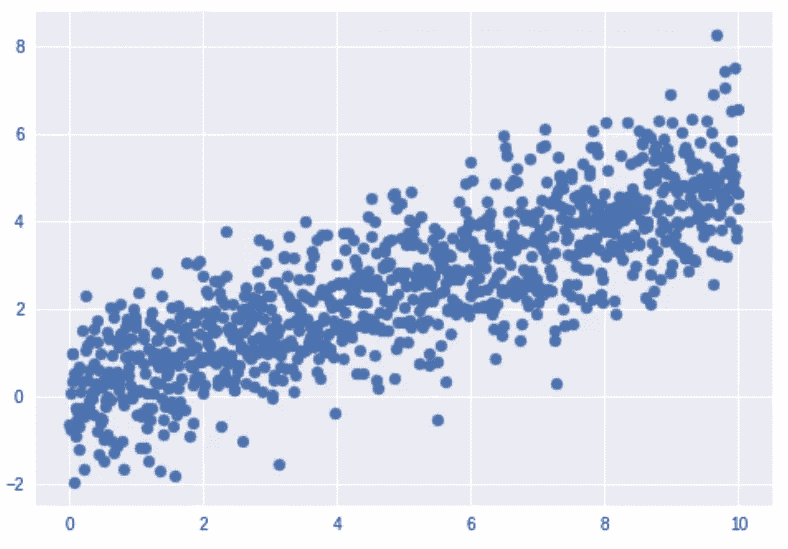
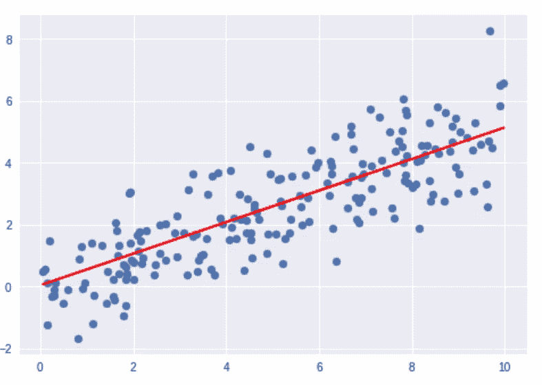
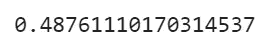
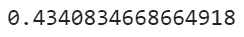
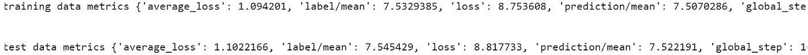

# 张量流估计器 API:那到底是什么？我们如何使用它？

> 原文：<https://medium.datadriveninvestor.com/tensorflow-estimator-api-what-in-the-world-is-that-how-do-we-use-it-70baaeeb597d?source=collection_archive---------9----------------------->

[](http://www.track.datadriveninvestor.com/1B9E)

Photo by [Clément H](https://unsplash.com/@clemhlrdt?utm_source=medium&utm_medium=referral) on [Unsplash](https://unsplash.com?utm_source=medium&utm_medium=referral)

你好。

好吧，欢迎来到这个听起来像是极客的诱饵的帖子。

无论如何，在我们开始评估 API 之前，让我们使用 Tensorflow 做一个简单的线性回归。

我们所做的是生成数据 X 和 Y，分成训练集和测试集，然后对训练集进行梯度下降。最后，我们预测 y _ 预测值。

对照实际 Y 测试值检查预测值，以检查准确性。

```
*# General imports* **import** numpy **as** np
**import** tensorflow **as** tf
**import** matplotlib.pyplot **as** plt

*# Generating data* X = np.linspace(0,10, 1000).reshape(1000,1) 
*# adding some noise to this* noise = np.random.randn(1000,1)

y = 0.5*X + noise

*# Splitting into test and training sets* **from** sklearn.model_selection **import** train_test_split
X_train, X_test, Y_train, Y_test= train_test_split(X, y, test_size=0.2, shuffle=**True**)

np.random.seed(101)
tf.set_random_seed(101)

*# creating initial weights* m = tf.Variable(np.random.randn(), name=**'m'**)
c = tf.Variable(np.random.randn(), name=**'c'**)

*# creating tensorflow operations* x_ph = tf.placeholder(tf.float32)
y_ph = tf.placeholder(tf.float32)

*# Creating the error operation* N = X_train[0]

y_hat = tf.add(tf.multiply(x_ph,m),c)
error = tf.reduce_sum(tf.square(y_ph - y_hat))/2*N

*# applying optimizer* train = tf.train.GradientDescentOptimizer(learning_rate=0.001).minimize(error)

*# Running the gradient descent* batch_size = 10
init = tf.global_variables_initializer()

**with** tf.Session() **as** sess:
    sess.run(init)
    epoch = 1000
    **for** i **in** range(epoch):
        random_index = np.random.randint(len(X_train), size=batch_size)
        sess.run(train, feed_dict={x_ph: X_train[random_index],
                                   y_ph: Y_train[random_index]})

    model_m, model_c = sess.run([m, c])  

y_test_hat = model_m*X_test + model_c
*# Checking accuracy (visual)* y_test_hat = model_m*X_test + model_c

plt.scatter(X_test, Y_test)
plt.plot(X_test, y_test_hat, **'r'**)
plt.show()

*# Checking accuracy* **from** sklearn.metrics **import** r2_score
print(r2_score(y_test_hat, Y_test))
```

**输出:**



(left)The generated data (right)Y prediction values



Accuracy score with the dataset using tensorflow

```
*# General imports* **import** numpy **as** np
**import** tensorflow **as** tf
**import** matplotlib.pyplot **as** plt

*# Generating data* X = np.linspace(0,10, 1000).reshape(1000,1) 
*# adding some noise to this* noise = np.random.randn(1000,1)

y = 0.5*X + noise

*# Splitting into test and training sets* **from** sklearn.model_selection **import** train_test_split
X_train, X_test, Y_train, Y_test= train_test_split(X, y, test_size=0.2, shuffle=**True**)*# trying with simple ML* **from** sklearn.linear_model **import** LinearRegression
regressor = LinearRegression().fit(X_train, Y_train)

*# predicting* y_pred = regressor.predict(X_test)

**from** sklearn.metrics **import** r2_score
print(r2_score(y_pred, Y_test))
```



Accuracy score with the dataset using sklearn

现在，tensorflow 的使用是非常低级的编码，使用 sklearn 会产生非常糟糕的结果，因此，为了使用 tensorflow 并利用像 sklearn 这样的预建 API，我们使用 estimator API。

Estimator API 是在 tensorflow 之上使用的高级 API，能够对最常见的密集神经网络和简单的回归和分类网络进行编码。

编码也更容易。

```
*# General imports* **import** numpy **as** np
**import** pandas **as** pd
**import** tensorflow **as** tf
**import** matplotlib.pyplot **as** plt

*# Generating data* X = np.linspace(0,10, 1000).reshape(1000,1) 

*# adding some noise to this* noise = np.random.randn(1000,1)

y = 0.5*X + noise

feat_col = [tf.feature_column.numeric_column(**'X'**, shape=[1])]

*# setting up estimator* estimator = tf.estimator.LinearRegressor(feature_columns= feat_col)

*# Splitting into test and training sets* **from** sklearn.model_selection **import** train_test_split
X_train, X_test, Y_train, Y_test= train_test_split(X, y, test_size=0.2, shuffle=**True**)

*# creating input, train and test estimators* input_func = tf.estimator.inputs.numpy_input_fn({**'X'**:X_train}, Y_train, batch_size=10,num_epochs=1, shuffle=**True**)

train_input_func = tf.estimator.inputs.numpy_input_fn({**'X'**:X_train}, Y_train, batch_size=10, num_epochs=1, shuffle=**False**)test_input_func = tf.estimator.inputs.numpy_input_fn({**'X'**:X_test}, Y_test, batch_size=10, num_epochs=1, shuffle=**False**)

*# training the estimator* estimator.train(input_fn=input_func, steps=1000)

train_metrics = estimator.evaluate(input_fn=train_input_func, steps=1000)
test_metrics = estimator.evaluate(input_fn=test_input_func, steps=1000)

print(train_metrics)
print(**'\n'**)
print(test_metrics)
```



Estimator API output

步骤很简单:

1.  创建功能列
2.  创建评估者模型类型
3.  创建输入函数
4.  培训评估人员
5.  评估训练集
6.  评估测试集

你坚持到了最后。

谢谢你的阅读。