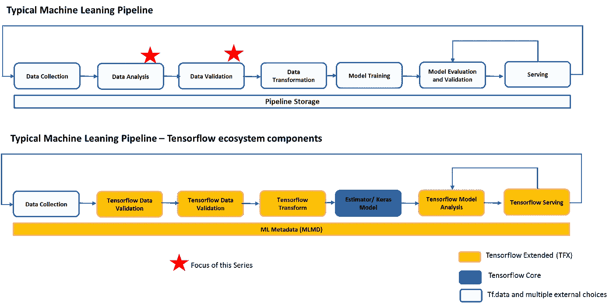
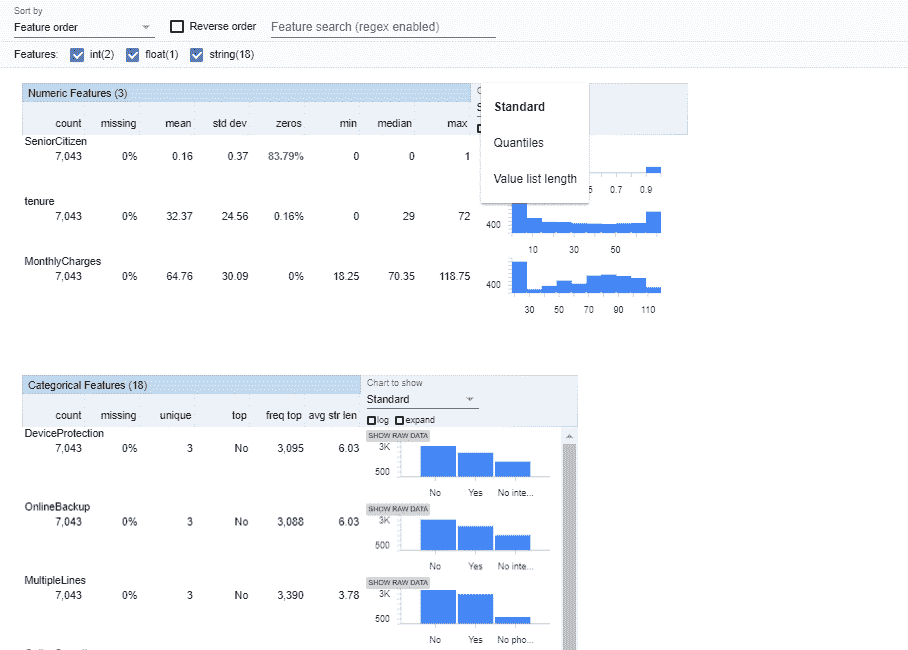
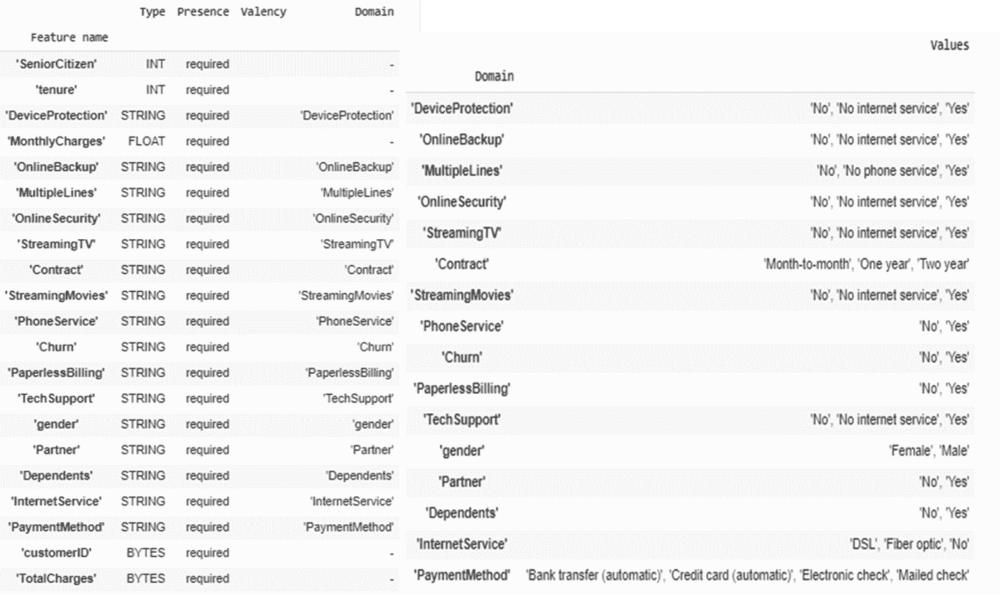
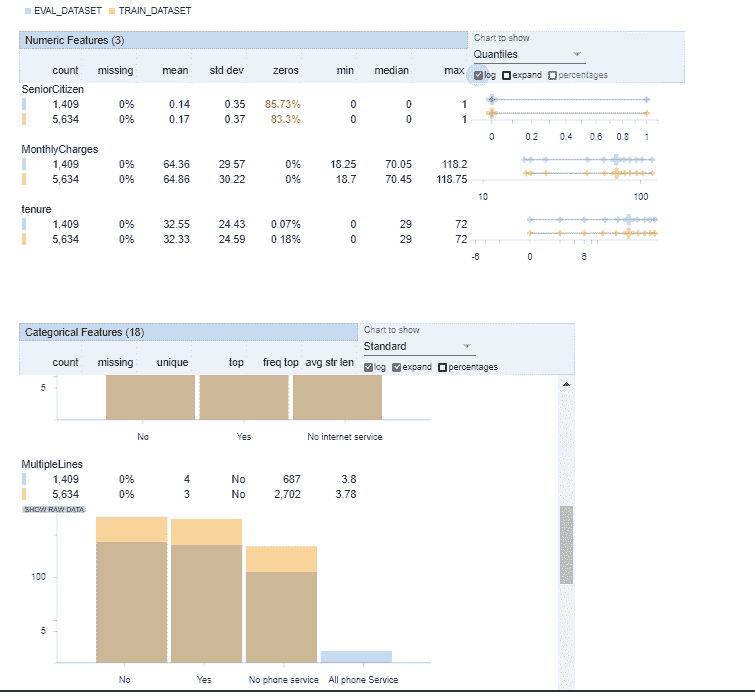
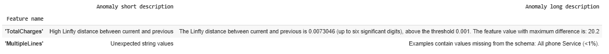

# Tensorflow Extended (TFX) —数据分析、验证和漂移检测—第 2 部分

> 原文：<https://medium.datadriveninvestor.com/tensorflow-extended-tfx-data-analysis-validation-and-drift-detection-part-2-6a9c5f8c6210?source=collection_archive---------3----------------------->

[](http://www.track.datadriveninvestor.com/1B9E)

在上一篇文章中，我们详细介绍了 Tensorflow 和 Tensorflow Extended (TFX)如何提供开发和部署端到端 ML 管道的功能。如果您错过了阅读本系列的第 1 部分，下面是我的文章的链接

第 1 部分的快速回顾...

模型算法和训练是整个端到端机器学习生命周期中相对较小的一部分。数据收集、数据工程、数据分析和验证、特征工程、模型性能监控和部署模型是典型的数据工程师+数据科学家花费 90%以上时间的工作

[](https://www.datadriveninvestor.com/2019/03/03/editors-pick-5-machine-learning-books/) [## DDI 编辑推荐:5 本机器学习书籍，让你从新手变成专家——数据驱动…

### 机器学习行业的蓬勃发展重新引起了人们对人工智能的兴趣

www.datadriveninvestor.com](https://www.datadriveninvestor.com/2019/03/03/editors-pick-5-machine-learning-books/) 

今天大多数深度学习框架只关注模型训练。Tensorflow 及其生态系统涵盖了上述整个 ML 生命周期

在 TFX 系列的第二部分中，我们将重点关注 Tensorflow 数据验证(TFDV)组件。在以后的系列文章中，我们将讨论张量流变换和张量流模型分析

如果你想直接进入代码，Github repo 的链接在本文末尾

Tensorflow 数据验证(TFDV)是一个用于分析、可视化和验证用于机器学习模型的数据的库。TFDV 提供了对数据分析过程中 3 个关键问题的见解

*   我的数据有什么特征？我的数据看起来如何？
*   数据有错误吗？
*   数据是否从基础假设而不是模型训练的基础上发展而来(漂移)？

特别是关于漂移，我想强调几个重要的概念。

随着时间的推移，数据和业务不断发展，导致最具预测性的模型也越来越不准确。机器学习生命周期不会随着部署而结束，而是需要在部署后进行持续的模型监控和数据监控。根据业务流程中潜在假设变化的速度，模型必须频繁地重新校准和部署。

以金融欺诈检测为例，欺诈者的创新速度比银行更快。EMV 芯片的引入确实减少了卡存在欺诈，但欺诈者很快将他们的欺诈转移到网上或卡不存在渠道。在欺诈检测的情况下，与识别员工流失的模型相比，模型可能需要频繁的重新校准。

> 在数据驱动方法中，像对待代码一样对待数据。尽早发现错误至关重要

数据科学家需要担心的一个关键方面是识别概念漂移，即数据随时间发生不可预测的变化。如果你需要更多关于概念漂移的细节，请查看下面的维基链接

[https://en.wikipedia.org/wiki/Concept_drift](https://en.wikipedia.org/wiki/Concept_drift)

数据科学家需要了解一个方面是区分异常漂移和自然漂移。数据中的自然漂移可以使用特征工程来建模。

自然漂移例子包括商业的季节性、经济与就业率或房价的相关性等等

另一种漂移是由于源数据的结构而改变的示意图或结构漂移。

TFDV 有助于及早发现错误，并识别和标记异常漂移。TFDV 的一些关键功能是

*   使用 2 行代码计算和可视化所有特性的汇总统计数据
*   比较多个数据集。帮助识别训练、评估和服务数据集之间的数据和分布偏差
*   基于底层数据自动生成模式，并使用该模式检查过期数据集
*   识别异常情况，例如缺失的特征、超出范围的值等
*   通过查看一系列数据来检测数据漂移

虽然有很多框架确实有类似的功能，但是 TFDV 的一个好处是它使用 Apache Beam 进行计算。这使得 TFDV 在大型数据集上跨数千个特征具有可伸缩性和高性能。这也有助于 TFDV 在流和批处理管道上一致地运行

现在让我们看看 TFDV 组件产生的代码和输出。我将使用沃森电信流失数据集来展示 TFDV 的能力。

下面是只有两行代码的数据分析组件的输出

```
train_stats=tfdv.generate_statistics_from_csv(data_location=OUTPUT_FILE)
tfdv.visualize_statistics(train_stats)
```



数据分析组件生成连续要素的分位数、等宽直方图、平均值、标准偏差和其他摘要，以及离散要素按频率排列的前 k 值。使用 TFDV 可以生成三种单变量图——箱线图、分位数图和值列表长度。

现在，我们将尝试推断传入数据集的模式。该模式为与 ML 相关的数据定义了约束。示例约束包括每个要素的数据类型，是数值型还是分类型，或者其在数据中出现的频率。对于分类要素，模式还定义了属性域，即可接受值的列表。

```
schema = tfdv.infer_schema(statistics=train_stats)
tfdv.display_schema(schema=schema)
```



如果您注意到上面的 infer_schema 不仅推断数据类型，还推断分类数据的可能值。此模式可进一步用于验证和识别评估或服务数据集中的逻辑示意图漂移，以及识别服务数据集中存在但在训练期间缺失的类别。

到目前为止，我们已经分别可视化了数据集。重要的是，我们的评估数据与我们的训练数据保持一致，包括它使用相同的模式。同样重要的是，评估数据包括与我们的训练数据大致相同的数值特征值范围的示例，以便我们在评估期间覆盖的损失面与训练期间大致相同。分类特征也是如此。否则，我们可能会有在评估期间没有发现的培训问题，因为我们没有评估我们损失面的一部分。

请注意，在下图中，每个要素现在都包括训练数据集和评估数据集的统计数据。训练和评估数据集的图表是重叠的，这使得比较它们变得容易。如果您注意到“多线”分类特征，则新类别在评估期间出现，但在培训中不存在。

```
tfdv.visualize_statistics(lhs_statistics=eval_df_stats, rhs_statistics=train_df_stats,lhs_name='EVAL_DATASET', rhs_name='TRAIN_DATASET')
```



如果您想单独突出显示异常，可以通过 display_anomalies 方法来实现。这将使用上面在训练数据集上定义的模式，并根据评估数据集对其进行验证

```
eval_anomalies = tfdv.validate_statistics(statistics=eval_df_stats, schema=schema)
tfdv.display_anomalies(eval_anomalies)
```


最后，我们将了解如何设置偏斜和漂移比较器阈值，以识别多个模型数据集之间的概念和数据漂移，并持续监控服务数据集。

```
multiple_lines_skew = tfdv.get_feature(schema, 'MultipleLines')
multiple_lines_skew.skew_comparator.infinity_norm.threshold = 0.001totalcharges_comp =tfdv.get_feature(schema, 'TotalCharges')
totalcharges_comp.drift_comparator.infinity_norm.threshold = 0.001skew_anomalies = tfdv.validate_statistics(eval_df_stats, schema,
                                          previous_statistics=train_df_stats)
tfdv.display_anomalies(skew_anomalies)
```



漂移以 L 无限距离表示，您可以设置阈值距离，以便当漂移高于可接受值时收到警告。

你可以在下面的维基链接中阅读更多关于 L-无限远的内容

[https://en.wikipedia.org/wiki/Chebyshev_distance](https://en.wikipedia.org/wiki/Chebyshev_distance)

gith hub repo:[https://github . com/srivatsan 88/tensor flow _ Extended _ Notebook/blob/master/TFX _ Visualize _ distribution . ipynb](https://github.com/srivatsan88/Tensorflow_Extended_Notebook/blob/master/TFX_Visualize_Distribution.ipynb)(您可以使用本笔记本内提供的链接在 google colab 中打开笔记本)

tensor flow Extended-tensor flow 数据验证的官方文档可在链接中找到

【https://www.tensorflow.org/tfx/guide/tfdv?hl=hi 

请继续关注 Tensorflow Extended (TFX)系列的下一部分...