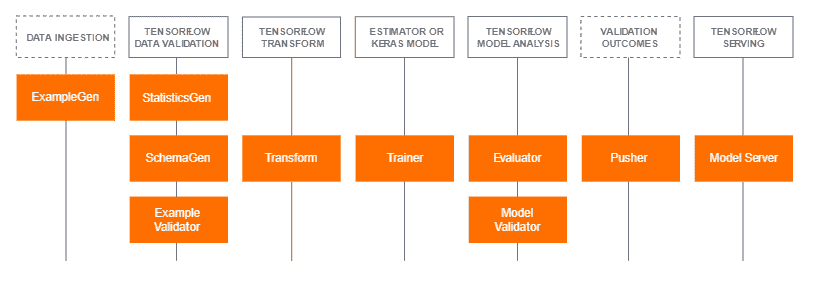
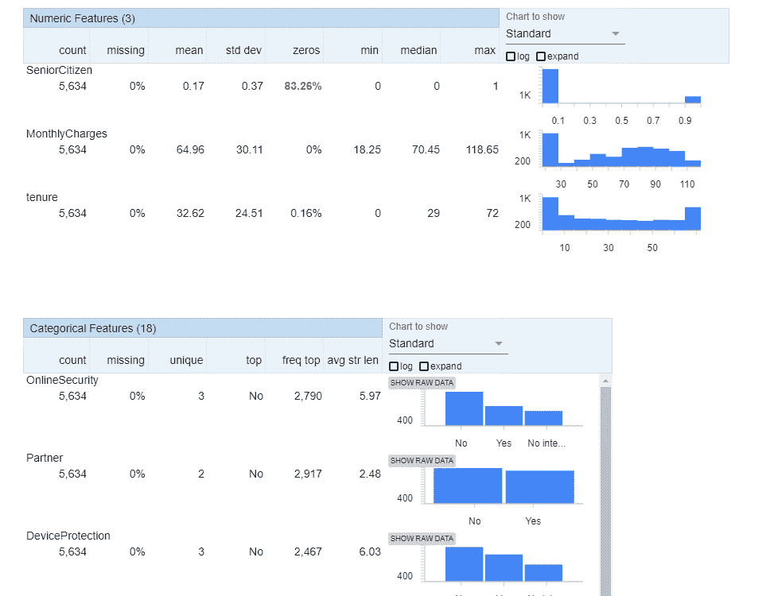
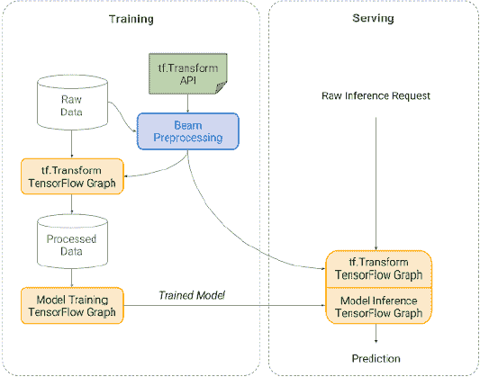
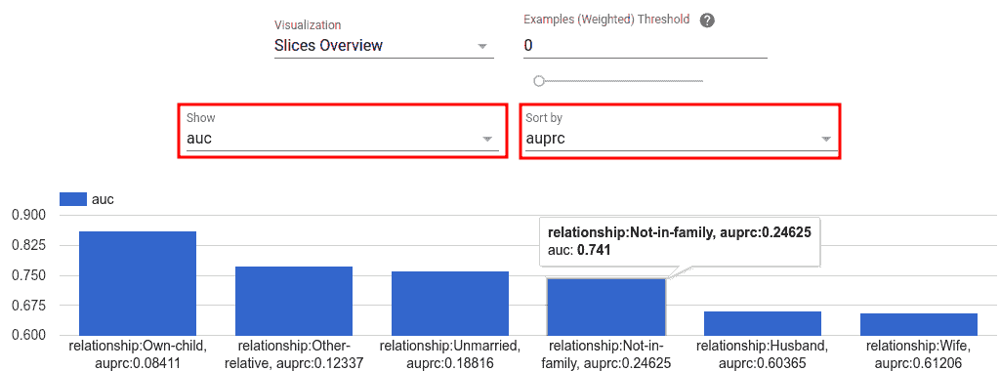
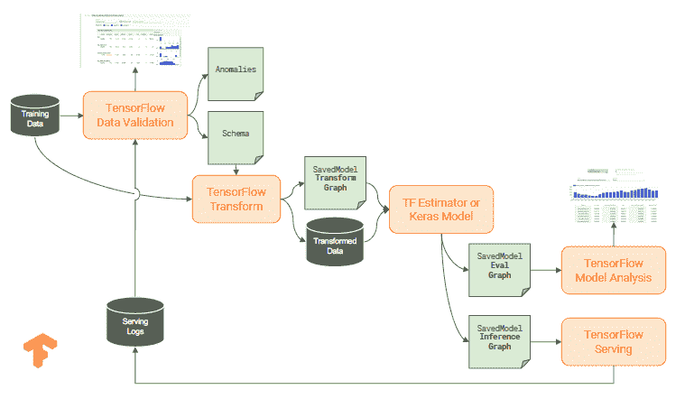

# Tensorflow Extended (TFX) —走向端到端机器学习管道—第 1 部分

> 原文：<https://medium.datadriveninvestor.com/tensorflow-extended-tfx-towards-end-to-end-machine-learning-pipeline-part-1-aee6868c4cad?source=collection_archive---------1----------------------->

[](http://www.track.datadriveninvestor.com/1B9E)

这是 Tensorflow Extended 系列文章的第一部分。本文将向您概述 Tensorflow Extended (TFX)组件及其生态系统。在本系列的后续文章中，我们将深入研究不同的 TFX 组件以及相关的代码。

让我先从免责声明开始这篇文章。我的团队今天在我们的机器学习用例中使用 Tensorflow 的比例相对较小。但是在我们使用 Tensorflow 的项目中，与其他可用的框架相比，tensor flow 确实非常突出。

[](https://www.datadriveninvestor.com/2019/02/08/machine-learning-in-finance/) [## 金融中的机器学习——数据驱动的投资者

### 在我们讲述一些机器学习金融应用之前，我们先来了解一下什么是机器学习。机器…

www.datadriveninvestor.com](https://www.datadriveninvestor.com/2019/02/08/machine-learning-in-finance/) 

我看到很多帖子将 Tensorflow 与其他深度学习框架进行比较，但人们忽略了 Tensorflow 不仅仅是深度学习。首先，Tensorflow 是数学计算框架，随着时间的推移，社区已经建立了一个生态系统，使端到端的 ML 管道成为可能，类似于 Spark ML 或 Sci-kit(以及 python 生态系统)今天提供的内容。Tensorflow 和 TFX 还没有完全实现，还需要几年时间才能看到更多人采用，但他们看起来正朝着正确的方向前进。

目前有相当多的深度学习框架具有明显突出的功能，但都是在研究的基础上创建的。Tensorflow 目前可能缺乏这些功能，但它是在考虑研究和生产的情况下创建的，这对于希望通过将机器学习融入其业务流程来交付成果的企业来说至关重要

此外，TF 2.0 streamlined API 和预构建的估算器使得在项目中采用它变得更加简单和干净。

现在让我们进入主题的核心。还有什么比直观地展示传统的机器学习管道，并了解 Tensorflow 和 Tensorflow 扩展组件如何融入管道更好的呢


在以后的系列文章中，我将详细介绍图中列出的每个 TFX 组件以及实现代码。现在，让我们坚持高层次的概述。

Tensorflow Extended (TFX)帮助您构建完整的端到端机器学习管道。TFX 管道是一系列组件，旨在实现可扩展的高性能机器学习任务。

下面是支持管道组件的底层 TFX 库

*   Tensorflow 数据验证
*   张量流变换
*   张量流模型分析
*   张量流服务
*   ML 元数据

下图说明了 TFX 库和管道组件之间的关系



和端到端 ML 流水线中 TFX 组件之间的样本数据流


让我快速地详细描述一下这些 TFX 图书馆的特点

**张量流数据验证(TFDV)**

> 理解您的数据是洞察的关键一步

TFDV 是一个用于分析和验证 ML 模型数据的库。TFDV 允许人们

*   使用 2 行代码计算和可视化所有特性的汇总统计数据
*   比较多个数据集。帮助识别训练、评估和服务数据集之间的数据和分布偏差
*   基于底层数据自动生成模式，并使用该模式检查过期数据集
*   识别异常情况，例如缺失的特征、超出范围的值等

下面是 IBM Watson telecom 流失数据集上的样本 TFDV 输出统计。TFDV 内部使用 google Facets 进行可视化

```
train_df_stats=tfdv.generate_statistics_from_dataframe(churn_train,stats_options=options.StatsOptions(),n_jobs=3)
tfdv.visualize_statistics(train_df_stats)
```



**张量流变换(TFT)**

TFT 有助于机器学习管道的特征工程部分。TFT 将输入特征转换成训练过程可以直接使用的格式。TFT 可以

*   从你的最新数据中自动生成一个词汇表。
*   在将数据发送到模型之前，对其执行任意转换。使用 TFT 转换数据的一个优点是，它将转换构建为张量流图，有助于无缝部署
*   有助于避免培训部署偏差

下图很好地展示了后两个功能是如何工作的



**张量流模型分析(TFMA)**

TFMA 允许用户在 TFX 管道中执行模型评估，并在 Jupyter 笔记本中查看度量和绘图。TFMA 是一个可重用的组件，它自动评估和验证模型，以确保它们在提供给用户之前是好的。

以下 TFMA 的度量可视化示例提供了针对所选度量对所选特征中的切片的直观了解



TFMA 帮助模型性能分析和

*   检查数据子集
*   确定服务不足的关键细分市场
*   模型公平性

在 TFMA 还有更多内容，我将在本系列的后续部分中介绍

**ML 元数据(MLMD)**

MLMD 是一个用于记录和检索与数据科学家工作流相关的元数据的库。MLMD 启用了跟踪 ML 工作流中所有组件/步骤的输入和输出及其沿袭的功能。

MLMD 的一些好处

*   递归返回以查看哪些数据进入了模型
*   查看从特定数据集训练的所有模型
*   显示所有执行及其输入和输出工件的 DAG
*   比较两个实验的结果

最后一个可能的表示是关于 TFX 库的端到端 ML 管道



TFX 的好处之一是大多数库都是由 Apache Beam 支持的。这使得 TFX 具有可伸缩性和高性能。这也有助于 TFX 在流式和批处理管道上持续运行

如果您想了解更多信息或继续关注我在本系列中的下一篇文章，请参考以下内容:)

[](https://www.tensorflow.org/tfx) [## TFX |张量流

### TFX 是一个端到端的平台，从数据接收、培训到生产级服务。

www.tensorflow.org](https://www.tensorflow.org/tfx)  [## TFX |张量流

### 学习 TensorFlow Extended (TFX)的一个好方法是边做边学。这些教程是重点示例的关键…

www.tensorflow.org](https://www.tensorflow.org/tfx/tutorials) 

查看产品经理 Clemens Mewald 的视频，了解关于 TFX 的更多详情