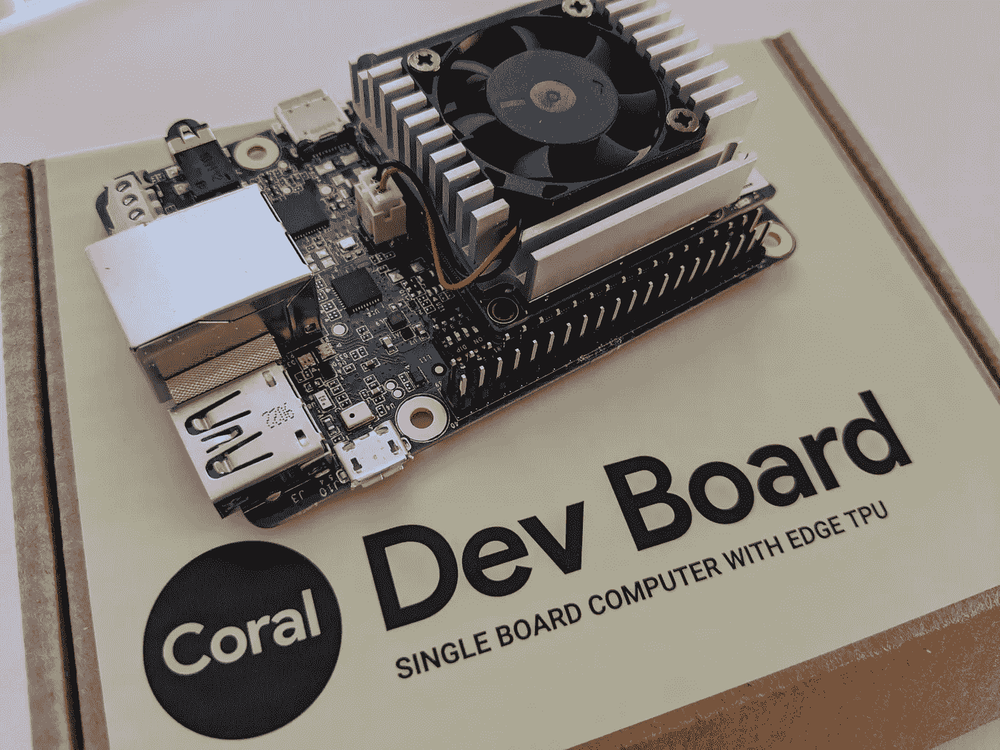
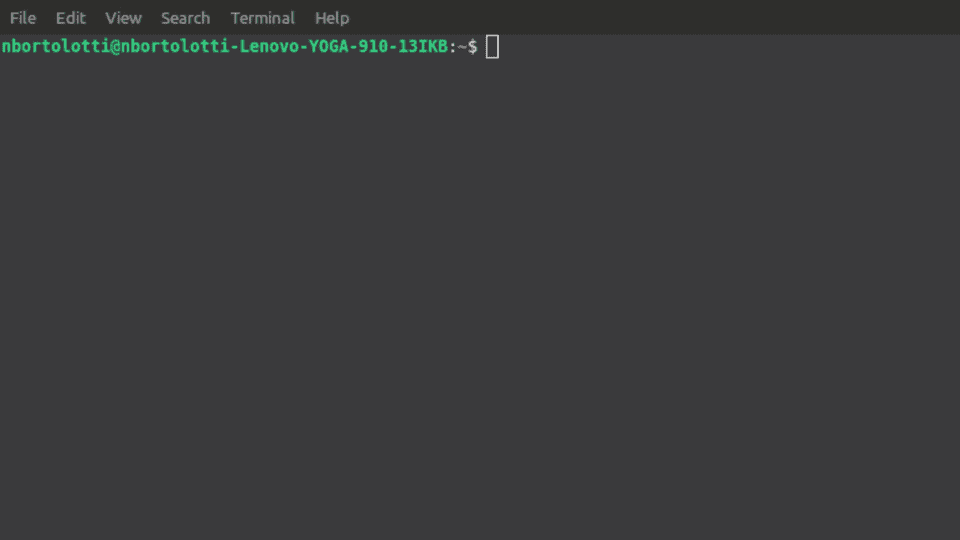

# TensorFlow Lite、Iris 机箱和边缘计算设备体验

> 原文：<https://medium.datadriveninvestor.com/tensorflow-lite-iris-case-and-coral-device-experience-5217064ab197?source=collection_archive---------2----------------------->

如果您从事物联网/移动/嵌入式工作，并且是 TensorFlow 的粉丝，那么您一定知道 [TensorFlow Lite](https://www.tensorflow.org/lite) 。TF lite 是一套帮助开发人员在移动、嵌入式和物联网设备上运行 TensorFlow 模型的工具。

以下是 Coral Dev Board 设备的快速视图:

我目前面临的挑战是尝试一种当前的学术模式，转换成 TensorFlow Lite 格式，然后运行到 Coral 设备上。

 [## 生活在边缘|数据驱动型投资者

### 为边缘和混合计算重新设计的旧想法它是一个数据抓取器！感觉每个行业的每个人…

www.datadriveninvestor.com](https://www.datadriveninvestor.com/2019/03/22/living-life-on-the-edge/) 

如果您正式探索[提出的](https://www.tensorflow.org/lite)初始流程:

1.  挑选模特
2.  皈依者
3.  部署
4.  使最优化

我们将改变步骤 1，我们将创建 Iris-Model，我们将避免优化，只建议部署到 Coral Dev Board 设备中。

# 虹膜模型的表示与创建

iris-keras-model

# 将 Iris Keras 模型转换为 tflite

converting iris-keras model

# 从 Coral 设备消费模型

tflite coral device

只使用解释器，我们将执行来自设备的推断。*根据 Coral 设备版本，您应该执行闪存和设备配置。[https://coral.ai/docs/dev-board/get-started/](https://coral.ai/docs/dev-board/get-started/)

[在这里](https://github.com/nbortolotti/tflite-tpu-experiences/tree/master/iris_case)您可以看到仓库&的探索实现。

[在这里](https://colab.research.google.com/drive/1NBRTSV_oF1TJR26s1nZnbxDtiAPHcGPb)你可以一步一步地进入一个笔记本。