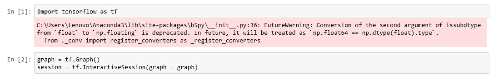
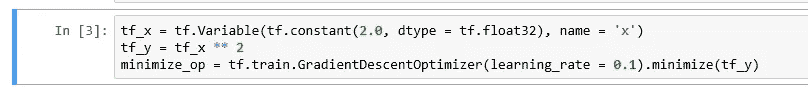
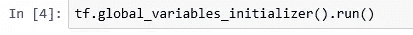
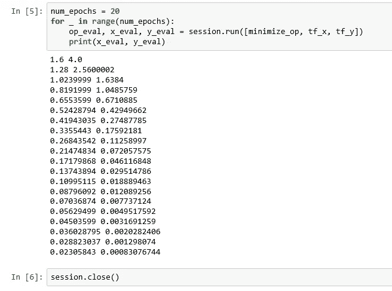

# 张量流网络优化

> 原文：<https://medium.datadriveninvestor.com/tensorflow-network-optimization-8acce9b16723?source=collection_archive---------5----------------------->

在我之前的一篇文章《TensorFlow 中的[损失函数》中，你看到了在机器学习中训练一个模型意味着改变模型权重以使损失最小。虽然我们在那篇文章中探讨了一些常见的损失函数，但这里我们将探讨如何最小化损失。TensorFlow 为我们提供了不同的优化器，我们可以使用它们来最小化任何函数，包括损失函数。](https://medium.com/datadriveninvestor/loss-function-in-tensorflow-b7eb1215ef78)

为了简化优化任何函数的问题，我们将跳过建立模型和使用损失函数，只关注最小化。我们将在这里使用 TensorFlow 的 [GradientDescentOptimizer](https://www.tensorflow.org/api_docs/python/tf/train/GradientDescentOptimizer) ，尽管 TensorFlow 也为我们提供了一些其他的优化器。

我们将导入 TensorFlow，创建一个图形和一个会话，就像我以前的文章一样。

Starting the Graph

我们将从变量“x”的初始值开始，我们将其任意设置为 2。函数“y”将等于“x”的平方。对于不同的“x”值，我们将尝试最小化“y”的值。从数学上我们知道，无论 x 是正数还是负数，平方的值都是正数，并且平方为零的唯一时间是 x 为零的时候。这意味着 y 的最小值是零，也就是 x 是零的时候。如果你对梯度下降用来最小化的方法感到不舒服，阅读[维基百科](https://en.wikipedia.org/wiki/Gradient_descent)。我们现在将要求 GradientDescentOptimizer 最小化“y”的值，并将学习率设置为 0.1。你会从维基百科的文章中找到什么是学习率。

Setting the Optimizer

我们将像在我以前的文章中一样初始化全局变量。

Initialize Global Variables

从维基百科的文章中你会知道，你需要多次运行最小化，因为在每次迭代中，函数值越来越接近最小值。这里我们将运行 20 次最小化。

Gradient Descent

您可以看到，x 和 y 的值都从初始值 x(2)和 y(4)向零移动，零是理想值。当您构建自己的神经网络并尝试通过最小化损失函数来训练网络时，您会发现这种最小化知识非常有用。