# macOS 上的 TensorFlow

> 原文：<https://medium.datadriveninvestor.com/tensorflow-on-macos-8bd2f7840463?source=collection_archive---------0----------------------->

# 机器学习

机器学习是一种人工智能，计算机在没有明确编程的情况下“学习”。机器学习工具不是编写算法，而是通过在大量数据中寻找模式，使计算机能够开发和完善算法。

# 深度学习

自 20 世纪 50 年代以来，人工智能研究人员开发了许多机器学习方法。然而，神经网络已经取得了许多最近最引人注目的成功，从谷歌 2012 年使用 YouTube 视频训练其人工智能识别猫和人开始。仅仅五年后，谷歌发起了一场识别 5000 种植物和动物的竞赛。像 Google Duplex、Cortana、Siri 和 Alexa 这样的应用程序也要归功于神经网络。

神经网络试图用以不同方式链接在一起的多层节点来模拟人脑过程。每增加一层都需要大幅增加计算能力:Inception v3，一个对象识别模型，有 48 层和大约 2000 万个参数。但计算基本上是矩阵乘法，GPU 处理起来非常高效。GPU 成本的下降使人们能够创建多层深度神经网络，因此有了术语*深度学习*。


A neural network

神经网络需要大量的训练数据，理想地代表所有的可能性。用户生成数据的爆炸也促进了机器学习的复兴。

*训练模型*是指为神经网络提供训练数据，并让它计算一个公式来组合输入参数以产生输出。训练在强大的机器上或云中离线进行，通常在有许多 GPU 的机器上进行。TensorFlow 也适用于 iOS——尽管有一些限制。

为了*使用*模型，你给它新的输入，它计算输出:这被称为*推理*。推理仍然需要大量的计算，从新的输入计算输出。您可以使用 TensorFlow 来训练您的机器学习模型，并使用这些模型进行预测。由于 TensorFlow & Metal 这样的框架，在手持设备上进行这些计算现在已经成为可能。

# 什么是张量流？

TensorFlow 是一个软件库，用于**构建计算图形**，以便进行机器学习。

许多其他工具在更高的抽象层次上工作。以 [Caffe](http://caffe.berkeleyvision.org/) 为例，你通过连接不同种类的“层”来设计神经网络。这类似于 iOS 上的 [BNNS 和 MPSCNN](http://machinethink.net/blog/apple-deep-learning-bnns-versus-metal-cnn/) 提供的功能。

在 TensorFlow 中，你也可以处理这样的层，但你也可以更深入，一直到组成你的算法的单个计算。

TensorFlow 是用于**实现新的机器学习算法**的工具包，而其他深度学习工具是用于*使用其他人实现的*算法。

这并不意味着你总是要从头开始构建一切。TensorFlow 附带了一组可重用的构建模块，还有其他库，如 [Keras](https://keras.io/) 在 TensorFlow 的基础上提供了方便的模块。

因此，深入研究数学并不是使用 TensorFlow 的必要条件，但如果您想尝试一下，这个选项是存在的。

# **逻辑回归**

我将使用**逻辑回归**算法创建一个分类器。当因变量(目标)是分类变量时，使用逻辑回归。

举个例子，

*   要预测电子邮件是垃圾邮件(1)还是(0)
*   肿瘤是恶性的(1)还是非恶性的(0)

考虑一个场景，我们需要对一封电子邮件是否是垃圾邮件进行分类。如果我们对这个问题使用线性回归，就需要设置一个阈值，根据这个阈值可以进行分类。比方说，如果实际类别是恶性的，预测连续值为 0.4，阈值为 0.5，则数据点将被分类为非恶性的，这会导致实时的严重后果。

从这个例子可以推断，线性回归不适合分类问题。线性回归是无限的，这就带来了逻辑回归。它们的值严格地在 0 到 1 之间。

**简单逻辑回归**

***型号***

输出= 0 或 1

假设=> Z = WX + B

hθ(x)= sigmoid(Z)

***乙状结肠功能***


Sigmoid Activation Function

如果‘Z’趋向正无穷大，Y(预测)将变为 1，如果‘Z’趋向负无穷大，Y(预测)将变为 0。

# 二元分类

分类器接收一些输入数据，然后告诉你这些数据属于哪个类别。对于这个项目，我们只有两个类:男性或女性，因此我们的是一个**二元分类器**。

二元分类器是最简单的一种分类器，但它使用的思想与能够区分成百上千个不同类别的分类器相同。因此，即使我们在本教程中没有真正进行深度学习，这两者也有很多共同点。

我们将使用的输入数据由 20 个数字组成，代表某个人讲话的特定录音的各种声学特性。稍后我会对此进行更多解释，但请考虑音频和这类信息。

在下图中，你可以看到这 20 个数字与一个叫做`sum`的小方块相连。根据分类器，这些连接具有不同的*权重*，对应于这 20 个数字中每一个的重要性。

这是逻辑分类器如何操作的框图:

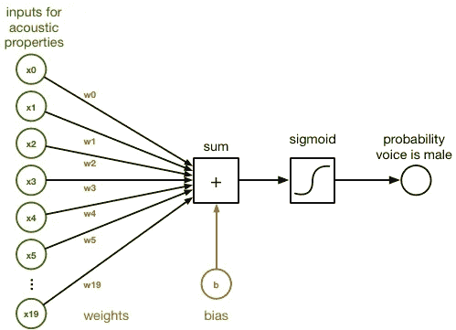

Block diagram of logistic classifier

在`sum`块内，`x0`–`x19`给出的输入和它们的连接`w0`–`w19`的权重简单相加。这是一个常规的点积:

```
sum = x[0]*w[0] + x[1]*w[1] + x[2]*w[2] + ... + x[19]*w[19] + b
```

我们还在末尾添加了*偏差*项`b`。这只是另一个数字。

数组`w`中的权重和`b`的值代表分类器已经学习的内容。训练分类器就是为`w`和`b`找到正确的数字。最初，我们将从所有的`w`和`b`都为零开始。经过多轮训练后，`w`和`b`将包含一组数字，分类器可以使用这些数字来区分男性语音和女性语音。

为了将这个`sum`转换成一个概率，它是一个介于 0 和 1 之间的数字，我们应用前面解释过的*逻辑 sigmoid* 函数:

```
y_pred = 1 / (1 + exp(-sum))
```

但是，如果`sum`接近 0，则 sigmoid 函数给出的概率接近 50%，因为它对预测不确定。当我们开始训练分类器时，最初的预测将是 50 / 50，因为分类器还没有学到任何东西，并且对结果完全没有信心。但是我们训练的越多，概率就越倾向于 1 和 0，分类器就变得越确定。

现在`y_pred`包含了预测的结果，即语音来自男性声音的概率。如果超过 0.5(或 50%)，我们就断定这个声音是男性的，否则就是女性的。

这就是使用逻辑回归进行二元分类背后的想法。分类器的输入由 20 个描述音频记录声学特征的数字组成，我们计算加权和并应用 sigmoid 函数，我们得到的输出是说话者是男性的概率。

然而，我们仍然需要建立训练分类器的机制，为此我们求助于 TensorFlow。

# 在 TensorFlow 中实现分类器

要在 TensorFlow 中使用分类器，我们需要首先将其设计转化为一个**计算图**。计算图由执行计算的节点以及在这些节点之间流动的数据组成。

我们的逻辑回归图如下所示:

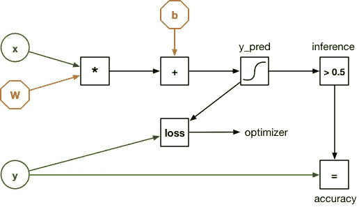

Graph of logistic regression

这看起来与之前的图有点不同，但那是因为输入`x`不再是 20 个独立的数字，而是一个包含 20 个元素的向量。权重由矩阵`W`表示。所以之前的点积已经被一个矩阵乘法代替了。

还有一个输入`y`。这用于训练分类器和验证它的工作情况。我们正在使用的数据集有 3168 个*录音示例*，对于每个示例，我们还知道它是由男性声音还是女性声音发出的。那些已知的结果——男性或女性——也被称为数据集的*标签*，这就是我们将放入`y`的内容。

为了训练分类器，我们将其中一个例子加载到`x`中，并让图形做出预测:它是男性还是女性？因为权重最初都是零，所以分类器很可能做出错误的预测。我们需要一种方法来计算它到底“有多”错，这是由*损失函数*来完成的。损失函数将预测结果`y_pred`与正确结果`y`进行比较。

给定训练示例的损失，我们使用一种称为*反向传播*的技术，通过计算图向后调整权重`W`和`b`稍微向正确的方向。如果预测是男性，但正确答案是女性，则权重会向上或向下移动一点，以便下一次该特定输入的结果更有可能是“女性”。

对数据集中的所有例子重复这种训练过程，一遍又一遍，直到图形停留在一组最佳的权重上。损失衡量的是预测的错误程度，因此随着时间的推移，损失会越来越小。

反向传播是训练这种计算图形的一种很好的技术，但是其中涉及的数学可能有点棘手。TensorFlow 很酷的一点是:由于我们将所有的“向前”操作表示为图中的节点，它可以自动计算出进行反向传播的“向后”操作是什么——您不需要自己做任何计算。太棒了。

# 那么张量到底是什么呢？

在上图中，数据从左到右，从输入到输出流动。那是 TensorFlow 名字的“流”部分。但是什么是张量呢？

所有流经图形的数据都是以*张量*的形式出现。张量只是一个 n 维数组**的酷名。我说过`W`是一个权重矩阵，但就 TensorFlow 而言，它实际上是一个二阶张量——换句话说，是一个二维数组。**

*   标量是零阶张量
*   矢量是一阶张量
*   矩阵是二阶张量
*   三维数组是一个三阶张量
*   诸如此类…

这就是全部了。利用深度学习，如[卷积神经网络](http://machinethink.net/blog/convolutional-neural-networks-on-the-iphone-with-vggnet/)，你经常会处理四维张量，但我们的逻辑分类器要简单得多，所以我们不会超越二阶张量，也就是矩阵。

我还说过`x`是一个向量——或者一阶张量，如果你愿意的话——但是我们也要把它当作一个矩阵。同样的事情也适用于`y`。这让我们可以一次性计算出整个数据集的损失。

一个例子有 20 个数据元素。如果我们把所有的 3168 个例子装入`x`，那么`x`就变成了一个 3168×20 的矩阵。将`x`乘以`W`后，结果`y_pred`是一个 3168×1 的矩阵。也就是说，`y_pred`对数据集中的每个示例都有一个预测。

通过用矩阵/张量来表达我们的图形，我们可以一次对许多例子进行预测。

# 安装 Python 3.x

好了，这就是理论，现在让我们把它付诸实践。

您的 Mac 可能已经安装了 Python 的一个版本，但它可能是一个旧版本。我在本教程中使用 Python 3.x，所以最好你也安装它。

使用家酿软件包管理器安装 Python 3.x 是最简单的。如果你还没有安装自制软件，[首先按照这些说明](https://brew.sh/)。

然后打开终端，输入以下命令安装最新版本的 Python:

```
brew install python3
```

如果 python3 CLI 无法通过终端启动，请在终端中设置 PATH 环境变量。

```
export PATH=/usr/local/Cellar:$PATH
```

在 Python 3.7 上安装 scikit-learn 时可能会出现错误。

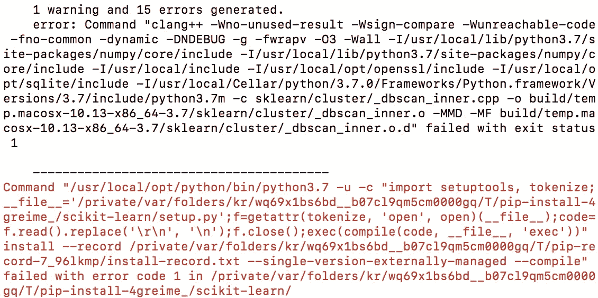

scikit-learn installation error on Python 3.7

# 从 Python 3.7 降级

1.  从[Python 网站](https://www.python.org/downloads/release/python-364/)下载 Python 3.6.4 包。

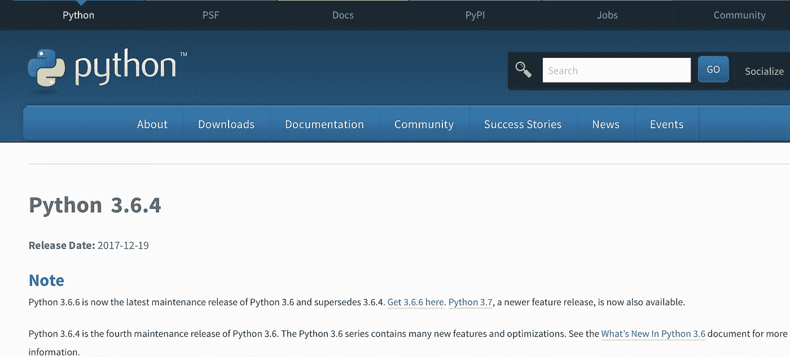

Python 3.6.4

2.双击下载的包并运行 Python 安装程序。

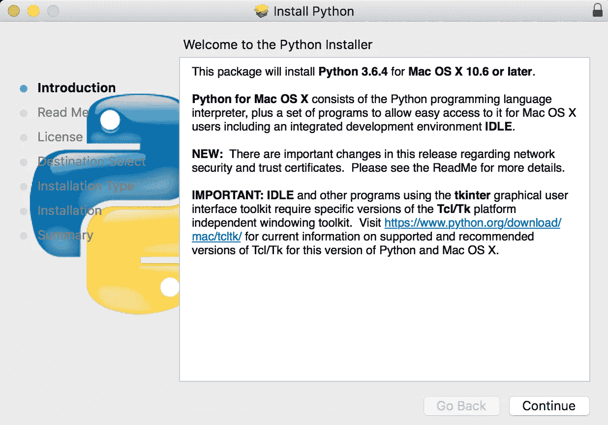

Python 3.6.4 installer

3.安装完成后，您会在应用程序目录中找到一个新的 Python 3.6.1 文件夹。安装程序还在/usr/local/bin 文件夹中安装了 Python 解释器和二进制文件。

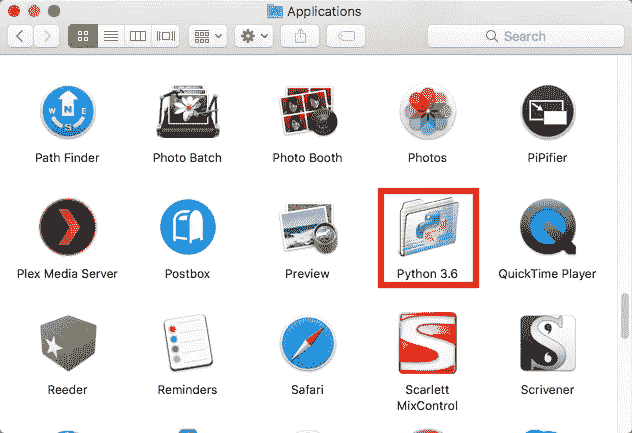

4.该文件夹包含一个用于启动 Python 应用程序的 GUI，称为 Python Launcher。它还包括 IDLE，一个用于开发 Python 应用程序的 IDE，一个到 Python 文档和其他文档的链接。

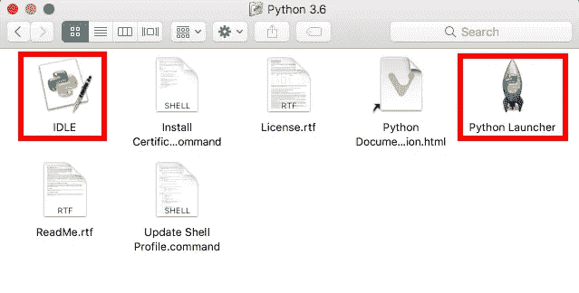

# 从终端启动 Python 3

1.如果您想从命令行运行 Python 3 脚本或应用程序，您需要使用命令`python3`。请注意与运行 Python 2.7 的`python`命令相比的区别。如果您最终使用 Python 3 作为您的主要解释器，您可以更改这个别名，但是默认是`python3`。

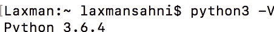

python3 from terminal

# 安装 TensorFlow

我们将在 Python 中使用 TensorFlow。除了 TensorFlow，我们还将安装 NumPy、SciPy、pandas 和 scikit-learn:

*   NumPy 是一个用于处理 n 维数组的库。听起来熟悉吗？NumPy 不称它们为张量，但这是一回事。TensorFlow Python API 构建在 NumPy 之上。
*   SciPy 是一个用于数值计算的库。它被其他一些包使用。
*   pandas 对于加载数据集和清理数据集很有用。
*   scikit-learn 在某些方面是 TensorFlow 的竞争对手，因为它是机器学习的库。我们在我们的项目中使用它，因为它有许多方便的功能。因为 TensorFlow 和 scikit-learn 都使用 NumPy 数组，所以它们可以很好地协同工作。

你不一定需要熊猫和 scikit——学会使用 TensorFlow，但它们很方便，属于任何数据科学家的工具箱。

Python 自带了自己的包管理器`pip`，我们将使用它来安装我们需要的包。从终端执行以下操作:

```
pip3 install numpypip3 install scipypip3 install scikit-learnpip3 install pandaspip3 install tensorflow
```

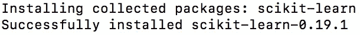

Successful installation of scikit-learn 0.19.1

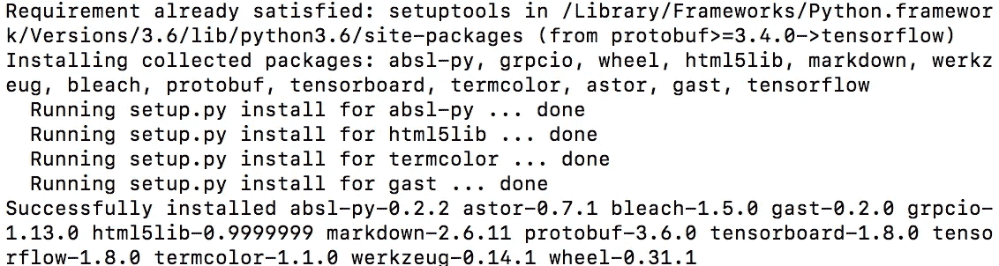

Successful installation of TensorFlow

如您所知，这些包将安装在**/usr/local/lib/python 3 . x/site-packages**或**/Library/Frameworks/python . framework/Versions/3 . x/lib/python 3 . x/site-packages**中。如果您需要在 TensorFlow 源代码中查找网站上没有记录的内容，这将非常有用。

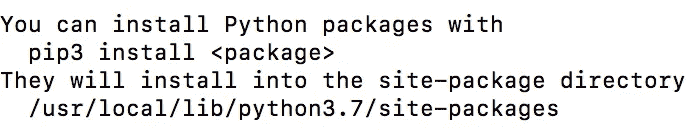

path of packages

从终端进入**/Library/Frameworks/python . framework/Versions/3 . x/lib/python 3 . x/site-packages**文件夹查看是否所有包都安装成功。

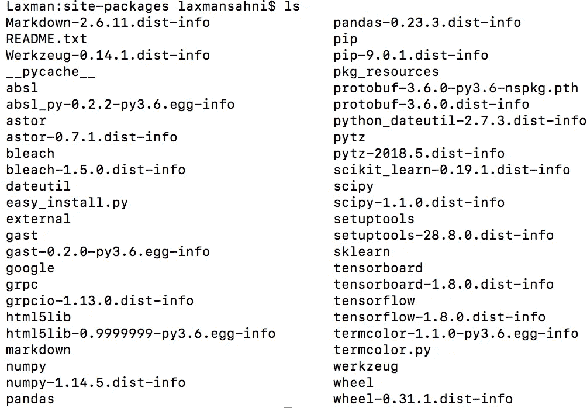

Installed packages

**注意:** `pip3`应该会自动为你的系统安装最好版本的 TensorFlow。如果您想安装不同的版本，请参见[官方安装说明](https://www.tensorflow.org/install/)。您也可以从源代码构建 TensorFlow，这是我们稍后为 iOS 构建 TensorFlow 时要做的事情。

让我们做一个快速测试，以确保一切安装正确。在您的工作区中创建一个文件夹`TensorFlowClassifier`。在`TensorFlowClassifier`文件夹下新建一个文本文件 **tryit.py** ，内容如下:

```
import tensorflow as tf
a = tf.constant([1, 2, 3])
b = tf.constant([4, 5, 6])  
sess = tf.Session(config=tf.ConfigProto(log_device_placement=True))  print(sess.run(a + b))
```

然后从终端运行该脚本:

```
python3 tryit.py
```

它将输出一些运行 TensorFlow 的设备的调试信息(最有可能是 CPU，但如果你有一台装有 NVIDIA GPU 的 Mac，也可能是 GPU)。最后应该说，

```
[5 7 9]
```

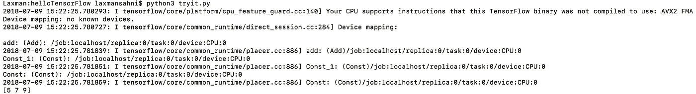

Output of tryit.py

它是两个矢量`a`和`b`的和。

您可能还会看到如下消息:

```
W tensorflow/core/platform/cpu_feature_guard.cc:45] The TensorFlow library  wasn't compiled to use SSE4.1/AVX2 FMA instructions, but these are available on your  machine and could speed up CPU computations.
```

如果发生这种情况，安装在您系统上的 TensorFlow 版本对于您的 CPU 来说不是最佳的。解决这个问题的一个方法是[从源代码](https://www.tensorflow.org/install/install_sources)构建 TensorFlow，因为这样可以配置所有选项。但是现在，如果你看到这些警告，这没什么大不了的。

# 仔细看看这些数据

要训练一个分类器，你需要数据。

在这个项目中，我们使用了来自 Kory Becker 的“声音性别识别”数据集。我想做一些不同于你在 TensorFlow 教程中看到的通常的 MNIST 数字识别的事情，所以我继续在[Kaggle.com](https://www.kaggle.com/datasets)上寻找数据集，这个看起来很有趣。你必须在 Kaggle.com 上注册才能下载数据集。


Sign up page of Kaggle.com

那么如何从音频中识别语音呢？如果你[下载数据集](https://www.kaggle.com/primaryobjects/voicegender)，复制到你工作区的项目文件夹`TensorFlowClassifier`中，查看 **voice.csv** 文件，你会看到一排排的数字:

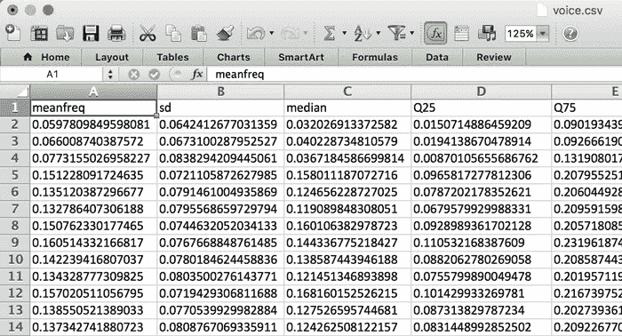

acoustic properties of recorded speech

重要的是要认识到，这不是实际的音频数据！相反，这些数字代表了录制语音的不同声学特性。这些属性——或者说*特性*——是通过脚本从音频记录中提取出来的，并被转换成这个 CSV 文件。具体如何做超出了本教程的范围，但是如果你感兴趣，你可以[查阅原始 R 源代码](https://github.com/primaryobjects/voice-gender)。

数据集包含 3168 个这样的*例子*(电子表格中每行一个)，大约一半来自男性说话者，一半来自女性说话者。每个示例有 20 个声学特征，例如:

*   以 kHz 为单位的平均频率
*   频率的标准偏差
*   光谱平坦度
*   光谱熵
*   峭度
*   声学信号上测得的最大基频
*   调制指数
*   诸如此类…

对于这些**中的大部分，我不知道它们是什么意思**，这也不是很重要。我们所关心的是，我们可以使用这些数据来训练一个分类器，以便它可以区分男性和女性的声音，给定这些特征。

如果你想在应用程序中使用这个分类器来检测音频录音或麦克风音频的性别，你将**首先必须从音频数据中提取这些声学属性**。一旦你有了这 20 个数字，你就可以把它们交给训练过的分类器，它会告诉你这个声音是男是女。

所以我们的分类器不能直接作用于录音，只能作用于你从录音中提取的特征。

**注:**这是一个很好的地方来指出深度学习和更传统的算法(如逻辑回归)之间的区别。我们正在训练的分类器不能学习非常复杂的东西，你需要通过在预处理步骤中从数据中提取特征来帮助它。这是通过从音频记录中提取声学数据来完成的。

深度学习很酷的一点是，你可以训练一个神经网络来学习如何自己提取那些声学特征。因此，深度学习系统可以将原始音频作为输入，提取它认为重要的任何声学特征，然后进行分类，而不是你必须做任何预处理。

构建本教程的深度学习版本会很有趣，但这是另一天的主题。

# 创建训练集和测试集

前面我提到过，我们通过以下方式训练分类器:

1.  把数据集中的所有例子都输入进去，
2.  衡量预测的错误程度，
3.  以及基于该损失调整权重。

事实证明，我们不应该把所有的数据都用于训练。我们需要分离一部分数据——称为*测试集*——以便我们可以评估我们的分类器工作得有多好。因此，我们将把数据集分成两部分:用于训练分类器的训练集，以及用于查看分类器准确度的测试集。

为了将数据分成训练集和测试集，我创建了一个名为 **split_data.py** 的 Python 脚本。看起来是这样的:

```
import numpy as np               # 1import pandas as pddf = pd.read_csv("voice.csv", header=0)        # 2labels = (df["label"] == "male").values * 1    # 3labels = labels.reshape(-1, 1)                 # 4del df["label"]                  # 5data = df.values# 6from sklearn.model_selection import train_test_splitX_train, X_test, y_train, y_test = train_test_split(data, labels,test_size=0.3, random_state=123456)np.save("X_train.npy", X_train)  # 7np.save("X_test.npy", X_test)np.save("y_train.npy", y_train)np.save("y_test.npy", y_test)
```

下面是这个脚本的工作原理:

1.  导入 NumPy 和 pandas 包。Pandas 使得加载 CSV 文件和对数据进行预处理变得非常容易。
2.  使用 Pandas 将数据集从 **voice.csv** 加载到所谓的 *dataframe* 中。这个对象的工作方式非常像电子表格或 SQL 表。
3.  `label`列包含数据集的标签:一个例子是男性还是女性。这里我们将标签提取到一个新的 NumPy 数组中。原始标签是文本，但我们将其转换为数字，其中 1 =男性，0 =女性。(这些数字的分配是任意的——在二进制分类器中，我们通常使用 1 来表示“正”类，或者我们试图检测的类。)
4.  新的`labels`数组是一个一维数组，但是我们的 TensorFlow 脚本将期望一个 3168 行的二维张量，其中每行有一列。因此，我们在这里“重塑”数组，使其成为二维的。这不会改变内存中的数据，只是改变 NumPy 从现在开始如何解释这些数据。
5.  一旦我们完成了`label`列，我们就将它从数据帧中移除，这样我们就剩下了描述输入的 20 个特征。我们还将数据帧转换成一个常规的 NumPy 数组。
6.  我们使用 scikit-learn 中的一个助手函数将`data`和`labels`数组分成两部分。这将基于`random_state`随机打乱数据集中的示例，T5 是随机生成器的种子。这个种子是什么并不重要，但是通过总是使用相同的种子，我们创造了一个可重复的实验。
7.  最后，以 NumPy 的二进制文件格式保存这四个新数组。我们现在有了一个训练集和一个测试集！

您可以在该脚本中对数据进行额外的预处理，例如缩放要素，使其具有零均值和相同方差，但我在这个简单的项目中没有考虑这一点。

从终端运行脚本，如下所示:

```
python3 split_data.py
```

这为我们提供了四个新文件，它们包含了训练示例( **X_train.npy** )和这些示例的标签( **y_train.npy** )，以及测试示例( **X_test.npy** )和它们的标签( **y_test.npy** )。

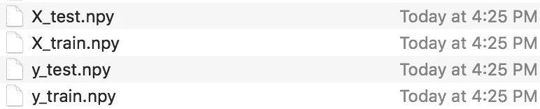

4 files of training, test and labels

**注意:**你可能想知道为什么有些变量名是大写的，而有些不是。在数学中，矩阵常写成大写，向量写成小写。一个**矩阵**仅仅是一个数字的矩形阵列，一个**向量**是一个**矩阵**的一行(或一列)。一个**向量**可以认为是 1 乘 n **矩阵**或者 n 乘 1 **矩阵**。在我们的脚本中， **X** 是一个矩阵， **y** 是一个向量。这是你在很多机器学习代码中看到的约定。

# 构建计算图

既然我们已经整理了数据，我们可以编写一个脚本来用 TensorFlow 训练逻辑分类器。这个脚本叫做 **train.py** 。为了节省空间，我不会在这里展示整个脚本，你可以在 [GitHub](https://github.com/laxmansahni/TensorFlowClassifier/blob/master/train.py) 上看到它。

像往常一样，我们首先导入我们需要的包。然后我们将训练数据加载到两个 NumPy 数组中:`X_train`和`y_train`。(我们在这个脚本中没有使用测试数据。)

```
import numpy as npimport tensorflow as tfX_train = np.load("X_train.npy")y_train = np.load("y_train.npy")
```

现在我们可以建立我们的计算图。首先，我们为我们的输入`x`和`y`定义所谓的*占位符*:

```
num_inputs = 20num_classes = 1with tf.name_scope("inputs"):x = tf.placeholder(tf.float32, [None, num_inputs], name="x-input")y = tf.placeholder(tf.float32, [None, num_classes], name="y-input")
```

`tf.name_scope("...")`对于将图形的不同部分归入不同的范围很有用，这使得理解图形更容易。我们将`x`和`y`放在`"inputs"`范围内。我们还给它们起了名字，`"x-input"`和`"y-input"`，这样我们以后可以很容易地引用它们。

回想一下，每个输入示例都是一个包含 20 个元素的向量。每个例子也有一个标签(1 是男性，0 是女性)。我还提到，如果我们将所有的示例组合成一个矩阵，我们可以一次性计算所有内容。这就是为什么`x`和`y`在这里被定义为二维张量:`x`有维度`[None, 20]`，`y`有维度`[None, 1]`。

`None`表示第一维度是灵活的，还不知道。在训练集的情况下，我们将把 2217 个例子放入`x`和`y`；在测试集的情况下，有 951 个例子。

现在 TensorFlow 知道我们的输入是什么，我们可以定义分类器的*参数*:

```
with tf.name_scope("model"):W = tf.Variable(tf.zeros([num_inputs, num_classes]), name="W")b = tf.Variable(tf.zeros([num_classes]), name="b")
```

张量`W`包含分类器将学习的权重(20×1 矩阵，因为有 20 个输入特征和 1 个输出)，而`b`包含偏差值。这两个变量被声明为 TensorFlow *变量*，这意味着它们可以通过反向传播过程进行更新。

准备好所有的部分后，我们可以声明逻辑回归分类器的核心计算:

```
y_pred = tf.sigmoid(tf.matmul(x, W) + b)
```

这就把`x`和`W`相乘，加上偏差`b`，然后取逻辑 sigmoid。`y_pred`中的结果是由`x`中的特征描述的音频数据的说话者是男性的概率。

**注意:**上面的代码行实际上还没有计算任何东西——到目前为止我们所做的只是构建计算图。上面的代码行简单地将节点添加到图中，用于矩阵乘法(`tf.matmul`)、加法(`+`)和 sigmoid 函数(`tf.sigmoid`)。一旦我们构建了整个图表，我们就可以创建一个 TensorFlow 会话，并在实际数据上运行它。

我们还没完呢。为了训练模型，我们需要定义一个损失函数。对于二元逻辑回归分类器，使用 *log loss* 是有意义的，幸运的是 TensorFlow 有一个内置的`log_loss()`函数，使我们不必写出实际的数学公式:

```
with tf.name_scope("loss-function"):loss = tf.losses.log_loss(labels=y, predictions=y_pred)loss += regularization * tf.nn.l2_loss(W)
```

对数损失，又名逻辑损失，是基于概率的最重要的分类度量。很难解释原始的**日志** - **损失**值，但是**日志** - **损失**仍然是比较模型的良好指标。对于任何给定的问题，较低的 **log** - **loss** 值意味着更好的预测。

`log_loss`图形节点将我们当前正在查看的示例的标签作为输入`y`，并将其与我们的预测`y_pred`进行比较。这将产生一个表示损失的数字。

当我们第一次开始训练时，所有例子的预测值`y_pred`都是 0.5(或者 50%是男性)，因为分类器还不知道正确答案应该是什么。因此，计算为`-ln(0.5)`的初始损失将为`0.693146`。随着训练的进行，损失会越来越小。

计算损失的第二行增加了一个叫做 *L2 正则化*的东西。这样做是为了防止过度拟合，防止分类器准确记忆训练数据。这在这里不成问题，因为我们的分类器的“内存”只包含 20 个权重值和一个偏差值。但是正则化是一种常见的机器学习技术，所以我想我应该包括它。

`regularization`值是另一个占位符:

```
with tf.name_scope("hyperparameters"): regularization = tf.placeholder(tf.float32, name="regularization") learning_rate = tf.placeholder(tf.float32, name="learning-rate")
```

我们已经使用占位符来定义我们的输入`x`和`y`，但是它们对于定义*超参数*也很有用。超参数允许您配置模型及其训练方式。它们被称为“超”参数，因为与常规参数`W`和`b`不同，它们不是由模型学习的——你必须自己将它们设置为适当的值。

`learning_rate`超参数告诉优化器应该采取多大的步长。*优化器*执行反向传播:它获取损失并将其反馈到图表中，以确定更新多少权重和偏差值。有许多可能的优化器，但我们将使用 ADAM:

```
with tf.name_scope("train"):optimizer = tf.train.AdamOptimizer(learning_rate)train_op = optimizer.minimize(loss)
```

这在图中创建了一个名为`train_op`的节点。这是我们稍后将“运行”的节点，以便训练分类器。

为了确定分类器做得有多好，我们将在训练期间偶尔拍摄快照，并计算它已经可以正确预测训练集中的多少个示例。训练集的准确性不是分类器工作好坏的一个很好的指标，但无论如何跟踪它是有用的-如果您正在训练，而训练集的预测准确性变得更差，那么一定是出了问题！

我们定义一个图节点来计算精度:

```
with tf.name_scope("score"):correct_prediction = tf.equal(tf.to_float(y_pred > 0.5), y)accuracy = tf.reduce_mean(tf.to_float(correct_prediction), name="accuracy")
```

我们可以运行`accuracy`节点，看看有多少例子被正确预测。回想一下`y_pred`包含 0 到 1 之间的概率。通过执行`tf.to_float(y_pred > 0.5)`，如果预测是女性，我们得到的值为 0，如果预测是男性，我们得到的值为 1。我们可以将其与包含正确值的`y`进行比较。准确度是正确预测的数量除以预测的总数。

稍后，我们还将在测试集上使用同一个`accuracy`节点，看看分类器*实际上*做得有多好。

再定义一个节点很有用。这个用来对我们没有任何标签的数据进行预测:

```
with tf.name_scope("inference"):inference = tf.to_float(y_pred > 0.5, name="inference")
```

要在应用程序中使用这种分类器，你需要录制一些口语文本，对其进行分析以提取 20 个声学特征，然后将这些特征提供给分类器。因为这是新数据，而不是来自训练集或测试集的数据，所以显然不会有标签。你只能把这些新数据交给分类器，希望它能预测出正确的结果。这就是`inference`节点的用途。

好吧，仅仅是建立计算图就做了很多工作。现在我们想在训练台上实际训练它。

# 训练分类器

训练通常发生在一个无限循环中。对于这个简单的逻辑分类器来说，这有点过头了——训练它只需要不到一分钟的时间——但对于深度神经网络来说，你希望让脚本运行几个小时或几天，直到精度足够好，或者你失去耐心。

下面是 **train.py** 中训练循环的第一部分:

```
with tf.Session() as sess:tf.train.write_graph(sess.graph_def, checkpoint_dir, "graph.pb", False)sess.run(init)step = 0while True:# here comes the training code
```

首先，我们创建一个新的 TensorFlow *session* 对象。要运行图表，您需要一个会话。对`sess.run(init)`的调用将`W`和`b`重置为全零。

我们还将计算图形写入文件。将我们刚刚创建的所有节点序列化到文件 **/tmp/voice/graph.pb** 中。我们稍后需要这个图形定义来在测试集上运行分类器，还需要将训练好的分类器放入 iOS 应用程序。

在`while True:`循环中，我们执行以下操作:

```
perm = np.arange(len(X_train))np.random.shuffle(perm)X_train = X_train[perm]y_train = y_train[perm]
```

首先，我们随机打乱训练样本。这一点很重要，因为您不希望分类器不经意间了解到例子的顺序。

接下来是重要的一点:我们告诉会话运行`train_op`节点。这将在图形上执行一次训练运行:

```
feed = {x: X_train, y: y_train, learning_rate: 1e-2,regularization: 1e-5}sess.run(train_op, feed_dict=feed)
```

当你说`sess.run()`的时候你还需要提供一个*提要字典*。这告诉 TensorFlow 占位符节点的值是什么。

由于这是一个非常简单的分类器，我们总是一次对整个训练集进行训练，所以我们将`X_train`数组放入占位符`x`，将`y_train`数组放入占位符`y`。(对于较大的数据集，您可以小批量地训练 100 到 1000 个示例。)

这就是我们需要做的。因为我们在一个无限循环中，`train_op`节点被运行了很多很多次。并且在每次迭代中，反向传播机制对权重`W`和`b`进行微小的改变。随着时间的推移，这将导致权重稳定在最佳值。

了解培训的进展情况非常有用，因此我们会经常打印进度报告(在演示项目中每 1000 步一次):

```
if step % print_every == 0:train_accuracy, loss_value = sess.run([accuracy, loss],feed_dict=feed)print("step: %4d, loss: %.4f, training accuracy: %.4f" % \(step, loss_value, train_accuracy))
```

这次我们不运行`train_op`节点，而是运行另外两个节点:`accuracy`和`loss`。我们使用相同的 feed 字典，因此在训练集上计算准确度和损失。

正如我之前所说的，高训练集精度并不一定意味着分类器在测试集上也能做得很好，但你肯定希望这个数字随着训练的进行而上升。你应该看到损失在减少。

我们还会不时地保存一个*检查点*:

```
if step % save_every == 0:checkpoint_file = os.path.join(checkpoint_dir, "model")saver.save(sess, checkpoint_file)print("*** SAVED MODEL ***")
```

这将获取分类器目前已经学习的`W`和`b`的值，并将它们保存到一个检查点文件中。当我们想要在测试集上运行分类器时，这个检查点就是我们要读回的内容。检查点文件保存到目录 **/tmp/voice/** 。

从终端运行训练脚本，如下所示:

```
python3 train.py
```

输出应该如下所示:

```
Training set size: (2217, 20)Initial loss: 0.693146step:    0, loss: 0.7432, training accuracy: 0.4754step: 1000, loss: 0.4160, training accuracy: 0.8904step: 2000, loss: 0.3259, training accuracy: 0.9170step: 3000, loss: 0.2750, training accuracy: 0.9229step: 4000, loss: 0.2408, training accuracy: 0.9337step: 5000, loss: 0.2152, training accuracy: 0.9405step: 6000, loss: 0.1957, training accuracy: 0.9553step: 7000, loss: 0.1819, training accuracy: 0.9594step: 8000, loss: 0.1717, training accuracy: 0.9635step: 9000, loss: 0.1652, training accuracy: 0.9666*** SAVED MODEL ***step: 10000, loss: 0.1611, training accuracy: 0.9702step: 11000, loss: 0.1589, training accuracy: 0.9707. . .
```

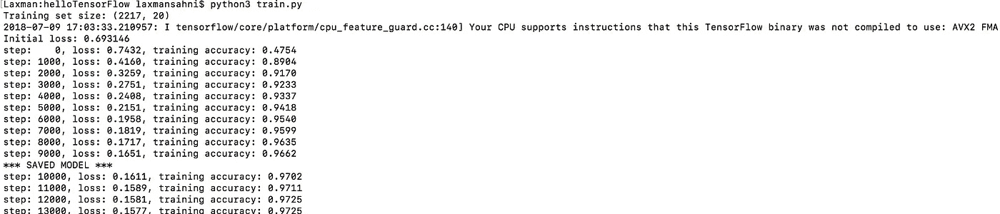

Output of train.py

一旦你不再看到损失下降，等到你看到下一个`*** SAVED MODEL ***`消息，按`Ctrl` + `C`停止训练。

使用我为正则化和学习率选择的超参数设置，您应该会看到训练集精度约为 97%，损失约为 0.157。(如果在进给字典中将`regularization`设置为 0，损耗会更低。)

# 测试分类器？

一旦你训练了你的分类器，你想要测试它，看看它在实践中的效果如何。您需要对未用于训练的数据进行此操作。这就是我们将数据集分成训练集和测试集的原因。

我们将创建一个新的脚本， **test.py** ，它加载图形定义和测试集，并计算它正确预测了多少个测试示例。我只会给你看相关的片段，完整的脚本在这里。

**注意:**测试精度总是低于训练精度(97%)。但它不应该太低…如果发生这种情况，你已经过度适合分类器，你需要调整你的训练程序。我们可以期望在测试集上看到大约 95%的准确率。任何低于 90%的情况都值得关注。

和以前一样，脚本首先导入包，包括来自 scikit-learn 的 metrics 包，以打印出一些附加的报告。当然，这次我们加载的是测试集，而不是训练集。

```
import numpy as npimport tensorflow as tffrom sklearn import metricsX_test = np.load("X_test.npy")y_test = np.load("y_test.npy")
```

为了计算测试集的精确度，我们将再次需要我们的计算图。不是整个图，因为现在没有使用用于训练的节点— `train_op`和`loss`。

我们可以再次手动构建图形，但是由于我们已经将它保存到文件 **graph.pb** 中，我们也可以从该文件中加载它。代码如下:

```
with tf.Session() as sess:graph_file = os.path.join(checkpoint_dir, "graph.pb")with tf.gfile.FastGFile(graph_file, "rb") as f:graph_def = tf.GraphDef()graph_def.ParseFromString(f.read())tf.import_graph_def(graph_def, name="")
```

TensorFlow 喜欢将其数据存储为花生酱协议缓冲文件(因此有了扩展名**)。pb** )，所以我们使用一些助手代码来加载这个文件，并将其作为图形导入到会话中。

接下来，我们需要从检查点文件加载`W`和`b`的值:

```
W = sess.graph.get_tensor_by_name("model/W:0")b = sess.graph.get_tensor_by_name("model/b:0")checkpoint_file = os.path.join(checkpoint_dir, "model")saver = tf.train.Saver([W, b])saver.restore(sess, checkpoint_file)
```

这就是为什么我们将节点放入范围并给它们命名，这样我们就可以使用`get_tensor_by_name()`很容易地再次找到它们。如果你没有给你的节点明确的名字，那么你必须挖掘图形定义，找出 TensorFlow 默认分配给它的名字。

我们还需要获得对其他几个节点的引用，特别是输入`x`和`y`以及做出预测的节点:

```
x = sess.graph.get_tensor_by_name("inputs/x-input:0")y = sess.graph.get_tensor_by_name("inputs/y-input:0")accuracy = sess.graph.get_tensor_by_name("score/accuracy:0")inference = sess.graph.get_tensor_by_name("inference/inference:0")
```

好了，到目前为止我们所做的就是将图表加载回内存。我们还将分类器所学的内容再次加载到`W`和`b`中。现在，我们终于可以测试分类器对以前从未见过的数据的准确性了:

```
feed = {x: X_test, y: y_test}print("Test set accuracy:", sess.run(accuracy, feed_dict=feed))
```

这将运行`accuracy`节点，将来自`X_test`阵列的声学特征作为输入，并将来自`y_test`的标签用于验证。

**注意:**这次提要字典不需要为`learning_rate`和`regularization`占位符指定值。我们只运行图表到`accuracy`节点，图表的这一部分不使用这些占位符。

在 scikit-learn 的帮助下，我们还可以展示一些其他报告:

```
predictions = sess.run(inference, feed_dict={x: X_test})print("Classification report:")print(metrics.classification_report(y_test.ravel(), predictions))print("Confusion matrix:")print(metrics.confusion_matrix(y_test.ravel(), predictions))
```

这次我们使用`inference`节点来获得预测。由于`inference`只是计算预测，但并不检查预测的准确性，因此 feed 字典只需包含输入`x`而非`y`。

运行这个脚本，您应该会看到类似如下的输出:

```
$ python3 test.pyTest set accuracy: 0.958991Classification report: precision    recall    f1-score   support0               0.98       0.94      0.96       4741               0.94       0.98      0.96       477avg / total     0.96      0.96       0.96       951Confusion matrix:[[446  28][ 11 466]]
```

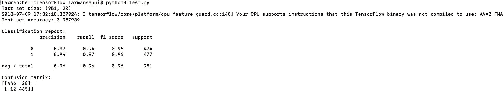

Ouput on the test set

测试集的准确率几乎是 96%——正如预期的那样，比训练集的准确率低一点，但是非常接近。这意味着我们的训练是成功的，我们已经验证了分类器在看不见的数据上也能很好地工作。它并不完美——每 25 次尝试中仍有 1 次会被归类为错误——但对于我们的目的来说已经足够好了！

分类报告和混淆矩阵显示了一些关于哪些例子被错误预测的统计数据。从混淆矩阵中我们可以看出，446 个女性样本是正确的，但是 28 个女性样本被错误地预测为男性。在男性样本中，466 个被正确识别，但 11 个被错误分类为女性。

因此，看起来我们的分类器错误识别女性声音的频率比错误识别男性声音的频率要高。分类报告中的精度/召回数字讲述了同样的故事。

# 从这里去哪里？

您可以为 iOS、macOS 平台构建 TensorFlow 的静态库&在一个简单的 iOS 应用程序中使用它，该应用程序可以使用该模型进行预测。

您可以使用本教程底部的链接下载完整的项目。

[**下载材料**](https://github.com/laxmansahni/TensorFlowClassifier)

*一如既往，感谢您的任何反馈，欢迎在这里发表评论或在*[*Twitter*](https://twitter.com/agavatar)*—*

[](http://eepurl.com/dw5NFP)