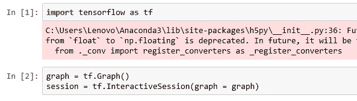
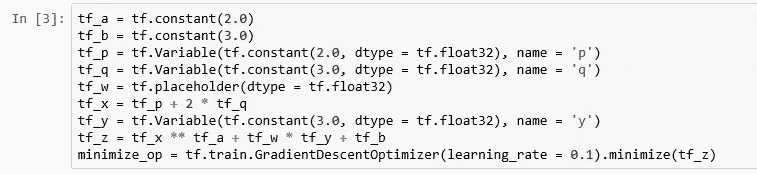
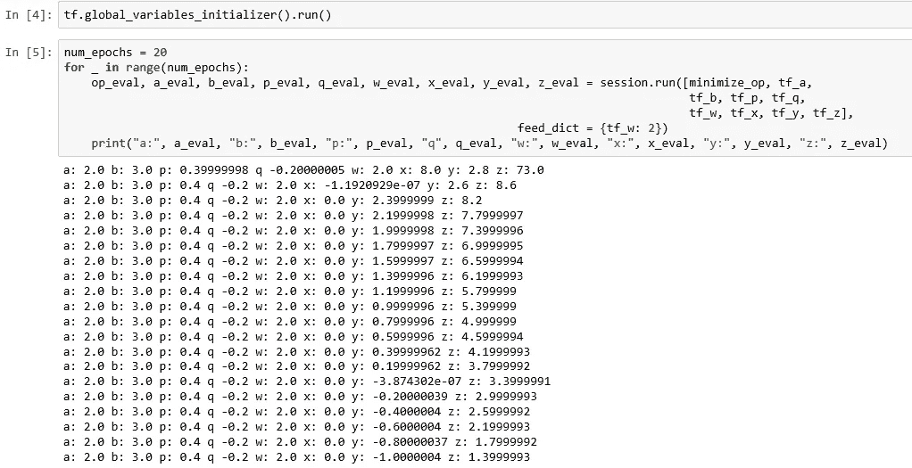

# 最优化中的张量流变量

> 原文：<https://medium.datadriveninvestor.com/tensorflow-variables-in-optimization-466cccc9ed2d?source=collection_archive---------14----------------------->

在我之前的文章 [TensorFlow 网络优化](https://medium.com/datadriveninvestor/tensorflow-network-optimization-8acce9b16723)中，您看到了如何使用 TensorFlow 提供的优化器，如 GradientDescentOptimizer，并最小化损失函数的值。在一个真实的神经网络中，损失函数会比你在上一篇文章中看到的简单平方函数更复杂。如果要最小化的函数有很多参数，TensorFlow 会改变哪些参数，TensorFlow 不会改变哪些参数？如果你想理解常量、变量和占位符的张量流概念，参考[开始张量流](https://medium.com/datadriveninvestor/beginning-tensorflow-dc041fc23392)。

让我们像以前一样创建图表和会话。

Graph and Session

在图中，我们现在将有几个参数。‘a’和‘b’是常数。p 和 q 是变量，w 是占位符。“x”本身就是“p”和“q”的函数。“y”是一个变量，“z”是“x”和“y”的函数，这意味着“z”是“p”、“q”和“y”变量的函数。我们将最小化 z 的值。

Minimization

现在让我们像以前一样在一个循环中运行该图，看看哪些值发生了变化，哪些值没有变化。

Running the Epochs

您将看到只有变量的值被修改以达到最小值。这个函数没有像我们在上一篇文章中看到的平方函数那样的直线最小化。我想指出的是，在最小化过程中，张量流常量和占位符不会被修改，只有变量会被修改。通常使用占位符将输入数据和标签传递给培训流程。

当你建立自己的神经网络时，你会发现这种理解很有帮助。