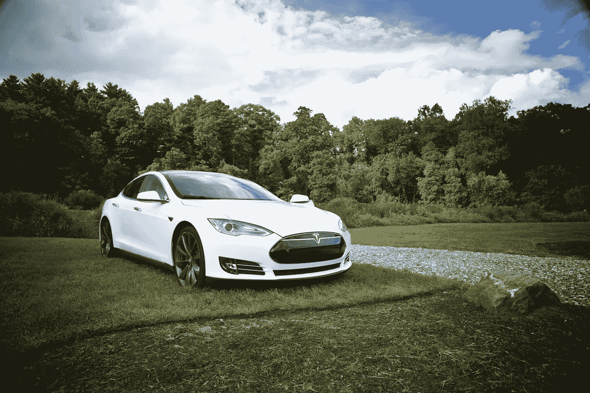
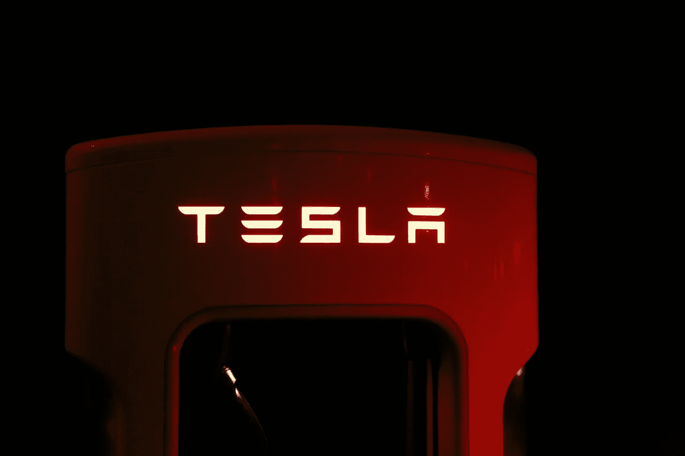
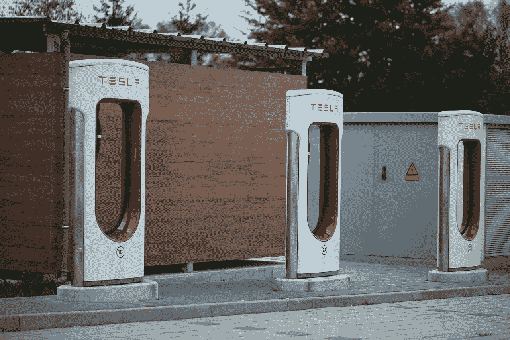
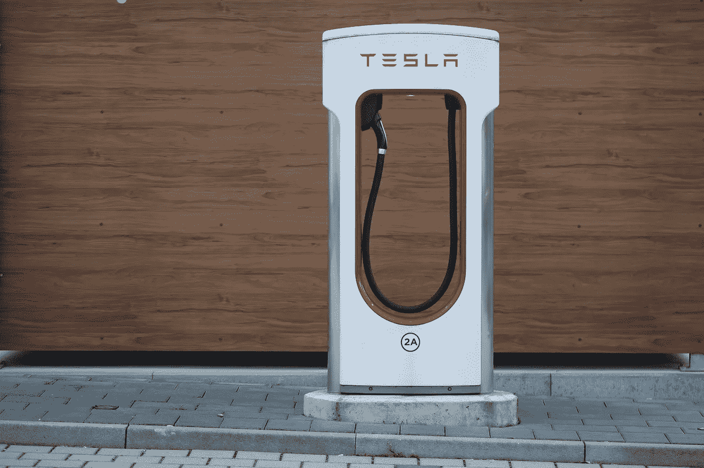
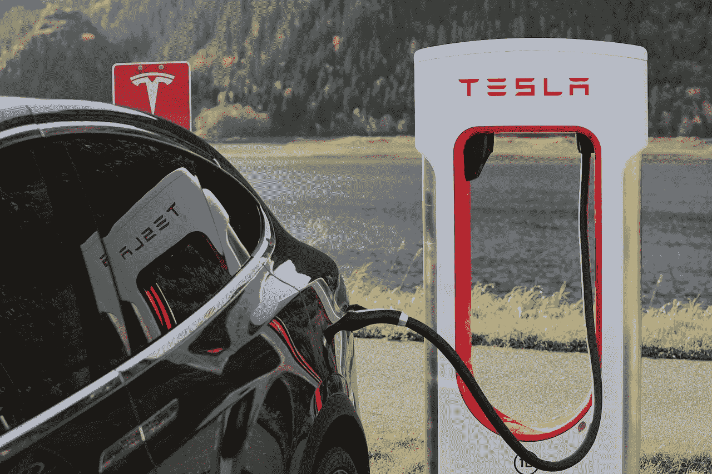
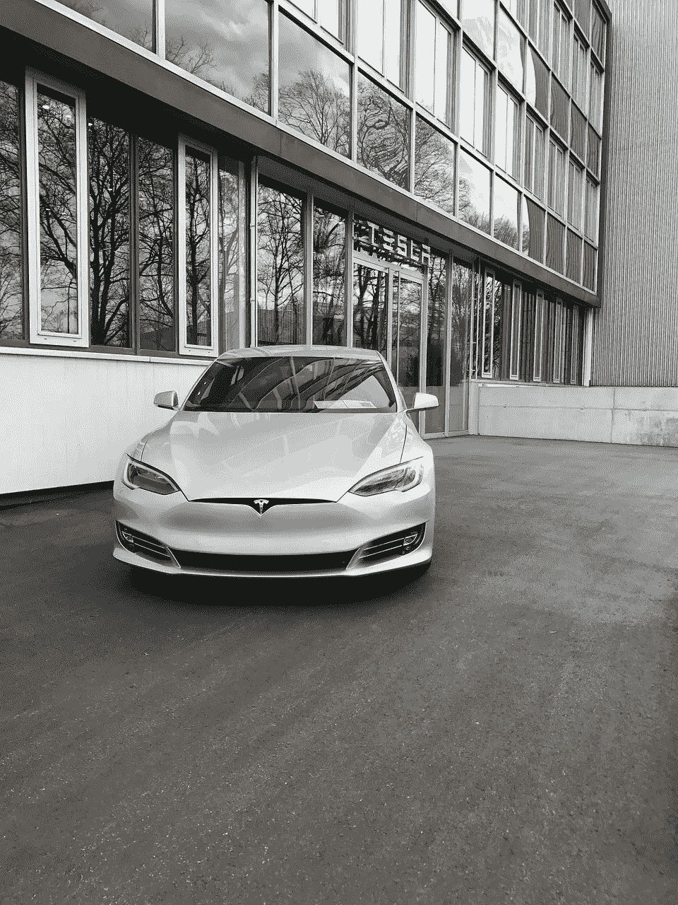

# 特斯拉是一只糟糕的股票，但却是一个好的汽车品牌

> 原文：<https://medium.datadriveninvestor.com/tesla-is-a-terrible-stock-but-a-good-auto-brand-449dd3c3b565?source=collection_archive---------22----------------------->

特斯拉是一只糟糕的股票，但却是一个优秀的汽车品牌。解释一下，**特斯拉汽车公司(纳斯达克股票代码:TSLA)** 作为一家汽车制造商是成功的，但其股票的基本特征是可怕的。

最重要的是，真实世界中的真实人物正在购买和驾驶特斯拉的车辆。特别是，当我看到一元店停车场上停着一辆 Model 3 时，我决定特斯拉是真的。因此，一个真实的人开着车去完成日常任务——也就是购物。

因此，埃隆·马斯克赢得了第一场也是最重要的战斗。值得注意的是，埃隆让公众接受了特斯拉这个汽车品牌。此外，马斯克正在证明一家电动汽车公司可以赚钱。

**惊奇特斯拉是一只可怕的股票，但它在赚钱**

事实上，特斯拉记录的营业收入为 4.1676 亿美元；2018 年第三季度净收入为 3.1152 亿美元。这是特斯拉自 2016 年 9 月以来首次录得正收入数字。

令人印象深刻的是，特斯拉报告称，2018 年第三季度的毛利为 15.24 亿美元，营收为 68.24 亿美元。最重要的是，特斯拉在 2018 年第三季度创下了令人难以置信的 128.65%的收入增长率。

具体而言，特斯拉报告 2018 年第二季度收入为 40.02 亿美元，三个月后为 68.24 亿美元。值得注意的是，特斯拉的毛利从 2018 年第二季度的 6.1834 亿美元增长到 2018 年 9 月的 15.24 亿美元，几乎翻了一番。

因此，特斯拉是一个强大的汽车品牌，能够创造收入和令人印象深刻的收入增长。此外，特斯拉终于产生了一些可观的现金。

值得注意的是，特斯拉 2018 年第三季度的自由现金流为 8.3152 亿美元，运营现金流为 13.91 亿美元。这远远好于三个月前负 1.2966 亿美元的经营现金流和负 8.0688 亿美元的自由现金流。

**特斯拉开始看起来像一家真正的汽车公司**

特斯拉是一只糟糕的股票，但它可以产生大量现金。因此，特斯拉正显示出与其他汽车公司类似的特征，如**福特**。例如，福特 2018 年第三季度的运营现金为 51.79 亿美元，自由现金流为 31.98 亿美元。

因此，特斯拉的财务状况看起来就像一家真正的汽车公司。澄清一下，一家真正的汽车公司会产生大量现金，但报告的收入会波动。

最后，特斯拉在 2018 年 9 月 30 日以 31.26 亿美元现金和等价物的形式存在银行。然而，与福特相比，特斯拉是个小角色。事实上，福特汽车公司在 2018 年 9 月 30 日拥有 185.62 亿美元的现金和等价物以及 177.80 亿美元的短期投资。

因此，福特是一项价值投资，因为它坐拥 363.42 亿美元的现金。在这种情况下，福特有很多钱可以用来解决自动驾驶汽车、轿车销量暴跌和电动汽车等问题。

**特斯拉是一只可怕的股票**

特斯拉是一只糟糕的股票，有两个基本原因；“市场先生”对**特斯拉汽车公司(纳斯达克股票代码:TSLA)** 定价过高，而且不支付股息。

事实上，特斯拉股票在 2019 年 1 月 16 日的交易价格为 346.05 美元。在特斯拉的财务数据中，唯一证明这一价格合理的数字是收入增长。

值得注意的是，其他汽车品牌股票，如福特和**通用汽车(纽约证券交易所代码:GM)** 的交易价格要低得多。2018 年 1 月 16 日，福特汽车的交易价格为 8.29 美元，通用汽车的交易价格为 37.67 美元。

此外，福特在 2018 年 1 月 16 日提供的股息收益率为 6.67%，年化股息支付为 60，支付率为 43.5%。最后一次福特股息是 2018 年 12 月 3 日支付的 15 英镑。

与此同时，通用汽车公司于 2018 年 12 月 20 日提供了 38 英镑的股息。此外，通用汽车在 2018 年 1 月 16 日提供的股息收益率为 4.04%，年化股息为 1.52 美元，股息支付率为 25.5%。

在目前情况下，福特或通用汽车将更好地服务于寻找优秀美国汽车股的投资者。注意:我在这里分析了福特和通用，因为他们是美国仅有的两家大型汽车制造商。他们把另一个美国大汽车品牌**菲亚特-克莱斯勒**的总部设在意大利。

**埃隆·马斯克是新的亨利·福特**

特斯拉最大的属性也是最大的负债。这种特质就是埃隆·马斯克，他是一个古怪、聪明、富有传奇色彩和疯狂的梦想家，是他创造了这个品牌。

事实上，汽车行业已经有一个世纪没有出现像埃隆·马斯克这样的人了。最后一位可以和马斯克相提并论的汽车高管是亨利·福特。

像马斯克一样，福特是一个才华横溢、高度独立、古怪而固执的人，他打破了汽车行业的所有规则。和马斯克一样，福特花了数年时间，消耗了大量现金，才把他的汽车推向市场。

具体来说，福特从 1896 年开始制造汽车，但直到 1903 年才并入福特汽车公司。此外，福特直到 1908 年才推出他的标志性发明 T 型车；直到 1913 年，也就是他进入汽车行业 17 年后，他才打开他著名的移动装配线。

同样，马斯克在 2003 年推出了特斯拉，并在 2008 年推出了第一辆汽车。此外，特斯拉在 2009 年推出了其标志性汽车 Model S，但直到 2012 年才投入生产。

与此同时，仍远未完成的 Gigafactory 的工作始于 2014 年，他们在 2014 年宣布了自动驾驶，并在 2015 年推出了 Powerwall。此外，他们在 2016 年推出了 Model 3 原型，但平价车的交付从 2018 年 9 月才开始。

因此，像亨利·福特一样，埃隆·马斯克是一个固执、耐心和专注的人。此外，像福特·马斯克一样，他是一个冒险家，也是一个愿意燃烧大量现金来实现梦想的人。

埃隆·马斯克和亨利·福特

埃隆马斯克和亨利福特之间的相似之处巨大而令人不安。例如，两人都是传奇式的名人和受人爱戴的公众人物。

然而，两人都因怪异的行为引发了大量争议。例如，1919 年，福特声称他将创办一家销售 300 美元汽车的新公司，这让公众感到困惑。

然而，这些指控是一个宣传噱头，旨在摧毁福特汽车公司的股票价格。最有可能的是，福特试图阻止他的儿子埃德塞尔通过他的权利主张控制公司。因此，福特和马斯克一样知道媒体操纵的价值。

此外，福特有时表现出怪异和极端的政治言论。1920 年，福特在他的报纸*迪尔伯恩独立报*上发表了恶毒的反犹宣传。

此外，像马斯克一样，福特喜欢大型项目，包括巨大的胭脂河汽车厂和福特兰迪亚，一个失败的巴西大型橡胶种植园。

**亨利·福特和埃隆·马斯克的阴暗面**

晚年，福特成了美国人憎恨的人之一。他们憎恶他暴力破坏工会，钦佩阿道夫·希特勒。

事实上，在第二次世界大战期间，联邦政府曾考虑从亨利手中接管福特汽车公司。A.J. Baime 在他的书 [*中揭示了民主的军火库*](https://www.amazon.com/Arsenal-Democracy-Detroit-Quest-America/dp/0547719280) 中的计划是将福特汽车公司置于其他更加合作的汽车高管的控制之下。

原因是福特所谓的同情纳粹、糟糕的劳资关系以及拒绝配合战争。福特最终屈服于联邦政府和联合汽车工人(UAW)阻止国有化的要求。

只有历史会告诉我们马斯克是否会走上如此黑暗的一步。然而，埃隆也有自己的争议。众所周知的马斯克争议包括与不受欢迎的总统唐纳德·j .[川普](https://www.businessinsider.com/elon-musk-agrees-trump-screwed-him-after-joining-white-house-council-2018-11)(纽约州共和党人)[的亲密关系](https://www.theverge.com/2018/11/30/18119832/tesla-elon-musk-discrimination-harassment-racism)种族主义指控[特斯拉汽车公司的工会破坏](https://www.theverge.com/2018/9/29/17914572/tesla-union-trial-silicon-valley-unionization-elon-musk)，与美国证券交易委员会的不和，以及在电视上吸食大麻。

马斯克粉丝和特斯拉股东应该知道福特的黑暗历史。如果埃隆马斯克(Elon Musk)做出类似的转变，可能会严重损害特斯拉品牌。福特的傲慢、反犹太主义和对纳粹的同情几乎摧毁了他所建立的一切。

**对埃隆·马斯克的崇拜让特斯拉成为一只糟糕的股票**

同样自私的埃隆·马斯克也可能落得同样的下场。福特的历史应该给那些狂热崇拜摇滚明星创始人兼首席执行官的投资者以警示。当你投资一位首席执行官时，你投资的是他或她的缺点以及个人的优势或天赋。

值得注意的是，**特斯拉汽车公司(纳斯达克代码:TSLA)** 可能会失去所有的市值，因为股票的主要“价值”是马斯克的明星影响力。如果马斯克退出或被迫出局，特斯拉将成为又一家汽车公司。

因此，如果埃隆离开，特斯拉的股价可能会跌至与福特相同的水平。在这种情况下，特斯拉的股价可能会低于 10 美元。

理解摇滚明星首席执行官通常是有严重缺陷的人，这对于价值投资至关重要。因此，投资于公司而非个人永远是更好的策略。

亨利·福特的历史表明，对埃隆·马斯克的崇拜是特斯拉成为糟糕股票的原因之一。对亨利·福特的崇拜几乎摧毁了福特汽车公司。希望对埃隆·马斯克的崇拜不会摧毁特斯拉汽车公司。

这个故事最早出现在 [*市场疯人院*](https://marketmadhouse.com/tesla-is-a-terrible-stock-but-a-good-auto-brand/) 。