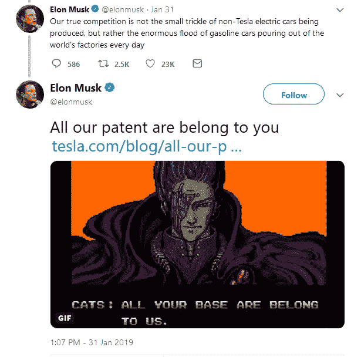
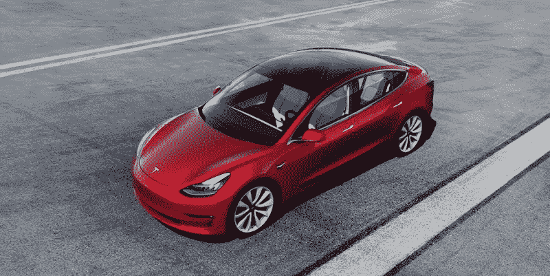
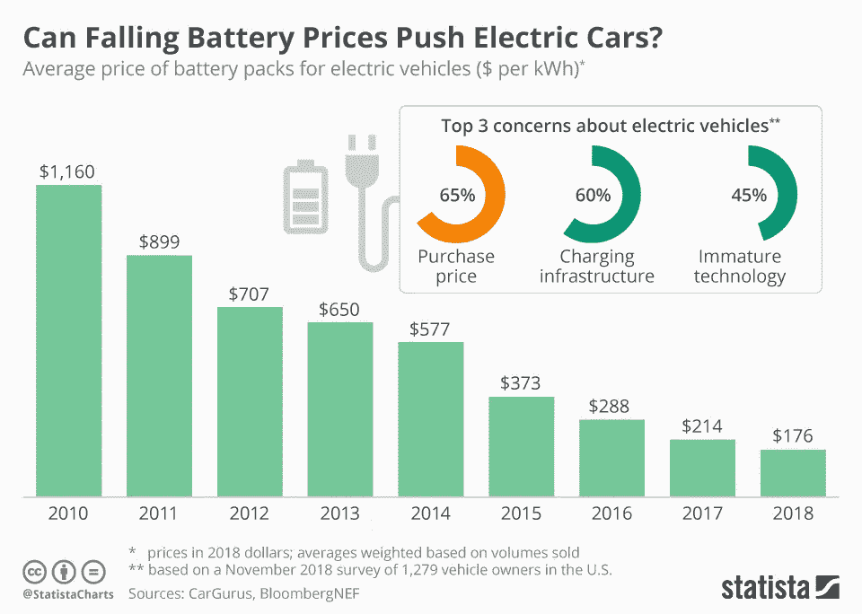
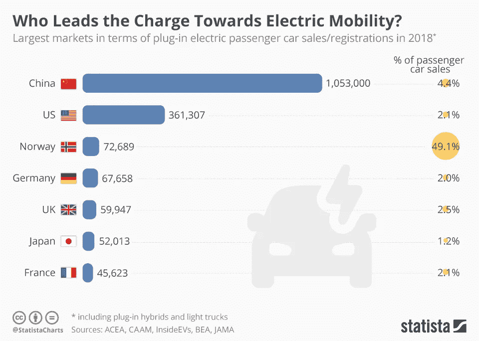
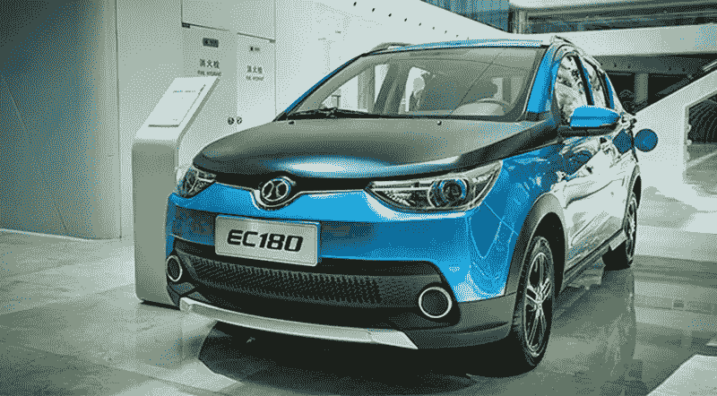

# 特斯拉专利对公众免费开放——这一勇敢的举动如何影响电动汽车行业的发展，或者这只是一种营销策略？

> 原文：<https://medium.datadriveninvestor.com/tesla-patents-are-freely-available-for-public-how-can-this-brave-move-impact-the-growth-in-f0861e006279?source=collection_archive---------0----------------------->

在当前背景下，创造力和创新对于任何基于技术的组织的成功都是至关重要的。因此，大多数组织都在研发上投入巨资，以开发出比竞争对手更聪明的知识产权(IP)。

所有领先的科技公司都拥有一支法律专业人员队伍，以确保他们的知识产权(如专利和设计)得到保护。这方面最好的例子是苹果公司和三星电子之间从 2011 年开始的一系列关于智能手机和平板电脑设计的诉讼。

 [## 在自动驾驶汽车发生事故的情况下，谁应该承担法律责任？-数据驱动型投资者

### 我仍然认为自动驾驶汽车是一种奢侈品，而不是必需品…

www.datadriveninvestor.com](https://www.datadriveninvestor.com/2018/11/02/who-is-legally-accountable-in-the-case-of-an-autonomous-vehicle-accident/) 

2019 年 1 月 31 日，特斯拉公司(Tesla，Inc .)首席执行官埃隆·马斯克(Elon Musk)在推特上表示，特斯拉的所有专利都是公开的，特斯拉不会对任何善意使用他们技术的人提起专利诉讼。

[https://twitter.com/elonmusk/status/1091080660100440065?lang=en](https://twitter.com/elonmusk/status/1091080660100440065?lang=en)

# 这是真的吗？

绝对的！开源运动的强烈倡导者埃隆·马斯克(Elon Musk)做出了这一举动，以支持电动汽车技术的进步。

然而，实际的公告发生在近 5 年前，即 2014 年 6 月 12 日，在一篇名为“我们所有的专利都属于你”的博客文章中。您可以使用下面的链接阅读完整的公告；

 [## 我们所有的专利都属于你

### 昨天，在我们帕洛阿尔托总部的大厅里有一面特斯拉专利墙。情况不再是这样了…

www.tesla.com](https://www.tesla.com/blog/all-our-patent-are-belong-you) 

# **让我们评价一下特斯拉公司这一惊人举动背后的主要原因**

## ***至*鼓励美国和欧洲大型汽车制造商的电动汽车(EV)制造项目增加其全球 EV 销量**

截至 2014 年，全球电动汽车销量不到汽车总销量的 1%**,因为大多数大型汽车制造商的电动汽车计划没有取得重大进展，而且绝大多数新销量仍来自汽油动力汽车。从整体来看，在 20 亿辆汽车中，电动汽车的总数量可以忽略不计。**

**从 2015 年到 2018 年，电动汽车销量的快速增长将电动汽车销量提升至**约占全球汽车总销量**的 2%。**

**尽管电动汽车的增长前景非常乐观，但我们需要明白，每年有近**9000 万辆**非电动汽车进入世界，对环境造成了严重的负面影响。**

## ****特斯拉无法独自满足电动汽车的需求****

**特斯拉在 2014 年的年产量不到 40，000 辆，在美国建立了两个巨型工厂后，其产能在 2018 年增加到每天 1000 辆。即使生产效率很高，并在中国建立了第三个大型工厂，到 2020 年，特斯拉每年也只能生产 50 万辆汽车。**

> **因此，埃隆·马斯克明白分享知识的必要性，以满足中国、欧洲和美国对电动汽车日益增长的需求。**

# ****特斯拉专利如何帮助克服阻碍电动汽车发展的最大制约因素？****

## ****让大众买得起电动汽车****

**任何行业的技术进步都是有代价的，因此大多数电动汽车的初始版本都很昂贵，并且面向更富有的环保意识的汽车购买者。因此，电动汽车采用率的增长主要是由发达的欧洲和美国市场推动的。即使在美国，接近 50%的电动汽车总销量发生在加利福尼亚州。**

**因此，生产更多负担得起的大众市场电动汽车对于维持电动汽车的未来增长至关重要。这就带来了如何降低电动汽车价格的问题。**

> ****1。** **电池技术的改进****
> 
> **在过去的几年里，特斯拉在寻找延长电动汽车电池寿命的方法方面发挥了重要作用，同时确保电池充电速度更快。更重要的是，他们在大幅降低电池生产成本的同时做到了这一点，这使他们能够在 2018 年推出首款名为“特斯拉 Model 3”的大众市场车型，未来售价将在 3.5 万美元左右。**

****

****First mass market model by Tesla — Tesla Model 3 (Source:** [**https://www.tesla.com/model3**](https://www.tesla.com/model3)**)****

> **因此，分享特斯拉在锂离子电池技术方面的专业知识，将使行业进一步降低电池价格，如下图所示，同时延长电池寿命。**

****

****Source:** [**https://www.statista.com/chart/7713/electric-car-battery-prices/**](https://www.statista.com/chart/7713/electric-car-battery-prices/)**

> ****2。** **共享增压器技术和基础设施****
> 
> **特斯拉在美国、欧洲、中东和亚洲(主要集中在中国)建立了全面的超级充电站网络，截至 2019 年 3 月，该网络包括 1400 多个站和 13000 个超级充电器。**
> 
> **截至目前，该网络仅免费为特斯拉汽车提供服务。因此，任何与特斯拉合作并利用其超级充电站技术的其他制造商都可以使用特斯拉超级充电站，从而避免在特斯拉覆盖的国家开发充电基础设施的大量投资。这将为特斯拉带来额外的收入，并创造一个双赢的局面。**

## ****拥抱开源运动，促进电动汽车技术的快速发展****

**拥抱开源运动将允许外部技术专家、研究人员和工程师审查、工作和改进现有的特斯拉技术。考虑到特斯拉最近通过他们的 R&D 团队取得的进步，如果世界各地的专家使用特斯拉的知识并建立在这些基准之上，我们可以预计未来的发展将会以更快的速度发生。**

## ****鼓励特定国家的汽车制造商开发国产电动汽车车型****

**亚洲热带国家电动汽车用户面临的最大问题之一是，在美国或欧洲开发的流行电动汽车型号在当地条件下效率不高。鉴于美国和欧洲仍然存在增长机会，像特斯拉这样的公司不太可能立即专注于开发适合在较小的发展中国家使用的电动汽车。**

**因此，这些市场的增长可能会受到国内制造商的推动，这些制造商生产适合本国环境条件的车型。**

****

****Source:** [**https://www.statista.com/chart/13143/electric-vehicle-sales/**](https://www.statista.com/chart/13143/electric-vehicle-sales/)**

**这一战略的最佳范例是中国。如上图所示，中国占全球新电动汽车销量的 50%以上。大多数中国电动汽车是由比亚迪汽车和北汽集团在国内制造的。事实上，BAIC EC 系列是 2017 年全球最畅销的插电式汽车。**

****

****BAIC EC-Series city car was the world’s top selling plug-in car in 2017 (Source:** [**https://www.carspiritpk.com/2018/02/09/top-10-best-selling-electric-vehicles-2017/**](https://www.carspiritpk.com/2018/02/09/top-10-best-selling-electric-vehicles-2017/)**)****

**通过公开他们的技术，特斯拉可以通过降低开发电动汽车技术的门槛来鼓励这些较小的国内制造商。**

**总的来说，尽管专利发布是旧闻，但我相信这是对其他主要汽车制造商的及时提醒，他们应该共同努力，互相帮助，以维持电动汽车采用的增长。因此，特斯拉迈出了大胆的一步，分享知识，牺牲竞争优势，通过减少排放来保护环境。因为正如埃隆·马斯克(Elon Musk)所说，“我们真正的竞争对手不是正在生产的非特斯拉电动汽车的涓涓细流，而是每天从世界各地工厂涌出的巨大汽油车洪流”。**