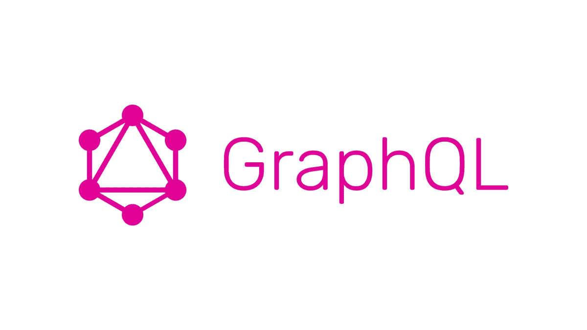

# 在 python 中测试 GraphQL API

> 原文：<https://medium.datadriveninvestor.com/testing-graphql-api-in-python-3136034e18c5?source=collection_archive---------2----------------------->



GraphQL 是服务器和客户端之间通信和交换数据的一种方式，它被 GitHub 这样的大公司使用。如果你还没有尝试过使用 python 来运行 GraphQL，那么看看[这个来自](https://www.howtographql.com/graphql-python/0-introduction/)[乔纳塔斯·鲍尔丁](https://medium.com/u/3748f98c7d49?source=post_page-----6a204e93120f----------------------)的很棒的教程。

在本教程中，我将带您测试一个使用石墨烯创建的 GrahpQL API。

[](https://www.datadriveninvestor.com/2019/02/25/6-alternatives-to-the-yahoo-finance-api/) [## 雅虎财经 API |数据驱动投资者的 6 种替代方案

### 长期以来，雅虎金融 API 一直是许多数据驱动型投资者的可靠工具。许多人依赖于他们的…

www.datadriveninvestor.com](https://www.datadriveninvestor.com/2019/02/25/6-alternatives-to-the-yahoo-finance-api/) 

# 概观

为了测试我们的 API，我将使用快照测试方法；如果您不熟悉快照测试，这是一种保存应用程序状态的方法，例如端点响应，并且在我们的测试用例中检查端点是否仍然返回该响应。

为了测试我们的 API，我们创建了一个客户端，向端点发出请求并获得响应，然后检查它。我们将介绍一些您可能觉得不容易测试的案例。

# 我们的应用

我将使用[hacken news clone 应用](https://github.com/Glyphack/hackernews-graphql)，它使用我之前提到的[本教程](https://www.howtographql.com/graphql-python/0-introduction/)构建的石墨烯，我们将为它编写测试，我们还将实现另一个东西来涵盖不同的测试情况。

# 测试

我们说过我们将使用快照测试来进行快照测试，我们使用 python 的库[snapshot test](https://github.com/syrusakbary/snapshottest)；这个库帮助我们捕获端点响应，并在我们运行测试时再次检查它。下一步，我们需要一个客户端来执行 GraphQL 请求，希望这是由 Graphene 自己完成的。

现在我们有了我们需要的一切，我们可以为我们的测试编写一个助手类。在链接应用程序下创建一个测试文件夹；现在我们将创建一个`APITestCase`类，用一些有用的方法来测试我们的 API:

utils/test_utils.py

这里有两个关键部分:首先，我们初始化了一个客户端，用我们的 app schema 执行我们的 graphql 请求(第 12 行)，其次，我们使用`RequestFactory`生成上下文，并设置请求它的用户和文件(如果我们有)。

你可以在这里阅读这个过程[。](https://docs.graphene-python.org/en/latest/execution/execute/)

# 快照测试创建链接

现在我们可以为 CreateLink 突变编写一个测试；首先，我们需要知道我们的请求是什么。在这种情况下，我们的突变看起来像这样:

```
mutation CreateLink($url: String!, $desc: String!){
  createLink(description: $desc, url: $url){
    id,
    url,
    description
  }
}
```

带变量:

```
{
  "url": "example.com", 
  "desc": "example link"
}
```

这种突变有两种可能的测试案例。第一种是用户登录时(我们返回创建的链接)第二种是用户未登录时(我们引发异常)让我们从第一种情况开始，在 links 应用程序中创建一个`tests`文件夹，并在其中创建一个`test_schema.py`文件。

**第一例**

利用我们的`test_utils`,我们可以得出这样的结论:

我把我们之前写的突变保存在`graphql_requests`文件中以保持测试文件的干净，基本上我们只是给`snapshot_graphql_request`函数请求、变量和上下文并检查它的结果(怎么做？).这个魔术是由 [snapshottest](https://github.com/syrusakbary/snapshottest) 完成的；当您第一次运行测试时，您可以看到在您的`test_schema.py`名为快照的旁边有一个文件夹，您的测试的响应存储在那里，因此无论何时您运行测试，它都会用保存的文件检查输出，只需确保输出是您真正想要的。

**第二种情况**

现在你想在用户没有登录的情况下测试 CreateLink，看起来很简单，对吗？它就像我们之前的测试用例一样，只是它不包含用户对象。

```
def test_create_link_user_anonymous(self):
    self.snapshot_graphql_request(
        request_string=CREATE_LINK_MUTATION,
        variables={"url": "example.com", "desc": "example link"},
    )
```

现在，当您运行测试时，您会看到一个错误:

```
graphql.error.located_error.GraphQLLocatedError: You must be logged to create link!
```

不要惊慌！在下一行中，您可以看到您的测试已经通过。

```
..
Ran 2 tests in 0.006s
```

**那么问题是什么呢？**

实际上这里没有问题，它是 GraphQL 的一部分，尽可能多地捕捉错误并返回数据。如果你看一下`snap_test_schema.py`文件，你会看到:

```
snapshots['LinkTestCase::test_create_link_user_anonymous 1'] = {
    'data': {
        'createLink': None
    },
    'errors': [
        {
            'locations': [
                {
                    'column': 3,
                    'line': 3
                }
            ],
            'message': 'You must be logged to create link!',
            'path': [
                'createLink'
            ]
        }
    ]
}
```

GraphQL 捕获错误并将其放入 errors 属性中，这样它就可以传递服务器发送的其他数据。你可以在这里阅读更多关于这种行为的信息[。](https://graphql.github.io/graphql-spec/June2018/#sec-Errors-and-Non-Nullability)

**提示**:如果您发现您的快照结果不是您想要的，您可以使用`— snapshot-update`参数和您的测试命令为测试用例重新生成快照。

其他案例和我们写的这个类似，所以我相信你可以自己写。

# 检查响应中的特定值

检查我们的 API 响应值相当简单，我们执行请求，检查结果有一个特定的属性或值，这可能是有用的，如果你想测试一个端点，不是每次都返回相同的响应，不能拍摄快照，要从响应中获取值，你可以从 GraphQL 响应中获取`data`属性并检查它。

# 测试上传文件

这是一个额外的例子，我们这里没有，但它可能很棘手，所以我解释一下；假设你的模型有一张图片，你想测试它，这是你需要做的。

1.  在测试用例中将一个文件变量添加到您的上下文中
2.  将文件放在 GraphQL 请求的上下文中(这由测试实用程序完成)
3.  处理请求并访问变异中的文件

首先，阅读[这一页](https://docs.graphene-python.org/en/latest/relay/mutations/#accepting-files)来实现一个接受文件的变异。

然后在测试用例中将 files key 添加到您的上下文字典中:

```
context={
    "user": self.dummy_user,
    "files": {
        "picture": SimpleUploadedFile(
            "img1-link.jpeg", content=None,
            content_type="image/jpeg"),
    }
}
```

现在在变异中，你可以用`picture`键从`info.context.FILES`字典中访问文件。

# 摘要

鉴于测试在开发应用程序中的重要性，知道如何编写高效的测试用例也很重要，在这里，我们学习了快照测试，如果使用正确，它可以降低测试 GraphQL 端点的难度。

我从 Graphene github 的讨论中学到了很多，所以当你遇到问题的时候，最好去查看一下。