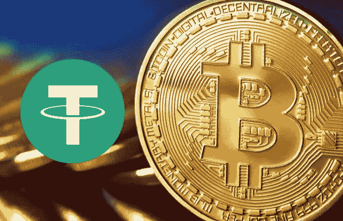

# 如何使用 TetherUSD 操纵比特币

> 原文：<https://medium.datadriveninvestor.com/tether-usd-is-used-to-manipulate-bitcoin-prices-94714e65ee31?source=collection_archive---------2----------------------->

最近由约翰·格里芬和阿明·沙姆斯进行的 2018 年 6 月 13 日[研究强调了在 Bitfinex、Poloniex 和 Bittrex 交易所使用 Tether USD 进行的价格操纵。这项研究说明了在没有适当储备的情况下“印刷”美元是如何允许比特币价格操纵的。请注意，这项研究的作者没有采访目击者或发现数据泄露。然而，他们发现的大量统计数据清楚地表明，Tether 被用于操纵 Bitfinex 交易所的比特币价格，以及在较小程度上操纵 Poloniex 和 Bittrex 交易所的比特币价格。这项研究没有假设比特币或其他加密货币存在市场范围的价格操纵。那么 Tether 是如何被用来操纵比特币价格的呢？](https://poseidon01.ssrn.com/delivery.php?ID=922005065110002073031068078127015100030050050078068020092085104072067007101009082103029001033127027001029092100092030071023081016039074000002097114015002076024016107058092077003024099024120091100031023101001108076111090125065113113094087105025115022117&EXT=pdf)

首先，按市值计算，Tether 是最大的稳定资本(约 25 亿美元)，而且 Tether 和 Bitfinex 之间存在管理重叠。[首席执行官、首席财务官、首席战略官和法律顾问是同一个](https://offshoreleaks.icij.org/nodes/82024464)。而 Bitfinex 是唯一可以直接购买 Tether 的交易所。这为 Tether 和 Bitfinex 之间的幕后勾结奠定了基础。

随着比特币价格走低，在 Bitfinex 发行了 Tether，用于购买比特币。虽然 Tether 是一种稳定的货币，它承诺拥有 100%的货币储备，但大多数[市场专家声称事实并非如此](https://medium.com/@bitfinexed/bitfinex-and-tether-is-unauditable-why-they-will-never-do-a-real-audit-3324e002b185)。这使得 Tether 可以作为中央银行运营，并在 Bitfinex 上发行无支持的 Tether USD，然后 Bitfinex 将使用 Tether 购买比特币。Tether 还将流向 Poloniex 和 Bittrex，以在价格疲软时支撑比特币价格。

这项研究的一些重要收获变得显而易见:

1.  Tether 是印刷的，在经济低迷时期支持比特币价格

2.当大量的系绳被印刷时，更大的向上价格变化发生

3.比特币价格上涨，系绳不兑换

4.Tether 只能在北海巨妖赎回，只占交易的一小部分

4.Tether 正在使用分级银行业务

从研究中直接引用:

> “总之，本节发现了大量证据表明，在系绳印刷和负回报之后，系绳被用于购买比特币，这一现象对比特币价格的未来有相当大的影响。这种效应也适用于其他硬币，并导致比特币回报的不对称负自相关。”

