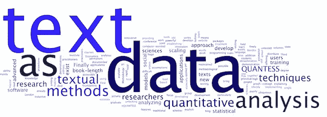

# 可以帮助你训练聊天机器人的文本挖掘基础

> 原文：<https://medium.datadriveninvestor.com/text-mining-foundations-that-can-help-you-to-train-chatbots-daeb0c81cfe9?source=collection_archive---------2----------------------->

Image extracted from hastac.org

有时候，你不得不训练一个聊天机器人，但却没有一个清晰的定义，不知道该用什么样的问题作为训练的输入。例如，你所拥有的只是来自客户服务或服务台数据库的一组记录，而挑战在于如何将数据记录中的非结构化文本转化为对训练聊天机器人有意义的问题，或者换句话说，可以用作 NLP 系统输入的话语。

为了使它更清楚，我们假设一个给定的公司有一个客户服务或技术支持区域，有一个软件，所有的请求都由代理记录。每个记录对应一个特定的请求，可以是问题、投诉、问题报告或任何其他问题。这是我们首先关注的问题，甚至在深入文本挖掘本身之前。由于我们可能希望训练聊天机器人回答问题，我们应该能够只选择与用户或客户的问题相关的记录。这在服务台或客户服务软件中相对简单，一旦它成为任何记录的基本分类。

> 所以，我们所要做的就是选择所有分类为问题的记录，我们就完成了，对吗？可惜不是。我们的挑战出现了。

为什么？

> *因为记录的书写方式很可能不是一种现成的格式来训练 NLP 系统*。大多数时候，用于训练聊天机器人的话语被表达为问题，这些问题以人类与机器人聊天时书写的方式表达，这不是数据库记录的注册方式——除非你已经有一个结构化的 FAQ 数据库。

就本文的范围而言，我们假设您不知道。

我们可以用一个假设的例子来澄清这一点。

让我们假设一个客户打电话给客户服务部，询问给定产品的可用尺寸和颜色。客户服务代理可能会将该案例记录为类似“*客户打电话询问产品 x 的尺寸和颜色。我告知了供货情况，她没有更多可报告的了*”。请注意，这是记录客户服务电话的常用方式，绝对没有任何问题。再次，重要的是要强调，尽管这是常见的，但它并不适合作为训练 NLP 系统的话语。相反，这应该被转换成类似于“***productx***的尺寸和颜色是什么”、“告诉我 productx 的尺寸和颜色”等话语。

> 也许现在我们对挑战有了更清晰的理解:我们必须分析记录的非结构化文本来推断问题是什么。

现在，亲爱的读者，你可能认为这是小菜一碟，一旦阅读一篇文章并推断出由此产生的问题是什么是极其简单的…你是对的。 ***只说你要对成千上万的记录做这个！***

文本挖掘可以帮助你分析大量的文本。

**基本概念**

文本挖掘有时也被称为文本数据挖掘或文本分析。它基本上包括从文本中提取信息。有不同类型的分析，如词典编纂和词频，递降层次分类和相似性分析，只是引用更相关的我们的上下文。

我们现在将讨论其中一些有助于我们实现目标的方法。在这篇文章的最后，我会推荐一个免费的工具来进行这些分析。

**词典分析和词频**:除了统计单词的出现次数，还分析词汇的语义和关系。也许与我们的上下文最相关的结果是单词云，它代表在文本中更频繁出现的单词。如果我们有一个统计记录中重要单词的单词云，我们可以开始了解一些趋势，如描述产品、信息或问题的属性类型。重要的是要强调，只有重要的词应该考虑，这需要一些准备。无意义的词可以是称呼、名词、俚语等。

**聚类分析—递降层次分类**:这样会产生一个 ***树状图*** ，是一个描述对象之间层次关系的树形图。它可以帮助我们显示按相似类别分组的单词集。探索 DHC 数据需要对这个概念有更深的理解，不幸的是，没有一个现成的收据。

**相似性分析**:从技术上讲，相似性分析有两种类型。词汇和语义。词法分析主要分析相似词在文本集中的出现频率；语义分析试图比较几组文本的意义。

通过良好的词法分析，我们可以找出记录之间存在的相似性，并且借助于所有记录的单词之间的关系，我们可以可视化一些重要的见解。我们可以预期，对数千条记录进行良好的统计分析可以显示出最常用的词以及它们之间的关系。为什么这很重要？

回到我们第一个假设的例子，在一条记录中，我们发现这个问题与 productx 的颜色和大小有关，对吗？

> 现在，如果我们能从成千上万的记录中看到这种趋势会怎么样呢？

**用一个自由软件做所有这些事情**

如前所述，我可以推荐一个免费软件来运行这里的分析。我需要澄清的是，我和它没有任何关系，也没有任何商业关系。这真的只是一个建议。该软件名为**IRAMUTEQ**(www . IRAMUTEQ . org)。这是一个由 Pierre Ratinaud 开发的法语软件(我找不到该网站的英文版本)。它自称是一个对文本和问卷进行多维分析的 R 接口。在我写这篇文章的时候，我在

[http://www . IRaMuTeQ . org/documentation/fichiers/IRaMuTeQ % 20 tutorial % 20 translated % 20 to % 20 English _ 17 . 03 . 2016 . pdf](http://www.iramuteq.org/documentation/fichiers/IRaMuTeQ%20Tutorial%20translated%20to%20English_17.03.2016.pdf)