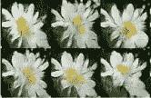
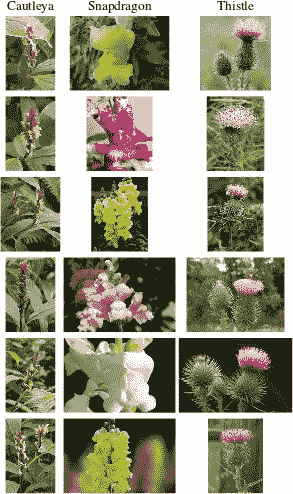
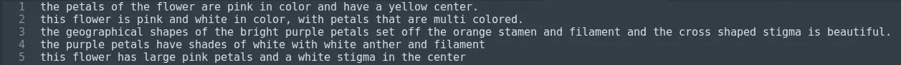
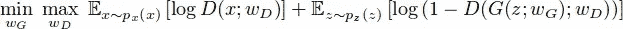
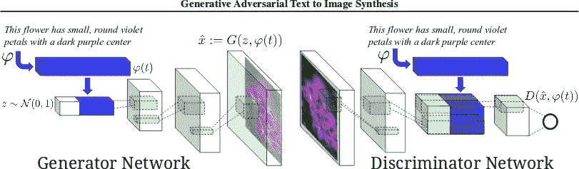
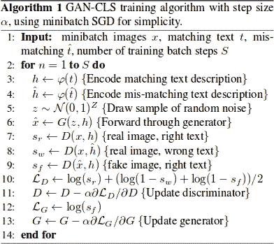
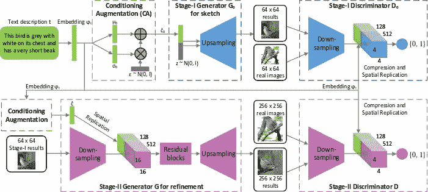
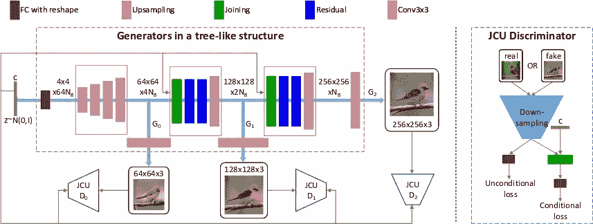
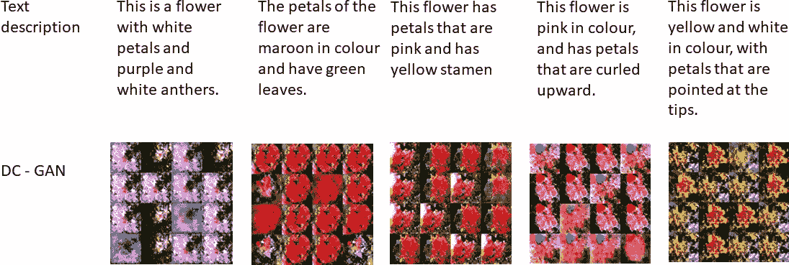

# 文本到图像的合成

> 原文：<https://medium.datadriveninvestor.com/text-to-image-synthesis-6e5de1bf86ec?source=collection_archive---------1----------------------->

计算机视觉领域最具挑战性的问题之一是从文本描述中合成高质量的图像。毫无疑问，这很有趣也很有用，但当前的人工智能系统离这个目标还很远。近年来，已经发现像 GANs(生成对抗网络)这样的强大的神经网络架构能够产生良好的结果。现有的文本到图像方法生成的样本可以粗略地反映给定描述的含义，但它们未能包含必要的细节和生动的对象[部分。[2]](#_bookmark17) 通过这个项目，我们希望探索能够帮助我们完成任务的架构，即**从给定的文本描述中生成图像**。从文本生成照片般逼真的图像有着巨大的应用，包括照片编辑、计算机辅助设计等。

**例子**

**文字描述:**这种白黄相间的花，有细细的白色花瓣和一个圆圆的黄色雄蕊。

## 生成的图像:

Figure 1: Example of generated images from the text description

# **数据集描述**

**概述**

我们的结果呈现在 Oxford-102 花卉图像数据集上，该数据集具有来自 102 个不同类别的 8189 幅花卉图像。数据集是用英国常见的花卉创建的。这些图像具有很大的比例、姿态和光线变化。此外，还有类别内部差异很大的类别和几个非常相似的类别。数据集使用具有形状和颜色[特征的 isomap 进行可视化。[3]](#_bookmark18)

每张图片都有十个文字说明，以不同的方式描述花的图像。每个类别包含 40 到 258 幅图像。类别的详细信息和每个类别的图像数量可以在这里找到: [**数据集信息**](http://www.robots.ox.ac.uk/~vgg/data/flowers/102/categories.html)

花卉数据集链接: [**花卉图片链接**](http://www.robots.ox.ac.uk/~vgg/data/flowers/102/)

每张图片使用了 5 个标题。下面的文字说明可以下载为 [**花卉文字链接**](https://drive.google.com/file/d/0B0ywwgffWnLLcms2WWJQRFNSWXM/view)

**数据集的示例图像**

Figure 2: Example images from different classes

**给定图像的文本描述示例**

Figure 3: Sample Text Descriptions for one flower

# **架构细节**

*   **生成对抗性 Netw**[**works【4】**](#_bookmark19)

生成性对抗网络背后的主要思想是学习两个网络——试图生成图像的生成器网络 G，以及试图区分“真实”和“虚假”生成的图像的鉴别器网络 D。人们可以在最小-最大游戏中训练这些网络相互对抗，其中生成器试图最大程度地欺骗鉴别器，同时鉴别器试图检测哪些例子是假的:

其中 z 是一个潜在的“代码”，经常从一个简单的分布(如正态分布)中取样。条件 GAN 是 GAN 的扩展，其中发生器和鉴别器都接收额外的条件变量 c，产生 G(z，c)和 D(x，c)。这个公式允许 G 根据变量 c 生成图像。

*   **生成对抗性文本到图像 Syn** [**论文【1】**](#_bookmark16)

图 4 显示了本文作者提出的网络架构。本文讨论了基于文本特征的深度卷积生成对抗网络(DC-GAN)的训练。这些文本特征由混合字符级卷积-递归神经网络编码。生成器网络 G 和鉴别器网络 D 都执行以文本特征为条件的前馈推理。首先使用全连接层将编码的文本描述 em- bedding 压缩到较小的维度，随后是 leaky-ReLU，然后连接到在发生器 g 中采样的噪声向量 z。以下步骤与普通 GAN 中的发生器网络中的步骤相同；通过去卷积网络前馈，生成基于文本查询和噪声样本的合成图像。

Figure 4: Network Architecture

## 甘 CLS

这是作者提出的第一个调整。训练条件 GAN 的最直接方式是将(文本、图像)对视为联合观察，并训练鉴别器来判断对是真的还是假的。鉴别器没有真实训练图像是否匹配文本嵌入上下文的明确概念。考虑到这一点，在 GAN-CLS 中，除了在训练期间对鉴别器的真实/虚假输入之外，还添加了由具有不匹配文本的真实图像组成的第三种类型的输入，鉴别器必须学会将该第三种类型的输入评分为虚假。除了图像真实性之外，通过学习优化图像/文本匹配，鉴别器可以向发生器提供附加信号。

Figure 5: GAN-CLS Algorithm

## GAN-INT

已经证明，深度网络学习嵌入对之间的插值趋向于数据流形附近的表示。根据这一主张，作者通过简单地在训练集字幕的嵌入之间进行插值，生成了大量的附加文本嵌入。由于内插嵌入是合成的，鉴别器 D 没有相应的“真实”图像和文本对来训练。然而，D 学会预测图像和文本对是否匹配。

探索的一些其他架构如下:

*   **Stac**[**kGAN【2】**](#_bookmark17)

这里的目标是生成具有照片般逼真细节的高分辨率图像。作者提出了一个架构，其中从文本生成图像的过程被分解为两个阶段，如图 6 所示。这两个阶段如下:

**Stage-I GAN:** 绘制对象的原始形状和基本颜色(以给定的文本描述为条件)以及来自随机噪声向量的背景布局，产生低分辨率图像。

**第二阶段 GAN:** 纠正第一阶段低分辨率图像中的缺陷，并通过再次阅读文本描述对物体细节进行点睛之笔，从而生成高分辨率照片级逼真图像。

Figure 6: Network Architecture of StackGAN

*   **stack gan++**[**【5】**](#_bookmark20)

这是前面讨论的 StackGAN 的扩展版本。它是一种先进的多级生成对抗网络结构，由多个生成器和多个鉴别器组成，以树状结构排列。该架构为同一场景生成多种比例的图像。实验表明，这种新提出的架构在生成照片级逼真图像方面明显优于其他最先进的方法。图 7 显示了该架构。

Figure 7: Network Architecture of StackGAN++

# **结果**

在本节中，我们将描述结果，即使用测试数据生成的图像。通过我们的 GAN-CLS 生成的文本描述及其相应输出的几个例子可以在图 8 中看到。正如我们所看到的，产生的花图像(每张图片中有 16 个图像)与文本描述精确对应。一个最简单明了的观察结果是，甘 CLS 的颜色总是正确的——不仅是花，还有叶子、花药和茎。该模型还根据文本描述中提到的花瓣方向产生图像。例如，在图 8 中，第三个图像描述中，提到了‘花瓣向上弯曲’。

Figure 8: Flower images generated using GAN-CLS

这种评估方法受到[【1】](#_bookmark16)的启发，我们知道这对于观众来说是相当主观的。我们的观察是为了尽可能客观。生成的快照的完整目录可以在以下链接中查看: [**快照**](https://drive.google.com/open?id=1leeWlMi8JqKYyaN_h-3uCWnQBbTp9vcX) 。

# **意见和结论**

这个项目试图探索技术和架构，以实现从文本描述自动合成图像的目标。我们实现了像 GAN-CLS 这样的简单架构，并对其进行了一些调整，以得出我们自己的结论。我们想在这里提到，我们对给定的问题陈述所获得的结果是基于非常基本的资源配置。GPU 或 TPU 等资源的配置越高，效果越好。虽然人工智能在相当多的领域正在迎头赶上，但文本到图像的合成可能还需要几年的广泛工作才能实现生产。

# **重要环节**

> 链接到数据集: [**数据集**](http://www.robots.ox.ac.uk/~vgg/data/flowers/102/)
> 
> 数据附加信息链接: [**数据信息**](http://www.robots.ox.ac.uk/~vgg/data/flowers/102/categories.html)
> 
> 链接实现: [**代码**](https://github.com/Nikunj-Gupta/NNProject)
> 
> 链接到结果: [**快照**](https://drive.google.com/drive/folders/1leeWlMi8JqKYyaN_h-3uCWnQBbTp9vcX)

> 查看我的网站:[***nikunj-Gupta . github . io***](https://nikunj-gupta.github.io/)
> 
> 链接到我的 LinkedIn 个人资料: [**LINKEDIN**](https://www.linkedin.com/in/nikunj-gupta97/)
> 
> 链接到我的 Github 简介: [**GITHUB**](https://github.com/Nikunj-Gupta)

# [**参考文献**](https://www.groundai.com/project/stackgan-text-to-photo-realistic-image-synthesis-with-stacked-generative-adversarial-networks/)

1.  生成性对立文本到图像合成。arXiv 预印本 arXiv:1605.05396 (2016)。
2.  张，韩，等。〈堆叠式甘:利用堆叠式生成对抗网络进行文本到照片级的图像合成〉。arXiv 预印本(2017 年)。
3.  尼尔斯巴克，玛丽亚-伊莲娜和安德鲁·齐泽曼。"对大量类别进行自动花卉分类."计算机视觉，图形和图像处理，2008。icv GIP’08。第六届印度国际会议。IEEE，2008 年。
4.  伊恩·古德菲勒等着《生成性对抗性网络》神经信息处理系统进展。2014.
5.  张，韩，等。〈stack gan ++基于生成性对抗网络的真实感图像合成〉。arXiv 预印本 arXiv:1710.10916 (2017)。